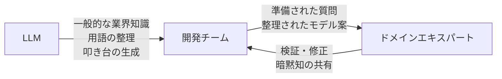
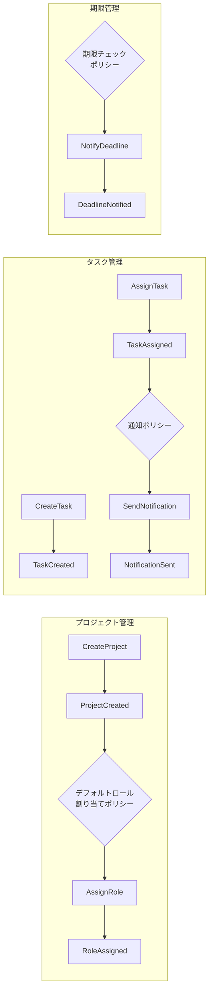
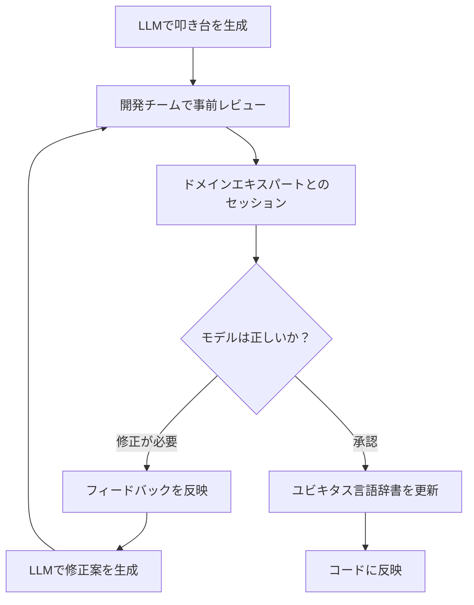
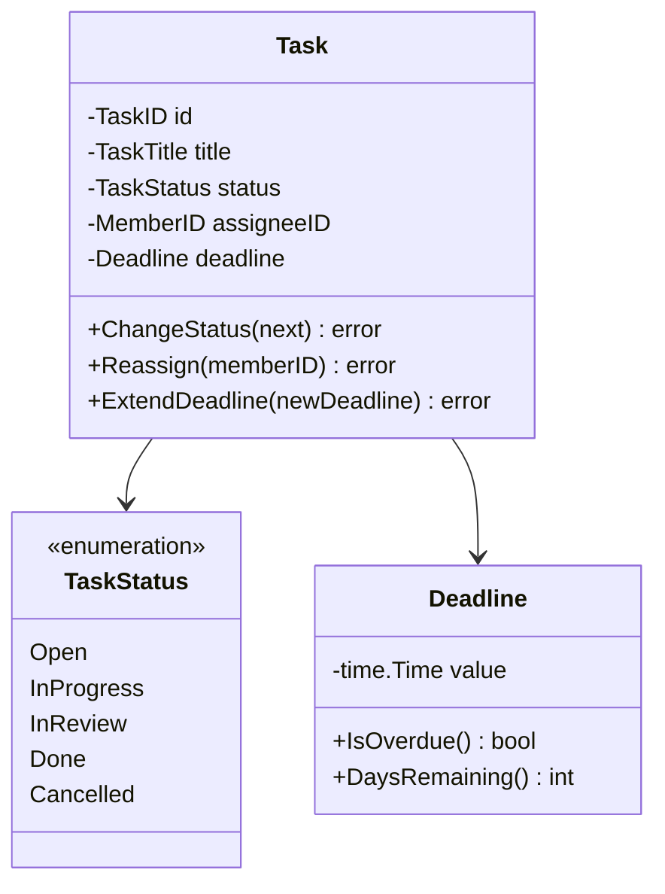

## はじめに

:::message

本記事はLLM（大規模言語モデル）をDDDのドメインモデリングプロセスに活用する手法をまとめたものです。各セクションの根拠となる一次情報源は、該当箇所に参照リンクを記載しています。

:::

DDDで最も難しいのは、技術ではなく**ドメイン知識の獲得**です。Eric Evansは『Domain-Driven Design』の中で、開発者とドメインエキスパートの対話を通じてユビキタス言語を構築することの重要性を繰り返し強調しています。

しかし現実には、ドメインエキスパートの時間は限られています。新しいプロジェクトの立ち上げ時に「まずドメインエキスパートと2週間集中セッションをしましょう」と言っても、なかなか実現しません。私のチームでも、ドメインエキスパートとのミーティングは週1〜2回が限度でした。

そこで私が試みたのは、**LLMをドメインエキスパートの"壁打ち相手"として活用する**アプローチです。LLMは真のドメインエキスパートの代替にはなりませんが、**ミーティングの準備や思考の整理には非常に有効**でした。

この記事では、LLMをDDDのドメインモデリングプロセスに組み込む具体的な手法を共有します。

---

## LLMの役割：ドメインエキスパートの代替ではなく補助

まず重要な前提を述べます。LLMはドメインエキスパートの**代替ではありません**。LLMは一般的な業界知識を持っていますが、あなたの組織固有のビジネスルールや暗黙知は知りません。



LLMが効果を発揮するのは以下の場面です。

| フェーズ | LLMの活用方法 | 期待される効果 |
| --- | --- | --- |
| 事前準備 | 業界の一般的な用語・概念を調査する | ドメインエキスパートとの対話の生産性が上がります |
| 言語整理 | ユビキタス言語の候補を網羅的に洗い出す | 言語の抜け漏れを減らせます |
| モデル叩き台 | ドメインモデルの初期案を生成する | ゼロから議論するよりも効率的です |
| 検証補助 | モデルの矛盾や曖昧さを指摘させる | レビューの観点が増えます |

---

## ユビキタス言語の抽出にLLMを活用する

### ステップ1：ドメインの概要をLLMに説明する

LLMに対して、プロジェクトのドメインを説明し、関連する用語の洗い出しを依頼します。

```text
【プロンプト例】

私はプロジェクト管理ツールを開発しています。
以下の業務フローがあります：

1. プロジェクトマネージャーがプロジェクトを作成する
2. タスクを作成し、メンバーにアサインする
3. メンバーはタスクのステータスを更新する
4. 期限が近いタスクにはリマインダーが送られる
5. プロジェクト完了時にレポートが生成される

このドメインにおいて、DDDのユビキタス言語として定義すべき
用語を洗い出してください。各用語について以下を整理してください：
- 用語名（英語・日本語）
- 定義（1〜2文）
- エンティティ/値オブジェクト/ドメインイベントのいずれに分類されるか
- 関連する用語
```

### ステップ2：LLMの出力を構造化する

LLMが生成した用語リストを、チームで使えるフォーマットに整理します。

```markdown
## ユビキタス言語 用語集（LLM生成ドラフト）

### エンティティ

| 用語（英語） | 用語（日本語） | 定義                                             | 検証状態  |
| ------------ | -------------- | ------------------------------------------------ | --------- |
| Project      | プロジェクト   | 目標達成のための作業単位。メンバーとタスクを持つ | ⬜ 未検証 |
| Task         | タスク         | プロジェクト内の具体的な作業項目                 | ⬜ 未検証 |
| Member       | メンバー       | プロジェクトに参加しているユーザー               | ⬜ 未検証 |

### 値オブジェクト

| 用語（英語） | 用語（日本語） | 定義                                              | 検証状態  |
| ------------ | -------------- | ------------------------------------------------- | --------- |
| Deadline     | 期限           | タスクの完了期日                                  | ⬜ 未検証 |
| Priority     | 優先度         | タスクの重要度を示す（高/中/低）                  | ⬜ 未検証 |
| TaskStatus   | タスク状態     | タスクの進行状態（未着手/進行中/完了/キャンセル） | ⬜ 未検証 |

### ドメインイベント

| 用語（英語） | 用語（日本語） | 定義 | 検証状態 |
| --- | --- | --- | --- |
| TaskAssigned | タスクアサイン済み | メンバーにタスクが割り当てられたイベント | ⬜ 未検証 |
| DeadlineApproaching | 期限接近 | タスクの期限が近づいていることを示すイベント | ⬜ 未検証 |
| ProjectCompleted | プロジェクト完了 | プロジェクトの全タスクが完了したイベント | ⬜ 未検証 |
```

**検証状態の列が重要です。** LLMの出力はすべて「未検証」として扱い、ドメインエキスパートとの対話で「検証済み」に更新していきます。

### ステップ3：用語の曖昧さをLLMに指摘させる

LLMに生成した用語の曖昧さや矛盾を自己レビューさせます。

```text
【プロンプト例】

先ほど生成した用語集について、以下の観点で問題点を指摘してください：

1. 同じ概念を異なる名前で呼んでいる箇所はないか
2. 1つの用語が複数の意味を持っている箇所はないか
3. 暗黙の前提が含まれている用語はないか
4. 境界づけられたコンテキスト（Bounded Context）によって
   意味が変わる用語はないか
```

この問いかけにより、LLMは以下のような指摘を返すことがあります。

- 「Member」はプロジェクトコンテキストでは「プロジェクトメンバー」だが、認証コンテキストでは「ユーザー」として扱われる可能性があります
- 「Task」の「完了」は誰が判断するのか（担当者自身か、レビュアーか）が曖昧です
- 「期限」に時間の情報は含まれるのか、日付のみなのかが不明確です

これらの指摘は、ドメインエキスパートに確認すべき質問リストとして活用できます。

---

## イベントストーミングの事前準備としてのAI活用

イベントストーミングは、Alberto Brandoliniが提唱したドメインモデリングの手法です。ドメインイベントを起点に、コマンド、集約、ポリシーを洗い出します。

LLMを使ってイベントストーミングの事前準備をすることで、本番のセッションの生産性を高められます。

### ドメインイベントの候補を生成する

```text
【プロンプト例】

プロジェクト管理ツールのドメインで発生しうるドメインイベントを
網羅的に洗い出してください。以下のフォーマットで出力してください：

イベント名（過去形）→ トリガー（コマンドまたはポリシー）→ 関連する集約

例：
TaskCreated → CreateTask コマンド → Task集約
```

### 生成結果をイベントストーミングのボードに配置する

LLMが生成したイベントの候補をMermaid図で可視化します。



この図をドメインエキスパートとのミーティングに持ち込むことで、「ゼロから付箋を貼っていく」のではなく、**叩き台をベースに修正・追加する**形でセッションを進められます。

---

## ドメインモデルの叩き台をLLMで生成する

### Goのコードとして生成する

LLMにドメインモデルのGoコードを生成させ、それをレビューの起点にします。

```text
【プロンプト例】

以下のユビキタス言語に基づいて、Go言語でドメインモデルを設計してください。
DDDの原則に従い、以下を満たすコードを生成してください：

- エンティティのフィールドは非公開にする
- コンストラクタでバリデーションを行う
- 値オブジェクトを使ってドメイン概念を表現する
- 状態遷移はエンティティのメソッドで管理する

【ユビキタス言語】
- Project: メンバーとタスクを管理する作業単位
- Task: 具体的な作業項目。ステータス（Open→InProgress→Done）を持つ
- Member: プロジェクトに参加するユーザー。ロール（Owner/Editor/Viewer）を持つ
- Deadline: タスクの完了期日。過去の日付は設定不可
```

### 生成されたコードの検証ポイント

LLMが生成したドメインモデルのコードは、[前の記事で紹介したレビューチェックリスト](/articles/583ecabd270e4b)を使って検証します。特に以下の点に注意が必要です。

| 検証ポイント | よくある問題 | 対処法 |
| --- | --- | --- |
| 集約の粒度 | ProjectがTask一覧を内包して肥大化する | Taskを独立した集約にし、ProjectIDで関連づける |
| 値オブジェクトの設計 | Deadlineが`time.Time`のラッパーだけになる | 「期限切れ判定」などのドメインロジックを持たせる |
| 状態遷移 | 全ての遷移が許可されている | 許可される遷移のみを定義する |
| 命名 | LLMが汎用的な名前を使う | ドメインエキスパートの言葉に置き換える |

---

## AIの出力をドメインエキスパートと検証するプロセス

LLMの出力をドメインエキスパートに持ち込む際のプロセスです。



### セッションの進め方

ドメインエキスパートとのセッションでは、LLMが生成した成果物を以下のように使います。

**1. 用語集の検証**

LLMが生成した用語集を見せながら、各用語の定義が正しいかを確認します。

```text
開発者：「LLMにタスクの状態遷移を整理させたところ、
Open → InProgress → Done の3状態になりました。
実際の業務ではこの遷移で正しいですか？」

ドメインエキスパート：「いいえ、レビュー状態があります。
InProgress → InReview → Done の流れです。
また、InReview から InProgress に差し戻すこともあります」
```

**2. イベントフローの検証**

LLMが生成したイベントストーミングの図を見せながら、抜け漏れを確認します。

```text
開発者：「タスクが完了した後のフローとして、
LLMはレポート生成を提案しました。
実際にはどのようなプロセスがありますか？」

ドメインエキスパート：「タスク完了後にはまず工数の集計があります。
それからプロジェクトの進捗率を更新して、
一定の進捗率を超えたらマネージャーに通知します」
```

**3. モデルコードの検証**

LLMが生成したGoコードを見せるのではなく、コードから抽出した**ドメインモデル図**を使います。



非技術者のドメインエキスパートにコードを見せるよりも、図で議論する方が生産的です。

### 検証結果の反映

ドメインエキスパートからのフィードバックは、すぐにユビキタス言語辞書とコードに反映します。

```go
// ドメインエキスパートのフィードバックを反映した状態遷移
var allowedTransitions = map[TaskStatus][]TaskStatus{
    TaskStatusOpen:       {TaskStatusInProgress, TaskStatusCancelled},
    TaskStatusInProgress: {TaskStatusInReview, TaskStatusCancelled},
    TaskStatusInReview:   {TaskStatusDone, TaskStatusInProgress}, // 差し戻し可能
    TaskStatusDone:       {},
    TaskStatusCancelled:  {},
}
```

---

## LLM活用の注意点

LLMをドメインモデリングに活用する際の注意点です。

### やってはいけないこと

- **LLMの出力をそのまま正とすること**。LLMは一般的な知識に基づいて回答するため、あなたの組織固有のルールは知りません
- **ドメインエキスパートとの対話をLLMで代替すること**。LLMはあくまで準備ツールです。最終的な検証は必ず人間が行います
- **LLMが生成した用語をそのまま採用すること**。LLMは「一般的に使われている用語」を提案しますが、チームのユビキタス言語はチーム固有のものです

### 効果的な使い方

- **事前準備の加速**。ドメインエキスパートとのセッション前に、議論の叩き台を用意する時間を大幅に短縮できます
- **網羅性の向上**。人間だけでは見落としがちな用語やイベントを、LLMが補完できます
- **ドキュメントの構造化**。散在するドメイン知識をLLMに整理させ、構造化されたドキュメントを生成できます
- **反復的な改善**。ドメインエキスパートのフィードバックをLLMに入力し、修正案を素早く生成できます

---

## まとめ

LLMをDDDのドメインモデリングに活用するポイントは以下の通りです。

| 活用フェーズ | 具体的な手法 | 成果物 |
| --- | --- | --- |
| ユビキタス言語の抽出 | ドメイン説明からの用語洗い出しと曖昧さの指摘 | 用語集ドラフト（未検証） |
| イベントストーミング準備 | ドメインイベント候補の網羅的生成 | イベントフロー図ドラフト |
| モデル叩き台生成 | ユビキタス言語に基づくGoコードの生成 | ドメインモデルコードドラフト |
| 検証補助 | モデルの矛盾・曖昧さの自動指摘 | ドメインエキスパートへの質問リスト |

最も重要なのは、**LLMの出力はすべて「未検証の叩き台」として扱う**ことです。LLMは思考を加速するツールであり、ドメインの真実を知っているのはドメインエキスパートです。LLMを活用することで、ドメインエキスパートとの限られた対話時間をより生産的に使えるようになります。

DDDの本質は技術ではなく、ドメインの深い理解にあります。LLMはその理解を得るまでの道のりを効率化するパートナーとして位置づけることで、最大の効果を発揮します。

---

## 参考文献

| 内容 | 出典 |
| --- | --- |
| ユビキタス言語の重要性 | Eric Evans, _Domain-Driven Design_（2003）Chapter 2: Communication and the Use of Language |
| イベントストーミング | Alberto Brandolini, [Introducing EventStorming](https://www.eventstorming.com/) |
| ドメインエキスパートとの協働 | Vaughn Vernon, _Implementing Domain-Driven Design_（2013）Chapter 1: Getting Started with DDD |
| ドメインモデリングプロセス | Nick Tune, [Domain-Driven Design Starter Modelling Process](https://github.com/ddd-crew/ddd-starter-modelling-process) |
| プロンプトエンジニアリング | Anthropic, [Prompt Engineering Guide](https://docs.anthropic.com/en/docs/build-with-claude/prompt-engineering) |
