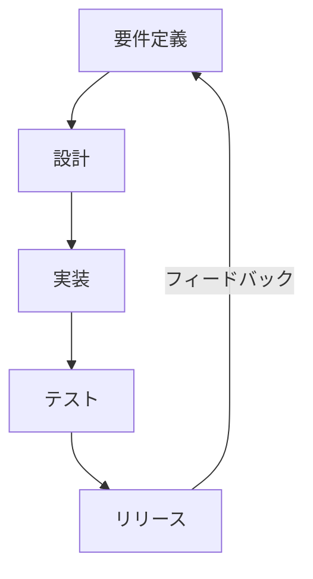
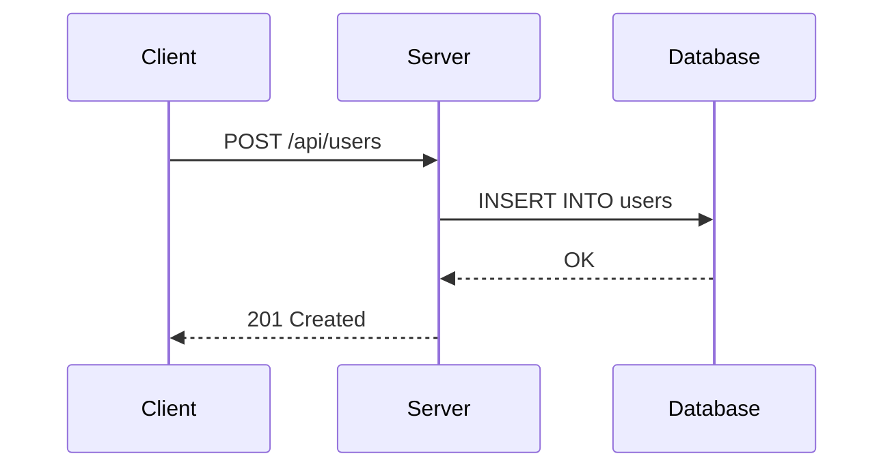
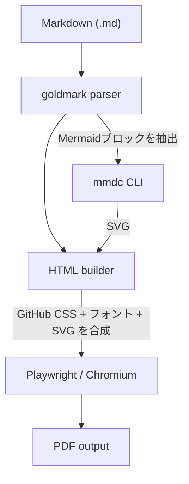

## はじめに

技術ドキュメントや設計書をMarkdownで管理していると、クライアントへの納品やレビュー会議など、PDFでの出力が適した場面に多く遭遇します。しかし既存の変換ツールではMermaidダイアグラムが崩れたり、日本語フォントが化けたりと、満足できるものに出会えませんでした。

そこで、以下の要件を満たすCLIツール **md2pdf** を作りました。

- GitHub風のスタイリングでPDFを生成
- **Mermaidダイアグラム** をインラインSVGとしてレンダリング
- **日本語フォント（Noto Sans CJK JP）** に対応
- ページサイズやマージンをカスタマイズ可能

<https://github.com/135yshr/md2pdf>

## インストール

### Homebrew（推奨）

```sh
brew install 135yshr/tap/md2pdf
```

### Go install

```sh
go install github.com/135yshr/md2pdf/cmd/md2pdf@latest
```

### ランタイム依存のインストール

md2pdf は内部で外部ツールを使っています。本体とは別にインストールが必要です。

```sh
# Mermaid CLI（ダイアグラムの SVG 変換に使用）
npm install -g @mermaid-js/mermaid-cli

# Playwright + Chromium（HTML → PDF の変換に使用）
pip install playwright
playwright install chromium
```

### 日本語フォント（オプション）

日本語テキストを含むドキュメントを変換する場合は、Noto Sans CJK JP フォントをインストールしてください。

**macOS**

```sh
brew install font-noto-sans-cjk
```

**Ubuntu / Debian**

```sh
sudo apt install fonts-noto-cjk
```

## 基本的な使い方

```sh
md2pdf document.md
```

これだけで `document.pdf` が同じディレクトリに生成されます。

### 出力先を指定する

```sh
md2pdf -o output/report.pdf document.md
```

### 詳細ログを表示する

```sh
md2pdf -v document.md
```

`-v` をつけると、各ステップの進行状況が表示されます。変換がうまくいかないときのデバッグに便利です。

## 実用例

### 設計書をPDFで納品する

```sh
md2pdf -page-size A4 -margin-top 20mm -margin-bottom 20mm spec.md
```

### レターサイズで英語ドキュメントを変換

```sh
md2pdf -page-size Letter -margin-left 25mm -margin-right 25mm design.md
```

### フォントを明示的に指定する

フォントの自動検出がうまくいかない場合は、直接パスを指定できます。

```sh
md2pdf -font /usr/share/fonts/opentype/noto/NotoSansCJK-Regular.ttc document.md
```

## Mermaidダイアグラムの活用

md2pdf の大きな特徴は、MermaidダイアグラムをそのままPDFに埋め込めることです。Markdown内に記述した Mermaid コードブロックが、自動的にSVGとしてレンダリングされます。

### フローチャートの例

Markdown内に以下のように書くだけです。



これがPDF上ではきれいなフローチャートとして描画されます。

### シーケンス図の例



APIの設計書にシーケンス図を含めてPDFとして納品する、といった使い方が可能です。

## 仕組み

md2pdf の変換パイプラインは4つのステップで構成されています。



1. **Parse** — goldmark が Markdown を HTML に変換。Mermaidコードブロックはプレースホルダーに置換
2. **Render diagrams** — 抽出した Mermaid ブロックを mmdc CLI で SVG にレンダリング
3. **Build HTML** — GitHub風CSS、`@font-face` 宣言、SVG を組み合わせた自己完結型 HTML を生成
4. **Print PDF** — Playwright 経由のヘッドレス Chromium が HTML を読み込み、PDF として出力

Chromium のレンダリングエンジンを使っているため、CSS の再現度が高く、ブラウザで見たときとほぼ同じ見た目のPDFが得られます。

## オプション一覧

| フラグ                | デフォルト   | 説明                              |
| --------------------- | ------------ | --------------------------------- |
| `-o <path>`           | `<入力>.pdf` | 出力PDFのパス                     |
| `-font <path>`        | 自動検出     | Noto Sans CJK JP Regular フォント |
| `-font-bold <path>`   | 自動検出     | Noto Sans CJK JP Bold フォント    |
| `-font-medium <path>` | 自動検出     | Noto Sans CJK JP Medium フォント  |
| `-mmdc <path>`        | 自動検出     | mmdc バイナリのパス               |
| `-page-size <size>`   | `A4`         | `A4` / `Letter` / `A3`            |
| `-margin-top <m>`     | `18mm`       | 上マージン                        |
| `-margin-bottom <m>`  | `18mm`       | 下マージン                        |
| `-margin-left <m>`    | `14mm`       | 左マージン                        |
| `-margin-right <m>`   | `14mm`       | 右マージン                        |
| `-v`                  | false        | 詳細出力                          |
| `-version`            | —            | バージョン情報を表示              |

## トラブルシューティング

### Chromium が見つからない

```text
no Chromium executable found; install chromium-browser or set CHROME_PATH
```

Playwright の Chromium がインストールされていない場合に発生します。

```sh
playwright install chromium
```

それでも解決しない場合は、`CHROME_PATH` 環境変数で直接パスを指定してください。

```sh
export CHROME_PATH=/path/to/chromium
md2pdf document.md
```

### 画像が表示されない

Markdown 内の画像は相対パスで参照されている場合、入力ファイルのディレクトリからの相対パスとして解決されます。画像ファイルが正しい場所にあることを確認してください。

```markdown
<!-- OK: 入力 .md と同じディレクトリ構造に画像がある -->


```

### 日本語が文字化けする

Noto Sans CJK JP フォントがインストールされていない可能性があります。上記のフォントインストール手順を確認してください。

## まとめ

md2pdf は「Markdown を書いたら、そのままきれいなPDFにしたい」というシンプルなニーズに応えるツールです。

- `brew install` ですぐ使い始められる
- Mermaidダイアグラムがそのまま描画される
- 日本語ドキュメントにも対応
- GitHub風のスタイリングで見た目がきれい

技術ドキュメントのPDF変換で困っている方は、ぜひ試してみてください。

<https://github.com/135yshr/md2pdf>
