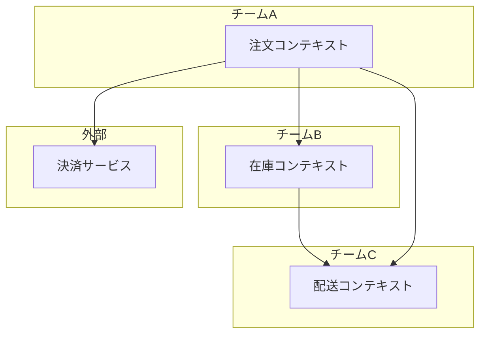
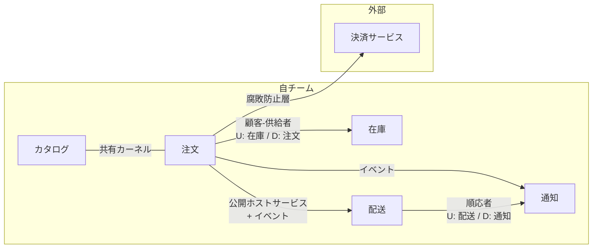

## はじめに

:::message

本記事はDDD/クリーンアーキテクチャ連載の一部です。戦略的DDDの中核であるコンテキストマップの描き方と、チーム間の関係パターンを解説します。各セクションの根拠となる一次情報源は、該当箇所に参照リンクを記載しています。

:::

[集約](https://zenn.dev/135yshr/articles/4afd548d07480a)、[値オブジェクト](https://zenn.dev/135yshr/articles/98473f8e119657)、[リポジトリ](https://zenn.dev/135yshr/articles/860e12b4a2698a)、[ユースケース](https://zenn.dev/135yshr/articles/5de289f64ec515)…戦術的なDDDパターンを導入してコードの品質は上がりました。しかし、システムが複数のチームやサービスにまたがると、別の問題が出てきます。

- あるチームが定義した「ユーザー」と別のチームの「ユーザー」が微妙に異なるのに、同じ型を共有してしまっている
- 外部APIの変更が自分のドメインモデルに直撃する
- どのコンテキストがどのコンテキストに依存しているのか、誰も把握していない

これらは**戦術的DDDだけでは解決しない問題**です。コードの構造ではなく、チームとコンテキストの関係性に起因するからです。本記事では、こうした問題を可視化し解決するための道具である**コンテキストマップ**を紹介します。

---

## 戦術的 DDD だけでは解決しない問題

戦術的DDDは「1つの境界づけられたコンテキストの内部をどう設計するか」に焦点を当てます。しかし現実のシステムでは、複数のコンテキストが連携して動いています。



コンテキスト間の関係が暗黙的なままだと、以下の問題が発生します。

| 問題 | 具体例 |
| --- | --- |
| モデルの汚染 | 決済サービスの`Transaction`型を注文コンテキストがそのまま使い、決済APIの仕様変更でドメインモデルが壊れます |
| 隠れた依存 | 在庫コンテキストが配送コンテキストの内部型を直接参照しており、変更の影響範囲が見えません |
| チーム間の摩擦 | 共有ライブラリの変更について合意が取れず、開発が停滞します |

Eric Evansは、こうした問題への対処として**コンテキストマップ**を提唱しました。コンテキストマップは境界づけられたコンテキスト間の関係を定義する道具です。単なる図ではなく、組織的・技術的な連携パターンを記録するものとされています（Evans, _Domain-Driven Design_, 2003, Chapter 14）。

---

## コンテキストマップの描き方

コンテキストマップは、境界づけられたコンテキスト間の関係を図示したものです。単なるアーキテクチャ図ではなく、**チーム間の力関係や連携方針**も表現します。

### ステップ1：コンテキストを洗い出す

まず、システムに存在する境界づけられたコンテキストを列挙します。

```text
1. 注文コンテキスト（注文の受付・管理）
2. 在庫コンテキスト（在庫数の管理・引当）
3. カタログコンテキスト（商品情報の管理）
4. 配送コンテキスト（配送手配・追跡）
5. 決済コンテキスト（外部決済サービスとの連携）
6. 通知コンテキスト（メール・プッシュ通知の送信）
```

### ステップ2：関係パターンを識別する

各コンテキスト間の関係を、DDDで定義された関係パターンに分類します。主要なパターンは以下の通りです。

| パターン | 英語名 | 概要 |
| --- | --- | --- |
| 共有カーネル | Shared Kernel | 2つのコンテキストがモデルの一部を共有します |
| 顧客-供給者 | Customer-Supplier | 上流（供給者）が下流（顧客）のニーズに応じてAPIを提供します |
| 順応者 | Conformist | 下流が上流のモデルにそのまま従います |
| 腐敗防止層 | Anti-Corruption Layer | 下流が翻訳層を設けて上流のモデルから自分を守ります |
| 公開ホストサービス | Open Host Service | 上流が公開プロトコル（API）を提供します |
| 公表された言語 | Published Language | コンテキスト間で共有する標準的なデータ形式です |
| 別々の道 | Separate Ways | コンテキスト間の連携を行わず、独立して開発します |

### ステップ3：マップを描く



**凡例**: 矢印はデータやAPIコールの流れを示します。ラベルの `U`（Upstream＝上流）/ `D`（Downstream＝下流）は、モデルの主導権がどちらにあるかを表します。`---`（方向なし）は対等な関係です。

このマップから、以下のことが読み取れます。

- 注文と決済サービスの間にはACLが必要です（外部サービスのモデルから自分を守るため）
- 注文と在庫は顧客-供給者の関係です（在庫が上流＝供給者、注文が下流＝顧客。在庫チームが注文チームのニーズに応じてAPIを調整します）
- カタログと注文は共有カーネルを持ちます（商品IDや基本的な商品情報を共有します）
- 配送から通知への連携では、通知側が配送のモデルに順応します

---

## チーム間の関係パターン（詳細）

### 共有カーネル（Shared Kernel）

2つのコンテキストがドメインモデルの一部を共有するパターンです。共有部分の変更には両チームの合意が必要です。

```text
shared/
├── go.mod
├── money.go        # 金額の値オブジェクト
├── product_id.go   # 商品IDの型定義
└── address.go      # 住所の値オブジェクト
```

```go
// shared/money.go
package shared

// Money は複数のコンテキストで共有される金額の値オブジェクトです。
// 変更する場合は、注文チームとカタログチームの合意が必要です。
type Money struct {
    Amount   int64
    Currency string
}

func NewMoney(amount int64, currency string) Money {
    return Money{Amount: amount, Currency: currency}
}

func (m Money) Add(other Money) (Money, error) {
    if m.Currency != other.Currency {
        return Money{}, ErrCurrencyMismatch // エラー定義は省略
    }
    return Money{Amount: m.Amount + other.Amount, Currency: m.Currency}, nil
}
```

**注意点**: 共有カーネルは便利ですが、共有範囲が広がるとコンテキスト間の結合が強くなります。共有するのは値オブジェクトやID型など、変更頻度の低いものに限定します。

Evansは共有カーネルについて、2つのチームが合意した小さなモデルのサブセットを共有する関係だと述べています。カーネルは小さく保つべきとされています（Evans, _Domain-Driven Design_, 2003, Chapter 14）。

### 顧客-供給者（Customer-Supplier）

上流（供給者）チームが下流（顧客）チームのニーズに応じてAPIを設計するパターンです。

```go
// inventory/service.go（上流：供給者）
package inventory

import "context"

// StockService は在庫コンテキストが提供するサービスです。
// 注文コンテキスト（顧客）のニーズに応じてAPIを設計します。
type StockService struct {
    repo stockReader
}

// CheckAvailability は注文コンテキストが必要とする在庫確認APIです。
// 顧客のニーズに合わせ、商品IDと数量を受け取り、利用可能かどうかを返します。
func (s *StockService) CheckAvailability(ctx context.Context, productID string, quantity int) (*Availability, error) {
    stock, err := s.repo.FindByProductID(ctx, productID)
    if err != nil {
        return nil, fmt.Errorf("在庫の取得に失敗しました: %w", err)
    }
    return &Availability{
        ProductID: productID,
        Available: stock.Quantity >= quantity,
        Remaining: stock.Quantity,
    }, nil
}
```

```go
// order/usecase/place_order.go（下流：顧客）
package usecase

// StockStatus は注文コンテキストが定義する、在庫確認結果の型です。
// inventory パッケージの型を直接使わず、下流コンテキスト独自の型として定義します。
type StockStatus struct {
    ProductID string
    Available bool
    Remaining int
}

type stockChecker interface {
    CheckAvailability(ctx context.Context, productID string, quantity int) (*StockStatus, error)
}

type PlaceOrderUseCase struct {
    stock     stockChecker
    orderRepo orderWriter
}
```

下流コンテキストは上流の型（`inventory.Availability`）を直接参照せず、自前の型（`StockStatus`）を定義します。`stockChecker` の実装（インフラ層のアダプタ）で上流の型から下流の型へ変換することで、コンテキスト間の境界を維持します。

顧客-供給者の関係では、下流チームが必要とするAPIを上流チームに要求できます。上流チームはその要求を考慮してAPIを設計します。

### 順応者（Conformist）

下流が上流のモデルにそのまま従うパターンです。上流チームが下流の要求に応じる意思や余力がなく、かつACL（翻訳層）を構築するコストが上流モデルへの依存リスクより高い場合に採用します。

```go
// notification/handler.go（下流：順応者）
package notification

import "myapp/shipping"

// HandleShipmentEvent は配送コンテキストのイベントをそのまま受け取り、
// 配送コンテキストのモデルに順応して通知を送信します。
type HandleShipmentEvent struct {
    sender emailSender
}

func (h *HandleShipmentEvent) Handle(ctx context.Context, event *shipping.ShipmentStatusChanged) error {
    // 配送コンテキストのモデルをそのまま使用します
    subject := fmt.Sprintf("配送状況の更新: %s", event.TrackingID)
    body := fmt.Sprintf("配送状況が「%s」に変更されました。", event.NewStatus)
    return h.sender.Send(ctx, event.CustomerEmail, subject, body)
}
```

順応者パターンでは、ACLを設けるコストと、上流モデルへの依存リスクを天秤にかけます。通知のような補助的なコンテキストでは、上流のモデルへの順応が実用的な場合もあります。

---

## 実プロジェクトでの適用ステップ

コンテキストマップを実プロジェクトに導入するための具体的なステップを紹介します。

### ステップ1：現状のコンテキスト境界を可視化する

既存のコードベースから、暗黙的なコンテキスト境界を見つけます。

```bash
# Go プロジェクトでパッケージ間の依存を可視化する
go list -json ./... | jq '.ImportPath'

# パッケージ間のインポート関係を確認する
go list -f '{{.ImportPath}}: {{join .Imports ", "}}' ./internal/...
```

依存関係を図にして、循環依存や不自然な依存がないか確認します。

### ステップ2：ドメインエキスパートと境界を議論する

技術的な依存関係だけでなく、ビジネス上の境界も考慮します。

- 「この概念は誰が責任を持つのか」
- 「この2つのチームは同じ言葉を同じ意味で使っているか」
- 「このサービスを別チームが独立して変更できるか」

### ステップ3：関係パターンを決定する

各コンテキスト間の関係を、前述のパターンから選択します。判断基準は以下の通りです。

| 状況                                               | 推奨パターン |
| -------------------------------------------------- | ------------ |
| 両チームが密に協力できる                           | 共有カーネル |
| 上流チームが下流の要求に応じられる                 | 顧客-供給者  |
| 上流が要求に応じず、翻訳コストが依存リスクより高い | 順応者       |
| 外部サービスやレガシーシステムとの連携             | 腐敗防止層   |
| 連携の必要がない                                   | 別々の道     |

### ステップ4：コードに反映する

コンテキストマップで決定した関係パターンを、ディレクトリ構成と実装に反映します。

```text
myapp/
├── internal/
│   ├── order/           # 注文コンテキスト
│   │   ├── domain/
│   │   ├── usecase/
│   │   └── infra/
│   │       └── acl/     # 決済サービスとのACL
│   │           ├── payment_adapter.go
│   │           └── payment_translator.go
│   ├── inventory/       # 在庫コンテキスト（注文の供給者）
│   ├── catalog/         # カタログコンテキスト
│   ├── shipping/        # 配送コンテキスト
│   └── notification/    # 通知コンテキスト（配送への順応者）
├── shared/              # 共有カーネル
│   ├── money.go
│   └── product_id.go
└── docs/
    └── context-map.md   # コンテキストマップのドキュメント
```

### ステップ5：マップを維持する

コンテキストマップを一度描いたら終わりではありません。以下のタイミングで見直します。

- 新しいコンテキスト（サービス）を追加するとき
- チーム構成が変わるとき
- 外部サービスとの連携を新たに始めるとき
- コンテキスト間の依存に問題が出たとき

マップはリポジトリ内のドキュメントとして管理し、ADR（Architecture Decision Record）と合わせて更新することをおすすめします。

---

## まとめ

| 観点 | 内容 |
| --- | --- |
| 戦術的DDDの限界 | 1つのコンテキスト内部の設計は解決しますが、コンテキスト間の関係は扱えません |
| コンテキストマップの役割 | コンテキスト間の関係を可視化し、連携パターンを明確にします |
| 主要な関係パターン | 共有カーネル、顧客-供給者、順応者、腐敗防止層などがあります |
| 適用のポイント | まず現状を可視化し、ドメインエキスパートと議論してからコードに反映します |

戦術的DDDで「良いコード」を書くことと、戦略的DDDで「正しい境界」を引くことは、車の両輪です。コンテキストマップを描くことで、「どこにACLが必要か」「どのモデルを共有すべきか」「どのチームが供給者になるべきか」が明確になります。コードを書く前に、まずマップを描くことをおすすめします。

---

## 参考文献

| 内容 | 出典 |
| --- | --- |
| コンテキストマップの原典 | Eric Evans, _Domain-Driven Design: Tackling Complexity in the Heart of Software_（2003） |
| 戦略的DDDパターンの解説 | Vaughn Vernon, _Implementing Domain-Driven Design_（2013） |
| コンテキストマップの実践 | Martin Fowler, [BoundedContext](https://martinfowler.com/bliki/BoundedContext.html) |
| チーム間パターンの整理 | Vladik Khononov, _Learning Domain-Driven Design_（2021） |
| Go モジュール構成 | [Go Modules Reference](https://go.dev/ref/mod) |
