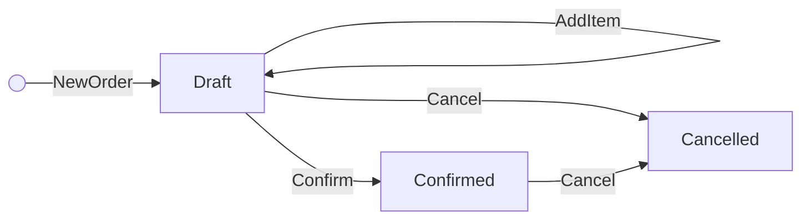
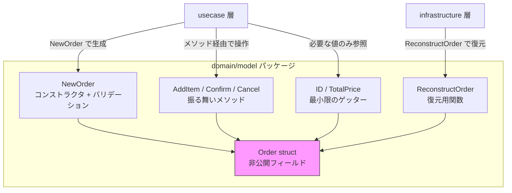

## はじめに

:::message

本記事はDDD/クリーンアーキテクチャ連載の一部です。Goで集約（Aggregate）の不変条件をどのように守るかについて、実践的な設計パターンを紹介します。各セクションの根拠となる一次情報源は、該当箇所に参照リンクを記載しています。

:::

DDDにおける集約（Aggregate）の最も重要な役割は、**不変条件（invariant）を常に満たした状態を保証する**ことです。不変条件とは、「注文金額は0以上でなければならない」「在庫数はマイナスにならない」といった、ビジネス上常に成立しなければならないルールを指します。

Java や C# ではアクセス修飾子（`private`、`protected`）を使ってフィールドを隠蔽しますが、Go にはクラスやアクセス修飾子がありません。代わりに、Go は**先頭文字の大小**でエクスポートの可否を制御します。この言語特性を活かして集約の不変条件を守る方法を、具体的なコード例とともに解説します。

---

## 集約と不変条件の関係

Eric Evans は _Domain-Driven Design_ の中で、集約について次のように述べています。

> Cluster the ENTITIES and VALUE OBJECTS into AGGREGATES and define boundaries around each. Choose one ENTITY to be the root of each AGGREGATE, and control all access to the objects inside the boundary through the root.
>
> — Eric Evans, _Domain-Driven Design_（2003）

集約の境界内では、すべての状態変更が不変条件を維持するように制御されなければなりません。外部から直接フィールドを書き換えられてしまうと、不変条件の破壊リスクが生じます。

たとえば、EC サイトの「注文」集約を考えてみます。以下の不変条件があるとします。

- 注文明細は1件以上必要です
- 合計金額は注文明細の小計の総和と一致する必要があります
- 確定済みの注文には明細を追加できません

これらのルールをコードでどう表現するかが、本記事のテーマです。

---

## すべての構造体を非公開にする必要はない

まず重要な前提を共有します。**Go の構造体すべてで非公開フィールドが必要なわけではありません**。Go の標準ライブラリ自体、構造体の性質に応じて公開・非公開を使い分けています。

### 公開フィールドの構造体：設定やデータの入れ物

標準ライブラリには、フィールドがすべて公開されている構造体が数多くあります。

```go
// net/http パッケージ — http.Response は非公開フィールドが1つもない
type Response struct {
    Status     string
    StatusCode int
    Header     Header
    Body       io.ReadCloser
    // ... 全14フィールドがすべて公開
}
```

`http.Response` は HTTP レスポンスのデータを格納する構造体です。フィールド間に「`StatusCode` が 200 なら `Body` は必ず非 nil」のような整合性ルールはなく、各フィールドを独立して読み書きできます。

同様に、`tls.Config` は約 32 個の公開フィールドを持つ設定用構造体です。`exec.Cmd` も `Path`、`Args`、`Stdout` などすべて公開されています。これらに共通するのは、**フィールド間に守るべき不変条件がない**という点です。

### 非公開フィールドの構造体：内部状態を持つオブジェクト

一方、標準ライブラリで非公開フィールドのみを使っている構造体もあります。

```go
// os パッケージ — os.File は非公開フィールドのみ
file, err := os.Open("data.txt")  // コンストラクタ経由でのみ生成
```

| 構造体 | コンストラクタ | 非公開にする理由 |
| --- | --- | --- |
| `os.File` | `os.Open()`, `os.Create()` | OS のファイルディスクリプタを保持しており、直接構築は無意味です |
| `regexp.Regexp` | `regexp.Compile()` | 正規表現のコンパイル結果を内部に持つため、パターン文字列なしでは生成できません |
| `bufio.Scanner` | `bufio.NewScanner()` | 内部バッファやトークン解析の状態が複雑で、外部から操作すると壊れます |

これらに共通するのは、**内部状態に整合性の制約がある**点です。DDD の集約もこちら側に該当します。

### 判断基準

| 構造体の性質 | フィールドの公開 | 標準ライブラリの例 |
| --- | --- | --- |
| 設定・データの入れ物 | 公開で十分 | `http.Response`, `tls.Config`, `exec.Cmd` |
| 内部状態に整合性ルールがある | 非公開 + コンストラクタ | `os.File`, `regexp.Regexp`, `bufio.Scanner` |

以降のセクションでは、不変条件を持つ集約を対象に、非公開フィールドによる設計パターンを解説します。

---

## 公開フィールドの集約が問題になるケース

不変条件を持つ集約でフィールドを公開すると、どのような問題が起きるかを見てみます。

```go
// ❌ フィールドがすべて公開されている
type Order struct {
    ID         string
    Status     OrderStatus
    Items      []OrderItem
    TotalPrice int
}

type OrderItem struct {
    ProductID string
    Name      string
    Price     int
    Quantity  int
}
```

この設計では、外部のコードから自由にフィールドを書き換えられます。

```go
order.Status = OrderStatusConfirmed  // バリデーションなしで確定できてしまう
order.Items = nil                     // 明細を空にできてしまう
order.TotalPrice = -100               // 負の金額を設定できてしまう
```

フィールドが公開されている限り、不変条件を守る責任が**集約の外側**に漏れ出します。すべての呼び出し元が正しくバリデーションしてくれることを祈るしかありません。

---

## Go のエクスポートルールを活かした設計

Go では、識別子の先頭を小文字にすると、そのパッケージ外からアクセスできなくなります。これが Go における「カプセル化」の基本です。

> An identifier may be exported to permit access to it from another package. An identifier is exported if the first character of the identifier's name is a Unicode upper case letter.
>
> — [The Go Programming Language Specification](https://go.dev/ref/spec#Exported_identifiers)

この仕組みを使って、集約のフィールドを非公開にし、状態変更をメソッド経由に限定します。

```go
// domain/model/order.go
package model

type OrderStatus int

const (
    OrderStatusDraft OrderStatus = iota
    OrderStatusConfirmed
    OrderStatusCancelled
)

type Order struct {
    id         string
    status     OrderStatus
    items      []OrderItem
    totalPrice int
}

type OrderItem struct {
    productID string
    name      string
    price     int
    quantity  int
}
```

フィールドが非公開なので、パッケージ外から `order.status = ...` のような直接代入はコンパイルエラーになります。

---

## New 関数（コンストラクタ）でのバリデーション

Go にはコンストラクタ構文がありません。代わりに `New` プレフィックスの関数を慣例的にコンストラクタとして使います。ここで不変条件のバリデーションを行います。

```go
// domain/model/order.go

func NewOrderItem(productID, name string, price, quantity int) (OrderItem, error) {
    if productID == "" {
        return OrderItem{}, errors.New("商品IDは必須です")
    }
    if name == "" {
        return OrderItem{}, errors.New("商品名は必須です")
    }
    if price <= 0 {
        return OrderItem{}, errors.New("価格は1以上でなければなりません")
    }
    if quantity <= 0 {
        return OrderItem{}, errors.New("数量は1以上でなければなりません")
    }
    return OrderItem{
        productID: productID,
        name:      name,
        price:     price,
        quantity:  quantity,
    }, nil
}

func (i OrderItem) Subtotal() int {
    return i.price * i.quantity
}

func NewOrder(id string, items []OrderItem) (Order, error) {
    if id == "" {
        return Order{}, errors.New("注文IDは必須です")
    }
    if len(items) == 0 {
        return Order{}, errors.New("注文明細は1件以上必要です")
    }

    copied := make([]OrderItem, len(items))
    copy(copied, items)

    total := 0
    for _, item := range copied {
        total += item.Subtotal()
    }

    return Order{
        id:         id,
        status:     OrderStatusDraft,
        items:      copied,
        totalPrice: total,
    }, nil
}
```

ポイントは以下の3つです。

- **`New` 関数でのみインスタンスを生成できる**: 不変条件を満たさない状態でインスタンスが存在することを防ぎます
- **スライスのコピー**: 呼び出し元が渡したスライスをそのまま保持すると、外部からの変更で不変条件が壊れます。コンストラクタでは所有権を取得するためにコピーします
- **`totalPrice` の自動計算**: 合計金額を外部から渡さず、明細から計算することで整合性を保証します

---

## 状態変更メソッドで不変条件を守る

フィールドが非公開なので、状態を変更するにはメソッドを経由するしかありません。各メソッドが不変条件を確認します。

```go
func (o *Order) AddItem(item OrderItem) error {
    if o.status != OrderStatusDraft {
        return errors.New("確定済みの注文には明細を追加できません")
    }
    o.items = append(o.items, item)
    o.totalPrice += item.Subtotal()
    return nil
}

func (o *Order) Confirm() error {
    if o.status != OrderStatusDraft {
        return errors.New("下書き状態の注文のみ確定できます")
    }
    if len(o.items) == 0 {
        return errors.New("注文明細が空の注文は確定できません")
    }
    o.status = OrderStatusConfirmed
    return nil
}

// Cancel は下書き・確定済みの注文をキャンセルします。
// このサンプルでは確定済み注文もキャンセル可能にしていますが、
// ビジネスルールによっては確定後のキャンセルを禁止する設計も考えられます。
func (o *Order) Cancel() error {
    if o.status == OrderStatusCancelled {
        return errors.New("すでにキャンセル済みです")
    }
    o.status = OrderStatusCancelled
    return nil
}
```

このパターンにより、状態遷移のルールが集約の内部に閉じ込められます。外部のコードが遷移の可否を判断する必要はありません。

なお、これらのメソッドはポインタレシーバを使っているため、複数の goroutine から同時に呼ぶと競合状態になります。DDD では集約はトランザクション整合性の境界でもあるため、通常は1つのリクエスト（goroutine）内で操作が完結します。並行アクセスが必要な場合は、集約レベルではなくリポジトリ層で楽観的ロックやデータベースのトランザクション制御で対応するのが一般的です。



---

## ゲッターより振る舞いメソッドを優先する

非公開フィールドにすると、値を外部から参照するためにゲッターが必要になります。しかし、**すべてのフィールドにゲッターを用意するのは避けるべき**です。

Go の標準ライブラリがこの原則をよく示しています。`os.File` は内部に多くの状態を持っていますが、公開しているゲッターは `Name()` と `Fd()` の2つだけです。残りの操作はすべて `Read()`、`Write()`、`Close()` といった振る舞いメソッドで行います。

私は以前、集約のすべてのフィールドにゲッターを用意したことがあります。その結果、usecase層やhandler層で `order.Status()` の戻り値を見て条件分岐するコードが増え、ドメインロジックが集約の外に漏れ出しました。ゲッターを公開すればするほど、外部のコードが集約の内部状態に依存する誘惑が生まれます。

### ゲッターではなく振る舞いを公開する

```go
// ❌ ゲッターで状態を公開すると、外部で条件分岐が発生する
func (h *OrderHandler) Cancel(w http.ResponseWriter, r *http.Request) {
    order := fetchOrder(r)
    if order.Status() == OrderStatusConfirmed || order.Status() == OrderStatusDraft {
        order.Cancel() // ドメインロジックがhandlerに漏れている
    }
}

// ✅ 振る舞いメソッドにすれば、判断は集約の内部に閉じる
func (h *OrderHandler) Cancel(w http.ResponseWriter, r *http.Request) {
    order := fetchOrder(r)
    if err := order.Cancel(); err != nil {
        http.Error(w, err.Error(), http.StatusBadRequest)
        return
    }
}
```

### 必要最小限のゲッターだけを用意する

Go の慣例では、ゲッターに `Get` プレフィックスを付けません。

> The convention in Go is NOT to use Get or Set prefixes for getters and setters.
>
> — [Effective Go](https://go.dev/doc/effective_go#Getters)

```go
// 外部から確実に必要なものだけ公開する
func (o *Order) ID() string         { return o.id }
func (o *Order) TotalPrice() int    { return o.totalPrice }
```

`ID()` はリポジトリでの永続化や集約間のID参照で必要です。`TotalPrice()` はAPIレスポンスの組み立てで使います。一方、`Status()` や `Items()` のゲッターは本当に必要かを立ち止まって考えます。

| フィールド | ゲッター公開 | 理由 |
| --- | --- | --- |
| `id` | する | 永続化やログ出力で外部から必要です |
| `totalPrice` | する | APIレスポンスや画面表示で必要です |
| `status` | しない | 状態に応じた判断は `Cancel()` や `Confirm()` 等の振る舞いメソッドで表現します |
| `items` | しない | 明細の操作は `AddItem()` 等のメソッドで行います。一覧表示が必要な場合は別途 Read Model を検討します |

---

## Java / C# との設計判断の違い

Go でこのパターンを採用する際、Java や C# の経験者にとって戸惑うポイントがいくつかあります。

### パッケージレベルのアクセス制御

Go の非公開フィールドは**パッケージスコープ**です。同じパッケージ内のコードからはアクセスできます。

| 言語 | アクセス制御の粒度 | 非公開フィールドへのアクセス         |
| ---- | ------------------ | ------------------------------------ |
| Java | クラスレベル       | 同一クラスからのみ                   |
| C#   | クラスレベル       | 同一クラスからのみ（+ `internal`）   |
| Go   | パッケージレベル   | 同一パッケージ内のすべてのコードから |

つまり、`domain/model` パッケージ内の他のファイルからは非公開フィールドにアクセスできます。これを踏まえた設計方針は以下のとおりです。

- **1つの集約 = 1つのパッケージ**にする必要はありません。`model` パッケージに複数の集約を置いても構いません
- ただし、パッケージが肥大化すると同一パッケージ内からの意図しないアクセスが増えるため、**大規模なドメインモデルではパッケージを分割**することを検討します

### ゼロ値の扱い

Go の構造体はゼロ値で初期化されます。`New` 関数を経由せずに `Order{}` と書けてしまう問題があります。

```go
// ⚠️ ゼロ値で不変条件を満たさないインスタンスが作れてしまう
var order model.Order
```

これに対する実用的な対策をいくつか紹介します。

**方法1：ゼロ値を無効な状態として扱う**

メソッド内でゼロ値を検出して拒否するアプローチです。

```go
func (o *Order) Confirm() error {
    if o.id == "" {
        return errors.New("無効な注文です（New関数で生成してください）")
    }
    // ...
}
```

**方法2：ゼロ値を有効な初期状態にする**

Go の標準ライブラリでは `sync.Mutex` や `bytes.Buffer` がこの方式を採用しています。ただし、DDDの集約では「明細が必須」のような不変条件があるため、この方法が適用できるケースは限られます。

私の経験では、**方法1で十分**です。Go のエコシステムでは「ドキュメントとNew関数で正しい使い方を示す」という慣例が広く受け入れられています。

---

## リポジトリからの復元

永続化層から集約を復元する場合は、バリデーションをスキップしたいケースがあります。データベースに保存された時点で不変条件は満たされているはずだからです。

この場合、パッケージ内に復元用の関数を用意します。

```go
// domain/model/order_reconstruct.go

// ReconstructOrder はリポジトリからの復元専用です。
// ビジネスロジックからは NewOrder を使用してください。
func ReconstructOrder(id string, status OrderStatus, items []OrderItem, totalPrice int) Order {
    return Order{
        id:         id,
        status:     status,
        items:      items,
        totalPrice: totalPrice,
    }
}
```

この関数は公開されているため、誤用のリスクがあります。これを軽減する方法として以下が考えられます。

- 関数名とコメントで用途を明示します
- コードレビューで `Reconstruct` の呼び出し元がリポジトリ実装に限定されていることを確認します

`internal` パッケージでアクセスを制限する方法も考えられますが、`domain/model` と `infrastructure/postgres` が別パッケージである以上、構成が複雑になりがちです。Java であれば package-private、C# であれば `internal` 修飾子で対応するところですが、Go では**関数名とコードレビューで用途を制限する**のが現実的です。

---

## 永続化時のデータ変換

`ReconstructOrder` でデータベースからドメインモデルへの復元はできるようになりました。しかし、逆方向の「ドメインモデル → データベースへの保存」も考える必要があります。フィールドが非公開なので、リポジトリ実装からは値を取り出せません。

この問題に対するアプローチを2つ紹介します。

### 方法1：Snapshot による一括変換

永続化に必要なデータをまとめて返すメソッドを用意します。

```go
// domain/model/order.go

// OrderSnapshot は永続化やAPIレスポンス用のデータ構造です。
type OrderSnapshot struct {
    ID         string
    Status     OrderStatus
    Items      []OrderItemSnapshot
    TotalPrice int
}

type OrderItemSnapshot struct {
    ProductID string
    Name      string
    Price     int
    Quantity  int
}

func (o *Order) Snapshot() OrderSnapshot {
    items := make([]OrderItemSnapshot, len(o.items))
    for i, item := range o.items {
        items[i] = OrderItemSnapshot{
            ProductID: item.productID,
            Name:      item.name,
            Price:     item.price,
            Quantity:  item.quantity,
        }
    }
    return OrderSnapshot{
        ID:         o.id,
        Status:     o.status,
        Items:      items,
        TotalPrice: o.totalPrice,
    }
}
```

リポジトリ実装では `Snapshot()` を通じて値を取得します。

```go
// infrastructure/postgres/order_repository.go

func (r *orderRepository) Save(ctx context.Context, order *model.Order) error {
    s := order.Snapshot()
    _, err := r.db.ExecContext(ctx,
        `INSERT INTO orders (id, status, total_price) VALUES ($1, $2, $3)
         ON CONFLICT (id) DO UPDATE SET status = $2, total_price = $3`,
        s.ID, s.Status, s.TotalPrice)
    return err
}
```

このアプローチの利点は、外部に公開されるデータが `Snapshot()` の1箇所に集約される点です。個別のゲッターが不要なので、前セクションで述べた「ゲッターを最小限にする」方針と整合します。APIレスポンスの組み立てにも同じ `OrderSnapshot` を活用できます。

ただし、`Snapshot()` は `Status` フィールドを含むため、`snapshot.Status` を使った条件分岐が書けてしまう点はゲッター公開と同じです。違いは**意図の明示性**にあります。`order.Status()` は汎用的に使えるゲッターですが、`order.Snapshot()` は「永続化やレスポンス変換のためにデータを取り出す」という用途が名前から明確です。handler 層のビジネスロジックで `Snapshot()` を呼んでいれば、コードレビューで違和感に気づきやすくなります。

また、`OrderSnapshot` の構造がDBスキーマやAPIレスポンスに引きずられると、ドメインモデルが外側のレイヤーに依存するリスクがあります。`Snapshot` はあくまで**ドメインモデルが自身の状態をフラットに表現したもの**と位置づけ、DBカラム名やJSONタグはリポジトリ実装側で変換するようにします。

### 方法2：永続化用のゲッターを割り切って公開する

前セクションでは `Status()` や `Items()` のゲッターを公開しない方針を示しました。しかし、Snapshot 構造体を定義するコストが見合わない場合は、割り切ってゲッターを公開する選択肢もあります。

```go
// domain/model/order.go

func (o *Order) ID() string           { return o.id }
func (o *Order) Status() OrderStatus  { return o.status }
func (o *Order) Items() []OrderItem   { return o.items }
func (o *Order) TotalPrice() int      { return o.totalPrice }
```

```go
// infrastructure/postgres/order_repository.go

func (r *orderRepository) Save(ctx context.Context, order *model.Order) error {
    _, err := r.db.ExecContext(ctx,
        `INSERT INTO orders (id, status, total_price) VALUES ($1, $2, $3)
         ON CONFLICT (id) DO UPDATE SET status = $2, total_price = $3`,
        order.ID(), order.Status(), order.TotalPrice())
    return err
}
```

追加の型定義が不要で、コード量を最も抑えられる点が利点です。小規模プロジェクトや少人数チームでは、この方法で十分な場合も多いです。ただしゲッターを公開すると handler 層でも `order.Status()` を呼べてしまいます。コードレビューでドメインロジックの漏れ出しを確認する運用が必要です。

### どちらを選ぶか

| 観点 | Snapshot | ゲッター公開 |
| --- | --- | --- |
| 追加の型定義 | 必要（`OrderSnapshot` 等） | 不要 |
| ドメインロジックの漏れ出しリスク | 低い（個別のゲッターがない） | ある（`Status()` 等を外部で使える） |
| コード量 | 多い | 少ない |
| 向いている規模 | 中〜大規模、複数チーム | 小規模、少人数チーム |

私の経験では、プロジェクト初期はゲッター公開（方法2）で始めるのが現実的です。チーム拡大や handler 層へのドメインロジック漏れが目立ち始めた時点で、Snapshot（方法1）に移行します。

---

## 全体の構造

ここまでのパターンを整理すると、集約の設計は以下の構造になります。



外部からの操作はすべて公開された関数・メソッドを経由するため、不変条件が破られることはありません。

---

## まとめ

Go で集約の不変条件を守るための設計パターンを整理します。

| パターン         | 内容                           | 効果                               |
| ---------------- | ------------------------------ | ---------------------------------- |
| 非公開フィールド | 先頭小文字でフィールドを隠蔽   | 外部からの直接変更を防止           |
| New 関数         | コンストラクタでバリデーション | 不正な状態のインスタンス生成を防止 |
| 振る舞いメソッド | 状態判断と変更をメソッドに集約 | ドメインロジックの漏れ出しを防止   |
| 最小限のゲッター | 外部が本当に必要な値だけ公開   | 内部状態への不要な依存を防止       |
| Reconstruct 関数 | 永続化層からの復元用           | バリデーションのバイパスを用途限定 |

Go にはクラスやアクセス修飾子はありませんが、**パッケージスコープの非公開フィールドと慣例的なNew関数の組み合わせ**で、実用上十分なカプセル化が実現できます。クラスレベルのアクセス制御には及びませんが、Go のシンプルな仕組みだからこそ、「不変条件を守る」という本質に集中できると私は感じています。

---

## 参考文献

| 内容 | 出典 |
| --- | --- |
| 集約とエンティティの定義 | Eric Evans, _Domain-Driven Design_（2003） |
| 集約の設計ルール | Vaughn Vernon, _Implementing Domain-Driven Design_（2013） |
| Go のエクスポートルール | [The Go Programming Language Specification](https://go.dev/ref/spec#Exported_identifiers) |
| Go のゲッター慣例 | [Effective Go](https://go.dev/doc/effective_go#Getters) |
| Go のパッケージ設計 | [Go Blog: Organizing Go code](https://go.dev/blog/organizing-go-code) |
| ゼロ値の活用 | [Go Blog: The zero value](https://go.dev/ref/spec#The_zero_value) |
