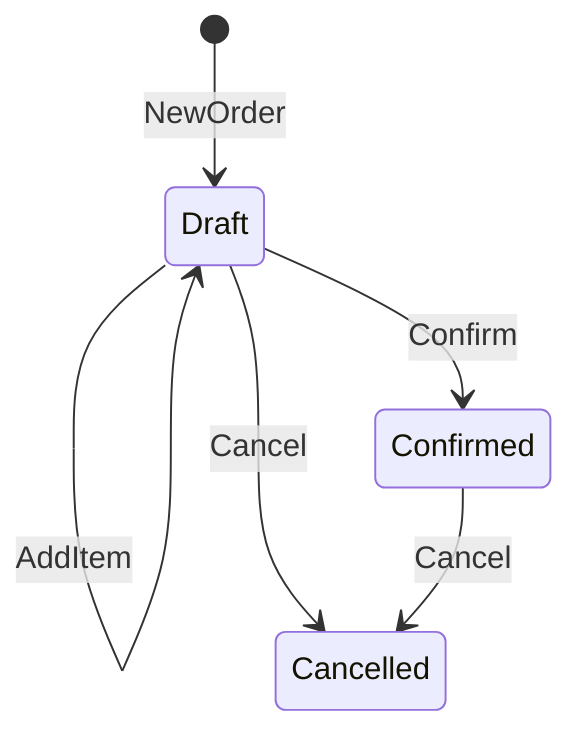
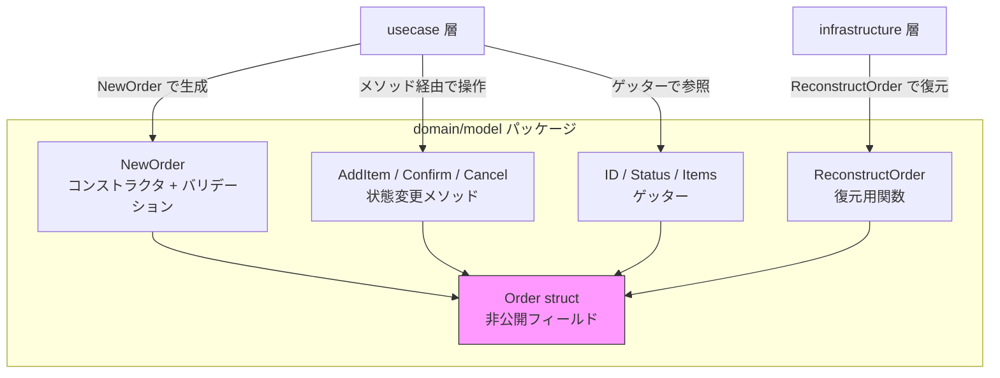

## はじめに

:::message

本記事はDDD/クリーンアーキテクチャ連載の一部です。Goで集約（Aggregate）の不変条件をどのように守るかについて、実践的な設計パターンを紹介します。各セクションの根拠となる一次情報源は、該当箇所に参照リンクを記載しています。

:::

DDDにおける集約（Aggregate）の最も重要な役割は、**不変条件（invariant）を常に満たした状態を保証する**ことです。不変条件とは、「注文金額は0以上でなければならない」「在庫数はマイナスにならない」といった、ビジネス上常に成立しなければならないルールを指します。

Java や C# ではアクセス修飾子（`private`、`protected`）を使ってフィールドを隠蔽しますが、Go にはクラスやアクセス修飾子がありません。代わりに、Go は**先頭文字の大小**でエクスポートの可否を制御します。この言語特性を活かして集約の不変条件を守る方法を、具体的なコード例とともに解説します。

---

## 集約と不変条件の関係

Eric Evans は _Domain-Driven Design_ の中で、集約について次のように述べています。

> Cluster the ENTITIES and VALUE OBJECTS into AGGREGATES and define boundaries around each. Choose one ENTITY to be the root of each AGGREGATE, and control all access to the objects inside the boundary through the root.
>
> — Eric Evans, _Domain-Driven Design_（2003）

集約の境界内では、すべての状態変更が不変条件を維持するように制御されなければなりません。外部から直接フィールドを書き換えられてしまうと、不変条件の破壊リスクが生じます。

たとえば、EC サイトの「注文」集約を考えてみます。以下の不変条件があるとします。

- 注文明細は1件以上必要です
- 合計金額は注文明細の小計の総和と一致する必要があります
- 確定済みの注文には明細を追加できません

これらのルールをコードでどう表現するかが、本記事のテーマです。

---

## すべての構造体を非公開にする必要はない

まず重要な前提を共有します。**Go の構造体すべてで非公開フィールドが必要なわけではありません**。

Go の標準ライブラリ自体、多くの構造体で公開フィールドを使っています。`http.Request` や `http.Response` はその代表例です。以下のような構造体では、公開フィールドで十分です。

- フィールド間に整合性ルールがないデータ構造（DTO、設定、APIレスポンスなど）です
- 状態遷移のルールがなく、どのフィールドをいつ変更しても問題ない構造体です
- 小規模チームで「このフィールドを直接書き換えない」という合意が口頭で成立する場合です

非公開フィールドが効果を発揮するのは、**フィールド間の整合性ルールや状態遷移のルールがある場合**です。つまり、DDDにおける集約のように不変条件を持つ構造体が対象です。

以降のセクションでは、不変条件を持つ集約を対象に、非公開フィールドによる設計パターンを解説します。

---

## 公開フィールドの集約が問題になるケース

不変条件を持つ集約でフィールドを公開すると、どのような問題が起きるかを見てみます。

```go
// ❌ フィールドがすべて公開されている
type Order struct {
    ID         string
    Status     OrderStatus
    Items      []OrderItem
    TotalPrice int
}

type OrderItem struct {
    ProductID string
    Name      string
    Price     int
    Quantity  int
}
```

この設計では、外部のコードから自由にフィールドを書き換えられます。

```go
order.Status = OrderStatusConfirmed  // バリデーションなしで確定できてしまう
order.Items = nil                     // 明細を空にできてしまう
order.TotalPrice = -100               // 負の金額を設定できてしまう
```

フィールドが公開されている限り、不変条件を守る責任が**集約の外側**に漏れ出します。すべての呼び出し元が正しくバリデーションしてくれることを祈るしかありません。

---

## Go のエクスポートルールを活かした設計

Go では、識別子の先頭を小文字にすると、そのパッケージ外からアクセスできなくなります。これが Go における「カプセル化」の基本です。

> An identifier may be exported to permit access to it from another package. An identifier is exported if the first character of the identifier's name is a Unicode upper case letter.
>
> — [The Go Programming Language Specification](https://go.dev/ref/spec#Exported_identifiers)

この仕組みを使って、集約のフィールドを非公開にし、状態変更をメソッド経由に限定します。

```go
// domain/model/order.go
package model

type OrderStatus int

const (
    OrderStatusDraft OrderStatus = iota
    OrderStatusConfirmed
    OrderStatusCancelled
)

type Order struct {
    id         string
    status     OrderStatus
    items      []OrderItem
    totalPrice int
}

type OrderItem struct {
    productID string
    name      string
    price     int
    quantity  int
}
```

フィールドが非公開なので、パッケージ外から `order.status = ...` のような直接代入はコンパイルエラーになります。

---

## New 関数（コンストラクタ）でのバリデーション

Go にはコンストラクタ構文がありません。代わりに `New` プレフィックスの関数を慣例的にコンストラクタとして使います。ここで不変条件のバリデーションを行います。

```go
// domain/model/order.go

func NewOrderItem(productID, name string, price, quantity int) (OrderItem, error) {
    if productID == "" {
        return OrderItem{}, errors.New("商品IDは必須です")
    }
    if price <= 0 {
        return OrderItem{}, errors.New("価格は1以上でなければなりません")
    }
    if quantity <= 0 {
        return OrderItem{}, errors.New("数量は1以上でなければなりません")
    }
    return OrderItem{
        productID: productID,
        name:      name,
        price:     price,
        quantity:  quantity,
    }, nil
}

func (i OrderItem) Subtotal() int {
    return i.price * i.quantity
}

func NewOrder(id string, items []OrderItem) (Order, error) {
    if id == "" {
        return Order{}, errors.New("注文IDは必須です")
    }
    if len(items) == 0 {
        return Order{}, errors.New("注文明細は1件以上必要です")
    }

    total := 0
    for _, item := range items {
        total += item.Subtotal()
    }

    return Order{
        id:         id,
        status:     OrderStatusDraft,
        items:      items,
        totalPrice: total,
    }, nil
}
```

ポイントは以下の2つです。

- **`New` 関数でのみインスタンスを生成できる**: 不変条件を満たさない状態でインスタンスが存在することを防ぎます
- **`totalPrice` の自動計算**: 合計金額を外部から渡さず、明細から計算することで整合性を保証します

---

## 状態変更メソッドで不変条件を守る

フィールドが非公開なので、状態を変更するにはメソッドを経由するしかありません。各メソッドが不変条件を確認します。

```go
func (o *Order) AddItem(item OrderItem) error {
    if o.status != OrderStatusDraft {
        return errors.New("確定済みの注文には明細を追加できません")
    }
    o.items = append(o.items, item)
    o.totalPrice += item.Subtotal()
    return nil
}

func (o *Order) Confirm() error {
    if o.status != OrderStatusDraft {
        return errors.New("下書き状態の注文のみ確定できます")
    }
    if len(o.items) == 0 {
        return errors.New("注文明細が空の注文は確定できません")
    }
    o.status = OrderStatusConfirmed
    return nil
}

func (o *Order) Cancel() error {
    if o.status == OrderStatusCancelled {
        return errors.New("すでにキャンセル済みです")
    }
    o.status = OrderStatusCancelled
    return nil
}
```

このパターンにより、状態遷移のルールが集約の内部に閉じ込められます。外部のコードが遷移の可否を判断する必要はありません。



---

## ゲッターの設計

非公開フィールドの値を外部から参照するためにゲッターを用意します。Go の慣例では、`Get` プレフィックスを付けません。

> The convention in Go is NOT to use Get or Set prefixes for getters and setters.
>
> — [Effective Go](https://go.dev/doc/effective_go#Getters)

```go
func (o *Order) ID() string           { return o.id }
func (o *Order) Status() OrderStatus  { return o.status }
func (o *Order) TotalPrice() int      { return o.totalPrice }
func (o *Order) Items() []OrderItem   { return o.items }
```

Go では「所有しないデータは変更しない」という慣例が広く浸透しています。ゲッターが返したスライスを呼び出し元が変更しないことを前提にするのが一般的です。

ただし、外部チーム向けのライブラリや、スライスの変更が致命的な不変条件違反につながる場合は、防御的にコピーを返す方法もあります。

```go
// 防御的コピーが必要な場合のみ
func (o *Order) Items() []OrderItem {
    return slices.Clone(o.items)
}
```

Go 1.21 以降では `slices.Clone` が使えます。ただし、多くのプロジェクトではここまでの防御は不要です。

---

## Java / C# との設計判断の違い

Go でこのパターンを採用する際、Java や C# の経験者にとって戸惑うポイントがいくつかあります。

### パッケージレベルのアクセス制御

Go の非公開フィールドは**パッケージスコープ**です。同じパッケージ内のコードからはアクセスできます。

| 言語 | アクセス制御の粒度 | 非公開フィールドへのアクセス         |
| ---- | ------------------ | ------------------------------------ |
| Java | クラスレベル       | 同一クラスからのみ                   |
| C#   | クラスレベル       | 同一クラスからのみ（+ `internal`）   |
| Go   | パッケージレベル   | 同一パッケージ内のすべてのコードから |

つまり、`domain/model` パッケージ内の他のファイルからは非公開フィールドにアクセスできます。これを踏まえた設計方針は以下のとおりです。

- **1つの集約 = 1つのパッケージ**にする必要はありません。`model` パッケージに複数の集約を置いても構いません
- ただし、パッケージが肥大化すると同一パッケージ内からの意図しないアクセスが増えるため、**大規模なドメインモデルではパッケージを分割**することを検討します

### ゼロ値の扱い

Go の構造体はゼロ値で初期化されます。`New` 関数を経由せずに `Order{}` と書けてしまう問題があります。

```go
// ⚠️ ゼロ値で不変条件を満たさないインスタンスが作れてしまう
var order model.Order
```

これに対する実用的な対策をいくつか紹介します。

**方法1：ゼロ値を無効な状態として扱う**

メソッド内でゼロ値を検出して拒否するアプローチです。

```go
func (o *Order) Confirm() error {
    if o.id == "" {
        return errors.New("無効な注文です（New関数で生成してください）")
    }
    // ...
}
```

**方法2：ゼロ値を有効な初期状態にする**

Go の標準ライブラリでは `sync.Mutex` や `bytes.Buffer` がこの方式を採用しています。ただし、DDDの集約では「明細が必須」のような不変条件があるため、この方法が適用できるケースは限られます。

私の経験では、**方法1で十分**です。Go のエコシステムでは「ドキュメントとNew関数で正しい使い方を示す」という慣例が広く受け入れられています。

---

## リポジトリからの復元

永続化層から集約を復元する場合は、バリデーションをスキップしたいケースがあります。データベースに保存された時点で不変条件は満たされているはずだからです。

この場合、パッケージ内に復元用の関数を用意します。

```go
// domain/model/order_reconstruct.go

// ReconstructOrder はリポジトリからの復元専用です。
// ビジネスロジックからは NewOrder を使用してください。
func ReconstructOrder(id string, status OrderStatus, items []OrderItem, totalPrice int) Order {
    return Order{
        id:         id,
        status:     status,
        items:      items,
        totalPrice: totalPrice,
    }
}
```

この関数は公開されているため、誤用のリスクがあります。これを軽減する方法として以下が考えられます。

- 関数名とコメントで用途を明示します
- コードレビューで `Reconstruct` の呼び出し元がリポジトリ実装に限定されていることを確認します
- `internal` パッケージを活用して、リポジトリ実装からのみアクセス可能にします

Java であれば package-private やリフレクション、C# であれば `internal` アクセス修飾子で対応するところですが、Go ではドキュメントと慣例で対応するのが現実的です。

---

## 全体の構造

ここまでのパターンを整理すると、集約の設計は以下の構造になります。



外部からの操作はすべて公開された関数・メソッドを経由するため、不変条件が破られることはありません。

---

## まとめ

Go で集約の不変条件を守るための設計パターンを整理します。

| パターン         | 内容                           | 効果                               |
| ---------------- | ------------------------------ | ---------------------------------- |
| 非公開フィールド | 先頭小文字でフィールドを隠蔽   | 外部からの直接変更を防止           |
| New 関数         | コンストラクタでバリデーション | 不正な状態のインスタンス生成を防止 |
| 状態変更メソッド | メソッド内で事前条件を検証     | 不変条件を満たす遷移のみ許可       |
| Reconstruct 関数 | 永続化層からの復元用           | バリデーションのバイパスを用途限定 |

Go にはクラスやアクセス修飾子はありませんが、**パッケージスコープの非公開フィールドと慣例的なNew関数の組み合わせ**で、Java / C# と同等のカプセル化が実現できます。むしろ、Go のシンプルな仕組みだからこそ、「不変条件を守る」という本質に集中できると私は感じています。

---

## 参考文献

| 内容 | 出典 |
| --- | --- |
| 集約とエンティティの定義 | Eric Evans, _Domain-Driven Design_（2003） |
| 集約の設計ルール | Vaughn Vernon, _Implementing Domain-Driven Design_（2013） |
| Go のエクスポートルール | [The Go Programming Language Specification](https://go.dev/ref/spec#Exported_identifiers) |
| Go のゲッター慣例 | [Effective Go](https://go.dev/doc/effective_go#Getters) |
| Go のパッケージ設計 | [Go Blog: Organizing Go code](https://go.dev/blog/organizing-go-code) |
| ゼロ値の活用 | [Go Blog: The zero value](https://go.dev/ref/spec#The_zero_value) |
