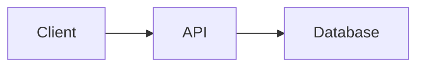
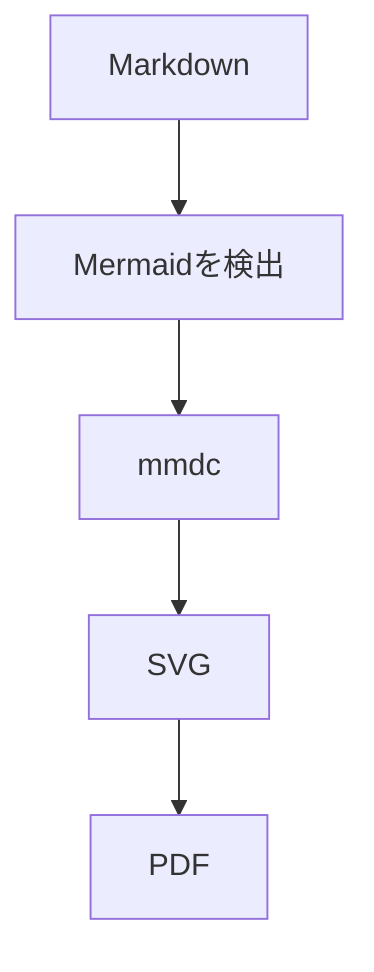
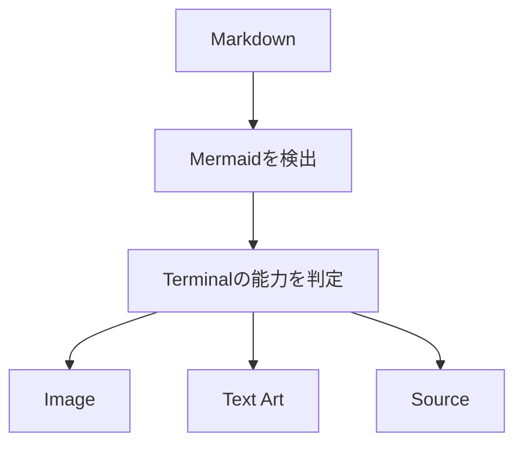
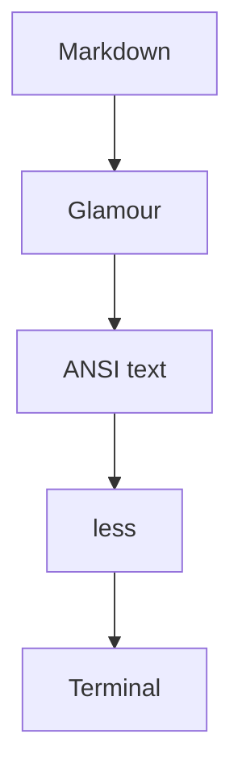
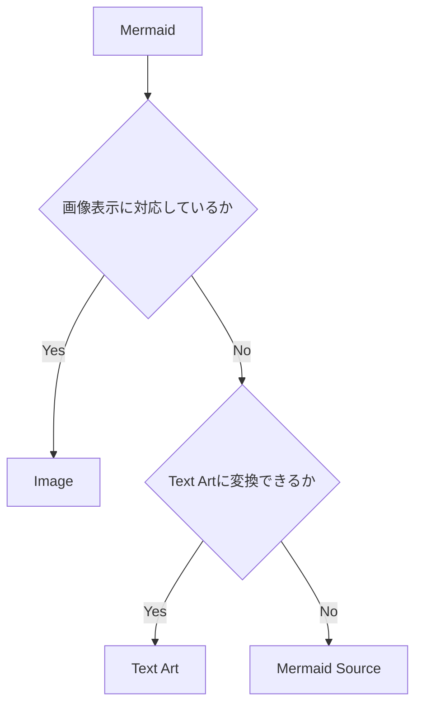
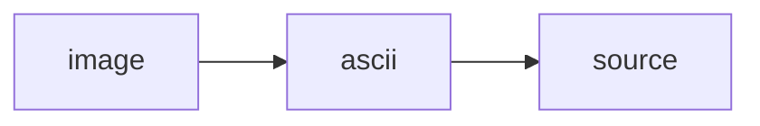
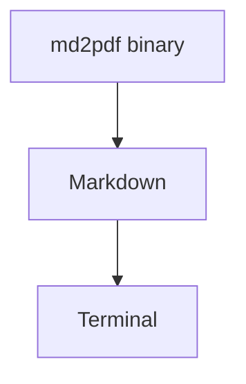
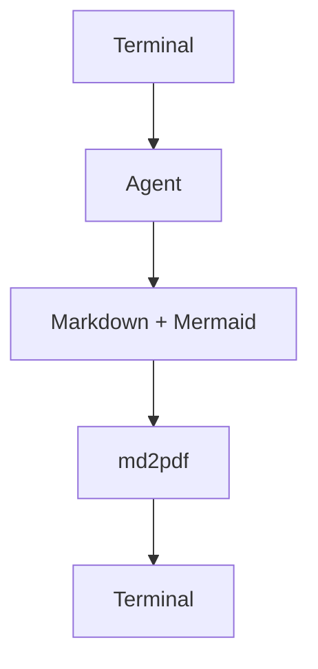
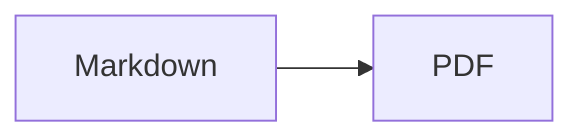
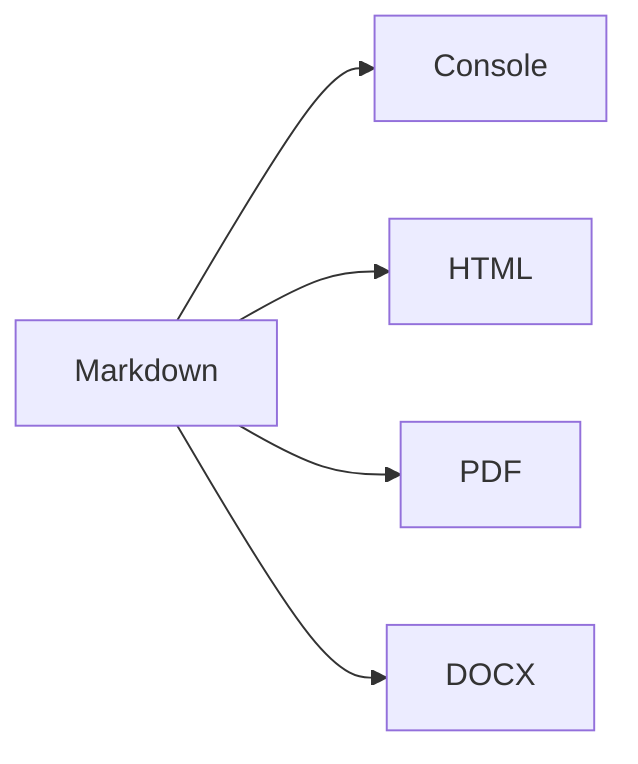

## はじめに

以前、MarkdownをPDFに変換するCLIツール **md2pdf** を作りました。

[md2pdf repository](https://github.com/135yshr/md2pdf)

もともとは、Markdownで書いた技術ドキュメントを、そのままPDFとして渡せるようにするためのツールです。[Mermaid](https://mermaid.js.org/)や日本語フォントにも対応しており、設計書やレポートをMarkdownで管理したままPDFにできます。

今回、ここにConsole出力を追加しました。

```sh
md2pdf -format console document.md
```

きっかけは、Markdownをターミナルで読みたかったからではありません。

**Mermaidを含むMarkdownを、ターミナルから出ずに読みたかったからです。**

## Markdownは読める。でもMermaidが読めない

ターミナルでMarkdownを読むツールはすでにあります。たとえば [Glow](https://github.com/charmbracelet/glow) なら、Markdownを見やすく表示できます。

```sh
brew install glow
glow README.md
```

困ったのはMermaidでした。

設計書やREADMEを書いていると、次のような図を入れることがあります。

````markdown
# Architecture


````

Markdown本文はターミナルで読めても、Mermaidまで同じ画面に図として表示してくれるツールは、探した範囲では見つかりませんでした。

欲しかったのは、Markdownを整形して表示するだけのビューアではありません。Mermaidも同じ画面で読めて、画像を表示できるターミナルならそのまま図を出したい。画像を表示できない環境でも、できればテキストの図として読みたい。SSHやCIでも使いたい。

そこで、md2pdfにConsole出力を足すことにしました。

md2pdfには、PDFを作るためにMarkdownからMermaidを検出し、[Mermaid CLI（mmdc）](https://github.com/mermaid-js/mermaid-cli)でレンダリングする処理がすでにあります。



この処理をターミナル向けにも使えば、Markdown本文と図を同じ場所で読めます。



これが `-format console` を追加した理由です。

## Markdown部分はGlamourに任せる

使い方はシンプルです。

```sh
md2pdf -format console README.md
```

見出し、リスト、コードブロック、テーブルなどをターミナル向けに整形して表示します。長い文書はデフォルトでページャを通します。



Markdownのレンダリングには [Glamour](https://github.com/charmbracelet/glamour) を使っています。ここを自前で実装する必要はありません。md2pdfで追加したかったのは、その中にあるMermaidをどう扱うかでした。

## Mermaidは環境に合わせて表示方法を変える

PDFなら、MermaidをMermaid CLIでSVGに変換すれば済みます。ターミナルはそうはいきません。

画像を直接表示できるターミナルもあれば、SSH先やCIのように画像を使えない環境もあります。そのため、一つの方式に固定せず、使える表示方法へ順番にフォールバックするようにしました。



デフォルトは `auto` です。

```sh
md2pdf -format console -mermaid-render auto README.md
```

`auto` では次の順に試します。



## 画像を表示できるなら、そのまま図を出す

md2pdfは、次の画像表示方式に対応しています。

- [Kitty Graphics Protocol](https://sw.kovidgoyal.net/kitty/graphics-protocol/)
- [iTerm2 Inline Images Protocol](https://iterm2.com/documentation-images.html)
- [Sixel](https://en.wikipedia.org/wiki/Sixel)

対応しているターミナルでは、MermaidをPNGに変換してMarkdownの途中へ直接表示します。

```text
# Architecture

APIの構成は以下です。

┌─────────────────────────┐
│   Mermaid Diagram       │
│   rendered as image     │
└─────────────────────────┘

続いて認証について説明します。
```

図を見るためにブラウザを開いたり、別の画像ファイルを探したりする必要はありません。

## 画像が無理ならテキストアートにする

画像を表示できないからといって、すぐMermaidのソース表示に戻すのも少し味気ありません。

そこで、対応できる図は box drawing character を使ったテキストアートに変換します。

たとえば、


は、次のような形で表示できます。

```text
┌────────┐     ┌─────┐     ┌──────────┐
│ Client ├────►│ API ├────►│ Database │
└────────┘     └─────┘     └──────────┘
```

現在、主に次の記法をテキストアートへ変換します。

- flowchart
- graph
- sequenceDiagram

すべてのMermaid記法を無理に図へ変換するつもりはありません。うまく描けない場合はソースをそのまま表示します。崩れた図を出すより、元のMermaidを読める方がよいと考えたためです。

## 表示方法は固定することもできる

自動判定を使わず、表示方法を指定することもできます。

画像表示を必須にする場合は `image` を指定します。

```sh
md2pdf -format console \
  -mermaid-render image \
  README.md
```

テキストアートを使う場合は `ascii` です。

```sh
md2pdf -format console \
  -mermaid-render ascii \
  README.md
```

Mermaidのソースを確認したい場合は `source` を指定します。

```sh
md2pdf -format console \
  -mermaid-render source \
  README.md
```

普段は `auto` でよく、SSHやCIでは `ascii`、Mermaid自体を確認したいときは `source` といった使い分けを想定しています。

## 外部ツールがなくてもMarkdownは読める

PDFの生成には [Chromium](https://www.chromium.org/Home/) が必要です。Mermaidを画像として表示するにはMermaid CLIも使います。

一方、Console出力そのものはGoのプロセス内で動きます。

```sh
md2pdf -format console README.md
```

画像を使えない場合はテキストアートへ切り替えるため、外部ツールがそろっていない環境でもMarkdownを読むこと自体はできます。



CLIツールなので、まずバイナリ一つで使えることは大事にしました。

## ターミナルの幅やテーマにも合わせる

ターミナルでは表示幅が環境ごとに違います。デフォルトでは現在の幅を取得して折り返しますが、固定値も指定できます。

```sh
md2pdf -format console -width 100 document.md
```

SSH先やCIログなど、表示幅をそろえたいときに使えます。

テーマも変更できます。

```sh
md2pdf -format console -style dark README.md
```

現在は、たとえば次のスタイルを指定できます。

```text
auto
dark
light
notty
ascii
dracula
pink
tokyo-night
```

通常は `auto` で十分です。Glamour互換のJSONスタイルも指定できます。

```sh
md2pdf -format console -style my-style.json README.md
```

## パイプでも使える

ファイルだけでなく標準入力も受け取れます。

```sh
cat README.md | md2pdf -format console -
```

[GitHub CLI](https://cli.github.com/)と組み合わせれば、PRやIssueの本文もそのまま表示できます。

```sh
gh pr view 41 --json body -q .body |
  md2pdf -format console -
```

```sh
gh issue view 30 --json body -q .body |
  md2pdf -format console -
```

最近はAI Coding AgentがMarkdownとMermaidをまとめて生成することもあります。そうした出力も、ターミナルから離れずに確認できます。



## 複数ファイルも続けて読める

Console形式では複数のMarkdownファイルを渡せます。

```sh
md2pdf -format console docs/*.md
```

たとえば、次のように設計書を分けている場合です。

```text
docs/
├── architecture.md
├── api.md
├── database.md
└── security.md
```

これらを順番に表示できます。

PDFではページ構成や画像パスをどう扱うかという問題があるため、現時点で複数入力に対応しているのはConsoleだけです。

## md2pdfはPDF変換だけのツールではなくなってきた

最初のmd2pdfは、その名前どおりのツールでした。



現在は次の形式へ出力できます。



とはいえ、Console出力を追加した理由は「対応形式を増やしたかったから」ではありません。

Mermaidを含むMarkdownを、ターミナルから出ずに読みたかった。それだけです。

必要な機能を足していった結果、md2pdfはMarkdownをPDFにするだけでなく、ターミナルで読むためのツールにもなりました。

## まとめ

Markdownをターミナルで表示するツールは、すでにあります。

今回欲しかったのは、**Mermaidを含むMarkdownを、そのままターミナルで読めるツール**でした。

そこでmd2pdfにConsole出力を追加し、Mermaidは環境に応じて次の順に表示するようにしました。


画像を表示できるなら画像で出す。無理ならテキストアートにする。それも難しければ、元のMermaidを表示する。

```sh
md2pdf -format console README.md
```

設計書やREADME、AI Coding Agentの出力など、Mermaid入りのMarkdownをターミナルで扱いたい方は試してみてください。

[md2pdf repository](https://github.com/135yshr/md2pdf)

```sh
brew install 135yshr/tap/md2pdf
```
