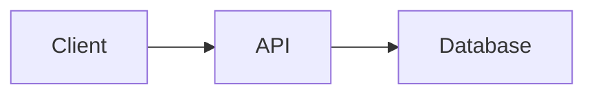

## はじめに

以前、MarkdownをPDFに変換するCLIツール **md2pdf** を作りました。

https://github.com/135yshr/md2pdf

もともとは、

> Markdownで書いた技術ドキュメントを、そのままきれいなPDFとして渡したい

という目的で作ったツールです。

MermaidをSVGとして埋め込んだり、日本語フォントに対応したりして、設計書やレポートをMarkdownで管理しながらPDFとして納品できるようにしていました。

ところが普段使っているうちに、別の不満が出てきました。

**PDFにする前に、Markdownを確認するためだけにブラウザやエディタを開くのが少し面倒です。**

README、設計書、ADR、AIに生成させたMarkdownなど、最近はターミナル上でMarkdownを扱う機会がかなり増えています。

そこで md2pdf に、

```sh
md2pdf -format console document.md
```

という **ターミナル表示機能** を追加しました。

単なるMarkdown → ANSI変換だけではなく、Mermaidも可能な限りターミナル上で図として表示します。

## Markdownをターミナルで読む

基本的な使い方はこれだけです。

```sh
md2pdf -format console README.md
```

MarkdownをANSI形式にレンダリングして、そのままターミナルに表示します。

見出し、リスト、コードブロック、テーブルなどもターミナル向けに整形されます。

長いドキュメントの場合はデフォルトでページャを通します。

```text
Markdown
   ↓
glamour
   ↓
ANSI text
   ↓
less
   ↓
Terminal
```

内部では Charmbracelet の `glamour` を使っています。

Glowなどで使われているMarkdownレンダリングライブラリです。

## なぜ専用のMarkdownビューアではなくmd2pdfに入れたのか

もちろん、ターミナルでMarkdownを見るためのツールはすでに存在します。

代表的なのは Glow です。

```sh
brew install glow

glow README.md
```

Markdownビューアとして考えるなら、Glowを使えば十分です。

それでも md2pdf にこの機能を追加した理由は、**Markdownを書くところから成果物を作るところまで同じCLIにしたかったから**です。

例えば設計書を書いているとします。

確認するときは、

```sh
md2pdf -format console design.md
```

ブラウザで確認するときは、

```sh
md2pdf -format html design.md
```

納品するときは、

```sh
md2pdf design.md
```

Word形式が必要なら、

```sh
md2pdf -format docx design.md
```

となります。

つまり、

```text
                 ┌─ Terminal
                 │
Markdown ────────┼─ HTML
                 │
                 ├─ PDF
                 │
                 └─ DOCX
```

という形です。

Markdownを「PDFに変換する入力ファイル」ではなく、**ドキュメントのSingle Source of Truthとして扱う**方向に少しずつ変わってきました。

## ターミナルの幅に合わせる

ターミナルではPDFとは違い、表示幅があります。

そこでデフォルトではターミナル幅を取得して折り返します。

幅を固定することもできます。

```sh
md2pdf -format console -width 100 document.md
```

例えばSSH先やCIログなど、表示幅を固定したい場合に使えます。

## テーマを変更する

表示テーマも変更できます。

```sh
md2pdf -format console -style dark README.md
```

現在は例えば以下を指定できます。

```text
auto
dark
light
notty
ascii
dracula
pink
tokyo-night
```

通常は `auto` で問題ありません。

```sh
md2pdf -format console -style auto README.md
```

ターミナルの背景に合わせて表示します。

また、Glamour互換のJSONスタイルも指定できます。

```sh
md2pdf -format console -style my-style.json README.md
```

## パイプからMarkdownを読む

ファイルだけではなく標準入力も受け取れます。

```sh
cat README.md | md2pdf -format console -
```

これが意外と便利です。

例えばGitHub CLIと組み合わせると、

```sh
gh pr view 41 --json body -q .body |
  md2pdf -format console -
```

のように、PR本文をMarkdownとして表示できます。

Issueなら、

```sh
gh issue view 30 --json body -q .body |
  md2pdf -format console -
```

です。

最近はAIがMarkdownを返すことも多いので、

```text
CLI
 ↓
Markdown
 ↓
md2pdf
 ↓
Terminal
```

というUnix的なパイプにも自然に組み込めます。

## 複数のMarkdownをまとめて読む

Console形式だけは複数ファイルを渡せます。

```sh
md2pdf -format console docs/*.md
```

例えば、

```text
docs/
├── architecture.md
├── api.md
├── database.md
└── security.md
```

という構成なら、

```sh
md2pdf -format console docs/*.md
```

で順番に確認できます。

PDFではページ構成や画像パスなどをどう扱うかという問題があるため、現時点で複数入力はConsoleだけに限定しています。

## Mermaidをどうするか

今回一番悩んだのがMermaidでした。

Markdownには、

````markdown

````

のような図が含まれることがあります。

PDFなら `mmdc` でSVGに変換すればいいのですが、ターミナルではそう簡単ではありません。

そこで、環境に応じて段階的にフォールバックするようにしました。

```text
Mermaid
   │
   ├─ Terminalが画像表示対応
   │       ↓
   │     Image
   │
   ├─ 画像表示不可
   │       ↓
   │   Text Art
   │
   └─ Text Art非対応
           ↓
      Mermaid Source
```

デフォルトは、

```sh
-mermaid-render auto
```

です。

つまり、

```text
image → ascii → source
```

の順で可能な表示方法を選びます。

## Mermaidを画像として表示する

最近のターミナルには画像を直接表示できるものがあります。

md2pdfでは、

- Kitty Graphics Protocol
- iTerm2 Inline Images
- Sixel

に対応しています。

そのため、例えば対応ターミナルではMermaidをPNGとして生成し、そのままMarkdownの途中に表示できます。

Markdownをターミナルで読んでいて、図だけ別ファイルを開く必要がありません。

## 画像が使えなければテキストアートにする

もちろんSSH先やCI、Terminal.appなど、画像プロトコルが使えない環境も多くあります。

そこでMermaidの一部を **box drawing characterによるテキストアート** に変換します。

例えば、


ならイメージとしては、

```text
┌────────┐     ┌─────┐     ┌──────────┐
│ Client ├────►│ API ├────►│ Database │
└────────┘     └─────┘     └──────────┘
```

のようになります。

現在テキストアート化しているのは主に、

- flowchart
- graph
- sequenceDiagram

です。

すべてのMermaid記法を無理に変換するのではなく、きれいに描画できないものはソースを残すようにしています。

このあたりは「何でも変換する」よりも、

**読めない図を出すくらいならソースを残す**

という判断にしています。

## Mermaidの表示方法を固定する

自動判定以外も指定できます。

```sh
md2pdf -format console \
  -mermaid-render image \
  README.md
```

画像表示を必須にします。

```sh
md2pdf -format console \
  -mermaid-render ascii \
  README.md
```

テキストアートを優先します。

```sh
md2pdf -format console \
  -mermaid-render source \
  README.md
```

Mermaidのソースをそのまま表示します。

SSHやCIなら `ascii`、Mermaid自体を確認したいなら `source`、普段は `auto` という使い方を想定しています。

## 外部依存なしでも動くようにしたかった

Console形式で個人的に重要だったのがここです。

PDFを生成する場合はChromiumが必要です。

MermaidをSVGにする場合は `mmdc` も使います。

しかし、

```sh
md2pdf -format console README.md
```

については、基本的にこれらを必要としません。

Markdownの表示自体はGoのプロセス内で完結します。

Mermaidも画像が使えなければテキストアートへフォールバックします。

そのため、

```text
md2pdf binary
     ↓
Markdown
     ↓
Terminal
```

だけでも使えます。

CLIツールとしては、この「とりあえずバイナリだけあれば使える」という性質をかなり大事にしています。

## Markdownを取り巻く環境が少し変わってきた

最近はMarkdownの用途が以前より広がっていると感じています。

READMEやドキュメントだけでなく、

- GitHub Issue
- Pull Request
- ADR
- AI Agentの出力
- AIへの指示ファイル
- 調査結果
- 実装計画

など、多くの情報がMarkdownになっています。

特にAI Coding Agentを使っていると、

```text
Terminal
 ↓
Agent
 ↓
Markdown
```

という流れがかなり増えます。

そのためMarkdownを確認するたびに、

```text
Terminal
 ↓
Editor
 ↓
Preview
```

と移動するより、

```text
Terminal
 ↓
Markdown renderer
```

で完結できる方が扱いやすいケースがあります。

ターミナルMarkdownビューア自体は新しいアイデアではありません。

ただ、**Markdownを作成・確認・変換・納品する一連の流れをCLIだけで完結させる**価値は、以前より大きくなっているように思います。

## md2pdfは名前と少し違うツールになってきた

最初のmd2pdfは名前の通り、

```text
Markdown → PDF
```

だけのツールでした。

今は、

```text
                         ┌─ Console
                         │
Markdown ────────────────┼─ HTML
                         │
                         ├─ PDF
                         │
                         └─ DOCX
```

となっています。

それでも、中心にある考え方は変わっていません。

**Markdownを原本として管理して、必要な形に出力する。**

今回追加したConsole出力も、その延長です。

## まとめ

md2pdfにMarkdownのターミナル表示機能を追加しました。

```sh
md2pdf -format console README.md
```

主な特徴は、

- MarkdownをANSI形式で表示
- ターミナル幅に合わせて折り返し
- ページャ対応
- テーマ変更
- stdin対応
- 複数Markdownの連続表示
- Mermaidを画像として表示
- 画像が使えなければテキストアート
- それも無理ならMermaidソースへフォールバック

です。

PDFを作るために始めたツールでしたが、少しずつ

> Markdownをどこでも読めて、どこにでも出せるCLI

になってきました。

Markdownをターミナル中心で扱っている方は、よければ試してみてください。

https://github.com/135yshr/md2pdf

```sh
brew install 135yshr/tap/md2pdf
```

そして、

```sh
md2pdf -format console README.md
```

だけで使えます。
