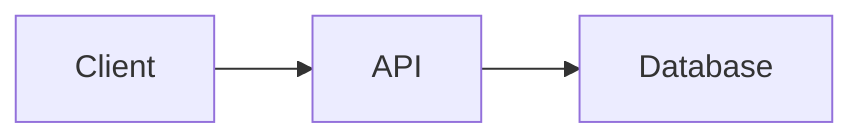

## はじめに

以前、MarkdownをPDFに変換するCLIツール **md2pdf** を作りました。

[md2pdf repository](https://github.com/135yshr/md2pdf)

もともとは、Markdownで書いた技術ドキュメントを、そのままきれいなPDFとして渡したいという目的で作ったツールです。MermaidをSVGとして埋め込んだり、日本語フォントに対応したりして、設計書やレポートをMarkdownで管理しながらPDFとして納品できるようにしていました。

今回追加したのは、Markdownをターミナル上で表示するConsole出力です。

```sh
md2pdf -format console document.md
```

ただし、Markdownビューアそのものを作りたかったわけではありません。

きっかけは **Mermaidを含むMarkdownをターミナルから出ずに読みたかったこと** でした。

## Markdownは読める。でもMermaidが読めない

ターミナルでMarkdownを読むためのツールはすでにあります。例えば [Glow](https://github.com/charmbracelet/glow) を使えば、Markdownをターミナル上できれいに表示できます。

```sh
brew install glow
glow README.md
```

ところが、設計書やREADMEにMermaidが入ってくると事情が変わります。

例えば、次のようなMarkdownです。

````markdown
# Architecture


````

Markdown本文はターミナルで読めても、Mermaidまで同じ場所に図として表示してくれるツールが、探した範囲では見つかりませんでした。

欲しかったのは単なるMarkdownの整形表示ではなく、

- Markdownをターミナル上で読める
- Mermaidも同じ場所に図として表示される
- kittyやiTerm2などでは画像として表示できる
- 画像を表示できないターミナルでも、できれば図として読める
- SSHやCI、パイプでも破綻しない

というものでした。

そこで、**それならmd2pdfにターミナル表示を追加すればよいのでは**と考えました。

md2pdfには、もともとPDFを生成するためにMarkdownからMermaidを検出し、`mmdc` でレンダリングする仕組みがあります。

```text
Markdown
    ↓
Mermaidを検出
    ↓
mmdc
    ↓
SVG
    ↓
PDF
```

このMermaid処理をターミナルにも利用すれば、Markdown本文と図を同じ場所で読めます。

```text
Markdown
    ↓
Mermaidを検出
    ↓
Terminalの能力を判定
    ↓
 ┌─────────┬──────────┬────────┐
 │ Image   │ Text Art │ Source │
 └─────────┴──────────┴────────┘
```

これが `-format console` を追加したきっかけです。

## Markdownをターミナルで読む

基本的な使い方はこれだけです。

```sh
md2pdf -format console README.md
```

MarkdownをANSI形式にレンダリングして、そのままターミナルに表示します。見出し、リスト、コードブロック、テーブルなどもターミナル向けに整形されます。

長いドキュメントの場合はデフォルトでページャを通します。

```text
Markdown
   ↓
glamour
   ↓
ANSI text
   ↓
less
   ↓
Terminal
```

内部では Charmbracelet の `glamour` を使っています。Markdown部分のレンダリングは既存のライブラリに任せ、md2pdfではMermaidをどう表示するかに処理を追加しています。

## Mermaidをどう表示するか

今回一番考えたのがここです。

PDFなら `mmdc` でSVGに変換すればよいのですが、ターミナルでは環境によって使える表現が違います。

最近のターミナルには画像を直接表示できるものがあります。一方、SSH先やCI、Terminal.appなど、画像プロトコルを利用できない環境もあります。

そこで、一つの表示方法に固定せず、環境に応じて段階的にフォールバックするようにしました。

```text
Mermaid
   │
   ├─ Terminalが画像表示対応
   │       ↓
   │     Image
   │
   ├─ 画像表示不可
   │       ↓
   │   Text Art
   │
   └─ Text Art非対応
           ↓
      Mermaid Source
```

デフォルトは `auto` です。

```sh
md2pdf -format console -mermaid-render auto README.md
```

つまり、

```text
image → ascii → source
```

の順で、その環境で利用できる表示方法を選びます。

## Mermaidを画像として表示する

md2pdfでは、ターミナルへの画像表示として次のプロトコルに対応しています。

- Kitty Graphics Protocol
- iTerm2 Inline Images
- Sixel

対応ターミナルでは、MermaidをPNGとして生成してMarkdownの途中へ直接表示します。

イメージとしては、Markdownを読んでいる途中にそのまま図が現れます。

```text
# Architecture

APIの構成は以下です。

┌─────────────────────────┐
│   Mermaid Diagram       │
│   rendered as image     │
└─────────────────────────┘

続いて認証について説明します。
```

図を見るためにブラウザや別のファイルを開く必要がありません。

## 画像が使えなければテキストアートにする

画像プロトコルを使えない環境でも、Mermaidのソースを表示するだけではなく、可能なものは **box drawing characterによるテキストアート** に変換します。

例えば、


ならイメージとしては、

```text
┌────────┐     ┌─────┐     ┌──────────┐
│ Client ├────►│ API ├────►│ Database │
└────────┘     └─────┘     └──────────┘
```

のようになります。

現在テキストアート化しているのは主に、

- flowchart
- graph
- sequenceDiagram

です。

すべてのMermaid記法を無理に変換するのではなく、きれいに描画できないものはソースを残すようにしています。

**読めない図を出すくらいならソースを残す**という判断です。

## Mermaidの表示方法を固定する

自動判定以外も指定できます。

画像表示を必須にする場合は `image` を指定します。

```sh
md2pdf -format console \
  -mermaid-render image \
  README.md
```

テキストアートを使いたい場合は `ascii` です。

```sh
md2pdf -format console \
  -mermaid-render ascii \
  README.md
```

Mermaidのソースをそのまま確認したい場合は `source` を指定します。

```sh
md2pdf -format console \
  -mermaid-render source \
  README.md
```

普段は `auto`、SSHやCIなら `ascii`、Mermaid自体を確認したい場合は `source` という使い方を想定しています。

## 外部依存がなくてもMarkdownは読める

PDFを生成する場合はChromiumが必要です。Mermaidを画像として表示する場合は `mmdc` も使います。

一方、Console出力そのものはGoのプロセス内で動作します。

```sh
md2pdf -format console README.md
```

画像を使えない場合はテキストアートへフォールバックするため、Mermaidを含むMarkdownでも外部変換ツールなしで可能な限り読みやすい形を維持します。

```text
md2pdf binary
     ↓
Markdown
     ↓
Terminal
```

CLIツールとしては、この「とりあえずバイナリだけあれば読める」という性質をかなり大事にしています。

## ターミナルの幅に合わせる

ターミナルではPDFとは違い、表示幅があります。デフォルトではターミナル幅を取得して折り返しますが、幅を固定することもできます。

```sh
md2pdf -format console -width 100 document.md
```

SSH先やCIログなど、表示幅を固定したい場合にも使えます。

## テーマを変更する

表示テーマも変更できます。

```sh
md2pdf -format console -style dark README.md
```

現在は例えば以下を指定できます。

```text
auto
dark
light
notty
ascii
dracula
pink
tokyo-night
```

通常は `auto` で問題ありません。

```sh
md2pdf -format console -style auto README.md
```

Glamour互換のJSONスタイルも指定できます。

```sh
md2pdf -format console -style my-style.json README.md
```

## パイプからMarkdownを読む

ファイルだけではなく標準入力も受け取れます。

```sh
cat README.md | md2pdf -format console -
```

GitHub CLIと組み合わせると、PRやIssueの本文もそのままMarkdownとして表示できます。

```sh
gh pr view 41 --json body -q .body |
  md2pdf -format console -
```

```sh
gh issue view 30 --json body -q .body |
  md2pdf -format console -
```

最近はAI Coding AgentがMarkdownとMermaidを生成することも増えています。

```text
Terminal
 ↓
Agent
 ↓
Markdown + Mermaid
 ↓
md2pdf
 ↓
Terminal
```

こうした出力を確認するたびにブラウザやエディタへ移動せず、そのままターミナルで読み続けられます。

## 複数のMarkdownをまとめて読む

Console形式だけは複数ファイルを渡せます。

```sh
md2pdf -format console docs/*.md
```

例えば、

```text
docs/
├── architecture.md
├── api.md
├── database.md
└── security.md
```

という構成なら、順番に確認できます。

PDFではページ構成や画像パスなどをどう扱うかという問題があるため、現時点で複数入力はConsoleだけに限定しています。

## md2pdfは名前と少し違うツールになってきた

最初のmd2pdfは名前の通り、

```text
Markdown → PDF
```

だけのツールでした。

現在は、

```text
                         ┌─ Console
                         │
Markdown ────────────────┼─ HTML
                         │
                         ├─ PDF
                         │
                         └─ DOCX
```

となっています。

ただ、今回Console出力を追加した出発点は「出力形式を増やしたかったから」ではありません。

**Mermaidを含むMarkdownを、ターミナルから出ずに読みたかったからです。**

そのためにMarkdownのConsole出力を追加し、ターミナルの能力に合わせてMermaidを画像・テキストアート・ソースへフォールバックする仕組みを作りました。

## まとめ

md2pdfにConsole出力を追加しました。

```sh
md2pdf -format console README.md
```

Markdownをターミナルで表示するツール自体はすでにあります。

今回作りたかったのは、**Mermaidを含むMarkdownをターミナル上でそのまま読めるもの**でした。

そのため、Mermaidについては、

```text
image → ascii → source
```

というフォールバックを実装しています。

- 対応ターミナルなら図を画像として表示
- 画像が使えなければテキストアート
- テキストアートにできなければMermaidソースを表示

という形で、環境が変わってもドキュメントの内容を失わないようにしています。

設計書やREADME、AI Coding Agentの出力など、Mermaidを含むMarkdownをターミナル中心で扱っている方は、よければ試してみてください。

[md2pdf repository](https://github.com/135yshr/md2pdf)

```sh
brew install 135yshr/tap/md2pdf
md2pdf -format console README.md
```
