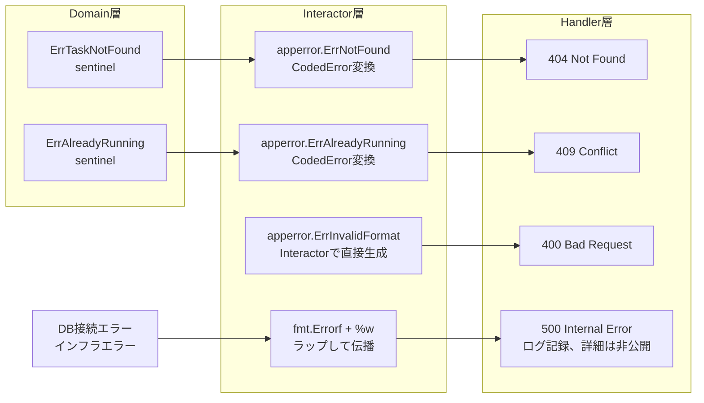

## はじめに

:::message

本記事は私がGoでDDD × クリーンアーキテクチャを採用したプロジェクトを運用する中で得た気づきをまとめたものです。各セクションの根拠となる一次情報源は、該当箇所に参照リンクを記載しています。

:::

DDDで設計されたGoのプロジェクトで、最初に混乱したのがエラーハンドリングでした。

- ドメイン層のバリデーションエラーとDBの接続エラーが同じ`error`として返されます
- Handler層で`err != nil`の中身を見て、400なのか500なのかを判断するif文が増殖します
- エラーメッセージをそのままクライアントに返してしまい、内部構造が漏洩します

この記事では、教科書通りのエラーハンドリングから始めて、**運用で見つかった課題と改善の過程**を共有します。

---

## エラーの3分類

まず教科書通りに、DDDのレイヤーに対応させてエラーを3つに分類しました。

| 分類 | 発生レイヤー | 例 | HTTPステータス |
| --- | --- | --- | --- |
| ドメインエラー | Domain層 | 「在庫が不足しています」「メールアドレスの形式が不正です」 | 400 / 409 / 422 |
| アプリケーションエラー | Application層 | 「指定されたリソースが見つかりません」「権限がありません」 | 404 / 403 |
| インフラエラー | Infrastructure層 | 「DBに接続できません」「外部APIがタイムアウトしました」 | 500 / 502 / 503 |

分類自体は正しいのですが、問題は**実装方法**でした。

---

## 最初の設計：sentinel errorだけで始めた

最初はGo標準の`errors.New`でsentinel errorを定義しました。

```go
// domain/model/errors.go
var (
    ErrTaskNotFound       = errors.New("task not found")
    ErrTaskAlreadyRunning = errors.New("another task is already running")
    ErrInvalidCSVFormat   = errors.New("invalid CSV format")
    ErrDuplicateEmail     = errors.New("duplicate email in input")
    ErrInvalidEmailFormat = errors.New("invalid email format")
)
```

ドメインのエンティティではこれらを返します。

```go
// domain/model/import_job.go
func (j *ImportJob) Start(totalCount int) error {
    if j.Status != StatusPending {
        return ErrTaskAlreadyRunning
    }
    now := time.Now()
    j.Status = StatusProcessing
    j.TotalCount = totalCount
    j.StartedAt = &now
    return nil
}
```

利用側では`errors.Is`で判定します。

```go
// usecase/start_job_interactor.go
if err := job.Start(totalCount); err != nil {
    if errors.Is(err, model.ErrTaskAlreadyRunning) {
        // 冪等に扱う（成功として返す）
        return nil
    }
    return err
}
```

この段階では問題なく動いていました。

---

## 課題：Handler層での分岐が爆発した

プロジェクトが成長するにつれ、Handler層のエラー処理がこうなりました。

```go
// ❌ Handler層でsentinel errorを個別に判定
func (h *JobHandler) CreateJob(w http.ResponseWriter, r *http.Request) {
    err := h.createJob.Execute(r.Context(), input)
    if err != nil {
        if errors.Is(err, model.ErrTaskAlreadyRunning) {
            writeJSON(w, http.StatusConflict, ErrorResponse{Message: err.Error()})
            return
        }
        if errors.Is(err, model.ErrInvalidCSVFormat) {
            writeJSON(w, http.StatusBadRequest, ErrorResponse{Message: err.Error()})
            return
        }
        if errors.Is(err, model.ErrDuplicateEmail) {
            writeJSON(w, http.StatusBadRequest, ErrorResponse{Message: err.Error()})
            return
        }
        // ... sentinel errorの数だけif文が増える
        writeJSON(w, http.StatusInternalServerError, ErrorResponse{Message: "内部エラーが発生しました"})
        return
    }
}
```

sentinel errorが増えるたびにHandler層のif文が増殖します。**エラーの種類とHTTPステータスの対応が散在**してしまいました。

---

## 改善：CodedErrorパターンの導入

sentinel errorを維持しつつ、**エラーコードとHTTPステータスを組み込んだCodedError型**を導入しました。

```go
// pkg/apperror/coded_error.go
package apperror

import "net/http"

type CodedError struct {
    code       string
    message    string
    httpStatus int
}

func (e *CodedError) Error() string {
    return e.message
}

func (e *CodedError) Code() string       { return e.code }
func (e *CodedError) HTTPStatus() int    { return e.httpStatus }

func newCodedError(code, message string, status int) *CodedError {
    return &CodedError{
        code:       code,
        message:    message,
        httpStatus: status,
    }
}
```

エラーをカテゴリごとに定義します。

```go
// pkg/apperror/codes.go
var (
    // バリデーション系（400）
    ErrInvalidFormat = newCodedError("VAL001", "invalid format", http.StatusBadRequest)
    ErrDuplicateEntry = newCodedError("VAL002", "duplicate entry", http.StatusBadRequest)

    // 競合系（409）
    ErrAlreadyRunning = newCodedError("CONF001", "resource is already running", http.StatusConflict)

    // 認証・認可系
    ErrAuthRequired = newCodedError("AUTH001", "authentication required", http.StatusUnauthorized)
    ErrForbidden    = newCodedError("AUTH002", "permission denied", http.StatusForbidden)

    // リソース系（404）
    ErrNotFound = newCodedError("RES001", "resource not found", http.StatusNotFound)

    // 内部エラー系（500）
    ErrInternal = newCodedError("SYS001", "internal error", http.StatusInternalServerError)
)
```

### Handler層がシンプルになる

CodedErrorを導入したことで、Handler層のエラー処理を**1箇所に集約**できました。

```go
// interface/rest/handler/error_handler.go
func HandleError(w http.ResponseWriter, err error) {
    var coded *apperror.CodedError
    if errors.As(err, &coded) {
        writeJSON(w, coded.HTTPStatus(), ErrorResponse{
            Code:    coded.Code(),
            Message: coded.Error(),
        })
        return
    }

    // CodedErrorでないエラーはすべて内部エラー
    slog.Error("unhandled error", "error", err)
    internal := apperror.ErrInternal
    writeJSON(w, internal.HTTPStatus(), ErrorResponse{
        Code:    internal.Code(),
        Message: internal.Error(),
    })
}
```

```go
// Handler層は err を渡すだけ
func (h *JobHandler) CreateJob(w http.ResponseWriter, r *http.Request) {
    result, err := h.createJob.Execute(r.Context(), input)
    if err != nil {
        HandleError(w, err)
        return
    }
    writeJSON(w, http.StatusCreated, result)
}
```

これにより、if文の分岐がなくなりました。`HandleError`は`errors.As`で**型**（`*CodedError`）を判定しているため、どの`CodedError`でも同じ処理で扱えます。

なお、`apperror.ErrNotFound`などはパッケージレベルのポインタ変数なので、`errors.Is(err, apperror.ErrNotFound)`による値の比較も機能します。特定のエラー種別をHandler層で区別したい場合は`errors.Is`、全`CodedError`を一括処理する場合は`errors.As`が適しています。

`errors.Is`と`errors.As`はどちらもエラーチェーンを辿って判定します。`fmt.Errorf("context: %w", apperror.ErrNotFound)`のようにラップされていても、`HandleError`は`*CodedError`を取り出せます。

---

## ドメインエラーとCodedErrorの使い分け

ドメイン層ではsentinel errorを使い、アプリケーション層（Interactor）でCodedErrorに変換します。

```go
// domain/model/errors.go（変更なし）
var (
    ErrTaskAlreadyRunning = errors.New("another task is already running")
    ErrInvalidCSVFormat   = errors.New("invalid CSV format")
)
```

```go
// usecase/create_job_interactor.go
func (i *CreateJobInteractor) Execute(ctx context.Context, req *CreateJobInput) (*CreateJobOutput, error) {
    // バリデーション（簡略化のため汎用エラーを返している）
    if err := i.validateInput(req); err != nil {
        return nil, apperror.ErrInvalidFormat  // CodedError
    }
    // NOTE: 実際のAPIでは「どのフィールドが不正か」をクライアントに返す必要があります。
    // フィールドレベルのバリデーションエラーは CodedError を拡張して details フィールドを
    // 持たせるか、専用の ValidationError 型を定義するのが実践的です。

    // 排他チェック
    running, err := i.jobRepo.ExistsPendingOrProcessing(ctx)
    if err != nil {
        return nil, fmt.Errorf("failed to check running jobs: %w", err)  // インフラエラー
    }
    if running {
        return nil, apperror.ErrAlreadyRunning  // CodedError
    }

    // ドメインオブジェクト生成
    job := model.NewImportJob(req.Data, req.WebhookURL)
    if err := i.jobRepo.Save(ctx, job); err != nil {
        return nil, fmt.Errorf("failed to save job: %w", err)  // インフラエラー
    }

    return &CreateJobOutput{JobID: job.ID}, nil
}
```

### なぜドメイン層はsentinel errorのままなのか

ドメイン層は**HTTPステータスやエラーコードを知るべきではない**からです。ドメインの関心事は「ビジネスルール違反が起きたこと」であり、HTTP 400や409への変換はプレゼンテーションの責務です。

```go
// usecase/get_job_interactor.go
func (i *GetJobInteractor) Execute(ctx context.Context, id string) (*GetJobOutput, error) {
    job, err := i.repo.FindByID(ctx, id)
    if err != nil {
        if errors.Is(err, model.ErrTaskNotFound) {
            return nil, apperror.ErrNotFound  // sentinel → CodedError
        }
        return nil, fmt.Errorf("failed to get job: %w", err)
    }
    return &GetJobOutput{Job: job}, nil
}
```

---

## インフラ層でのエラー変換

### 教科書の主張と実務のギャップ

クリーンアーキテクチャの解説では「インフラ層はインフラエラーをそのまま返し、アプリケーション層で解釈すべき」と述べられることがあります。しかし実務では**インフラ層でDBエラーをドメインエラーに変換する**パターンが有効でした。

```go
// infrastructure/postgres/job_repository.go
func (r *jobRepository) FindByID(ctx context.Context, id string) (*model.ImportJob, error) {
    var dest jobRow
    result := r.db.Where("id = ?", id).First(&dest)
    if result.Error != nil {
        if errors.Is(result.Error, gorm.ErrRecordNotFound) {
            return nil, model.ErrTaskNotFound  // ドメインのsentinel errorに変換
        }
        return nil, fmt.Errorf("failed to find job: %w", result.Error)
    }
    return r.toDomainModel(&dest), nil
}
```

`gorm.ErrRecordNotFound`を`model.ErrTaskNotFound`に変換しています。ヘキサゴナルアーキテクチャでは、アダプター（Repository実装）が技術的なエラーをドメインが理解できる形に変換する責務を持つとされており、この変換は**境界での翻訳**として合理的だと考えています。

ただし、この変換ロジックのユニットテストにはDBのモックやtestcontainersが必要になる点は留意してください。

### なぜ境界での変換が合理的か

1. **Interactorが`gorm`パッケージを知らずに済む** — Interactorで`gorm.ErrRecordNotFound`を判定すると、インフラ詳細への依存が生まれます。
2. **Repositoryはドメインとインフラの境界である** — Repository interfaceはdomain層に定義されています。その実装は「ドメインの言葉に翻訳して返す」責務を持っています。

なお、この設計ではインフラ層がドメインのsentinel error（`model.ErrTaskNotFound`）に依存します。ドメインのエラーシンボルを変更するとインフラ層にも波及します。ただし、Infrastructure→Domainの方向はクリーンアーキテクチャの依存方向として正しいため、許容範囲と判断しました。

### 変換すべきでないケース

一方、**Repository層がCodedErrorを直接返す**パターンは避けるべきです。

```go
// ❌ Repository層がHTTPステータスを含むCodedErrorを返している
func (r *userRepository) Save(ctx context.Context, u *model.User) error {
    result := r.db.Create(r.toDBModel(u))
    if result.Error != nil {
        if isDuplicateKeyError(result.Error) {
            return apperror.ErrDuplicateEntry  // CodedError（HTTP 400を含む）
        }
        return result.Error
    }
    return nil
}
```

`apperror.ErrDuplicateEntry`はHTTPステータス400を内包しています。Repository層がこの型を返すと、インフラ層がHTTPレスポンスの知識を持つことになり、レイヤー間の責務が曖昧になります。

### 変換場所の判断基準

「どのエラーをどこで変換するか」の判断基準を明文化しないと、属人的な判断になりがちです。私のプロジェクトでは次のルールを設けました。

| 変換元 | 変換先 | 変換場所 | 例 |
| --- | --- | --- | --- |
| DB固有エラー | ドメインsentinel error | Repository層 | `gorm.ErrRecordNotFound` → `model.ErrTaskNotFound` |
| DB固有エラー | ラップして伝播 | Repository層 | 接続エラー → `fmt.Errorf("failed: %w", err)` |
| ドメインsentinel error | CodedError | Interactor層 | `model.ErrDuplicateEmail` → `apperror.ErrDuplicateEntry` |

ルールは1つです。**Repository層はドメインのsentinel errorまでしか返さず、CodedErrorへの変換はInteractor層が担います**。`FindByID`の例と同じパターンを、一意制約違反にも適用します。

### 一意制約違反の変換例

```go
// infrastructure/postgres/user_repository.go
// ✅ Repository層はDB固有エラーをドメインのsentinel errorに変換する
func (r *userRepository) Save(ctx context.Context, u *model.User) error {
    result := r.db.Create(r.toDBModel(u))
    if result.Error != nil {
        if isDuplicateKeyError(result.Error) {
            return model.ErrDuplicateEmail  // ドメインのsentinel errorに変換
        }
        return fmt.Errorf("failed to save user: %w", result.Error)
    }
    return nil
}

// isDuplicateKeyError はDBドライバ固有の一意制約違反を判定します。
// PostgreSQLの場合、pgconn.PgError の Code が "23505" かどうかで判定します。
func isDuplicateKeyError(err error) bool {
    var pgErr *pgconn.PgError
    return errors.As(err, &pgErr) && pgErr.Code == "23505"
}
```

```go
// usecase/create_user_interactor.go
// ✅ Interactor層でsentinel errorをCodedErrorに変換する
func (i *CreateUserInteractor) Execute(ctx context.Context, input *CreateUserInput) error {
    user := model.NewUser(input.Name, input.Email)
    if err := i.userRepo.Save(ctx, user); err != nil {
        if errors.Is(err, model.ErrDuplicateEmail) {
            return apperror.ErrDuplicateEntry  // sentinel → CodedError
        }
        return fmt.Errorf("failed to save user: %w", err)
    }
    return nil
}
```

この構造は`FindByID`と同じパターンです。Repository層はDB固有エラーをドメインのsentinel errorに変換し、Interactor層はsentinel errorをCodedErrorに変換します。各レイヤーの変換責務が一貫しているため、新しいエラーが増えても同じルールで判断できます。

---

## エラーの流れ全体像



---

## セキュリティの観点

エラーハンドリングは**セキュリティの多層防御**の一部でもあります。

### インフラエラーの詳細をクライアントに返さない

```go
// ❌ SQLエラーがそのまま露出
writeJSON(w, 500, map[string]string{
    "error": err.Error(), // "Error 1045: Access denied for user 'root'@'localhost'"
})

// ✅ CodedErrorでないエラーは汎用メッセージに変換
slog.Error("unhandled error", "error", err)
internal := apperror.ErrInternal
writeJSON(w, internal.HTTPStatus(), ErrorResponse{
    Code:    internal.Code(),
    Message: internal.Error(),
})
```

### 存在確認のエラーで情報を漏らさない

```go
// ❌ ユーザーの存在が推測できる
// POST /login → "パスワードが間違っています"

// ✅ 存在を推測させない
// POST /login → "メールアドレスまたはパスワードが間違っています"
```

### HTTPステータスコードでリソースの存在を推測させない

`404 Not Found`と`403 Forbidden`を使い分けると、リソースの存在が推測できてしまいます。認可エラーでもリソースの存在を隠したい場合は、一律`404`を返す設計を検討してください。

```go
// HandleError 内で認可エラーを404に変換する例
func HandleError(w http.ResponseWriter, err error) {
    var coded *apperror.CodedError
    if errors.As(err, &coded) {
        status := coded.HTTPStatus()
        if status == http.StatusForbidden {
            status = http.StatusNotFound  // 存在を推測させない
        }
        writeJSON(w, status, ErrorResponse{
            Code:    coded.Code(),
            Message: coded.Error(),
        })
        return
    }
    // ...
}
```

### スタックトレースをクライアントに返さない

本番環境では、スタックトレースはログに記録し、クライアントにはエラーコードのみを返します。

---

## まとめ

| レイヤー | エラーの責務 | 実装パターン |
| --- | --- | --- |
| Domain | ビジネスルール違反を表現する | sentinel error（`errors.New`） |
| Infrastructure | DBエラーをドメインの言葉に翻訳する | 「見つからない」→ sentinel error、それ以外 → `%w`でラップ |
| Interactor | ドメインエラーをCodedErrorに変換する | `apperror.ErrXxx`を返す |
| Handler | CodedErrorをHTTPレスポンスに変換する | `errors.As`で型判定、1箇所で集約処理 |

最初はsentinel errorだけで始め、Handler層のif文が爆発した時点でCodedErrorを導入しました。段階的に改善できるのがこのパターンの利点です。

重要なのは**エラーの変換場所を明確にする**ことです。「見つからない」のような事実の翻訳はRepository層で、「重複エントリ」のようなビジネス判断はInteractor層で行います。

---

## 参考文献

| 内容 | 出典 |
| --- | --- |
| Goのエラーハンドリング | Go Blog, [Working with Errors in Go 1.13](https://go.dev/blog/go1.13-errors) |
| DDDのエラー設計 | Vaughn Vernon, _Implementing Domain-Driven Design_（2013） |
| エラー設計の考え方 | Dave Cheney, [Don't just check errors, handle them gracefully](https://dave.cheney.net/2016/04/27/dont-just-check-errors-handle-them-gracefully)（2016年。`errors.Is`/`errors.As`導入前の記事ですが、エラーを呼び出し元に判断させる設計思想は現在も有効です） |
| セキュリティ観点のエラー処理 | OWASP, [Improper Error Handling](https://owasp.org/www-community/Improper_Error_Handling) |
