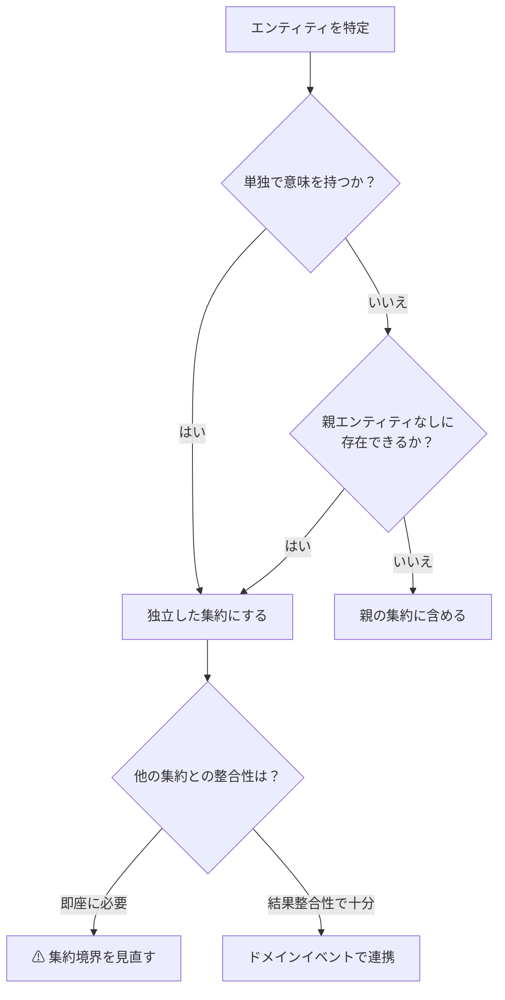
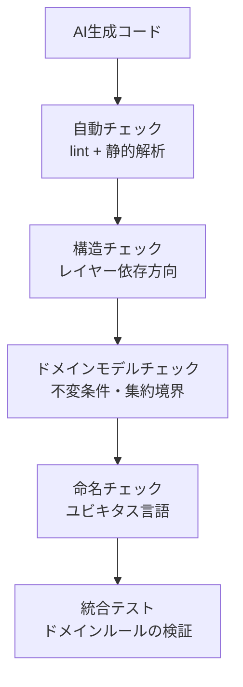

## はじめに

:::message

本記事はLLM（大規模言語モデル）が生成したDDDコードをレビューする際の観点とチェックリストをまとめたものです。各セクションの根拠となる一次情報源は、該当箇所に参照リンクを記載しています。

:::

GitHub CopilotやClaude、ChatGPTなどのLLMをコーディングに活用することが当たり前になりました。私のチームでもAIによるコード生成を積極的に取り入れています。しかし、DDDの文脈でAIが生成したコードには**特有の問題パターン**があることに気づきました。

LLMは構文的に正しいコードを高速に生成できますが、**ドメインの意図を理解していません**。その結果、一見正しく動くが設計上の問題を抱えたコードが生成されます。人間のレビューアーが「DDDの観点で何をチェックすべきか」を体系化しておくことが重要です。

この記事では、私が実際に遭遇したAI生成コードの問題パターンと、DDDの観点から行うレビューのチェックリストを共有します。

---

## LLMが生成するDDDコードの典型的な問題パターン

### パターン1：貧血ドメインモデル（Anemic Domain Model）

最も頻繁に遭遇するパターンです。LLMはドメインモデルを「データの入れ物」として生成しがちです。Martin Fowlerが指摘するAnemic Domain Modelそのものです。

```go
// ❌ AIが生成しがちな貧血ドメインモデル
type Order struct {
    ID         string
    CustomerID string
    Items      []OrderItem
    Status     string
    TotalPrice float64
    CreatedAt  time.Time
}

type OrderItem struct {
    ProductID string
    Quantity  int
    Price     float64
}
```

このコードの問題点は以下の通りです。

- フィールドがすべてパブリックで、外部から自由に変更できます
- `Status`が`string`型で、不正な値を受け入れます
- `TotalPrice`が外部から設定可能で、`Items`との整合性が保証されません
- ドメインロジック（合計計算、状態遷移）がモデルの外に漏れます

```go
// ✅ DDDの原則に沿ったモデル
type Order struct {
    id         OrderID
    customerID CustomerID
    items      []OrderItem
    status     OrderStatus
    createdAt  time.Time
}

func NewOrder(customerID CustomerID, items []OrderItem) (*Order, error) {
    if len(items) == 0 {
        return nil, errors.New("order must have at least one item")
    }

    return &Order{
        id:         NewOrderID(),
        customerID: customerID,
        items:      items,
        status:     OrderStatusPending,
        createdAt:  time.Now(),
    }, nil
}

func (o *Order) TotalPrice() int {
    total := 0
    for _, item := range o.items {
        total += item.Subtotal()
    }
    return total
}

func (o *Order) Confirm() error {
    if o.status != OrderStatusPending {
        return fmt.Errorf("cannot confirm order in %s status", o.status)
    }
    o.status = OrderStatusConfirmed
    return nil
}
```

### パターン2：集約境界の不在

LLMは複数のエンティティを生成する際、**集約境界を意識しません**。すべてのエンティティが独立してリポジトリを持ち、相互に直接参照し合うコードを生成します。

```go
// ❌ 集約境界がないAI生成コード
type OrderRepository interface {
    FindByID(ctx context.Context, id string) (*Order, error)
    Save(ctx context.Context, order *Order) error
}

type OrderItemRepository interface {
    FindByOrderID(ctx context.Context, orderID string) ([]OrderItem, error)
    Save(ctx context.Context, item *OrderItem) error
    Delete(ctx context.Context, id string) error
}

// UseCaseがOrderとOrderItemを個別に操作している
func (u *UpdateOrderUseCase) Execute(ctx context.Context, input UpdateOrderInput) error {
    order, _ := u.orderRepo.FindByID(ctx, input.OrderID)
    // OrderItemを個別に追加・削除
    for _, item := range input.NewItems {
        u.itemRepo.Save(ctx, &item)
    }
    for _, id := range input.RemoveItemIDs {
        u.itemRepo.Delete(ctx, id)
    }
    return u.orderRepo.Save(ctx, order)
}
```

この設計の問題は、`Order`と`OrderItem`のトランザクション整合性が保証されないことです。Eric Evansは、集約をトランザクション整合性の境界として定義しています。

```go
// ✅ 集約ルートを通じた操作
type Order struct {
    id         OrderID
    customerID CustomerID
    items      []OrderItem
    status     OrderStatus
    createdAt  time.Time
}

// 集約ルートが内部エンティティのライフサイクルを管理する
func (o *Order) AddItem(productID ProductID, quantity int, unitPrice int) error {
    if o.status != OrderStatusPending {
        return errors.New("cannot modify confirmed order")
    }
    if quantity <= 0 {
        return errors.New("quantity must be positive")
    }

    o.items = append(o.items, OrderItem{
        productID: productID,
        quantity:  quantity,
        unitPrice: unitPrice,
    })
    return nil
}

func (o *Order) RemoveItem(productID ProductID) error {
    if o.status != OrderStatusPending {
        return errors.New("cannot modify confirmed order")
    }

    filtered := make([]OrderItem, 0, len(o.items))
    found := false
    for _, item := range o.items {
        if item.productID == productID {
            found = true
            continue
        }
        filtered = append(filtered, item)
    }
    if !found {
        return fmt.Errorf("item with product %s not found", productID)
    }

    o.items = filtered
    return nil
}
```

### パターン3：ドメインサービスの過剰生成

LLMは「ロジックの置き場所に迷ったらサービスへ置く」傾向があります。結果として、本来エンティティや値オブジェクトに属すべきロジックがサービスへ流出します。

```go
// ❌ AIが過剰に生成するドメインサービス
type OrderService struct {
    orderRepo OrderRepository
}

func (s *OrderService) CalculateTotal(order *Order) float64 {
    total := 0.0
    for _, item := range order.Items {
        total += item.Price * float64(item.Quantity)
    }
    return total
}

func (s *OrderService) CanBeCancelled(order *Order) bool {
    return order.Status == "pending" || order.Status == "confirmed"
}

func (s *OrderService) ApplyDiscount(order *Order, rate float64) {
    order.TotalPrice = s.CalculateTotal(order) * (1 - rate)
}
```

`CalculateTotal`と`CanBeCancelled`は`Order`エンティティ自身のメソッドであるべきです。ドメインサービスは、**単一のエンティティに属さないドメインロジック**にのみ使用します。

### パターン4：値オブジェクトのプリミティブ型への退化

LLMはドメイン概念を`string`や`int`のプリミティブ型で表現しがちです。これは「Primitive Obsession」と呼ばれるコードスメルです。

```go
// ❌ プリミティブ型の濫用
type Order struct {
    ID         string  // UUID？連番？
    CustomerID string  // フォーマットは？
    Status     string  // 取りうる値は？
    Currency   string  // ISO 4217？
    Amount     float64 // 通貨の精度は？
}
```

```go
// ✅ 値オブジェクトによるドメイン概念の表現
type OrderID struct{ value uuid.UUID }
type CustomerID struct{ value string }
type OrderStatus int
type Money struct {
    amount   int // 最小通貨単位（円なら円、ドルならセント）
    currency Currency
}
type Currency string

const (
    CurrencyJPY Currency = "JPY"
    CurrencyUSD Currency = "USD"
)
```

---

## 集約境界の妥当性チェック方法

AI生成コードの集約境界を検証するための判断基準です。



チェックすべき観点は以下の通りです。

| チェック項目 | 質問 | NGサイン |
| --- | --- | --- |
| 独立性 | このエンティティは集約ルートなしに生成・削除できるか | 集約内エンティティに専用リポジトリがある |
| トランザクション境界 | この操作で一緒に更新すべきデータは何か | 1つのUseCaseで複数の集約を同時に保存している |
| 不変条件 | どのデータ間に常に成り立つべきルールがあるか | 整合性チェックが集約の外（UseCaseやサービス）にある |
| サイズ | この集約のメモリフットプリントは妥当か | 集約が数百件の子エンティティを保持している |

---

## ドメインロジックの漏れ出し検出

AI生成コードでドメインロジックが漏れ出している箇所を検出する方法です。

### Handlerにビジネスルールが含まれていないか

```go
// ❌ Handlerにドメインロジックが漏れている
func (h *OrderHandler) Create(w http.ResponseWriter, r *http.Request) {
    var req CreateOrderRequest
    json.NewDecoder(r.Body).Decode(&req)

    // Handlerで合計金額を計算している
    total := 0
    for _, item := range req.Items {
        total += item.Price * item.Quantity
    }

    // Handlerで割引ルールを適用している
    if total > 10000 {
        total = int(float64(total) * 0.9)
    }
    // ...
}
```

### UseCaseにドメイン知識が埋め込まれていないか

```go
// ❌ UseCaseにドメインの状態遷移ルールが埋め込まれている
func (u *CancelOrderUseCase) Execute(ctx context.Context, orderID string) error {
    order, _ := u.repo.FindByID(ctx, orderID)

    // ドメインルールがUseCaseに漏れている
    if order.Status != "pending" && order.Status != "confirmed" {
        return errors.New("cannot cancel order")
    }

    order.Status = "cancelled"
    return u.repo.Save(ctx, order)
}
```

```go
// ✅ ドメインモデルが自身の状態遷移を管理する
func (u *CancelOrderUseCase) Execute(ctx context.Context, orderID string) error {
    order, _ := u.repo.FindByID(ctx, model.OrderID(orderID))

    if err := order.Cancel(); err != nil {
        return fmt.Errorf("failed to cancel order: %w", err)
    }

    return u.repo.Save(ctx, order)
}
```

---

## AI生成コードに対するDDD観点のレビューチェックリスト

以下は、私のチームで実際に使用しているレビューチェックリストです。

### ドメインモデルの設計

- [ ] エンティティのフィールドは非公開（小文字始まり）になっているか
- [ ] コンストラクタ（`NewXxx`関数）でバリデーションが行われているか
- [ ] 状態遷移はエンティティのメソッドで管理されているか
- [ ] 値オブジェクトが適切に使用されているか（`string`/`int`の直接使用を避けているか）
- [ ] `TotalPrice`のような導出値は計算メソッドで提供されているか（フィールドとして持っていないか）

### 集約の設計

- [ ] 集約ルートを通じてのみ内部エンティティが操作されているか
- [ ] 集約内エンティティに専用のリポジトリが作られていないか
- [ ] 1つのトランザクションで複数の集約を変更していないか
- [ ] 集約間の参照はIDによる間接参照になっているか

### レイヤー構造

- [ ] Handlerにビジネスルールが含まれていないか
- [ ] UseCaseにドメインの不変条件チェックが埋め込まれていないか
- [ ] ドメインモデルがインフラ層のパッケージに依存していないか
- [ ] リポジトリのinterfaceはドメイン層またはユースケース層に定義されているか

### 命名

- [ ] ユビキタス言語に沿った命名か（`data`、`info`、`manager`などの汎用語を避けているか）
- [ ] ドメインイベントは過去形で命名されているか（`OrderConfirmed`、`TaskAssigned`）
- [ ] 値オブジェクトの型名がドメイン概念を表現しているか

### AIに固有の注意点

- [ ] 存在しないライブラリやAPIを使用していないか（ハルシネーション）
- [ ] 過度に抽象化されたデザインパターンが適用されていないか
- [ ] コメントが実際のコードの振る舞いと一致しているか
- [ ] エラーハンドリングが省略されていないか（`_`による無視）

---

## レビュープロセスの実践

AI生成コードのレビューを効率化するためのプロセスです。



### ステップ1：自動チェック

まず静的解析ツールで機械的にチェックできる項目を確認します。

```bash
# 公開フィールドを持つドメインモデルの検出
grep -rn "^type.*struct {" domain/model/ | while read line; do
    file=$(echo "$line" | cut -d: -f1)
    # 大文字始まりのフィールド（公開フィールド）を検出
    grep -n "^\s*[A-Z]" "$file"
done
```

### ステップ2：依存方向の確認

ドメイン層が外部パッケージに依存していないことを確認します。

```bash
# ドメイン層のimportを確認
grep -rn "import" domain/ | grep -v "domain/" | grep -v "\"fmt\"" | grep -v "\"errors\""
```

### ステップ3：ドメインロジックの所在確認

ビジネスルールがドメインモデル内に配置されていることを確認します。条件分岐やビジネス用語がHandler層やUseCase層に出現していないかを確認します。

---

## まとめ

AI生成コードのDDD観点でのレビューは、以下の優先順位で行うことをおすすめします。

| 優先度 | チェック項目               | 理由                                         |
| ------ | -------------------------- | -------------------------------------------- |
| 高     | 貧血ドメインモデルの検出   | LLMが最も生成しやすい問題パターンです        |
| 高     | 集約境界の妥当性           | トランザクション整合性に直結します           |
| 中     | ドメインロジックの漏れ出し | 保守性に大きく影響します                     |
| 中     | 値オブジェクトの活用       | 型安全性とドメイン表現力を左右します         |
| 低     | 命名のユビキタス言語準拠   | 長期的なコミュニケーションコストに影響します |

LLMは「動くコード」を素早く生成する強力なツールです。一方で、DDDの設計原則は人間の判断で守る必要があります。特に集約境界の設計とドメインモデルの振る舞いの配置は、ドメイン知識なしには正しく判断できません。AI生成コードをそのまま受け入れるのではなく、**DDDのレンズを通してレビューする習慣**を持つことが、設計品質の維持につながります。

---

## 参考文献

| 内容 | 出典 |
| --- | --- |
| 貧血ドメインモデル | Martin Fowler, [AnemicDomainModel](https://martinfowler.com/bliki/AnemicDomainModel.html) |
| 集約の設計原則 | Eric Evans, _Domain-Driven Design_（2003）Chapter 6: Aggregates |
| 集約のトランザクション整合性 | Vaughn Vernon, [Effective Aggregate Design](https://www.dddcommunity.org/library/vernon_2011/) |
| Primitive Obsession | Martin Fowler, _Refactoring_（2018）Chapter 3: Bad Smells in Code |
| AI生成コードの品質 | GitHub, [Research: Quantifying GitHub Copilot's impact on code quality](https://github.blog/news-insights/research/research-quantifying-github-copilots-impact-on-code-quality/) |
