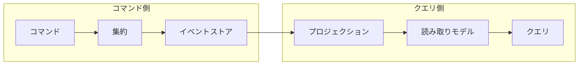

## はじめに

:::message

本記事はDDD×クリーンアーキテクチャ連載の一部です。イベントソーシングの基本概念からGoでの実装パターンまでを解説します。各セクションの根拠となる一次情報源は、該当箇所に参照リンクを記載しています。

:::

集約の状態を「現在の値」としてデータベースに保存するのは、多くの開発者にとって自然なアプローチです。しかし、この方法には「なぜその状態になったのか」という経緯が失われるという問題があります。

イベントソーシングは、集約に起きたすべての変更を**ドメインイベントの列**として記録し、その列を再生することで現在の状態を復元するパターンです。Martin Fowler は次のように説明しています。

> The fundamental idea of Event Sourcing is ensuring that every change to the state of an application is captured in an event object.
>
> — Martin Fowler, [Event Sourcing](https://martinfowler.com/eaaDev/EventSourcing.html)

この記事では、Go でイベントソーシングを実装するために必要な概念と、実際に動くコードを共有します。

---

## イベントソーシングの基本概念

### 従来のCRUDモデルとの違い

従来のCRUDモデルでは、集約の状態を直接データベースに書き込みます。`UPDATE orders SET status = 'shipped' WHERE id = 1` のように、現在の状態が過去の状態を上書きします。

イベントソーシングでは、状態の変更をイベントとして記録します。

```text
OrderCreated { id: 1, customer: "Alice", items: [...] }
OrderConfirmed { id: 1, confirmed_at: "2026-01-15T10:00:00Z" }
OrderShipped { id: 1, tracking_number: "JP12345" }
```

現在の状態は、これらのイベントを最初から順に再生（リプレイ）することで導出します。

### イベントソーシングの利点と注意点

| 項目         | CRUD                     | イベントソーシング                       |
| ------------ | ------------------------ | ---------------------------------------- |
| 履歴の保持   | 別途監査ログが必要       | イベント列自体が履歴                     |
| デバッグ     | 現在の状態しか分からない | 任意の時点の状態を再現できる             |
| スキーマ変更 | マイグレーションが必要   | イベントのアップキャストで対応           |
| 読み取り性能 | そのまま読める           | プロジェクションの構築が必要             |
| 実装の複雑さ | 低い                     | 高い（イベント設計・スナップショット等） |

イベントソーシングはすべてのドメインに適しているわけではありません。Greg Young は「すべてのシステムをイベントソーシングで構築すべきではない」と繰り返し述べています（参考：[CQRS Documents](https://cqrs.files.wordpress.com/2010/11/cqrs_documents.pdf)）。監査要件が厳しい領域や、状態遷移の追跡が重要なドメインで特に効果を発揮します。

---

## ドメインイベントの設計

### イベントの構造

Go でドメインイベントを表現するために、まずイベントの共通インターフェースを定義します。

```go
// domain/event/event.go
package event

import "time"

// Event はドメインイベントの共通インターフェースです。
type Event interface {
    EventType() string
    OccurredAt() time.Time
    AggregateID() string
}

// Base はイベント共通のフィールドを埋め込みで提供します。
type Base struct {
    Type      string    `json:"type"`
    Timestamp time.Time `json:"occurred_at"`
    AggID     string    `json:"aggregate_id"`
}

func (b Base) EventType() string    { return b.Type }
func (b Base) OccurredAt() time.Time { return b.Timestamp }
func (b Base) AggregateID() string   { return b.AggID }
```

### 注文集約のイベント定義

注文管理を例に、具体的なイベントを定義します。

```go
// domain/event/order_events.go
package event

import "time"

type OrderCreated struct {
    Base
    CustomerID string            `json:"customer_id"`
    Items      []OrderItemDetail `json:"items"`
}

type OrderItemDetail struct {
    ProductID string `json:"product_id"`
    Quantity  int    `json:"quantity"`
    Price     int    `json:"price"`
}

type OrderConfirmed struct {
    Base
    ConfirmedAt time.Time `json:"confirmed_at"`
}

type OrderShipped struct {
    Base
    TrackingNumber string `json:"tracking_number"`
}

type OrderCancelled struct {
    Base
    Reason string `json:"reason"`
}
```

イベントの命名には**過去形**を使います。イベントは「すでに起きた事実」を表すためです。`OrderCreated`（注文が作成された）であって、`CreateOrder`（注文を作成する）ではありません。

---

## 集約のイベントソーシング実装

### イベントを蓄積する集約

集約はコマンドを受け取り、ドメインイベントを生成します。蓄積されたイベントを再生することで、集約の状態を復元します。

```go
// domain/model/order.go
package model

import (
    "errors"
    "fmt"
    "time"

    "example/domain/event"
)

type OrderStatus string

const (
    OrderStatusDraft     OrderStatus = "draft"
    OrderStatusConfirmed OrderStatus = "confirmed"
    OrderStatusShipped   OrderStatus = "shipped"
    OrderStatusCancelled OrderStatus = "cancelled"
)

type Order struct {
    id             string
    customerID     string
    status         OrderStatus
    items          []OrderItem
    trackingNumber string
    version        int
    changes        []event.Event // 未保存のイベント
}

type OrderItem struct {
    ProductID string
    Quantity  int
    Price     int
}
```

### コマンドメソッドとイベント適用

集約のコマンドメソッドは、ビジネスルールを検証してからイベントを生成します。`apply` メソッドがイベントを状態に反映します。

```go
func NewOrder(id, customerID string, items []OrderItem) (*Order, error) {
    if len(items) == 0 {
        return nil, errors.New("注文には1つ以上の商品が必要です")
    }
    o := &Order{}
    o.raise(event.OrderCreated{
        Base: event.Base{
            Type:      "OrderCreated",
            Timestamp: time.Now(),
            AggID:     id,
        },
        CustomerID: customerID,
        Items:      toEventItems(items),
    })
    return o, nil
}

func (o *Order) Confirm() error {
    if o.status != OrderStatusDraft {
        return fmt.Errorf("確認できるのは下書き状態の注文のみです（現在: %s）", o.status)
    }
    o.raise(event.OrderConfirmed{
        Base: event.Base{
            Type:      "OrderConfirmed",
            Timestamp: time.Now(),
            AggID:     o.id,
        },
        ConfirmedAt: time.Now(),
    })
    return nil
}

func (o *Order) Ship(trackingNumber string) error {
    if o.status != OrderStatusConfirmed {
        return fmt.Errorf("出荷できるのは確認済みの注文のみです（現在: %s）", o.status)
    }
    o.raise(event.OrderShipped{
        Base: event.Base{
            Type:      "OrderShipped",
            Timestamp: time.Now(),
            AggID:     o.id,
        },
        TrackingNumber: trackingNumber,
    })
    return nil
}

// raise はイベントを生成し、状態に適用します。
func (o *Order) raise(e event.Event) {
    o.apply(e)
    o.changes = append(o.changes, e)
}

// apply はイベントを集約の状態に反映します。
func (o *Order) apply(e event.Event) {
    switch ev := e.(type) {
    case event.OrderCreated:
        o.id = ev.AggregateID()
        o.customerID = ev.CustomerID
        o.status = OrderStatusDraft
        o.items = fromEventItems(ev.Items)
    case event.OrderConfirmed:
        o.status = OrderStatusConfirmed
    case event.OrderShipped:
        o.status = OrderStatusShipped
        o.trackingNumber = ev.TrackingNumber
    case event.OrderCancelled:
        o.status = OrderStatusCancelled
    }
    o.version++
}

// UncommittedChanges は未保存のイベントを返します。
func (o *Order) UncommittedChanges() []event.Event {
    return o.changes
}

// ClearChanges は未保存のイベントをクリアします。
func (o *Order) ClearChanges() {
    o.changes = nil
}

func (o *Order) Version() int {
    return o.version
}

func (o *Order) ReplayFrom(events []event.Event) {
    for _, e := range events {
        o.apply(e)
    }
}

func toEventItems(items []OrderItem) []event.OrderItemDetail {
    result := make([]event.OrderItemDetail, len(items))
    for i, item := range items {
        result[i] = event.OrderItemDetail{
            ProductID: item.ProductID,
            Quantity:  item.Quantity,
            Price:     item.Price,
        }
    }
    return result
}

func fromEventItems(items []event.OrderItemDetail) []OrderItem {
    result := make([]OrderItem, len(items))
    for i, item := range items {
        result[i] = OrderItem{
            ProductID: item.ProductID,
            Quantity:  item.Quantity,
            Price:     item.Price,
        }
    }
    return result
}
```

この設計のポイントは、`raise`（コマンド実行時）と `apply`（リプレイ時）を分離していることです。リプレイ時にはバリデーションを通さず、`apply` だけを呼び出します。

---

## イベントストアの設計

### イベントストアのインターフェース

```go
// domain/repository/event_store.go
package repository

import "example/domain/event"

type EventStore interface {
    Save(aggregateID string, events []event.Event, expectedVersion int) error
    Load(aggregateID string) ([]event.Event, error)
}
```

`expectedVersion` は楽観的ロックに使います。同じ集約に対して並行して書き込みが発生した場合、バージョンの不一致でエラーにすることで、データの整合性を保ちます。

### PostgreSQL 実装

```go
// infrastructure/postgres/event_store.go
package postgres

import (
    "database/sql"
    "encoding/json"
    "fmt"
    "time"

    "example/domain/event"
    "example/domain/repository"
)

type eventStore struct {
    db *sql.DB
}

func NewEventStore(db *sql.DB) repository.EventStore {
    return &eventStore{db: db}
}

func (s *eventStore) Save(aggregateID string, events []event.Event, expectedVersion int) error {
    tx, err := s.db.Begin()
    if err != nil {
        return fmt.Errorf("トランザクション開始に失敗しました: %w", err)
    }
    defer tx.Rollback()

    // 楽観的ロック：現在のバージョンを確認
    var currentVersion int
    err = tx.QueryRow(
        "SELECT COALESCE(MAX(version), 0) FROM events WHERE aggregate_id = $1",
        aggregateID,
    ).Scan(&currentVersion)
    if err != nil {
        return fmt.Errorf("バージョン確認に失敗しました: %w", err)
    }
    if currentVersion != expectedVersion {
        return fmt.Errorf("楽観的ロックエラー: 期待バージョン %d, 現在バージョン %d", expectedVersion, currentVersion)
    }

    // イベントを順番に保存
    for i, e := range events {
        payload, err := json.Marshal(e)
        if err != nil {
            return fmt.Errorf("イベントのシリアライズに失敗しました: %w", err)
        }
        _, err = tx.Exec(
            `INSERT INTO events (aggregate_id, version, event_type, payload, occurred_at)
             VALUES ($1, $2, $3, $4, $5)`,
            aggregateID,
            expectedVersion+i+1,
            e.EventType(),
            payload,
            e.OccurredAt(),
        )
        if err != nil {
            return fmt.Errorf("イベントの保存に失敗しました: %w", err)
        }
    }
    return tx.Commit()
}

func (s *eventStore) Load(aggregateID string) ([]event.Event, error) {
    rows, err := s.db.Query(
        `SELECT event_type, payload, occurred_at FROM events
         WHERE aggregate_id = $1 ORDER BY version ASC`,
        aggregateID,
    )
    if err != nil {
        return nil, fmt.Errorf("イベントの読み込みに失敗しました: %w", err)
    }
    defer rows.Close()

    var events []event.Event
    for rows.Next() {
        var eventType string
        var payload []byte
        var occurredAt time.Time

        if err := rows.Scan(&eventType, &payload, &occurredAt); err != nil {
            return nil, fmt.Errorf("イベントのスキャンに失敗しました: %w", err)
        }

        e, err := deserializeEvent(eventType, payload)
        if err != nil {
            return nil, err
        }
        events = append(events, e)
    }
    return events, rows.Err()
}
```

テーブルスキーマは次のとおりです。

```sql
CREATE TABLE events (
    id           BIGSERIAL PRIMARY KEY,
    aggregate_id VARCHAR(255) NOT NULL,
    version      INT NOT NULL,
    event_type   VARCHAR(255) NOT NULL,
    payload      JSONB NOT NULL,
    occurred_at  TIMESTAMP WITH TIME ZONE NOT NULL,
    UNIQUE (aggregate_id, version)
);

CREATE INDEX idx_events_aggregate_id ON events (aggregate_id);
```

`(aggregate_id, version)` のユニーク制約が、楽観的ロックのデータベースレベルでの保証になります。

---

## イベントのリプレイとスナップショット

### リプレイによる集約の復元

イベントストアからイベントを読み出し、`apply` を順に呼び出すことで集約を復元します。

```go
// domain/model/order.go

// ReplayOrder はイベント列から注文集約を復元します。
func ReplayOrder(events []event.Event) *Order {
    o := &Order{}
    for _, e := range events {
        o.apply(e)
    }
    return o
}

type OrderSnapshot struct {
    ID             string      `json:"id"`
    CustomerID     string      `json:"customer_id"`
    Status         OrderStatus `json:"status"`
    Items          []OrderItem `json:"items"`
    TrackingNumber string      `json:"tracking_number"`
    Version        int         `json:"version"`
}

func (o *Order) ToSnapshot() OrderSnapshot {
    return OrderSnapshot{
        ID:             o.id,
        CustomerID:     o.customerID,
        Status:         o.status,
        Items:          o.items,
        TrackingNumber: o.trackingNumber,
        Version:        o.version,
    }
}

func UnmarshalOrder(data []byte) (*Order, error) {
    var snap OrderSnapshot
    if err := json.Unmarshal(data, &snap); err != nil {
        return nil, err
    }
    return &Order{
        id:             snap.ID,
        customerID:     snap.CustomerID,
        status:         snap.Status,
        items:          snap.Items,
        trackingNumber: snap.TrackingNumber,
        version:        snap.Version,
        changes:        nil,
    }, nil
}
```

### スナップショットで復元を高速化する

イベント数が増えると、すべてのイベントを再生するコストが高くなります。スナップショットは、ある時点の集約の状態を保存しておき、そこから先のイベントだけを再生する仕組みです。

```go
// domain/repository/snapshot_store.go
package repository

type Snapshot struct {
    AggregateID string
    Version     int
    Data        []byte
}

type SnapshotStore interface {
    Save(snapshot *Snapshot) error
    Load(aggregateID string) (*Snapshot, error)
}
```

```go
// usecase/order_usecase.go
package usecase

import (
    "encoding/json"
    "fmt"

    "example/domain/event"
    "example/domain/model"
    "example/domain/repository"
)

const snapshotInterval = 50

type OrderUseCase struct {
    eventStore    repository.EventStore
    snapshotStore repository.SnapshotStore
}

func (uc *OrderUseCase) LoadOrder(id string) (*model.Order, error) {
    // スナップショットがあれば、そこから復元を開始
    snap, err := uc.snapshotStore.Load(id)
    if err != nil {
        return nil, err
    }

    var order *model.Order
    fromVersion := 0
    if snap != nil {
        order, err = model.UnmarshalOrder(snap.Data)
        if err != nil {
            return nil, err
        }
        fromVersion = snap.Version
    }

    // スナップショット以降のイベントを取得して再生
    events, err := uc.eventStore.Load(id)
    if err != nil {
        return nil, err
    }

    eventsAfterSnapshot := filterEventsAfterVersion(events, fromVersion)
    if order == nil {
        order = model.ReplayOrder(eventsAfterSnapshot)
    } else {
        order.ReplayFrom(eventsAfterSnapshot)
    }

    // 一定間隔でスナップショットを保存
    if order.Version()-fromVersion >= snapshotInterval {
        data, err := json.Marshal(order.ToSnapshot())
        if err != nil {
            return nil, fmt.Errorf("スナップショットのシリアライズに失敗しました: %w", err)
        }
        if err := uc.snapshotStore.Save(&repository.Snapshot{
            AggregateID: id,
            Version:     order.Version(),
            Data:        data,
        }); err != nil {
            return nil, fmt.Errorf("スナップショットの保存に失敗しました: %w", err)
        }
    }
    return order, nil
}

func filterEventsAfterVersion(events []event.Event, version int) []event.Event {
    if version >= len(events) {
        return nil
    }
    return events[version:]
}
```

スナップショットの取得間隔はドメインの特性に応じて調整します。イベント数が数百件程度であればスナップショットなしでも十分高速です。

---

## CQRS との組み合わせ

### なぜ CQRS が必要になるのか

イベントソーシングでは、集約の現在の状態を得るためにイベントの再生が必要です。一覧表示や検索のようなクエリ操作でリプレイを行うのは非効率です。そこで**CQRS（Command Query Responsibility Segregation）**を組み合わせます。



コマンド側はイベントストアにイベントを追記し、クエリ側はプロジェクション（イベントから構築した読み取り専用のビュー）を参照します。

### プロジェクションの実装

プロジェクションは、イベントを購読して読み取りモデルを更新するハンドラです。

```go
// projection/order_projection.go
package projection

import (
    "database/sql"

    "example/domain/event"
)

type OrderProjection struct {
    db *sql.DB
}

func NewOrderProjection(db *sql.DB) *OrderProjection {
    return &OrderProjection{db: db}
}

func (p *OrderProjection) Handle(e event.Event) error {
    switch ev := e.(type) {
    case event.OrderCreated:
        _, err := p.db.Exec(
            `INSERT INTO order_read_model (id, customer_id, status, total_amount, created_at)
             VALUES ($1, $2, $3, $4, $5)`,
            ev.AggregateID(), ev.CustomerID, "draft",
            calculateTotal(ev.Items), ev.OccurredAt(),
        )
        return err
    case event.OrderConfirmed:
        _, err := p.db.Exec(
            `UPDATE order_read_model SET status = 'confirmed', updated_at = $1 WHERE id = $2`,
            ev.ConfirmedAt, ev.AggregateID(),
        )
        return err
    case event.OrderShipped:
        _, err := p.db.Exec(
            `UPDATE order_read_model SET status = 'shipped', tracking_number = $1, updated_at = $2 WHERE id = $3`,
            ev.TrackingNumber, ev.OccurredAt(), ev.AggregateID(),
        )
        return err
    }
    return nil
}

func calculateTotal(items []event.OrderItemDetail) int {
    total := 0
    for _, item := range items {
        total += item.Price * item.Quantity
    }
    return total
}
```

読み取りモデルのテーブルは、クエリの要件に合わせて自由に設計できます。これがCQRS の大きな利点です。コマンド側のスキーマ（イベント）に制約されることなく、画面表示やレポートに最適化したテーブル構造を採用できます。

### プロジェクションの全体像

```sql
CREATE TABLE order_read_model (
    id              VARCHAR(255) PRIMARY KEY,
    customer_id     VARCHAR(255) NOT NULL,
    status          VARCHAR(50) NOT NULL,
    total_amount    INT NOT NULL,
    tracking_number VARCHAR(255),
    created_at      TIMESTAMP WITH TIME ZONE NOT NULL,
    updated_at      TIMESTAMP WITH TIME ZONE
);
```

---

## イベントソーシング導入の判断基準

すべてのドメインにイベントソーシングが適しているわけではありません。以下の基準を参考にしてください。

| 条件                                       | イベントソーシングの適合度 |
| ------------------------------------------ | -------------------------- |
| 監査証跡が法的に必要                       | 高い                       |
| 状態遷移が複雑で、デバッグ頻度が高い       | 高い                       |
| 時系列での分析やレポートが求められる       | 高い                       |
| シンプルなCRUDが中心                       | 低い                       |
| チームにイベントソーシングの経験者がいない | 低い（段階的導入を推奨）   |

---

## まとめ

イベントソーシングは、集約の状態変更をイベントの列として記録し、そのリプレイで現在の状態を復元するパターンです。Go で実装する際のポイントをまとめます。

- **イベントは過去形で命名**します。イベントは「すでに起きた事実」です
- **`raise` と `apply` を分離**することで、コマンド実行時とリプレイ時で同じ状態遷移ロジックを再利用できます
- **楽観的ロック**で並行書き込みの整合性を保ちます。`(aggregate_id, version)` のユニーク制約がデータベースレベルの保証です
- **スナップショット**はイベント数が増えたときの性能対策です。すべてのドメインで最初から必要になるわけではありません
- **CQRS との組み合わせ**により、コマンド側の設計を変えずに読み取り側を最適化できます

イベントソーシングは強力なパターンですが、導入には相応のコストが伴います。監査要件や状態遷移の複雑さを考慮し、本当に必要な境界づけられたコンテキストに限定して導入することをお勧めします。

---

## 参考文献

| 内容 | 出典 |
| --- | --- |
| イベントソーシングの定義 | Martin Fowler, [Event Sourcing](https://martinfowler.com/eaaDev/EventSourcing.html) |
| CQRS とイベントソーシング | Greg Young, [CQRS Documents](https://cqrs.files.wordpress.com/2010/11/cqrs_documents.pdf) |
| DDD 原典 | Eric Evans, _Domain-Driven Design: Tackling Complexity in the Heart of Software_（2003） |
| CQRS パターン | Microsoft, [CQRS pattern](https://learn.microsoft.com/en-us/azure/architecture/patterns/cqrs) |
| イベントソーシングパターン | Microsoft, [Event Sourcing pattern](https://learn.microsoft.com/en-us/azure/architecture/patterns/event-sourcing) |
| Go の interface 設計 | Go Wiki, [Go Code Review Comments](https://go.dev/wiki/CodeReviewComments#interfaces) |
