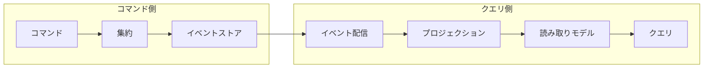

## apply の意味を完全に誤解していた

イベントソーシングを初めて実装したとき、私は `apply` メソッドをこう理解していました。

- `apply` の中でバリデーションすればいい
- `apply` は状態を更新するメソッドだから、コマンドと大差ない
- エラーを返せるようにしておけば安心

しかし、この理解のまま実装した結果、イベントのリプレイ時にバリデーションエラーが発生し、過去のイベントが再適用できず、集約の復元が壊れました。

この記事では、この「`apply` の誤解」がなぜ起きるのかを解き明かし、正しいイベントソーシングの設計を Go のコードで解説します。イベントソーシングを知らない方向けに、後半で詳しく解説しています。

:::message alert

**イベントソーシングの前提知識** — 状態を直接保存するのではなく、状態の変化（イベント）を記録し、それを再生して現在の状態を復元する設計パターンです。たとえば「注文が出荷された」という状態を直接保存するのではなく、「注文が作成された → 確認された → 出荷された」というイベントの列を保存します。それを順に適用（`apply`）することで現在の状態を導出します。

:::

:::message

本記事はDDD×クリーンアーキテクチャ連載の一部です。根拠となる一次情報源は、末尾の参考文献に記載しています。

コード例はクリーンアーキテクチャのレイヤーに沿ったパッケージ構成を採用しています。

- `domain/event` — ドメインイベント
- `domain/model` — 集約
- `infrastructure/postgres` — イベントストア実装
- `infrastructure/projection` — プロジェクション（読み取りモデル更新）
- `usecase` — ユースケース（利用側でインターフェースを定義）

コード例は説明の都合上セクションごとに分割して掲載していますが、同一ファイルのコードは結合してご利用ください。

:::

---

## なぜ apply は誤解されるのか

`apply` は「状態を変更するメソッド」に見えます。CRUDに慣れた開発者であれば、状態を変更する箇所にバリデーションを入れるのは自然な発想です。

しかし、イベントソーシングにおける `apply` は根本的に異なる性質を持ちます。

- `apply` は外部副作用（DB・API呼び出し等）を持たない、**決定的な状態遷移**です
- ビジネスルールの検証は**コマンドメソッド側**で行います
- `apply` は「検証済みのイベント」を前提とするため、通常のドメインロジックとしては**失敗しない設計**にします

この違いを理解していないと、イベントソーシングの設計は破綻します。`apply` にバリデーションや外部依存を入れてしまうと、リプレイ時にエラーが発生し、集約を復元できなくなるためです。

以降のセクションでは、この `raise`（コマンド）と `apply`（状態遷移）の分離を軸に、イベントソーシングの設計と実装を順を追って解説します。

---

## イベントソーシングとは

集約の状態を「現在の値」としてデータベースに保存するのは、多くの開発者にとって自然なアプローチです。しかし、この方法には「なぜその状態になったのか」という経緯が失われるという問題があります。

イベントソーシングは、集約に起きたすべての変更を**ドメインイベントの列**として記録し、その列を再生することで現在の状態を復元するパターンです。ただし、外部依存（為替レート・外部APIの応答等）や非決定的な処理を含む場合、イベントだけでは完全な再現ができないこともあります。Martin Fowler は次のように説明しています。

> The fundamental idea of Event Sourcing is ensuring that every change to the state of an application is captured in an event object.
>
> — Martin Fowler, [Event Sourcing](https://martinfowler.com/eaaDev/EventSourcing.html)

### 従来のCRUDモデルとの違い

従来のCRUDモデルでは、集約の状態を直接データベースに書き込みます。`UPDATE orders SET status = 'shipped' WHERE id = 1` のように、現在の状態が過去の状態を上書きします。

イベントソーシングでは、状態の変更をイベントとして記録します。

```text
OrderCreated { id: 1, customer: "Alice", items: [...] }
OrderConfirmed { id: 1, confirmed_at: "2026-01-15T10:00:00Z" }
OrderShipped { id: 1, tracking_number: "JP12345" }
```

現在の状態は、これらのイベントを最初から順に再生（リプレイ）することで導出します。

### イベントソーシングの利点と注意点

| 項目         | CRUD                     | イベントソーシング                                 |
| ------------ | ------------------------ | -------------------------------------------------- |
| 履歴の保持   | 別途監査ログが必要       | イベント列自体が履歴                               |
| デバッグ     | 現在の状態しか分からない | 任意の時点の状態を再現できる                       |
| スキーマ変更 | マイグレーションが必要   | アップキャストで対応可能（ただし慎重な設計が必要） |
| 読み取り性能 | そのまま読める           | プロジェクションの構築が必要                       |
| 実装の複雑さ | 低い                     | 高い（イベント設計・スナップショット等）           |

上記の表で「イベントのアップキャストで対応」と書きましたが、補足します。アップキャストとは、古いバージョンのイベントを現在のスキーマに変換する処理です。たとえば、`OrderCreated` イベントに後から `currency` フィールドを追加した場合、デシリアライズ時にデフォルト値 `"JPY"` を補完する変換処理を挟みます。本記事の `deserializeEvent` は型ごとの基本的な復元例に留めています。実運用でアップキャストを行う場合は、イベントバージョンを持たせたうえで復元前に変換レイヤーを挟む設計が一般的です。詳細は別記事で扱います。

イベントソーシングはすべてのドメインに適しているわけではありません。Greg Young は CQRS Documents の "Event Sourcing" セクションで、適用範囲は限定的であるべきだと述べています（参考：[CQRS Documents](https://cqrs.files.wordpress.com/2010/11/cqrs_documents.pdf)）。監査要件が厳しい領域や、状態遷移の追跡が重要なドメインで特に効果を発揮します。

---

## ドメインイベントの設計

### イベントの構造

Go でドメインイベントを表現するために、まずイベントの共通インターフェースを定義します。

```go
// domain/event/event.go
package event

import "time"

// Event はドメインイベントの共通インターフェースです。
type Event interface {
    EventID() string
    EventType() string
    OccurredAt() time.Time
    AggregateID() string
}

// Base はイベント共通のフィールドを埋め込みで提供します。
type Base struct {
    ID        string    `json:"event_id"`
    Type      string    `json:"event_type"`
    // AggID はフィールド名。AggregateID という名前にすると
    // AggregateID() メソッドと衝突するため略称を使用します。
    AggID     string    `json:"aggregate_id"`
    Timestamp time.Time `json:"occurred_at"`
}

func (b Base) EventID() string       { return b.ID }
func (b Base) EventType() string     { return b.Type }
func (b Base) OccurredAt() time.Time { return b.Timestamp }
func (b Base) AggregateID() string   { return b.AggID }
```

### 注文集約のイベント定義

注文管理を例に、具体的なイベントを定義します。

```go
// domain/event/order_events.go
package event

import "time"

// イベントタイプ定数。文字列のハードコードを防ぎ、deserializeEvent 側と一致させます。
const (
    EventTypeOrderCreated   = "OrderCreated"
    EventTypeOrderConfirmed = "OrderConfirmed"
    EventTypeOrderShipped   = "OrderShipped"
    EventTypeOrderCancelled = "OrderCancelled"
)

type OrderCreated struct {
    Base
    CustomerID string            `json:"customer_id"`
    Items      []OrderItemDetail `json:"items"`
}

type OrderItemDetail struct {
    ProductID string `json:"product_id"`
    Quantity  int    `json:"quantity"`
    Price     int    `json:"price"`
}

type OrderConfirmed struct {
    Base
    ConfirmedAt time.Time `json:"confirmed_at"`
}

type OrderShipped struct {
    Base
    TrackingNumber string `json:"tracking_number"`
}

type OrderCancelled struct {
    Base
    Reason string `json:"reason"`
}
```

イベントの命名には**過去形**を使います。イベントは「すでに起きた事実」を表すためです。`OrderCreated`（注文が作成された）であって、`CreateOrder`（注文を作成する）ではありません。

なお、`OrderItemDetail`（event パッケージ）と `orderItem`（model パッケージ）は似た構造ですが、意図的に別の型として定義しています。イベントはシリアライズされて永続化されるため、JSON タグを含む exported フィールドを持ちます。一方、集約内の `orderItem` はドメインロジックで使う内部表現であり、フィールドは unexported です。両者を分離することで、イベントスキーマの変更が集約の内部構造に波及するのを防ぎます。

---

## 集約のイベントソーシング実装

### イベントを蓄積する集約

集約はコマンドを受け取り、ビジネスルールを検証したうえでドメインイベントを生成します。

```go
// domain/model/order.go
package model

import (
    "encoding/json"
    "errors"
    "fmt"
    "time"

    "example/domain/event"
    "github.com/google/uuid"
)

type OrderStatus string

const (
    OrderStatusDraft     OrderStatus = "draft"
    OrderStatusConfirmed OrderStatus = "confirmed"
    OrderStatusShipped   OrderStatus = "shipped"
    OrderStatusCancelled OrderStatus = "cancelled"
)

type Order struct {
    id             string
    customerID     string
    status         OrderStatus
    items          []orderItem
    trackingNumber string
    version        int
    events         []event.Event // 未保存のイベント
}

type orderItem struct {
    productID string
    quantity  int
    price     int
}

// OrderItemInput は NewOrder に渡すための入力型です。
// 集約内部の orderItem は unexported ですが、外部パッケージから注文を作成するために
// exported な入力型を用意しています。
type OrderItemInput struct {
    ProductID string
    Quantity  int
    Price     int
}
```

### コマンドメソッドとイベント適用

集約のコマンドメソッドは、ビジネスルールを検証してからイベントを生成します。`apply` メソッドがイベントを状態に反映します。連載の[ドメインイベント記事](/135yshr/articles/c05cf4efcc591f)と同様に、現在時刻は引数で受け取る設計にしています。テスト時に任意の時刻を注入できるためです。

```go
// NewOrder は注文集約を生成します。now を引数で受け取ることで、テスト時に時刻を固定できます。
func NewOrder(id, customerID string, inputs []OrderItemInput, now time.Time) (*Order, error) {
    if len(inputs) == 0 {
        return nil, errors.New("注文には1つ以上の商品が必要です")
    }
    items := make([]orderItem, len(inputs))
    for i, in := range inputs {
        items[i] = orderItem{
            productID: in.ProductID,
            quantity:  in.Quantity,
            price:     in.Price,
        }
    }
    o := &Order{}
    o.raise(event.OrderCreated{
        Base: event.Base{
            ID:        uuid.New().String(),
            Type:      event.EventTypeOrderCreated,
            AggID:     id,
            Timestamp: now,
        },
        CustomerID: customerID,
        Items:      toEventItems(items),
    })
    return o, nil
}

func (o *Order) Confirm(now time.Time) error {
    if o.status != OrderStatusDraft {
        return fmt.Errorf("確認できるのは下書き状態の注文のみです（現在: %s）", o.status)
    }
    o.raise(event.OrderConfirmed{
        Base: event.Base{
            ID:        uuid.New().String(),
            Type:      event.EventTypeOrderConfirmed,
            AggID:     o.id,
            Timestamp: now,
        },
        ConfirmedAt: now,
    })
    return nil
}

func (o *Order) Ship(trackingNumber string, now time.Time) error {
    if o.status != OrderStatusConfirmed {
        return fmt.Errorf("出荷できるのは確認済みの注文のみです（現在: %s）", o.status)
    }
    o.raise(event.OrderShipped{
        Base: event.Base{
            ID:        uuid.New().String(),
            Type:      event.EventTypeOrderShipped,
            AggID:     o.id,
            Timestamp: now,
        },
        TrackingNumber: trackingNumber,
    })
    return nil
}

// Cancel は下書きまたは確認済みの注文をキャンセルします。
// 出荷前であればキャンセル可能とする設計です。
func (o *Order) Cancel(reason string, now time.Time) error {
    if o.status == OrderStatusShipped {
        return fmt.Errorf("出荷済みの注文はキャンセルできません")
    }
    if o.status == OrderStatusCancelled {
        return fmt.Errorf("すでにキャンセルされています")
    }
    o.raise(event.OrderCancelled{
        Base: event.Base{
            ID:        uuid.New().String(),
            Type:      event.EventTypeOrderCancelled,
            AggID:     o.id,
            Timestamp: now,
        },
        Reason: reason,
    })
    return nil
}

// raise はイベントを生成し、状態に適用します。
func (o *Order) raise(e event.Event) {
    o.apply(e)
    o.events = append(o.events, e)
}

// apply はイベントを集約の状態に反映します。
func (o *Order) apply(e event.Event) {
    switch ev := e.(type) {
    case event.OrderCreated:
        o.id = ev.AggregateID()
        o.customerID = ev.CustomerID
        o.status = OrderStatusDraft
        o.items = fromEventItems(ev.Items)
    case event.OrderConfirmed:
        o.status = OrderStatusConfirmed
    case event.OrderShipped:
        o.status = OrderStatusShipped
        o.trackingNumber = ev.TrackingNumber
    case event.OrderCancelled:
        o.status = OrderStatusCancelled
    }
    o.version++ // イベントの適用回数。イベントストア上の version と一致します
}

func (o *Order) DomainEvents() []event.Event {
    result := make([]event.Event, len(o.events))
    copy(result, o.events)
    return result
}

func (o *Order) ClearEvents() {
    o.events = nil
}

func (o *Order) Version() int {
    return o.version
}

func (o *Order) ReplayFrom(history []event.Event) {
    for _, e := range history {
        o.apply(e)
    }
}

func toEventItems(items []orderItem) []event.OrderItemDetail {
    result := make([]event.OrderItemDetail, len(items))
    for i, item := range items {
        result[i] = event.OrderItemDetail{
            ProductID: item.productID,
            Quantity:  item.quantity,
            Price:     item.price,
        }
    }
    return result
}

func fromEventItems(items []event.OrderItemDetail) []orderItem {
    result := make([]orderItem, len(items))
    for i, item := range items {
        result[i] = orderItem{
            productID: item.ProductID,
            quantity:  item.Quantity,
            price:     item.Price,
        }
    }
    return result
}
```

冒頭で述べた `raise` と `apply` の分離が、ここに現れています。`apply` は外部副作用（DB・API呼び出し等）を持たない決定的な状態遷移であり、エラーを返しません。「すでに検証済みのイベント」を前提としており、外部から任意に呼び出されることは想定していません。整合性の保証はコマンドメソッド（`NewOrder`, `Confirm` 等）側で担保します。もし `apply` の中にバリデーションを入れてしまうと、過去に正常だったイベントがリプレイ時に拒否されるという致命的な問題を引き起こします。

Go では構造体は値コピーされますが、スライスやマップは内部で参照を共有するため注意が必要です。イベントを値型として `raise` に渡すと `int` や `string` のフィールドはコピーで保護されますが、スライスの要素は共有されたままです。本記事のコードでは `toEventItems` で新しいスライスを生成しているため安全ですが、既存のスライスをそのまま埋め込む場合はディープコピーが必要です。

---

## イベントストアの設計

### 利用側でインターフェースを定義する

連載の「[interfaceが爆発する問題への処方箋](/135yshr/articles/f2027369b648cc)」で解説した通り、Go ではインターフェースを利用側で定義するのが慣習です。イベントストアも同様に、`domain/repository` に大きなインターフェースを置くのではなく、**利用側が必要なメソッドだけ定義**します。

なお、連載の[CQRS記事](/135yshr/articles/9e3ec9a7d52c98)では通常のリポジトリを `domain` 層に配置しています。イベントストアの配置を変えている理由は、責務の違いにあります。従来の Repository は「集約を取得・保存する」抽象であるのに対し、イベントストアは「イベントストリームを読み出す・追記する」低レベルな操作を担います。ユースケース側で必要な操作（Load / Save）を定義することで、依存関係をシンプルに保てます。

`Save` と `LoadFrom` は別の責務（書き込みと読み取り）なので、利用側で必要な方だけに依存できます。`expectedVersion` は楽観的ロックに使います。同じ集約に対して並行して書き込みが発生した場合、バージョンの不一致でエラーにすることで、データの整合性を保ちます。

### PostgreSQL 実装

```go
// infrastructure/postgres/event_store.go
package postgres

import (
    "database/sql"
    "encoding/json"
    "fmt"
    "time"

    "example/domain/event"
)

// EventStore はイベントの永続化と読み込みを担う構造体です。
// インターフェースは利用側（usecase 等）で定義します。
type EventStore struct {
    db *sql.DB
}

func NewEventStore(db *sql.DB) *EventStore {
    return &EventStore{db: db}
}

func (s *EventStore) Save(aggregateID string, events []event.Event, expectedVersion int) error {
    tx, err := s.db.Begin()
    if err != nil {
        return fmt.Errorf("トランザクション開始に失敗しました: %w", err)
    }
    defer tx.Rollback()

    // 楽観的ロック：現在のバージョンを確認
    var currentVersion int
    err = tx.QueryRow(
        "SELECT COALESCE(MAX(version), 0) FROM events WHERE aggregate_id = $1",
        aggregateID,
    ).Scan(&currentVersion)
    if err != nil {
        return fmt.Errorf("バージョン確認に失敗しました: %w", err)
    }
    if currentVersion != expectedVersion {
        return fmt.Errorf("楽観的ロックエラー: 期待バージョン %d, 現在バージョン %d", expectedVersion, currentVersion)
    }

    // イベントを順番に保存
    for i, e := range events {
        payload, err := json.Marshal(e)
        if err != nil {
            return fmt.Errorf("イベントのシリアライズに失敗しました: %w", err)
        }
        _, err = tx.Exec(
            `INSERT INTO events (event_id, aggregate_id, version, event_type, payload, occurred_at)
             VALUES ($1, $2, $3, $4, $5, $6)`,
            e.EventID(),
            aggregateID,
            expectedVersion+i+1,
            e.EventType(),
            payload,
            e.OccurredAt(),
        )
        if err != nil {
            return fmt.Errorf("イベントの保存に失敗しました: %w", err)
        }
    }
    return tx.Commit()
}

// LoadFrom は afterVersion より後（排他的）のイベントを返します。
// afterVersion=0 の場合はすべてのイベントを返します。
func (s *EventStore) LoadFrom(aggregateID string, afterVersion int) ([]event.Event, error) {
    rows, err := s.db.Query(
        `SELECT event_type, payload, occurred_at FROM events
         WHERE aggregate_id = $1 AND version > $2 ORDER BY version ASC`,
        aggregateID, afterVersion,
    )
    if err != nil {
        return nil, fmt.Errorf("イベントの読み込みに失敗しました: %w", err)
    }
    defer rows.Close()

    var events []event.Event
    for rows.Next() {
        var eventType string
        var payload []byte
        var occurredAt time.Time

        if err := rows.Scan(&eventType, &payload, &occurredAt); err != nil {
            return nil, fmt.Errorf("イベントのスキャンに失敗しました: %w", err)
        }

        e, err := deserializeEvent(eventType, payload)
        if err != nil {
            return nil, err
        }
        events = append(events, e)
    }
    return events, rows.Err()
}

func deserializeEvent(eventType string, payload []byte) (event.Event, error) {
    switch eventType {
    case event.EventTypeOrderCreated:
        var e event.OrderCreated
        if err := json.Unmarshal(payload, &e); err != nil {
            return nil, fmt.Errorf("OrderCreatedのデシリアライズに失敗しました: %w", err)
        }
        return e, nil
    case event.EventTypeOrderConfirmed:
        var e event.OrderConfirmed
        if err := json.Unmarshal(payload, &e); err != nil {
            return nil, fmt.Errorf("OrderConfirmedのデシリアライズに失敗しました: %w", err)
        }
        return e, nil
    case event.EventTypeOrderShipped:
        var e event.OrderShipped
        if err := json.Unmarshal(payload, &e); err != nil {
            return nil, fmt.Errorf("OrderShippedのデシリアライズに失敗しました: %w", err)
        }
        return e, nil
    case event.EventTypeOrderCancelled:
        var e event.OrderCancelled
        if err := json.Unmarshal(payload, &e); err != nil {
            return nil, fmt.Errorf("OrderCancelledのデシリアライズに失敗しました: %w", err)
        }
        return e, nil
    default:
        return nil, fmt.Errorf("未知のイベントタイプ: %s", eventType)
    }
}
```

`Save` メソッドの `defer tx.Rollback()` は、コミット成功後に呼ばれると `sql.ErrTxDone` を返しますが、副作用はありません。`defer` で呼び出しているため戻り値は無視されます。この `defer tx.Rollback()` パターンは Go の `database/sql` で広く使われるイディオムです。

テーブルスキーマは次のとおりです。

```sql
CREATE TABLE events (
    id           BIGSERIAL PRIMARY KEY,
    event_id     VARCHAR(255) NOT NULL UNIQUE,
    aggregate_id VARCHAR(255) NOT NULL,
    version      INT NOT NULL,
    event_type   VARCHAR(255) NOT NULL,
    payload      JSONB NOT NULL,
    occurred_at  TIMESTAMP WITH TIME ZONE NOT NULL,
    created_at   TIMESTAMP WITH TIME ZONE NOT NULL DEFAULT NOW(),
    UNIQUE (aggregate_id, version)
);

```

`(aggregate_id, version)` のユニーク制約が、楽観的ロックの最終的な保証です。アプリケーション側の `SELECT` + バージョン比較は早期エラー検出を目的としており、データベースレベルの整合性はユニーク制約で担保されます。PostgreSQL のデフォルト分離レベル（Read Committed）では、`SELECT` と `INSERT` の間に別のトランザクションがコミットされる可能性もあります。その場合でもユニーク制約違反でエラーになるため、データの不整合は発生しません。

---

## イベントのリプレイとスナップショット

### リプレイによる集約の復元

イベントストアからイベントを読み出し、`apply` を順に呼び出すことで集約を復元します。復元には2つのパターンがあります。

- **`ReplayOrder`** — ゼロから復元します。スナップショットがない場合に使います
- **`ReplayFrom`** — 途中からの再生です。スナップショットで復元した集約に、残りのイベントを適用します

```go
// domain/model/order.go（続き）

// ReplayOrder はイベント列から注文集約を復元します。
func ReplayOrder(events []event.Event) *Order {
    o := &Order{}
    for _, e := range events {
        o.apply(e)
    }
    return o
}

// snapshotItem はスナップショットのシリアライズ用の型です。
// orderItem のフィールドは unexported なため、JSON 変換用に exported フィールドを持つ
// 別の型を用意しています。スナップショットは「現時点の状態のキャッシュ」であり、
// スキーマ変更時は破棄してイベントから再構築できます。
// ただし、データ量が大きい場合は再構築コストも高くなるため、
// マイグレーション戦略を検討する必要があります。
type snapshotItem struct {
    ProductID string `json:"product_id"`
    Quantity  int    `json:"quantity"`
    Price     int    `json:"price"`
}

type OrderSnapshot struct {
    ID             string         `json:"id"`
    CustomerID     string         `json:"customer_id"`
    Status         OrderStatus    `json:"status"`
    Items          []snapshotItem `json:"items"`
    TrackingNumber string         `json:"tracking_number"`
    Version        int            `json:"version"`
}

func (o *Order) ToSnapshot() OrderSnapshot {
    items := make([]snapshotItem, len(o.items))
    for i, item := range o.items {
        items[i] = snapshotItem{
            ProductID: item.productID,
            Quantity:  item.quantity,
            Price:     item.price,
        }
    }
    return OrderSnapshot{
        ID:             o.id,
        CustomerID:     o.customerID,
        Status:         o.status,
        Items:          items,
        TrackingNumber: o.trackingNumber,
        Version:        o.version,
    }
}

func UnmarshalOrder(data []byte) (*Order, error) {
    var snap OrderSnapshot
    if err := json.Unmarshal(data, &snap); err != nil {
        return nil, err
    }
    items := make([]orderItem, len(snap.Items))
    for i, si := range snap.Items {
        items[i] = orderItem{
            productID: si.ProductID,
            quantity:  si.Quantity,
            price:     si.Price,
        }
    }
    return &Order{
        id:             snap.ID,
        customerID:     snap.CustomerID,
        status:         snap.Status,
        items:          items,
        trackingNumber: snap.TrackingNumber,
        version:        snap.Version,
        events:         nil,
    }, nil
}
```

### スナップショットで復元を高速化する

イベント数が増えると、すべてのイベントを再生するコストが高くなります。スナップショットは、ある時点の集約の状態を保存しておき、そこから先のイベントだけを再生する仕組みです。

```go
// usecase/order_usecase.go
package usecase

import (
    "encoding/json"
    "fmt"
    "log"

    "example/domain/event"
    "example/domain/model"
)

// 利用側でインターフェースを定義（必要なメソッドだけ）
type eventLoader interface {
    LoadFrom(aggregateID string, afterVersion int) ([]event.Event, error)
}

type snapshotLoader interface {
    // Load はスナップショットが存在しない場合 (nil, nil) を返します。
    Load(aggregateID string) (*Snapshot, error)
}

type snapshotSaver interface {
    Save(snapshot *Snapshot) error
}

type Snapshot struct {
    AggregateID string
    Version     int
    Data        []byte
}

const snapshotInterval = 50

type OrderUseCase struct {
    eventLoader   eventLoader
    snapshotLoader snapshotLoader
    snapshotSaver  snapshotSaver
}

func (uc *OrderUseCase) LoadOrder(id string) (*model.Order, error) {
    // スナップショットがあれば、そこから復元を開始
    snap, err := uc.snapshotLoader.Load(id)
    if err != nil {
        return nil, err
    }

    var order *model.Order
    fromVersion := 0
    if snap != nil {
        order, err = model.UnmarshalOrder(snap.Data)
        if err != nil {
            return nil, err
        }
        fromVersion = snap.Version
    }

    // スナップショット以降のイベントを取得して再生
    events, err := uc.eventLoader.LoadFrom(id, fromVersion)
    if err != nil {
        return nil, err
    }

    if order == nil {
        if len(events) == 0 {
            return nil, fmt.Errorf("集約が見つかりません: %s", id)
        }
        order = model.ReplayOrder(events)
    } else {
        order.ReplayFrom(events)
    }

    // 一定間隔でスナップショットを保存（失敗しても読み込みには影響しない）
    if order.Version()-fromVersion >= snapshotInterval {
        if data, err := json.Marshal(order.ToSnapshot()); err != nil {
            log.Printf("スナップショットのシリアライズに失敗しました: %v", err)
        } else if err := uc.snapshotSaver.Save(&Snapshot{
            AggregateID: id,
            Version:     order.Version(),
            Data:        data,
        }); err != nil {
            log.Printf("スナップショットの保存に失敗しました: %v", err)
        }
    }
    return order, nil
}

```

スナップショットの取得間隔はドメインの特性に応じて調整します。イベント数が少ないうちはスナップショットなしでも問題ありませんが、閾値はイベントのサイズやデシリアライズのコストに依存するため、実際のワークロードでベンチマークを取って判断してください。

---

## CQRS との組み合わせ

### なぜ CQRS と組み合わせるのか

理論上はイベントソーシングを CQRS なしで使うことも可能です（クエリのたびにリプレイする方式）。しかし、イベント数に比例して読み取りコストが増加するため、実務ではほぼ採用されません。そのため、 **CQRS（Command Query Responsibility Segregation）** を組み合わせるのが一般的です。



コマンド側はイベントストアにイベントを追記します。保存されたイベントはイベント配信メカニズム（ポーリング、Pub/Sub、トランザクションログのテーリング等）を通じてプロジェクションに届けられ、読み取りモデルが更新されます。クエリ側はこの読み取りモデルを参照します。

### プロジェクションの実装

プロジェクションは、イベントを購読して読み取りモデル（DB）を更新するハンドラです。SQLを直接発行するため、連載の[CQRS記事](/135yshr/articles/9e3ec9a7d52c98)の QueryService と同様に `infrastructure` 層に配置します。以下の `Handle` メソッドは、イベント配信メカニズムから呼び出される想定です。配信方法としてはイベントストアへのポーリング、メッセージキュー（Kafka、NATS 等）経由の Pub/Sub、PostgreSQL の `LISTEN/NOTIFY` などが考えられます。本記事では配信基盤の実装は扱いませんが、プロジェクションは配信方法に依存しない設計です。

```go
// infrastructure/projection/order_projection.go
package projection

import (
    "database/sql"

    "example/domain/event"
)

type OrderProjection struct {
    db *sql.DB
}

func NewOrderProjection(db *sql.DB) *OrderProjection {
    return &OrderProjection{db: db}
}

func (p *OrderProjection) Handle(e event.Event) error {
    switch ev := e.(type) {
    case event.OrderCreated:
        _, err := p.db.Exec(
            `INSERT INTO order_read_model (id, customer_id, status, total_amount, created_at)
             VALUES ($1, $2, $3, $4, $5)`,
            ev.AggregateID(), ev.CustomerID, "draft",
            calculateTotal(ev.Items), ev.OccurredAt(),
        )
        return err
    case event.OrderConfirmed:
        _, err := p.db.Exec(
            `UPDATE order_read_model SET status = 'confirmed', updated_at = $1 WHERE id = $2`,
            ev.ConfirmedAt, ev.AggregateID(),
        )
        return err
    case event.OrderShipped:
        _, err := p.db.Exec(
            `UPDATE order_read_model SET status = 'shipped', tracking_number = $1, updated_at = $2 WHERE id = $3`,
            ev.TrackingNumber, ev.OccurredAt(), ev.AggregateID(),
        )
        return err
    case event.OrderCancelled:
        _, err := p.db.Exec(
            `UPDATE order_read_model SET status = 'cancelled', updated_at = $1 WHERE id = $2`,
            ev.OccurredAt(), ev.AggregateID(),
        )
        return err
    }
    return nil
}

func calculateTotal(items []event.OrderItemDetail) int {
    total := 0
    for _, item := range items {
        total += item.Price * item.Quantity
    }
    return total
}
```

読み取りモデルのテーブルは、クエリの要件に合わせて自由に設計できます。これがCQRSの大きな利点です。コマンド側のスキーマ（イベント）に制約されることなく、画面表示やレポートに最適化したテーブル構造を採用できます。

ただし、CQRSの導入には**結果整合性（Eventual Consistency）**というトレードオフがあります。コマンドで注文を作成した直後にクエリ側で検索しても、プロジェクションの更新が完了するまでは結果に反映されません。この遅延はイベント配信方式や負荷によって異なります。遅延が許容できない場合は、コマンド成功後にクライアント側で楽観的にUIを更新する方法が一般的です。コマンドとプロジェクションを同一トランザクションで処理する方法もありますが、CQRSの分離を弱める設計判断になります。

### プロジェクションの全体像

```sql
CREATE TABLE order_read_model (
    id              VARCHAR(255) PRIMARY KEY,
    customer_id     VARCHAR(255) NOT NULL,
    status          VARCHAR(50) NOT NULL,
    total_amount    INT NOT NULL,
    tracking_number VARCHAR(255),
    created_at      TIMESTAMP WITH TIME ZONE NOT NULL,
    updated_at      TIMESTAMP WITH TIME ZONE
);
```

---

## イベントソーシング導入の判断基準

すべてのドメインにイベントソーシングが適しているわけではありません。以下の基準を参考にしてください。

| 条件                                       | イベントソーシングの適合度 |
| ------------------------------------------ | -------------------------- |
| 監査証跡が法的に必要                       | 高い                       |
| 状態遷移が複雑で、デバッグ頻度が高い       | 高い                       |
| 時系列での分析やレポートが求められる       | 高い                       |
| シンプルなCRUDが中心                       | 低い                       |
| チームにイベントソーシングの経験者がいない | 低い（段階的導入を推奨）   |

---

## まとめ

イベントソーシングは、集約の状態変更をイベントの列として記録し、そのリプレイで現在の状態を復元するパターンです。Go で実装する際のポイントをまとめます。

- **イベントは過去形で命名**します。イベントは「すでに起きた事実」です
- **`raise` と `apply` を分離**することで、コマンド実行時とリプレイ時で同じ状態遷移ロジックを再利用できます
- **楽観的ロック**で並行書き込みの整合性を保ちます。`(aggregate_id, version)` のユニーク制約がデータベースレベルの保証です
- **スナップショット**はイベント数が増えたときの性能対策です。すべてのドメインで最初から必要になるわけではありません
- **CQRS との組み合わせ**により、コマンド側の設計を変えずに読み取り側を最適化できます

イベントソーシングは強力なパターンですが、導入には相応のコストが伴います。監査要件や状態遷移の複雑さを考慮し、本当に必要な境界づけられたコンテキストに限定して導入することをお勧めします。

---

## 参考文献

| 内容 | 出典 |
| --- | --- |
| イベントソーシングの定義 | Martin Fowler, [Event Sourcing](https://martinfowler.com/eaaDev/EventSourcing.html) |
| CQRS とイベントソーシング | Greg Young, [CQRS Documents](https://cqrs.files.wordpress.com/2010/11/cqrs_documents.pdf) |
| 集約の定義 | Eric Evans, _Domain-Driven Design: Tackling Complexity in the Heart of Software_（2003）Part II, Chapter 6 |
| ドメインイベントの体系的な解説 | Vaughn Vernon, _Implementing Domain-Driven Design_（2013）Chapter 8 |
| CQRS パターン | Microsoft, [CQRS pattern](https://learn.microsoft.com/en-us/azure/architecture/patterns/cqrs) |
| イベントソーシングパターン | Microsoft, [Event Sourcing pattern](https://learn.microsoft.com/en-us/azure/architecture/patterns/event-sourcing) |
| Go の interface 設計 | Go Wiki, [Go Code Review Comments](https://go.dev/wiki/CodeReviewComments#interfaces) |
