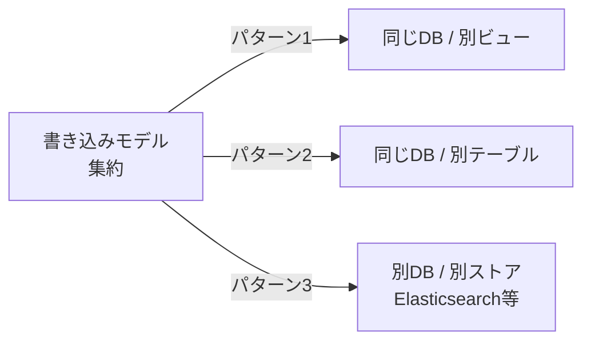
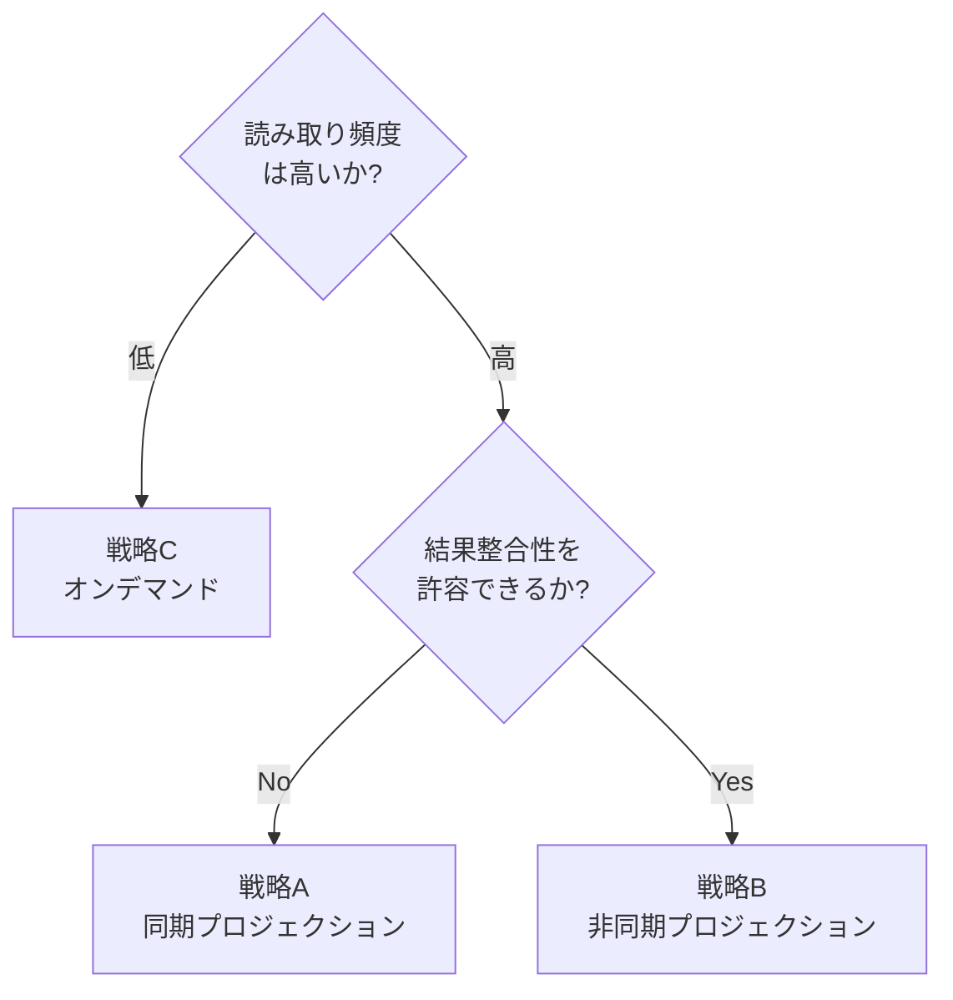
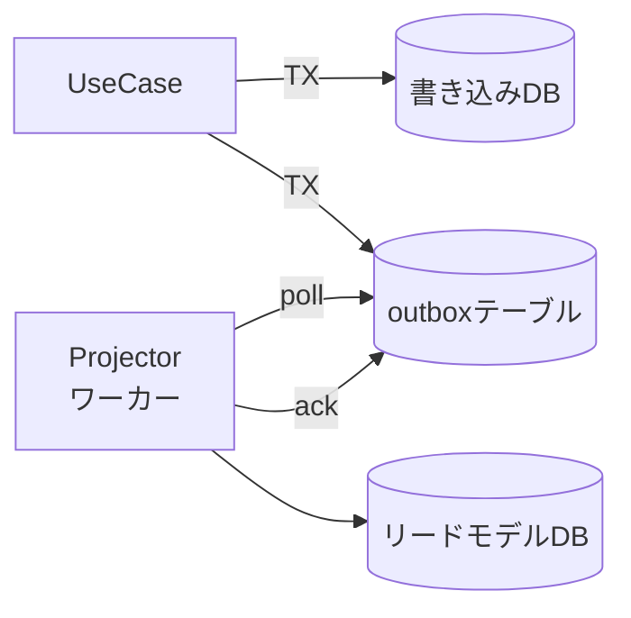

## はじめに

CQRSをDDDに導入したあと、私が一番悩んだのはコマンド側ではなく**読み取り側**でした。「QueryServiceでDTOを返せばよい」までは整理できても、その先にある「リードモデルをどこにどう作るか」「書き込みと読み取りのズレをどう吸収するか」で手が止まりました。

本記事で答えるのは次の3つです。

1. **読み取り側のデータ表現（リードモデル）を、書き込みモデルからどう分離するか**
2. **リードモデルを最新に保つプロジェクション戦略を、どの順で検討すべきか**
3. **結果整合性のレイテンシを、UX側でどう吸収するか**

「読み方」「設計判断の選び方」を扱う記事であり、CQRSの基礎解説や個別実装の網羅ではありません。

:::message

**前提知識と読む順**

本記事はDDD×CQRSシリーズの3作目です。下記2本を先に読むと前提が揃います。

1. [DDDにCQRSを導入する前に知っておきたいこと](https://zenn.dev/135yshr/articles/9e3ec9a7d52c98) — CQRSの基礎、Repository / QueryServiceの使い分け
2. [DDD×CQRSの認可設計](https://zenn.dev/135yshr/articles/60d7d006c0f38f) — コマンドとクエリで異なる認可箇所
3. 本記事（リードモデルとプロジェクションの設計）

:::

:::message

**本記事で使う用語**

- **リードモデル**: 画面・APIレスポンス向けに非正規化された、読み取り専用のデータ表現です
- **プロジェクション**: 書き込みモデルやドメインイベントから、リードモデルを生成・更新する処理です
- **QueryService**: アプリケーション層に置く、リードモデルから DTO を返すインターフェースです
- **Outbox**: 書き込みDBの中に「これから別プロセスに渡したいイベント」を一旦置くテーブルです
- **集約 / ドメインイベント**: それぞれ書き込み側の整合性単位、書き込みで発生する出来事を表す不変オブジェクトです

:::

:::message

**コード例の前提**

レイヤー構成はシリーズ前作と同じです。

- `domain/model/` — 集約・ドメインイベント
- `domain/event/` — ドメインイベントの型定義
- `usecase/` — アプリケーション層（CommandとQueryの両方）
- `infrastructure/postgres/` — Repository・QueryServiceの実装
- `infrastructure/projection/` — プロジェクション処理

コード例の `order.Repository` `TxRunner` `OutboxWriter` などはシリーズ前作で導入した型です。本記事では再定義しません。コード例はセクションごとに分割していますが、同一ファイルのコードは結合してご利用ください。

:::

:::message alert

**本記事の経験談について**

本文中の「経験則」「判断基準」は、私が関わったプロジェクトを母集団とした主観です。母集団は注文・予約系を中心に4〜5件、チーム規模10名以下、トランザクション量はピーク数十req/sec程度です。金融・大規模分散など領域が大きく異なる場合は、そのまま当てはまらないことがあります。

:::

---

## リードモデルとは何か

CQRSにおける**リードモデル（Read Model）**は、「画面やAPIレスポンスの形にあわせて非正規化された、読み取り専用のデータ表現」です。書き込みモデル（集約）とは独立しており、JOIN・集計・キャッシュ・全文検索インデックスなど、読み取りに都合のよい形を自由に選べます。

Greg Youngは、読み取り側はドメインモデルを経由しなくてよいと述べています。

> The Read Side ... is a thin layer over the database. (CQRS Documents, "The Read Side" 節)
>
> — Greg Young, [CQRS Documents](https://cqrs.files.wordpress.com/2010/11/cqrs_documents.pdf)

私は最初、リードモデルを「集約をDTOに変換しただけのもの」と考えていました。しかしそれは**RepositoryからDTOへの詰め替え**にすぎず、CQRSのうまみはほぼ得られません。リードモデルは次の3つの条件を満たして初めて意味を持ちます（**表1**）。

**表1: リードモデルの3条件**

| 条件                              | 説明                                         |
| --------------------------------- | -------------------------------------------- |
| 書き込みモデルから独立している    | 集約の構造が変わってもリードモデルが壊れない |
| 画面・API単位で非正規化されている | 1回のクエリで必要なデータが揃う              |
| ドメインルールを持たない          | 検証・状態遷移・ビジネス計算は行わない       |

つまり「リードモデルは別物として作る」ことに意味があり、書き込みモデルの構造をそのまま映したリードモデルは、ただの薄いDTOです。

### リードモデルの配置先（私の整理）

リードモデルをどこに置くかは、システムによって違います。本記事では次の3つを便宜的に **配置パターン1 / 2 / 3** と呼んで進めます（業界用語ではなく、本記事内のラベルです）。



**図1: リードモデルの配置パターン**

- **パターン1**: 書き込みテーブルに対してビュー（VIEW / Materialized View）を作る
- **パターン2**: 同じDB内に専用のリードテーブルを持ち、プロジェクションで更新する
- **パターン3**: 別のデータストア（検索エンジン、KVS、ドキュメントDB）にプロジェクションする

配置が書き込みモデルから離れるほど読み取り性能と柔軟性は上がりますが、整合性の維持コストも上がります。次節で扱うプロジェクション戦略は、この「配置」と「整合性」の組み合わせの選択そのものです。

---

## プロジェクションの3つの戦略

リードモデルを最新に保つ仕組みを**プロジェクション**と呼びます。プロジェクションには大きく3つの戦略があります（**表2**）。

**表2: プロジェクション戦略の比較**

| 戦略 | 整合性モデル | 運用コンポーネント数 | 再構築の容易さ | 初期フェーズ向き | 主な実装 |
| --- | --- | --- | --- | --- | --- |
| A. 同期プロジェクション | トランザクション整合性 | 1（書き込みDBのみ） | 中（バッチ再計算） | ◯ | 同一トランザクション内で更新 |
| B. 非同期プロジェクション | 結果整合性 | 3以上（書き込みDB + outbox + Projector） | 高（イベント再生で再構築） | △ | イベント駆動 + Outboxパターン |
| C. オンデマンドプロジェクション | 読み取り時のクエリで確定 | 1（書き込みDBのみ） | 高（VIEW定義の変更） | ◎ | DBビュー / Materialized View |

評価指標の定義は次の通りです。重要度は読者の文脈で変わるため、定性的な比較に絞っています。

- **整合性モデル**: 書き込み完了と読み取り完了の関係を、SQL/CQRSの語彙で表現します
  - 「トランザクション整合性」: 同一トランザクションのコミット直後に最新値が読めます（ACID範囲内）
  - 「結果整合性」: 書き込み後に時間差で反映されます
  - 「読み取り時のクエリで確定」: リード時に毎回SQLで集計するため、トランザクション分離レベル（多くの場合 READ COMMITTED）で読める範囲が決まります
- **運用コンポーネント数**: 書き込み・読み取りパスに登場する独立した実行プロセスの数です（少ないほど運用が簡単）
- **再構築の容易さ**: スキーマ変更時に、既存データから新しいリードモデルを作り直せるかです
- **初期フェーズ向き**: プロジェクト立ち上げ時に「迷ったら採用」する候補としての推しやすさです

選び方の基本方針は「整合性要件 × 読み取り負荷」で、加えて「初期フェーズ向き」軸も意識します。



**図2: 戦略選択のフロー**

「迷ったら戦略C → A → Bの順に検討する」のが私の経験則です。Bは強力ですが、Outboxやワーカー、再構築機構など運用の道具立てが多く、必要になるまで導入を遅らせるのが安全だと感じています。

---

## 戦略A: 同期プロジェクション

書き込みと同じトランザクションで、読み取りテーブルも更新する戦略です。書き込みが完了した瞬間にリードモデルは最新化されており、結果整合性の問題は発生しません。

### 実装例

注文を確定したら、一覧画面のためのリードテーブル `order_list_view` も同じトランザクションで更新します。

```go
// usecase/place_order.go

type PlaceOrderUseCase struct {
    txRunner      TxRunner
    orderRepo     order.Repository
    orderListView OrderListViewWriter // ← リードモデルの更新口
}

type OrderListViewWriter interface {
    Upsert(ctx context.Context, row OrderListRow) error
}

type OrderListRow struct {
    OrderID      string
    CustomerName string
    TotalAmount  int64
    Status       string
    PlacedAt     time.Time
}

func (uc *PlaceOrderUseCase) Execute(ctx context.Context, in PlaceOrderInput) error {
    return uc.txRunner.Run(ctx, func(ctx context.Context) error {
        o, err := order.Place(in.CustomerID, in.Items)
        if err != nil {
            return err
        }
        if err := uc.orderRepo.Save(ctx, o); err != nil {
            return err
        }
        // リードモデルに詰める値はすべて集約から取り出して、
        // 「集約に保存した内容」と「画面に出る内容」のズレを防ぎます。
        return uc.orderListView.Upsert(ctx, OrderListRow{
            OrderID:      o.ID().String(),
            CustomerName: o.CustomerSnapshotName(), // 集約が保持する顧客名スナップショット
            TotalAmount:  o.TotalAmount(),
            Status:       o.Status().String(),
            PlacedAt:     o.PlacedAt(),
        })
    })
}
```

集約は `order.Place` の時点で顧客名のスナップショットを内部に保持しており、`CustomerSnapshotName()` で取り出します。**リードモデルに詰める値は、入力（`in`）と集約（`o`）が混在しないよう、できる限り集約に寄せる**のがおすすめです。混ぜると「保存した内容」と「画面に出る内容」がずれる事故の温床になります。

### 戦略Aを採用する判断基準

- 書き込みと読み取りが**同一データベース**で完結する
- 「書いた直後に読んだら最新が見えてほしい」という要件が強い（read-your-writes）
- プロジェクションが軽く、書き込みのレイテンシに乗せても問題ない

### 落とし穴

私がハマったのは、**リードモデルの更新失敗で書き込みごとロールバックする**ケースです。具体的には次の状況でした。

- 顧客マスタの整備直後、顧客名を持たない既存レコードが本番に残っていた
- リードモデル `order_list_view` で `customer_name` を NOT NULL にしていた
- 既存顧客に対する注文確定リクエストが、リードモデルの NOT NULL 違反でトランザクションごと失敗

ドメインの整合性とは無関係な理由で業務処理（注文確定）が止まりました。集約側は注文を作れる状態なのに、リードモデルの都合で書き込み自体が落ちる構図です。

対策として、リードモデル側のスキーマは**できるだけ緩く**しておきます。NOT NULL や UNIQUE は最低限に絞り、補助的なインデックスは後から張る、というスタンスです。

:::message

戦略Aを採用していても、リードモデルは「画面のためのテーブル」と割り切ります。書き込みモデルと同じ正規化レベルを目指す必要はありません。リードモデルに制約を増やすほど、書き込みの失敗経路が増えます。

:::

---

## 戦略B: 非同期プロジェクション

書き込みは集約と「これから何が起きたか」を表すイベントだけを保存し、別プロセス（プロジェクター）がそのイベントを購読してリードモデルを更新する戦略です。

### Outboxパターンを使う理由

「ドメインイベントが発生したらメッセージブローカーに送る」を素朴に書くと、**書き込みDBへの保存とブローカーへの発行が二相になってしまい、片方だけ成功するケース**が起きます。これを避けるためにOutboxパターンを使います。

> The fundamental problem with publishing events from a database is the need to update the database and publish a message atomically. The outbox pattern solves this by storing events as part of the same database transaction as the entity change.
>
> — Chris Richardson, [Pattern: Transactional outbox](https://microservices.io/patterns/data/transactional-outbox.html)

仕組みはシンプルです。



ポイントは「集約とoutboxを同じトランザクションで書き、別プロセスが outbox を読み出してリードモデルを更新する」点です。これで書き込みDBの整合性（書き込みとイベント記録のアトミック性）は守られます。リードモデル更新側は**at-least-onceセマンティクスに緩和される**形です。exactly-onceは諦め、その代わり整合性とリトライ可能性を取る、というトレードオフになります。

### イベントの保存

ドメインイベントは集約から取り出し、outboxテーブルに直列化して保存します。

```go
// usecase/place_order.go (戦略B)

func (uc *PlaceOrderUseCase) Execute(ctx context.Context, in PlaceOrderInput) error {
    return uc.txRunner.Run(ctx, func(ctx context.Context) error {
        o, err := order.Place(in.CustomerID, in.Items)
        if err != nil {
            return err
        }
        if err := uc.orderRepo.Save(ctx, o); err != nil {
            return err
        }
        return uc.outbox.Append(ctx, o.PullEvents())
    })
}
```

`PullEvents()` は集約が貯めたドメインイベントを取り出して内部バッファをクリアします。`outbox.Append` は次のようなテーブルにシリアライズしたイベントを INSERT します。

```sql
CREATE TABLE outbox (
    id           BIGSERIAL PRIMARY KEY,
    aggregate_id TEXT      NOT NULL,
    event_type   TEXT      NOT NULL,
    payload      JSONB     NOT NULL,
    occurred_at  TIMESTAMPTZ NOT NULL,
    processed_at TIMESTAMPTZ
);
CREATE INDEX outbox_unprocessed_idx ON outbox(id) WHERE processed_at IS NULL;
```

### プロジェクターの実装

ワーカー側は outbox を順に読み、対応する Projector にディスパッチします。

```go
// infrastructure/projection/runner.go

type Projector interface {
    EventType() string
    Project(ctx context.Context, payload []byte) error
}

type Runner struct {
    outbox     OutboxReader
    projectors map[string]Projector
}

func (r *Runner) Tick(ctx context.Context) error {
    events, err := r.outbox.FetchUnprocessed(ctx, 100)
    if err != nil {
        return err
    }
    for _, e := range events {
        p, ok := r.projectors[e.EventType]
        if !ok {
            continue // 未登録のイベントは無視（あとから増やせる）
        }
        if err := p.Project(ctx, e.Payload); err != nil {
            return err // リトライは次の tick で
        }
        if err := r.outbox.MarkProcessed(ctx, e.ID); err != nil {
            return err
        }
    }
    return nil
}
```

イベント間の順序保証が必要なら、`aggregate_id` 単位でシリアライズします（同じ集約のイベントは順序通りに処理します）。グローバル順序が必要かどうかは業務によります。金融の取引履歴や監査ログのように「全体で時系列を保証したい」要件があれば別途設計が必要です。私が扱ってきた範囲（注文・予約系）では集約単位の順序で足りるケースがほとんどでした。

### Projector の中身

OrderListView を更新する Projector の例です。

```go
// infrastructure/projection/order_list_projector.go

type OrderListProjector struct {
    view OrderListViewWriter
}

func (p *OrderListProjector) EventType() string { return "OrderPlaced" }

func (p *OrderListProjector) Project(ctx context.Context, payload []byte) error {
    var ev event.OrderPlaced
    if err := json.Unmarshal(payload, &ev); err != nil {
        return err
    }
    return p.view.Upsert(ctx, OrderListRow{
        OrderID:      ev.OrderID,
        CustomerName: ev.CustomerName,
        TotalAmount:  ev.TotalAmount,
        Status:       "placed",
        PlacedAt:     ev.OccurredAt,
    })
}
```

Projector は**冪等**に書く必要があります。at-least-onceで配信される以上、重複処理は前提です。

`Upsert` は「同じイベントが2回流れても同じ結果になる」ことを保証する一手段ですが、Upsertだけでは不十分なケースがある点に注意してください。たとえば次のような場合です。

- **状態遷移系イベントが順不同で届く**: `OrderPlaced` → `OrderShipped` → `OrderDelivered` のような遷移列を考えます。後続イベントが先着したあとに前のイベントが処理されると、単純な Upsert ではステータスが巻き戻ります
- **計算系イベントの二重適用**: ポイント加算のような累積処理では Upsert そのものが使えず、`processed_at` または `event_id` をリードテーブル側に持って二重適用を弾く必要があります

対策は2つで、本記事では順序保証側（前述の `aggregate_id` 単位シリアライズ）を採用しています。さらに堅くしたい場合は、リードテーブルに `last_event_id` を持たせて「処理済みIDより小さいイベントは無視する」ガードを追加します。

つまり「**Upsertは冪等性の十分条件ではなく、Upsert + 順序保証 or イベントIDのガード**」で初めて安全になります。

### 再構築可能性

戦略Bの強みは「イベントを残しておけば、リードモデルをいつでも作り直せる」点です。リードモデルのスキーマを変更したいときも、新しいスキーマで全イベントを再生すれば移行できます。**Read Model is a cache** という言い方は Greg Young が CQRS Documents の "The Read Side" 節で示しています。リードモデルをキャッシュとして扱えることが、この戦略のうまみです。

イベントソーシングそのものを採用するかどうかは別の判断ですが、Outboxまで来た時点で「書き込みパスからイベントが流れる」状態になっています。詳しくは「[イベントソーシングをGoで実装したら「applyの意味」を完全に誤解していた](https://zenn.dev/135yshr/articles/5ffc0f6a7251e4)」をご覧ください。

---

## 戦略C: オンデマンドプロジェクション

書き込みテーブルから直接、読み取り時にビューを計算する戦略です。専用のリードテーブルは持たず、SQLのビュー（VIEW）や Materialized View で代用します。

```sql
CREATE VIEW order_list_view AS
SELECT
    o.id            AS order_id,
    c.name          AS customer_name,
    o.total_amount  AS total_amount,
    o.status        AS status,
    o.placed_at     AS placed_at
FROM orders o
JOIN customers c ON c.id = o.customer_id;
```

QueryService側はこのビューを SELECT するだけです。

```go
// infrastructure/postgres/order_query_service.go

func (s *OrderQueryService) FindAll(ctx context.Context) ([]OrderListDTO, error) {
    rows, err := s.db.QueryContext(ctx, `
        SELECT order_id, customer_name, total_amount, status, placed_at
        FROM   order_list_view
        ORDER  BY placed_at DESC
    `)
    // ... rows を DTO に詰める
}
```

### 戦略Cを採用する判断基準

- リードモデルが書き込みモデルの**簡単な射影で済む**（重い集計が必要ない）
- 読み取り頻度がそれほど高くなく、JOINのコストが許容範囲
- 専用テーブルを作る運用コストを払いたくない初期フェーズ

Materialized Viewにすればキャッシュも効きますが、リフレッシュのタイミングを自分で管理する必要が出てくるため、戦略Bに近い運用コストがかかります。「Materialized View が欲しくなったら戦略Bを真面目に検討する」のが私の判断基準です。

---

## 結果整合性をUXでどう吸収するか

戦略Bを採用すると必ず付いてくるのが**結果整合性**です。注文を確定した直後に注文一覧を開いても、まだリードモデルに反映されていない、という現象が起きます。

この問題は「技術で完全に消す」のではなく、**UXで吸収する**のが現実的です。よく使われる手を整理します。

### 手1: クライアント側のオプティミスティック更新

書き込みリクエストが成功した時点で、クライアントは自分のメモリ上のリストに新しいエントリを追加します。サーバーからのフェッチを待ちません。

```text
ユーザー操作 → POST /orders（成功）→ ローカルストアに即時追加
                                  → リードモデルへの反映は非同期
                                  → 次回のフェッチで「サーバー版」に置き換わる
```

実装コストは増えますが、ユーザー体験としては「即時反映されている」ように見えます。SPA や React Query 系のフレームワークと相性がよいパターンです。

### 手2: バージョン番号でスタール検知

リードモデルにバージョン番号を持たせ、書き込みレスポンスに「この値以上が見えるはず」という期待バージョンを返します。クライアントは次回読み取り時に期待バージョン未満の応答を**スタール**として扱い、リトライします。

バージョン番号は、集約ごとの単調増加IDが扱いやすいです。Outbox の `id` 列（BIGSERIAL）をそのままリードテーブルの `version` に転記するのが一番簡単です。Projector が自然に「最後に処理した outbox.id」をバージョンとして書き込めます。

```sql
CREATE TABLE order_list_view (
    order_id      TEXT PRIMARY KEY,
    customer_name TEXT,
    total_amount  BIGINT,
    status        TEXT,
    placed_at     TIMESTAMPTZ,
    version       BIGINT NOT NULL  -- ← outbox.id を転記
);
```

書き込みレスポンスと読み取りリクエストはこんなイメージです。

```go
// 書き込みレスポンス: outboxにINSERTした最新IDを返す
type PlaceOrderResponse struct {
    OrderID         string `json:"order_id"`
    ExpectedVersion int64  `json:"expected_version"` // ← この値以上が見えるはず
}

// 読み取りリクエスト
// GET /orders?since_version=42

// QueryService側: 集約単位の最大バージョンが since_version 未満なら 202
func (s *OrderQueryService) FindAll(ctx context.Context, sinceVersion int64) (Result, error) {
    var maxVersion int64
    _ = s.db.QueryRowContext(ctx,
        `SELECT COALESCE(MAX(version), 0) FROM order_list_view`,
    ).Scan(&maxVersion)
    if maxVersion < sinceVersion {
        return Result{Stale: true}, nil
    }
    // ... 通常の取得
}
```

ETagを使う場合は、`ExpectedVersion` をそのまま `ETag` ヘッダに載せ、クライアントが `If-None-Match` で送り返す形になります。仕組みはバージョン番号と同じで、HTTPヘッダに乗せるかボディに乗せるかの違いです。本記事ではバージョン番号ベースで例示しています。

クライアントのリトライ間隔は、システムの平均反映遅延に合わせて決めます。私が運用していた範囲では outbox→Projector のラグは中央値で 200ms 前後、95パーセンタイルで 1〜2 秒でした。**まず計測してから決める**のが基本で、固定値の例示は鵜呑みにしないでください。

### 手3: 同期プロジェクションのハイブリッド

「全部を同期プロジェクションするのは重いが、自分自身の最新変更だけは即時に見たい」というケースは、**該当ユーザー向けのリードモデルだけ同期更新**して、それ以外は非同期にするハイブリッドが有効です。

```go
func (uc *PlaceOrderUseCase) Execute(ctx context.Context, in PlaceOrderInput) error {
    // 注意: TxRunner.Run のクロージャ内では同一トランザクションが ctx に紐づきます。
    // orderRepo.Save / outbox.Append / myOrdersView.Upsert はすべてこの ctx を受け取り、
    // 同じトランザクションでコミットされる前提です。
    // ネストした txRunner.Run を内側で呼び出すとサブトランザクションになるか
    // 既存トランザクションを引き継ぐかは実装に依存するので、本記事ではネストしません。
    return uc.txRunner.Run(ctx, func(ctx context.Context) error {
        o, err := order.Place(in.CustomerID, in.Items)
        if err != nil {
            return err
        }
        if err := uc.orderRepo.Save(ctx, o); err != nil {
            return err
        }
        if err := uc.outbox.Append(ctx, o.PullEvents()); err != nil {
            return err
        }
        // 自分の注文一覧だけは同期で更新する
        return uc.myOrdersView.Upsert(ctx, toMyOrderRow(o))
    })
}
```

これで「自分のページに戻ったら必ず自分の注文は見える」というUXを保ちながら、組織全体に見える集計ビューは結果整合性に任せられます。

---

## リードモデル設計の指針

3つの戦略のどれを採用するにしても、リードモデル自体の作り方には共通の指針があります。

### 画面・APIごとに用意する

リードモデルは画面・API単位で個別に持ちます。本記事ではこの方針を便宜的に「**View per Use Case**」と呼びます。Greg Young の CQRS 解説でしばしば登場する **Read Model per View** や **Screen-driven design** の発想を、本記事用に言い換えたものです。

「注文の一覧画面用」「注文の詳細画面用」「ダッシュボード用」をそれぞれ別のテーブルやビューにします。汎用テーブルを作って画面ごとに JOIN すると、CQRSのうまみが消えます。

```text
❌ 共通の orders_with_customer テーブルを画面ごとにJOINで加工
✅ order_list_view / order_detail_view / sales_dashboard_view を画面別に持つ
```

データの重複は許容します。リードモデルは**書き込みモデルの結果系**であって、いつでも再構築できるからです。

### 非正規化を恐れない

JOINを避けるために、リードモデルでは積極的に値を埋め込みます。`customer_name` を `orders` 側にも持つ、`total_amount` を計算済みで持つ、といった具合です。

書き込み側で「正規化されていないとデータが壊れる」と感じるのは、**書き込みモデルがリードモデルを兼ねている**ためです。CQRSではここを分離することで、書き込みモデルは正規化したまま、リードモデルだけ非正規化できます。

### インデックスを前提に設計する

リードモデルは「どう検索されるか」が先に決まっていることが多いです。スキーマと一緒にインデックスも設計します。検索条件 → インデックス → クエリプランがそのまま回答になるよう作ります。

---

## アンチパターン

4つ挙げます。経験度合いがそれぞれ違うので、各項目の頭に **【経験】** （自分で踏んだ）、**【観察】** （チームメンバーや別プロジェクトで見た）を付けます。

### アンチパターン1【経験】: リードモデルに「業務判断」を入れる

リードモデル側に書くと「ビジネスルールが2箇所に分散する」例を考えてみます。`placed` ステータスかつ `total_amount >= 10000` なら **業務上の優先処理対象** として priority フラグを立てる、という計算です。これをリードモデル更新時に書くと、書き込みモデルと両方でルールを持つことになります。

ここで線引きが大切です。リードモデル側に置いてよいのは**純粋な表示ロジック**だけです（UI都合のラベル付け、ソート用キーの算出、色分け用のカテゴリ判定など）。一方、**業務判断**は書き込みモデル側で確定させ、結果をイベントに乗せます。請求対象、優先処理キューの対象、SLAの変化など、後続処理に影響する判断はすべてこちらに含まれます。

私が踏んだケースは、UIの「優先」バッジを表示するためにリードモデル側で `priority` を計算していた、という構図でした。いつのまにかその priority を別のバッチジョブが業務判断に流用しており、表示ロジックのつもりが業務ロジックに昇格していたのです。境界が崩れた瞬間にこのアンチパターンは発動します。

### アンチパターン2【観察】: リードモデルをドメインモデルにする

リードモデルを生のまま UseCase や Domain Service に渡し、そこから判断を生やすパターンです。リードモデルは表示用の射影なので、不変条件やバージョンを持ちません。**ビジネス判断は集約から**、というルールを守ります。

### アンチパターン3【観察】: リードモデルのために集約を分割する

「この画面の表示が遅いから集約を分けたい」と言い出すと、書き込みモデルがリードモデルに引きずられて壊れます。表示の都合は**リードモデル側で吸収**します。集約境界はあくまでビジネス不変条件で決めます。

### アンチパターン4【経験】: プロジェクションでうっかりN+1する

「最初のうちは小さくしておこう」と最小限のIDだけイベントに載せて始めると、Projector がリードモデルを組み立てる段階で**関連データを取得する実装になりがち**です。書き込み件数だけクエリが飛び、後から気付いて直すのは大仕事になります。

戦略B採用時の原則は「**必要なデータはイベントに乗せて運ぶ**」です。`OrderPlaced` イベントには `customer_name` まで含める、と割り切ります。実装としては先述の戦略Bのコードと同じ形ですが、ここでは「うっかり下のように書いてしまう罠」を明示しておきます。

```go
// ❌ Projector内で関連データを取得（典型的なやらかし）
func (p *OrderListProjector) Project(ctx context.Context, payload []byte) error {
    var ev event.OrderPlaced
    _ = json.Unmarshal(payload, &ev)
    customer, _ := p.customerRepo.FindByID(ctx, ev.CustomerID) // ← N+1の温床
    // ...
}

// ✅ イベントに必要な情報を含めて運ぶ
type OrderPlaced struct {
    OrderID      string
    CustomerID   string
    CustomerName string // ← 書き込み時点でスナップショットを取る
    TotalAmount  int64
    OccurredAt   time.Time
}
```

イベントは「その瞬間のスナップショット」を運びます。あとから関連データを引きにいくのは、結果整合性のレイテンシをさらに広げる原因にもなります。「イベントは初手で大きめに作る」と覚えておくと、後で削るのは簡単なので楽です。

---

## まとめ

CQRSのリードモデル設計を、戦略の選び方と実装のポイントから整理しました。

- リードモデルは**書き込みモデルとは別物**として設計します。詰め替えだけでは意味がありません
- プロジェクション戦略は**A: 同期 / B: 非同期（Outbox） / C: オンデマンド**の3つです。整合性モデル・運用コンポーネント数・初期フェーズ向きの3軸で選びます（表2）
- 迷ったら**C → A → B**の順で検討します。Bは強力ですが運用コンポーネントが増えます
- 結果整合性は技術で消すのではなく、**UXで吸収**します（オプティミスティック更新、バージョン番号、ハイブリッド）
- リードモデルは**画面・API単位で非正規化**し、業務判断は持たせません（表示ロジックは可）

「最初から戦略Bで設計しない」は、表2の「初期フェーズ向き」軸そのままの結論です。整合性と読み取り負荷の評価で戦略Bが第一候補に挙がる場合でも、運用コンポーネントの増加を後回しにできるなら C → A の順で段階導入したほうが落ち着きます。私自身、戦略Cから始めて、画面が増えてきたタイミングで戦略Aに移し、最終的に一部だけ戦略Bという形になりました。

なお Martin Fowler の[CQRS](https://martinfowler.com/bliki/CQRS.html) では「多くのシステムにとってCQRSは不必要なリスクと複雑性を加える」と明確に警告されています。本記事の戦略選択フロー（図2）が「結果整合性を許容できるか」を必ず通る作りなのも、同じ立場を取っているからです。

シリーズとしては「コマンド側」「認可」「リードモデル」で書きたい主要トピックは一巡しました。続編候補は「**リードモデルの再構築運用**」（イベント再生によるリビルド、ダウンタイム最小化）です。現時点で着手予定は未確定で、システム規模次第のテーマなので需要が見えたら切り出します。

## 参考文献

- Greg Young, [CQRS Documents](https://cqrs.files.wordpress.com/2010/11/cqrs_documents.pdf) — 本記事のリードモデルの定義、および「Read Model is a cache」の整理は本書 "The Read Side" 節に依拠します。ページ番号は版差があるため節名で参照しています
- Martin Fowler, [CQRS](https://martinfowler.com/bliki/CQRS.html) — 戦略選択フロー（図2）の「結果整合性を許容できるか」の問いの根拠
- Chris Richardson, [Pattern: Transactional outbox](https://microservices.io/patterns/data/transactional-outbox.html) — 戦略Bの Outbox パターンの仕様
- Vaughn Vernon — _Implementing Domain-Driven Design_ Chapter 4 "Architecture" の CQRS 節。クエリ側がドメインを経由しない構造の妥当性
