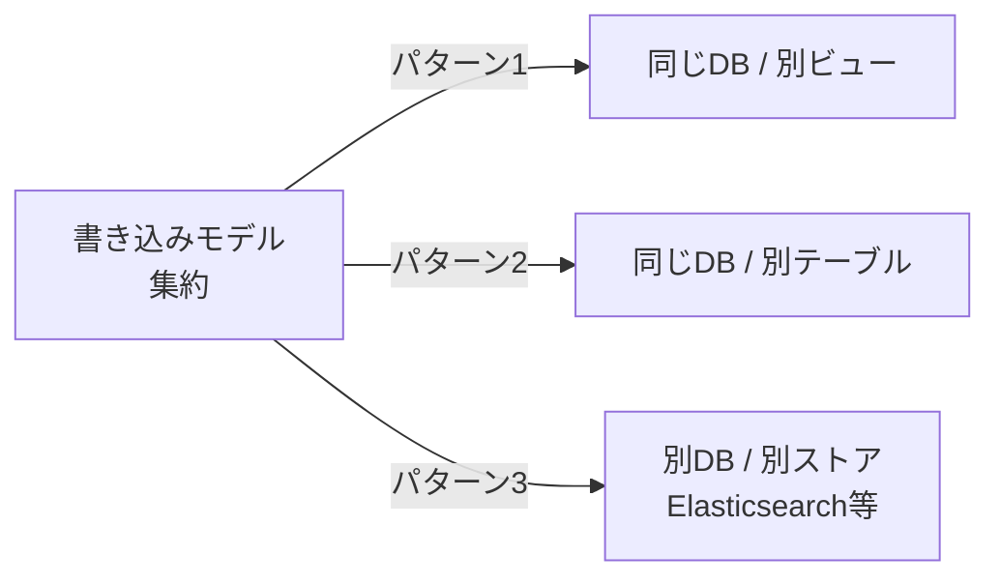
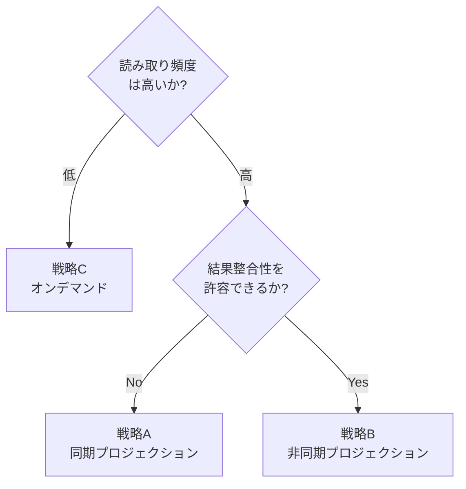
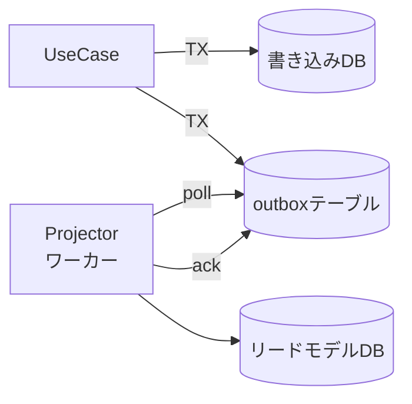

## はじめに

CQRSをDDDに導入したあと、私が一番悩んだのはコマンド側ではなく**読み取り側**でした。「QueryServiceでDTOを返せばよい」までは整理できても、その先にある「リードモデルをどこにどう作るか」「書き込みと読み取りのズレをどう吸収するか」で手が止まりました。

本記事で答えるのは次の3つです。

1. **読み取り側のデータ表現（リードモデル）を、書き込みモデルからどう分離するか**
2. **リードモデルを最新に保つプロジェクション戦略を、どの順で検討すべきか**
3. **結果整合性のレイテンシを、UX側でどう吸収するか**

「読み方」「設計判断の選び方」を扱う記事であり、CQRSの基礎解説や個別実装の網羅ではありません。

:::message

**前提知識と読む順**

本記事はDDD×CQRSシリーズの3作目です。下記2本を先に読むと前提が揃います。

1. [DDDにCQRSを導入する前に知っておきたいこと](https://zenn.dev/135yshr/articles/9e3ec9a7d52c98) — CQRSの基礎、Repository / QueryServiceの使い分け
2. [DDD×CQRSの認可設計](https://zenn.dev/135yshr/articles/60d7d006c0f38f) — コマンドとクエリで異なる認可箇所
3. 本記事（リードモデルとプロジェクションの設計）

:::

:::message

**本記事で使う用語**

- **リードモデル**: 読み取りユースケースに合わせて設計された、読み取り専用のデータ表現です（非正規化されることが多いものの、必須ではありません）
- **プロジェクション**: 書き込みモデルやドメインイベントから、リードモデルを生成・更新する処理です
- **QueryService**: アプリケーション層に置く、リードモデルから DTO を返すインターフェースです
- **Outbox**: 書き込みDBの中に「これから別プロセスに渡したいイベント」を一旦置くテーブルです
- **集約 / ドメインイベント**: それぞれ書き込み側の整合性単位、書き込みで発生する出来事を表す不変オブジェクトです

:::

:::message

**コード例の前提**

レイヤー構成はシリーズ前作と同じです。

- `domain/model/` — 集約・ドメインイベント
- `domain/event/` — ドメインイベントの型定義
- `usecase/` — アプリケーション層（CommandとQueryの両方）
- `infrastructure/postgres/` — Repository・QueryServiceの実装
- `infrastructure/projection/` — プロジェクション処理

コード例の `order.Repository` `TxRunner` `OutboxWriter` などはシリーズ前作で導入した型です。本記事では再定義しません。本記事内では特に `TxRunner.Run` のクロージャ内で受け取る `ctx` に同一トランザクションが紐づく前提を置きます（前作の[認可設計記事](https://zenn.dev/135yshr/articles/60d7d006c0f38f)と同じ実装方針）。コード例はセクションごとに分割していますが、同一ファイルのコードは結合してご利用ください。

:::

:::message alert

**本記事の経験談について**

本文中の「経験則」「判断基準」は、私が関わったプロジェクトを母集団とした主観です。母集団は注文・予約系を中心に4〜5件、チーム規模10名以下、トランザクション量はピーク数十req/sec程度です。金融・大規模分散など領域が大きく異なる場合は、そのまま当てはまらないことがあります。

:::

---

## リードモデルとは何か

CQRSにおける **リードモデル（Read Model）** は、「読み取りユースケースに合わせて設計されたデータ表現」です。実装としては DTO、SQL の VIEW、専用テーブル、検索インデックスなどがあり、性能や UX 要件に応じて非正規化されることが多い、という関係です。書き込みモデル（集約）とは独立しており、JOIN・集計・キャッシュ・全文検索インデックスなど、読み取りに都合のよい形を自由に選べます。

CQRSの読み取り側がドメインモデルを必ずしも経由する必要はない、という発想は[Greg Young の CQRS Documents](https://cqrs.files.wordpress.com/2010/11/cqrs_documents.pdf)で示されている考え方です。ここで「経由しなくてよい」のは、**状態遷移を成立させるための不変条件チェックや、副作用を伴う業務判断**です。一方で、認可・テナント分離・表示可否の判定・マスキング・公開状態によるフィルタリングなど、**読み取り固有のルール**は Query 側にも必要です（認可については[シリーズ第2作](https://zenn.dev/135yshr/articles/60d7d006c0f38f)で扱っています）。本記事もこの立場を前提とします。

私は最初、リードモデルを「集約をDTOに変換しただけのもの」と考えていました。しかしそれは**RepositoryからDTOへの詰め替え**にすぎず、CQRSのうまみはほぼ得られません。リードモデルは次の3つの方針を意識して初めて意味を持ちます（**表1**）。これらは必須要件というよりは、「リードモデルを別物として設計する」ことが効くケースの典型像です。

**表1: リードモデル設計の方針**

| 方針 | 説明 |
| --- | --- |
| 書き込みモデルから独立している | 集約の構造が変わってもリードモデルが壊れない |
| 画面・API単位で形を最適化する | 1回のクエリで必要なデータが揃う（非正規化や集計の事前計算を含む） |
| 状態遷移・不変条件は持たない | 業務判断や副作用を伴うロジックは書き込み側に寄せる |

つまり「リードモデルは別物として作る」ことに意味があり、書き込みモデルの構造をそのまま映したリードモデルは、ただの薄いDTOです。

なお3つ目の「状態遷移・不変条件は持たない」が指すのは、後続業務に影響する判断のことです。表示ラベルの生成やソート用キーの算出といった**純粋な表示ロジック**はリードモデル側に置いても問題ありません。詳しくはアンチパターン1で線引きします。

### リードモデルの配置先（私の整理）

リードモデルをどこに置くかは、システムによって違います。本記事では次の3つを便宜的に **配置パターン1 / 2 / 3** と呼んで進めます（業界用語ではなく、本記事内のラベルです）。



**図1: リードモデルの配置パターン**

- **パターン1**: 書き込みテーブルに対してビュー（VIEW / Materialized View）を作る
- **パターン2**: 同じDB内に専用のリードテーブルを持ち、プロジェクションで更新する
- **パターン3**: 別のデータストア（検索エンジン、KVS、ドキュメントDB）にプロジェクションする

配置が書き込みモデルから離れるほど、読み取り用途に最適化しやすくなります。一方で、実際の性能はクエリ特性・インデックス設計・同期方式に依存し、必ずしも別ストア化が速いとは限りません。整合性の維持コストと運用コストは上がります。

次節で扱う**プロジェクション戦略**は「配置パターンに対してどの更新方式を採るか」の話で、両者は次のように対応します。

| 配置パターン | 取りうる更新戦略 |
| --- | --- |
| パターン1（同一DB / ビュー） | 戦略C（オンデマンド）が自然 |
| パターン2（同一DB / 別テーブル） | 戦略A（同期）または戦略B（非同期） |
| パターン3（別DB / 別ストア） | 戦略B（非同期）が第一候補。同期的に二重書き込みすることも技術的には可能ですが、書き込みDBとリードDBの原子的な一貫性まで保証しようとすると2フェーズコミットなどの分散トランザクションが必要になります |

つまり「どこに置くか」を決めると「どう更新するか」の選択肢が絞り込まれます。次節以降は戦略側を軸に説明しますが、各戦略のセクションで「対応する配置パターン」も明記します。

---

## プロジェクションの3つの戦略

リードモデルを最新に保つ仕組みを**プロジェクション**と呼びます。プロジェクションには多くのバリエーションがありますが、本記事では実務上の判断に使いやすいよう、大きく3つの戦略に整理します（**表2**）。これは業界標準の分類ではなく、本記事内で議論の見通しを良くするためのまとめです。

**表2: プロジェクション戦略の比較**

| 戦略 | 整合性モデル | 運用要素 | 再構築の容易さ | 初期フェーズ向き | 主な実装 |
| --- | --- | --- | --- | --- | --- |
| A. 同期プロジェクション | トランザクション整合性 | 書き込みDBのみ | 低（集約から再計算するバッチが必要） | ◯ | 同一トランザクション内で更新 |
| B. 非同期プロジェクション | 結果整合性 | outboxテーブル + Projectorワーカー + 監視・リトライ運用 | 中（再生可能なイベントを保持していれば） | △ | イベント駆動 + Outboxパターン |
| C. オンデマンドプロジェクション | 書き込みDBで読める範囲に依存 | 書き込みDBのみ | 高（通常の VIEW なら定義変更で対応） | ◎ | 通常の DB VIEW / 直接SQL |

Materialized View は表からあえて外しています。本文の「Materialized View の位置づけ」で説明する通り、戦略Cの素直な延長というよりは戦略A / B に移る前の中間的な選択肢として扱うためです。

評価指標の定義は次の通りです。重要度は読者の文脈で変わるため、定性的な比較に絞っています。

- **整合性モデル**: 書き込み完了と読み取り完了の関係を表現します
  - 「トランザクション整合性」: 同一トランザクションのコミット直後に最新値が読めます（ACID範囲内）
  - 「結果整合性」: 書き込み後に時間差で反映されます
  - 「書き込みDBで読める範囲に依存」: リード時に毎回SQLで集計するため、書き込みDBのトランザクション分離レベル（多くの場合 READ COMMITTED）で読める範囲が決まります
- **運用要素**: 書き込み・読み取りパスを成立させるために必要なテーブル・ワーカー・運用作業の合計感です（少ないほど運用が簡単）。Outbox は書き込みDB内のテーブルなので独立プロセスではありませんが、専用のスキーマ・保持期間・処理済み判定など運用上の関心事を伴うため、ここでは要素の1つとして数えています
- **再構築の容易さ**: スキーマ変更時に、既存データから新しいリードモデルを作り直す難易度です
  - 戦略C のうち通常の VIEW は、定義を変更するだけで読み取り結果に反映できます。Materialized View は結果を永続化するため、REFRESH や再作成・インデックス再設計が必要です
  - 戦略B は、再生可能なイベントを保持していれば過去イベントを順に再生して作り直せます。ただし Outbox を「処理済みイベントを削除・アーカイブする運用」にしている場合は、Outbox 単独では完全な再構築はできません。再構築可能性を要件にするなら、Outbox とは別に永続的なイベントログを設計する必要があります
  - 戦略A はイベントが残っていないことが多く、現時点の集約から再計算するバッチを書く必要があります
- **初期フェーズ向き**: プロジェクト立ち上げ時に「迷ったら採用」する候補としての推しやすさです
  - 戦略C ◎: 専用テーブルが不要、設定コストが最も低い
  - 戦略A ◯: 専用テーブルは作るが、運用要素は増えない
  - 戦略B △: outbox と Projector ワーカーの実装・運用が必要

選び方の基本方針は「整合性要件 × 読み取り負荷」で、加えて「初期フェーズ向き」軸も意識します。



**図2: 戦略選択のフロー（簡略版）**

このフローは**初期判断のための簡略版**です。実際には、読み取り頻度や結果整合性の許容度だけでなく、集計の重さ・検索要件・再構築要件・障害時運用・書き込みレイテンシの許容値・読み取りSLO・監査要件なども合わせて判断します。本記事の経験談スコープ（注文・予約系、数十req/sec規模）ではこの2軸でかなり絞り込めますが、領域が変われば判断軸も増えます。

「迷ったら戦略C → A → Bの順に検討する」のが私の経験則です。Bは強力ですが、Outboxやワーカー、再構築機構など運用の道具立てが多く、必要になるまで導入を遅らせるのが安全だと感じています。

ただしこれは一般則ではありません。次のような条件が最初から分かっている場合は、初期フェーズでも戦略Bから入る判断はあり得ます。

- 検索エンジン連携が必要です
- 高頻度の集計を読み取りで返します
- 監査ログからの再生を業務要件として持ちます
- 読み取り負荷が書き込みの数十〜数百倍あります

本記事の経験談（注文・予約系・チーム10名以下・数十req/sec規模）の外側では、この並びが逆転することも珍しくありません。

---

## 戦略A: 同期プロジェクション

**対応する配置パターン**: パターン2（同一DB / 別テーブル）。

書き込みと同じトランザクションで、読み取りテーブルも更新する戦略です。書き込みが完了した瞬間にリードモデルは最新化されており、結果整合性の問題は発生しません。

### 実装例

注文を確定したら、一覧画面のためのリードテーブル `order_list_view` も同じトランザクションで更新します。

```go
// usecase/place_order.go

type PlaceOrderUseCase struct {
    txRunner      TxRunner
    orderRepo     order.Repository
    orderListView OrderListViewWriter // ← リードモデルの更新口
}

type OrderListViewWriter interface {
    Upsert(ctx context.Context, row OrderListRow) error
}

type OrderListRow struct {
    OrderID      string
    CustomerName string
    TotalAmount  int64
    Status       string
    PlacedAt     time.Time
}

func (uc *PlaceOrderUseCase) Execute(ctx context.Context, in PlaceOrderInput) error {
    return uc.txRunner.Run(ctx, func(ctx context.Context) error {
        o, err := order.Place(in.CustomerID, in.Items)
        if err != nil {
            return err
        }
        if err := uc.orderRepo.Save(ctx, o); err != nil {
            return err
        }
        // リードモデルに詰める値はすべて集約から取り出して、
        // 「集約に保存した内容」と「画面に出る内容」のズレを防ぎます。
        return uc.orderListView.Upsert(ctx, OrderListRow{
            OrderID:      o.ID().String(),
            CustomerName: o.CustomerSnapshotName(), // 集約が保持する顧客名スナップショット
            TotalAmount:  o.TotalAmount(),
            Status:       o.Status().String(),
            PlacedAt:     o.PlacedAt(),
        })
    })
}
```

集約は `order.Place` の時点で顧客名のスナップショットを内部に保持しており、`CustomerSnapshotName()` で取り出します。**リードモデルに詰める値は、入力（`in`）と集約（`o`）が混在しないよう、できる限り集約に寄せる**のがおすすめです。混ぜると「保存した内容」と「画面に出る内容」がずれる事故の温床になります。

### 戦略Aを採用する判断基準

- 書き込みと読み取りが**同一プライマリDB**で完結します（リードレプリカやキャッシュ越しに読むと read-your-writes は崩れ得るため、ここではプライマリDBを直接読める前提です）
- 「書いた直後に読んだら最新が見えてほしい」という要件が強いです（read-your-writes）
- プロジェクションが軽く、書き込みのレイテンシに乗せても問題ありません

### 落とし穴

私がハマったのは、**リードモデルの更新失敗で書き込みごとロールバックする**ケースです。具体的には次の状況でした。

- 顧客マスタの整備直後、顧客名を持たない既存レコードが本番に残っていました
- リードモデル `order_list_view` で `customer_name` を NOT NULL にしていました
- 既存顧客に対する注文確定リクエストが、リードモデルの NOT NULL 違反でトランザクションごと失敗していました

ドメインの整合性とは無関係な理由で業務処理（注文確定）が止まりました。集約側は注文を作れる状態なのに、リードモデルの都合で書き込み自体が落ちる構図です。

対策の方針は、「**書き込み処理を止めるリスク**」と「**読み取りデータの品質を守る必要性**」のバランスで決めます。同期プロジェクションでは制約違反が業務書き込みを巻き戻すため、特に NOT NULL や UNIQUE は本当に必要なものに絞ります。主キー、クエリ用インデックス、データ品質を守る最低限の制約までを残し、それ以外は緩める、というスタンスが私のデフォルトです。

:::message

戦略Aを採用していても、リードモデルは「画面のためのテーブル」と割り切ります。書き込みモデルと同じ正規化レベルを目指す必要はありません。リードモデルに制約を増やすほど、書き込みの失敗経路が増えます。

:::

---

## 戦略B: 非同期プロジェクション

**対応する配置パターン**: パターン2（同一DB / 別テーブル）またはパターン3（別DB / 別ストア）。

別ストア（Elasticsearch等）に書く場合は、非同期プロジェクションが第一候補になります。CDC・バッチ同期・検索ストア側のプル型インデックス更新といった代替手段もありますが、本記事では Outbox 経由の非同期反映を主軸に解説します。

書き込みは集約と「これから何が起きたか」を表すイベントだけを保存し、別プロセス（プロジェクター）がそのイベントを購読してリードモデルを更新する戦略です。

### Outboxパターンを使う理由

「ドメインイベントが発生したらメッセージブローカーに送る」を素朴に書くと、**書き込みDBへの保存とブローカーへの発行が二相になってしまい、片方だけ成功するケース**が起きます。これを避けるために Outbox パターンを使います。

Chris Richardson の [Pattern: Transactional outbox](https://microservices.io/patterns/data/transactional-outbox.html) では、DB更新とメッセージ送信を原子的に扱う必要があると説明されています。一方で、DBとメッセージブローカーにまたがる2フェーズコミットは現実的でない場合があります。そこで「送信予定メッセージ」を同一DBトランザクション内に保存しておく、というのが Outbox の発想です。

仕組みはシンプルです。



ポイントは「集約と outbox を同じトランザクションで書き、別プロセスが outbox を読み出してリードモデルを更新する」点です。これで書き込みDBの整合性（書き込みとイベント記録のアトミック性）は守られます。リードモデル更新側は**at-least-onceセマンティクスに緩和される**形です。exactly-onceは諦め、その代わり整合性とリトライ可能性を取る、というトレードオフになります。

ただし at-least-once は Outbox テーブルを置くだけで自動的に得られるわけではありません。後段の Projector 実装で次の前提を満たして初めて成立します。

- 未処理イベント（`processed_at IS NULL`）を確実に再取得できるようにします
- Projector が失敗したときは該当イベントを processed として扱わないようにします
- Projector の処理は成功したが `MarkProcessed` 前にクラッシュした場合の再処理を許容します
- Projector を冪等に書きます（同じイベントを2回処理しても結果が変わらないようにします）

最後の冪等性については次の小節で詳しく扱います。

### イベントの保存

ドメインイベントは集約から取り出し、outboxテーブルに直列化して保存します。

```go
// usecase/place_order.go (戦略B)

func (uc *PlaceOrderUseCase) Execute(ctx context.Context, in PlaceOrderInput) error {
    return uc.txRunner.Run(ctx, func(ctx context.Context) error {
        o, err := order.Place(in.CustomerID, in.Items)
        if err != nil {
            return err
        }
        if err := uc.orderRepo.Save(ctx, o); err != nil {
            return err
        }
        return uc.outbox.Append(ctx, o.PullEvents())
    })
}
```

`PullEvents()` は集約が貯めたドメインイベントを取り出して内部バッファをクリアします。`outbox.Append` は次のようなテーブルにシリアライズしたイベントを INSERT します。

```sql
CREATE TABLE outbox (
    id           BIGSERIAL PRIMARY KEY,
    aggregate_id TEXT      NOT NULL,
    event_type   TEXT      NOT NULL,
    payload      JSONB     NOT NULL,
    occurred_at  TIMESTAMPTZ NOT NULL,
    processed_at TIMESTAMPTZ
);
CREATE INDEX outbox_unprocessed_idx ON outbox(id) WHERE processed_at IS NULL;
```

### プロジェクターの実装

ワーカー側は outbox を順に読み、対応する Projector にディスパッチします。

```go
// infrastructure/projection/runner.go

type Projector interface {
    EventType() string
    Project(ctx context.Context, payload []byte) error
}

type Runner struct {
    outbox     OutboxReader
    projectors map[string]Projector
}

func (r *Runner) Tick(ctx context.Context) error {
    events, err := r.outbox.FetchUnprocessed(ctx, 100)
    if err != nil {
        return err
    }
    for _, e := range events {
        p, ok := r.projectors[e.EventType]
        if !ok {
            // 未登録イベントを continue で素通りさせると未処理のまま残り続け、
            // 毎回の Tick で同じイベントを取得し続けてしまいます。
            // ここではエラーにして開発時に気付けるようにします。
            // 「あとからProjectorを足したい」運用に倒すなら、
            // 別の状態（unsupported / dead-letter）にマークして
            // 通常の未処理キューからは外す方針を採ります。
            return fmt.Errorf("unsupported event type: %s (event id=%d)", e.EventType, e.ID)
        }
        if err := p.Project(ctx, e.Payload); err != nil {
            return err // リトライは次の tick で
        }
        if err := r.outbox.MarkProcessed(ctx, e.ID); err != nil {
            return err
        }
    }
    return nil
}
```

未登録イベントの扱いは、運用方針によって2通りに分かれます。

- **方針1: エラーで止める**（上記の例）。未対応イベントが流れたら即座に気付けるので、CI や開発初期に向きます
- **方針2: `unsupported` 状態に切り替えて通常キューから外す**。たとえば outbox に `status` 列を持たせ、`MarkUnsupported(ctx, e.ID, e.EventType)` で `unsupported` に遷移させます。Projector を後から追加するときは、対象の `unsupported` レコードを `pending` に戻して再処理させます

「あとから増やせる」を運用要件にするなら方針2が必要です。`continue` で未処理のまま放置すると、毎回の Tick で同じイベントが取得され続けるうえ、後から Projector を追加しても**順序が保証されない**ことに注意してください。

イベント間の順序保証が必要なら、`aggregate_id` 単位でシリアライズします（同じ集約のイベントは順序通りに処理します）。グローバル順序が必要かどうかは業務によります。金融の取引履歴や監査ログのように「全体で時系列を保証したい」要件があれば別途設計が必要です。私が扱ってきた範囲（注文・予約系）では集約単位の順序で足りるケースがほとんどでした。

### Projector の中身

OrderListView を更新する Projector の例です。

```go
// infrastructure/projection/order_list_projector.go

type OrderListProjector struct {
    view OrderListViewWriter
}

func (p *OrderListProjector) EventType() string { return "OrderPlaced" }

func (p *OrderListProjector) Project(ctx context.Context, payload []byte) error {
    var ev event.OrderPlaced
    if err := json.Unmarshal(payload, &ev); err != nil {
        return err
    }
    return p.view.Upsert(ctx, OrderListRow{
        OrderID:      ev.OrderID,
        CustomerName: ev.CustomerName,
        TotalAmount:  ev.TotalAmount,
        Status:       "placed",
        PlacedAt:     ev.OccurredAt,
    })
}
```

Projector は**冪等**に書く必要があります。at-least-onceで配信される以上、重複処理は前提です。

`Upsert` は「同じイベントが2回流れても同じ結果になる」ことを保証する一手段ですが、Upsertだけでは不十分なケースがある点に注意してください。たとえば次のような場合です。

- **状態遷移系イベントが順不同で届く**: `OrderPlaced` → `OrderShipped` → `OrderDelivered` のような遷移列を考えます。後続イベントが先着したあとに前のイベントが処理されると、単純な Upsert ではステータスが巻き戻ります
- **計算系イベントの二重適用**: ポイント加算のような累積処理では Upsert そのものが使えず、`processed_at` または `event_id` をリードテーブル側に持って二重適用を弾く必要があります

対策は2つで、本記事では順序保証側（前述の `aggregate_id` 単位シリアライズ）を採用しています。さらに堅くしたい場合は、リードテーブルに `last_event_id` を持たせて「処理済みIDより小さいイベントは無視する」ガードを追加します。

つまり「**Upsertは冪等性の十分条件ではなく、Upsert + 順序保証 or イベントIDのガード**」で初めて安全になります。

### 再構築可能性（前提つき）

戦略Bには「再生可能なイベントを保持していれば、リードモデルを作り直せる」というメリットがあります。リードモデルのスキーマを変更したいときも、新しいスキーマで過去のイベントを再生すれば移行できます。

ただし、ここで注意が必要です。**Outbox は本来「DB更新とメッセージ発行の整合性を取るための送信箱」であって、永続的なイベントログそのものではありません**。実運用では次のような扱いをすることが多く、その場合は Outbox だけを根拠にリードモデルを完全再構築できるとは限りません。

- 処理済み（`processed_at` セット済み）のイベントを定期的に削除します
- 一定期間が過ぎたものをアーカイブして本テーブルからは消します
- スキーマ互換性を Outbox 単体では保証していません（イベントの型変更時に古いペイロードを破棄します）

つまり「再構築可能性」を要件として置く場合は、Outbox とは別に**イベントログを永続化する仕組み**を用意するか、Outbox 自体の保持期間・スキーマ互換性・再生手順を明示的に設計する必要があります。本記事のサンプルは Outbox を残し続ける形にしていますが、再構築を本気で運用するなら別のイベントストアを別途検討してください。

イベントソーシングそのものを採用するかどうかは別の判断です。詳しくは「[イベントソーシングをGoで実装したら「applyの意味」を完全に誤解していた](https://zenn.dev/135yshr/articles/5ffc0f6a7251e4)」をご覧ください。

---

## 戦略C: オンデマンドプロジェクション

**対応する配置パターン**: パターン1（同一DB / 別ビュー）。

書き込みテーブルから直接、読み取り時にビューを計算する戦略です。本記事の戦略Cは**通常の VIEW** を想定します。Materialized View は結果を永続化するため、性質としてはリードテーブル（戦略A / B）に近く、本記事では戦略Cの素直な延長としては扱いません。詳細はこの節の末尾で触れます。

```sql
CREATE VIEW order_list_view AS
SELECT
    o.id            AS order_id,
    c.name          AS customer_name,
    o.total_amount  AS total_amount,
    o.status        AS status,
    o.placed_at     AS placed_at
FROM orders o
JOIN customers c ON c.id = o.customer_id;
```

QueryService側はこのビューを SELECT するだけです。

```go
// infrastructure/postgres/order_query_service.go

func (s *OrderQueryService) FindAll(ctx context.Context) ([]OrderListDTO, error) {
    rows, err := s.db.QueryContext(ctx, `
        SELECT order_id, customer_name, total_amount, status, placed_at
        FROM   order_list_view
        ORDER  BY placed_at DESC
    `)
    // ... rows を DTO に詰める
}
```

### 戦略Cを採用する判断基準

- リードモデルが書き込みモデルの**簡単な射影で済みます**（重い集計が必要ない場合）
- 読み取り頻度がそれほど高くなく、JOINのコストが許容範囲に収まります
- 専用テーブルを作る運用コストを払いたくない初期フェーズに向きます

### Materialized View の位置づけ

以下は主に **PostgreSQL の Materialized View** を念頭に置いた説明です。DB 製品によって更新方式・自動更新の扱い・インデックスの可否は異なるため、利用 DB のドキュメントで確認してください。

Materialized View は名前こそ「ビュー」ですが、実態は**結果を永続化したテーブル**です。PostgreSQL では `REFRESH MATERIALIZED VIEW` 実行時のスナップショットが保存され、それ以降は書き込みテーブルが更新されても自動では反映されません。

このため Materialized View は次の点で通常の VIEW とは性質が違います。

- 定義変更だけで読み取り結果が反映されません（再作成や REFRESH が必要です）
- REFRESH のタイミング・頻度・ロック挙動（`CONCURRENTLY` の有無、必要な UNIQUE インデックスの設計）を運用設計する必要があります
- インデックスを別途張る対象になります（PostgreSQL では通常の VIEW にはインデックスを張れません）

本記事の整理では、Materialized View は「戦略Cの素直な延長」というよりも、戦略A / 戦略B に移る前の**中間的な選択肢**として捉えます。小規模な集計や日次バッチでの REFRESH 程度なら Materialized View の方がシンプルに済むこともあります。一方で、REFRESH の頻度・粒度・ロック設計が複雑になってきたタイミングで、戦略Bの Outbox + Projector に移したほうが見通しよくなることもあります。「複雑化のシグナルが出てきたら戦略B」というのが私の判断基準です。

---

## 結果整合性をUXでどう吸収するか

戦略Bを採用すると必ず付いてくるのが**結果整合性**です。注文を確定した直後に注文一覧を開いても、まだリードモデルに反映されていない、という現象が起きます。

この問題は「技術で完全に消す」のではなく、**UXで吸収する**のが現実的です。よく使われる手を整理します。

### 手1: クライアント側のオプティミスティック更新

書き込みリクエストが成功した時点で、クライアントは自分のメモリ上のリストに新しいエントリを追加します。サーバーからのフェッチを待ちません。

```text
ユーザー操作 → POST /orders（成功）→ ローカルストアに即時追加
                                  → リードモデルへの反映は非同期
                                  → 次回のフェッチで「サーバー版」に置き換わる
```

実装コストは増えますが、ユーザー体験としては「即時反映されている」ように見えます。SPA や React Query 系のフレームワークと相性がよいパターンです。

### 手2: バージョン番号でスタール検知

リードモデルにバージョン番号を持たせ、書き込みレスポンスに「この値以上が見えるはず」という期待バージョンを返します。クライアントは次回読み取り時に期待バージョン未満の応答を**スタール**として扱い、リトライします。

バージョン番号は、集約ごとの単調増加IDが扱いやすいです。Outbox の `id` 列（BIGSERIAL）をそのままリードテーブルの `version` に転記するのが一番簡単です。Projector が自然に「最後に処理した outbox.id」をバージョンとして書き込めます。戦略Aで使うテーブルとは別物として、戦略B専用の `order_list_view_async` を作る前提です（戦略Aの `OrderListRow` には version は不要です）。

```sql
CREATE TABLE order_list_view_async (
    order_id      TEXT PRIMARY KEY,
    customer_name TEXT,
    total_amount  BIGINT,
    status        TEXT,
    placed_at     TIMESTAMPTZ,
    version       BIGINT NOT NULL  -- ← outbox.id を転記
);
```

書き込みレスポンスと読み取りリクエストはこんなイメージです。

なお、戦略Bのサンプルでは `outbox.Append(ctx, events) error` というシグネチャでした。`ExpectedVersion` を返したい場合は、**INSERT で採番された outbox.id のうち最大値を返すよう拡張**する必要があります。実装方法は2通りです。

- `Append(ctx, events) (lastID int64, err error)` のように戻り値を増やす
- 別途 `outbox.LastInsertedID(ctx)` を呼んで UseCase 側からバージョンを受け取る

本記事のサンプルは簡潔さを優先して error 返しのみにしていますが、戦略Bでスタール検知まで採用するならここを揃えてください。

```go
// 書き込みレスポンス: outboxにINSERTした最新IDを返す
type PlaceOrderResponse struct {
    OrderID         string `json:"order_id"`
    ExpectedVersion int64  `json:"expected_version"` // ← この値以上が見えるはず
}

// 読み取りリクエスト
// GET /orders?min_version=42

// QueryService側: リードモデルの最大バージョンが min_version 未満なら 202
func (s *OrderQueryService) FindAll(ctx context.Context, minVersion int64) (Result, error) {
    var maxVersion int64
    _ = s.db.QueryRowContext(ctx,
        `SELECT COALESCE(MAX(version), 0) FROM order_list_view_async`,
    ).Scan(&maxVersion)
    if maxVersion < minVersion {
        return Result{Stale: true}, nil
    }
    // ... 通常の取得
}
```

:::message

**`MAX(version)` 判定は簡易例です**

ここでは説明を簡単にするため、リードモデル全体の最大 `version` を見て stale 判定しています。ただし `MAX(version) >= min_version` だけでは「期待した特定の行が反映済み」とは限りません。Projector を並列化していたり、本記事のように集約単位の順序保証だけにしている場合は特に注意が必要です。

別集約のイベントが先に到達して `MAX(version)` が進む一方、自分が待っている注文のイベントはまだ反映されていない、という状態があり得ます。厳密に判定するなら、対象の `order_id` の行が存在し、かつ `version >= min_version` を満たすことを確認します。

:::

HTTPヘッダで表現するなら `ETag` / `If-None-Match` を応用する選択肢もあります。ただしこれは本来HTTPキャッシュ検証の仕組みです。「このバージョン以上になるまで待つ」を示すには、`min_version` のような専用クエリパラメータや `X-Expected-Version` のような独自ヘッダの方が意図を明確に伝えられます。

クライアントのリトライ間隔は、システムの平均反映遅延に合わせて決めます。具体的な数値は環境に強く依存します（DB種別とバージョン、Projector のポーリング間隔、ワーカー数、outboxテーブルのインデックス設計、書き込みスループットなど）。**まず計測してから決める**のが基本で、本記事ではあえて固定値を例示しません。書き込みレスポンスを返した直後にクライアントが即時 GET → スタール検出 → 短い間隔で数回リトライ、を出発点に計測を始めるイメージです。

### 手3: 同期プロジェクションのハイブリッド

「全部を同期プロジェクションするのは重いが、自分自身の最新変更だけは即時に見たい」というケースは、**該当ユーザー向けのリードモデルだけ同期更新**して、それ以外は非同期にするハイブリッドが有効です。中身としては「戦略Aを自分用のミニリードテーブルだけに適用し、それ以外のリードモデルは戦略Bの Outbox 経由で更新する」という構成になります。

```go
func (uc *PlaceOrderUseCase) Execute(ctx context.Context, in PlaceOrderInput) error {
    // 注意: TxRunner.Run のクロージャ内では同一トランザクションが ctx に紐づきます。
    // orderRepo.Save / outbox.Append / myOrdersView.Upsert はすべてこの ctx を受け取り、
    // 同じトランザクションでコミットされる前提です。
    // ネストした txRunner.Run を内側で呼び出すとサブトランザクションになるか
    // 既存トランザクションを引き継ぐかは実装に依存するので、本記事ではネストしません。
    return uc.txRunner.Run(ctx, func(ctx context.Context) error {
        o, err := order.Place(in.CustomerID, in.Items)
        if err != nil {
            return err
        }
        if err := uc.orderRepo.Save(ctx, o); err != nil {
            return err
        }
        if err := uc.outbox.Append(ctx, o.PullEvents()); err != nil {
            return err
        }
        // 自分の注文一覧だけは同期で更新する
        return uc.myOrdersView.Upsert(ctx, toMyOrderRow(o))
    })
}
```

これで「自分のページに戻ったら必ず自分の注文は見える」というUXを保ちながら、組織全体に見える集計ビューは結果整合性に任せられます。

---

## リードモデル設計の指針

3つの戦略のどれを採用するにしても、リードモデル自体の作り方には共通の指針があります。

### 画面・APIごとに用意する

リードモデルは画面・API単位で個別に持ちます。本記事ではこの方針を便宜的に「**View per Use Case**」と呼びますが、これは業界用語ではなく本記事内のラベルです。「リードモデルを画面ごとに分ける」という発想自体は CQRS 文脈で広く語られていますが、特定の人物の用語に紐づけて引用するだけの裏取りは私の側ではできていないため、本記事内のラベルとして使います。

「注文の一覧画面用」「注文の詳細画面用」「ダッシュボード用」をそれぞれ別のテーブルやビューにします。汎用テーブルを作って画面ごとに JOIN すると、CQRSのうまみが消えます。

```text
❌ 共通の orders_with_customer テーブルを画面ごとにJOINで加工
✅ order_list_view / order_detail_view / sales_dashboard_view を画面別に持つ
```

データの重複は許容します。リードモデルは**書き込みモデルから導出された結果系**だからです。

ただし「いつでも再構築できる」のは自動的にそうなるわけではありません。元データ・イベントログ・再計算バッチ・保持期間を**再構築できるように設計しておく**ことが前提です。戦略Bの再構築可能性の節で触れた通り、Outbox 単独では完全な再構築はできない場合があります。

### 非正規化を恐れない

JOINを避けるために、リードモデルでは積極的に値を埋め込みます。`customer_name` を `orders` 側にも持つ、`total_amount` を計算済みで持つ、といった具合です。

書き込み側で「正規化されていないとデータが壊れる」と感じるのは、**書き込みモデルがリードモデルを兼ねている**ためです。CQRSではここを分離することで、書き込みモデルは正規化したまま、リードモデルだけ非正規化できます。

### インデックスを前提に設計する

リードモデルは「どう検索されるか」が先に決まっていることが多いです。スキーマと一緒にインデックスも設計します。検索条件 → インデックス → クエリプランがそのまま回答になるよう作ります。

---

## アンチパターン

4つ挙げます。経験度合いがそれぞれ違うので、各項目の頭に **【経験】**（自分で踏んだ）、**【観察】**（チームメンバーや別プロジェクトで見た）の印を付けています。

### アンチパターン1【経験】: リードモデルに業務判断を入れる

リードモデル更新時にビジネスルールを書くと、ルールが書き込みモデルとリードモデルの2箇所に分散します。

線引きはシンプルです。リードモデル側に置いてよいのは**純粋な表示ロジック**（UI都合のラベル付け・ソート用キー算出・色分けカテゴリ判定など）です。**業務判断**は書き込みモデル側で確定させ、結果をイベントに乗せます。業務判断とは「請求対象になる/ならない」「優先処理キューに入る/入らない」「SLAが変動する」など、後続処理に影響する判断のことです。

私が踏んだのは、UIの「優先」バッジ表示用にリードモデル側で `priority` を計算していたケースです。そのうち別のバッチジョブが priority を業務判断へ流用し始め、表示ロジックのつもりが業務ロジックへ昇格していました。境界が崩れた瞬間に発動するタイプのアンチパターンです。

### アンチパターン2【観察】: リードモデルをドメインモデルとして扱う

リードモデルを生のまま UseCase や Domain Service に渡し、そこから判断を生やすパターンです。

別チームのレビューで見たのは、「ダッシュボード表示用のリードモデルから合計売上を取り、その値で値引きクーポンの発行可否を決める」というケースでした。リードモデルは結果整合性で遅延しますし、書き込み側の不変条件も通っていません。結果として「画面では発行可能と見えていたクーポンが、別ユーザーの注文で売上が変わった直後、エラーで弾かれる」不具合が発生しました。

リードモデルは表示用の射影なので、本質的には不変条件やバージョンを持ちません。**業務判断は必ず集約経由**にしてください。

### アンチパターン3【観察】: リードモデルのために集約を分割する

「この画面の表示が遅いから集約を分けたい」と言い出すと、書き込みモデルがリードモデルに引きずられて壊れます。

具体的には、「注文集約」を「注文ヘッダ集約」と「注文明細集約」に分けて画面表示を高速化しようとしたケースを見ました。結果として、本来1つの不変条件（「明細合計が注文の合計金額に一致する」）を維持するため、2集約間で結果整合性を取らねばならなくなり、書き込み側のコードが一気に複雑化しました。

表示の都合は**リードモデル側で吸収**します（戦略B＋画面用のリードテーブルを増やせば、書き込み側を分割せずに表示性能だけ上げられます）。集約境界はあくまでビジネス不変条件で決めます。

### アンチパターン4【経験】: プロジェクションでうっかりN+1する

「最初のうちは小さくしておこう」と最小限のIDだけイベントに載せて始めると、Projector がリードモデルを組み立てる段階で**関連データを取得する実装になりがち**です。書き込み件数だけクエリが飛び、後から気付いて直すのは大仕事になります。

戦略B採用時の原則は「**必要なデータはイベントに乗せて運ぶ**」です。`OrderPlaced` イベントには `customer_name` まで含める、と割り切ります。実装としては先述の戦略Bのコードと同じ形ですが、ここでは「うっかり下のように書いてしまう罠」を明示しておきます。

```go
// ❌ Projector内で関連データを取得（典型的なやらかし）
func (p *OrderListProjector) Project(ctx context.Context, payload []byte) error {
    var ev event.OrderPlaced
    _ = json.Unmarshal(payload, &ev)
    customer, _ := p.customerRepo.FindByID(ctx, ev.CustomerID) // ← N+1の温床
    // ...
}

// ✅ イベントに必要な情報を含めて運ぶ
type OrderPlaced struct {
    OrderID      string
    CustomerID   string
    CustomerName string // ← 書き込み時点でスナップショットを取る
    TotalAmount  int64
    OccurredAt   time.Time
}
```

イベントは「その瞬間のスナップショット」を運びます。あとから関連データを引きにいくのは、結果整合性のレイテンシをさらに広げる原因にもなります。

イベントの設計指針としては、**Projector がリードモデルを作るために必要なスナップショットを明示的に含める**のが基本です。とはいえ「大きければよい」というわけではありません。イベントは一度ログや外部連携に流れると後から削るのは難しく、不要な属性を載せすぎると次のような問題に繋がります。

- 個人情報・機微情報を不必要に外部システムへ伝搬してしまいます
- スキーマ互換性の制約が強くなり、後の構造変更が辛くなります
- ペイロードが肥大化して保存・転送コストが増えます

「想定するリードモデルに必要な値か」「外部連携に流す前提でも安全か」を1つひとつ立ち止まって考えるくらいの粒度が、ちょうどよいバランスです。

もう1つ意識したいのは、**ドメインイベントとプロジェクション専用イベント（または投影用メッセージ）を分けて考える**ことです。

たとえば `OrderPlaced` に `CustomerName` を載せるのは、注文時点の顧客名スナップショットに業務上の意味があれば自然です。後から顧客名が変わっても、注文履歴は当時の名前を保持できます。

一方で、一覧画面のラベル表示だけのためにドメインイベントへ表示項目を増やすと、ドメインモデルが画面都合に引っ張られます。表示専用の項目は、ドメインイベントを購読する Projector 側で「投影用の中間表現」に詰め替えて保持するなどの分離が有効です。

---

## まとめ

CQRSのリードモデル設計を、戦略の選び方と実装のポイントから整理しました。

- リードモデルは**書き込みモデルとは別物**として設計します。詰め替えだけでは意味がありません
- プロジェクション戦略は**A: 同期 / B: 非同期（Outbox） / C: オンデマンド**の3つです。整合性モデル・運用要素・初期フェーズ向きの軸で選びます（表2）
- 迷ったら**C → A → B**の順で検討します。これは初期判断の簡略フローで、集計の重さ・検索要件・再構築要件などが絡む場合は別途検討します
- 結果整合性は技術で消すのではなく、**UXで吸収**します（オプティミスティック更新、バージョン番号、ハイブリッド）
- リードモデルは**画面・API単位で形を最適化**し、状態遷移や不変条件は持たせません（認可・テナント分離・表示可否などの読み取り固有ルールは Query 側でも必要です）

なお Martin Fowler の[CQRS](https://martinfowler.com/bliki/CQRS.html) は CQRS の適用に慎重な立場を取っています。多くのシステムでは CQRS の導入が複雑性を増やすだけになりうる、という議論です。本記事の戦略選択フロー（図2）が「結果整合性を許容できるか」を必ず通る作りなのも、この慎重さを共有しているためです。

シリーズとしては「コマンド側」「認可」「リードモデル」で書きたい主要トピックは一巡しました。続編候補は「**リードモデルの再構築運用**」（イベント再生によるリビルド、ダウンタイム最小化）で、現時点では構想中です。読者の反応次第で着手するかどうか決めます。

## 参考文献

- Greg Young, [CQRS Documents](https://cqrs.files.wordpress.com/2010/11/cqrs_documents.pdf) — 本記事のリードモデルの位置づけ（読み取り側はドメインモデルを経由しなくてよい）の発想元として参照しました
- Martin Fowler, [CQRS](https://martinfowler.com/bliki/CQRS.html) — 戦略選択フロー（図2）の「結果整合性を許容できるか」の問いの根拠として参照しました
- Chris Richardson, [Pattern: Transactional outbox](https://microservices.io/patterns/data/transactional-outbox.html) — 戦略Bの Outbox パターンの仕様の出典として参照しました
- Vaughn Vernon — _Implementing Domain-Driven Design_ Chapter 4 "Architecture" CQRS 節を参照しました（読み取り側構造の根拠）
