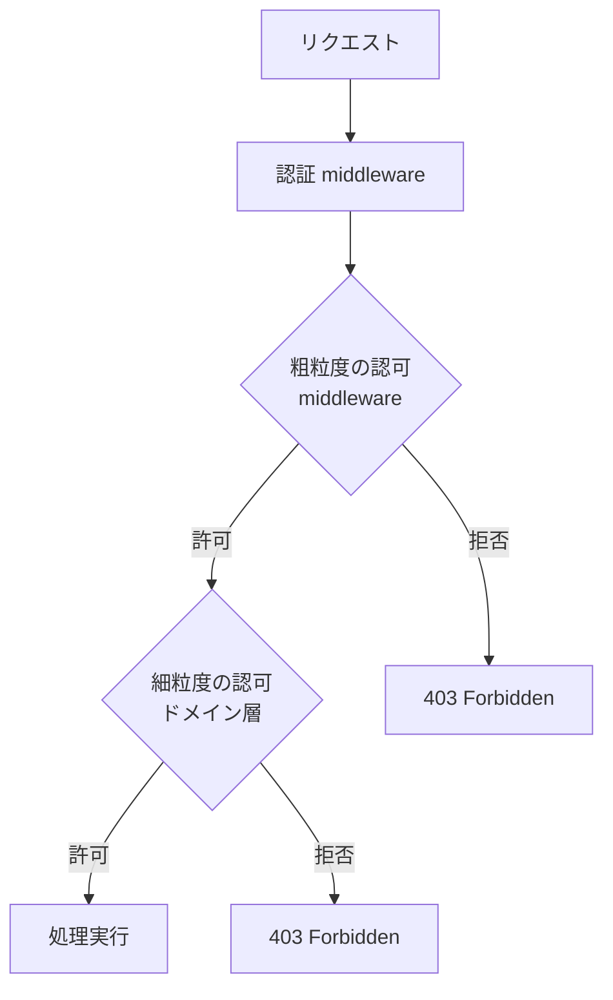
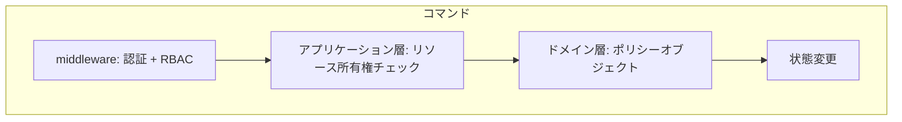
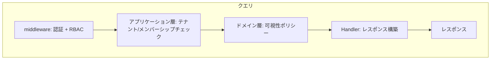

## はじめに

:::message

本記事はDDD（ドメイン駆動設計）とCQRS（コマンドクエリ責務分離）における認可の設計パターンをまとめたものです。各セクションの根拠となる一次情報源は、該当箇所に参照リンクを記載しています。

:::

APIの認可設計で「middlewareで全部チェックすればよい」と考えていた時期が私にもありました。しかしDDDを導入したプロジェクトで、**コマンド（書き込み）とクエリ（読み取り）で認可の粒度が根本的に異なる**ことに気づきました。

middlewareでJWTを検証してユーザーIDを取り出すところまではよいのですが、「このユーザーはこのタスクを編集できるか」「このクエリでどのデータが見えるべきか」はドメイン知識に依存します。結果として、認可ロジックがmiddleware・Handler・UseCaseに散在し、修正漏れによる権限バグが発生しました。

この記事では、CQRSパターンを前提に、**コマンドとクエリそれぞれに適した認可の設計箇所**を整理します。CQRSそのものの解説は「[DDDにCQRSを導入する前に知っておきたいこと](https://zenn.dev/135yshr/articles/9e3ec9a7d52c98)」をご覧ください。

:::message

本記事のコード例では、DDDシリーズで使用しているディレクトリ構成に従っています。CQRS記事で使用した`presentation/`・`application/`とは名称が異なりますが、各層の責務は同じです。

- `interface/rest/` はハンドラ層です（CQRS記事の`presentation/`に相当します）
- `usecase/` はアプリケーション層です（CQRS記事の`application/`に相当します）
- `domain/model/` はドメイン層です

:::

---

## 認可の2つのレベル

APIセキュリティは大きく **認証（Authentication：本人確認）**と**認可（Authorization：権限判定）** に分かれます。本記事では認証済みのユーザーに対する認可に焦点を当てます。

認可はさらに2つのレベルに分けて考えられます（[OWASP Authorization Cheat Sheet](https://cheatsheetseries.owasp.org/cheatsheets/Authorization_Cheat_Sheet.html)でも、RBACによる粗粒度の制御とリソース単位の細粒度の制御を区別しています）。



| レベル                   | 判断基準                     | 実装箇所                       |
| ------------------------ | ---------------------------- | ------------------------------ |
| 粗粒度（Coarse-grained） | ロール、エンドポイント単位   | middleware                     |
| 細粒度（Fine-grained）   | リソースの所有者、状態に依存 | アプリケーション層・ドメイン層 |

粗粒度の認可は「管理者ロールのみアクセス可能」のように、リクエストの属性だけで判断できます。細粒度の認可は「このタスクの作成者またはプロジェクトオーナーのみ編集可能」のように、ドメインモデルの状態を参照する必要があります。

---

## middleware での粗粒度の認可

Go の HTTP middleware で認証と粗粒度の認可をするパターンです。

```go
// interface/rest/middleware/auth.go

type Claims struct {
    UserID string
    Roles  []string
}

type contextKey string

const claimsKey contextKey = "claims"

func Authentication(verifier TokenVerifier) func(http.Handler) http.Handler {
    return func(next http.Handler) http.Handler {
        return http.HandlerFunc(func(w http.ResponseWriter, r *http.Request) {
            token := extractBearerToken(r)
            if token == "" {
                respondError(w, http.StatusUnauthorized, "missing token")
                return
            }

            claims, err := verifier.Verify(r.Context(), token)
            if err != nil {
                respondError(w, http.StatusUnauthorized, "invalid token")
                return
            }

            ctx := context.WithValue(r.Context(), claimsKey, claims)
            next.ServeHTTP(w, r.WithContext(ctx))
        })
    }
}

func RequireRole(roles ...string) func(http.Handler) http.Handler {
    if len(roles) == 0 {
        panic("middleware: RequireRole called with no roles")
    }

    return func(next http.Handler) http.Handler {
        return http.HandlerFunc(func(w http.ResponseWriter, r *http.Request) {
            claims := ClaimsFromContext(r.Context())
            if claims == nil {
                respondError(w, http.StatusUnauthorized, "not authenticated")
                return
            }

            for _, required := range roles {
                for _, actual := range claims.Roles {
                    if required == actual {
                        next.ServeHTTP(w, r)
                        return
                    }
                }
            }

            respondError(w, http.StatusForbidden, "insufficient permissions")
        })
    }
}
```

ルーターでの利用例です。

```go
// interface/rest/router.go

func SetupRouter(h *handler.TaskHandler, auth middleware.TokenVerifier) http.Handler {
    r := chi.NewRouter()

    r.Use(middleware.Authentication(auth))

    r.Route("/api/tasks", func(r chi.Router) {
        r.Get("/", h.List)           // 全ロールがアクセス可能
        r.Post("/", h.Create)        // 全ロールがアクセス可能

        r.Route("/{taskID}", func(r chi.Router) {
            r.Get("/", h.Get)
            r.Put("/", h.Update)
            r.Delete("/", h.Delete)
        })
    })

    // 管理者専用エンドポイント
    r.Route("/api/admin", func(r chi.Router) {
        r.Use(middleware.RequireRole("admin"))
        r.Get("/stats", h.AdminStats)
    })

    return r
}
```

middlewareで扱えるのは **ロールベースのアクセス制御（RBAC）** です。「このエンドポイントにはこのロールが必要」という静的なルールを宣言的に設定できます。

なお、コンテキストからのユーザー情報取得は `ClaimsFromContext` に統一します。`Authentication` middlewareを通過したリクエストには必ず `Claims` がセットされているため、middlewareの配下では非nilが保証されます。この不変条件を前提に、nilの場合はプログラミングエラーとしてパニックさせる `MustClaimsFromContext` を用意します。

```go
// interface/rest/middleware/context.go

// ClaimsFromContext はコンテキストからClaimsを取得します。
// Authentication middlewareを通過していない場合はnilを返します。
func ClaimsFromContext(ctx context.Context) *Claims {
    claims, _ := ctx.Value(claimsKey).(*Claims)
    return claims
}

// MustClaimsFromContext はAuthentication middleware配下で使用します。
// middlewareを通過していれば必ず非nilです。nilの場合はルーティング設定のバグです。
func MustClaimsFromContext(ctx context.Context) *Claims {
    claims := ClaimsFromContext(ctx)
    if claims == nil {
        panic("middleware: claims not found in context — is Authentication middleware applied?")
    }
    return claims
}
```

Handlerでは `MustClaimsFromContext` を使い、毎回のnilチェックを不要にします。`Authentication` middlewareの配下であることがルーター設定で保証されているためです。

```go
// interface/rest/handler/task_handler.go

func (h *TaskHandler) Delete(w http.ResponseWriter, r *http.Request) {
    claims := middleware.MustClaimsFromContext(r.Context())
    actor := model.NewUserID(claims.UserID)

    // actorをUseCaseに渡す（contextに型安全でない値を埋め込まない）
    err := h.deleteTask.Execute(r.Context(), &usecase.DeleteTaskInput{
        TaskID: chi.URLParam(r, "taskID"),
        Actor:  actor,
    })
    // ...
}
```

---

## コマンド実行時の権限チェック

CQRSにおけるコマンド（状態を変更する操作）では、**リソースの所有権や状態に基づく細粒度の認可**が必要になります。

### 素朴なアプローチ：UseCase内に直接書く

最初に思いつくのは、UseCase内で直接認可判定を書く方法です。

```go
// usecase/update_task_interactor.go

type taskFinder interface {
    FindByID(ctx context.Context, id model.TaskID) (*model.Task, error)
}

type taskSaver interface {
    Save(ctx context.Context, task *model.Task) error
}

type projectMemberChecker interface {
    IsMember(ctx context.Context, projectID model.ProjectID, userID model.UserID) (bool, error)
}

type UpdateTaskInteractor struct {
    tasks    taskFinder
    saver    taskSaver
    members  projectMemberChecker
}

func (i *UpdateTaskInteractor) Execute(ctx context.Context, input *UpdateTaskInput) (*UpdateTaskOutput, error) {
    actor := input.Actor

    task, err := i.tasks.FindByID(ctx, model.TaskID(input.TaskID))
    if err != nil {
        return nil, fmt.Errorf("failed to find task: %w", err)
    }
    if task == nil {
        return nil, ErrTaskNotFound
    }

    // 権限チェック：タスクの作成者またはプロジェクトメンバーであること
    if err := i.authorizeUpdate(ctx, task, actor); err != nil {
        return nil, err
    }

    // ドメインモデルの操作
    if err := task.UpdateTitle(input.Title); err != nil {
        return nil, fmt.Errorf("failed to update title: %w", err)
    }

    if err := i.saver.Save(ctx, task); err != nil {
        return nil, fmt.Errorf("failed to save task: %w", err)
    }

    return &UpdateTaskOutput{ID: task.ID().String()}, nil
}

func (i *UpdateTaskInteractor) authorizeUpdate(ctx context.Context, task *model.Task, actor model.UserID) error {
    // 作成者本人は常に許可
    if task.CreatedBy() == actor {
        return nil
    }

    // プロジェクトメンバーかどうかを確認
    isMember, err := i.members.IsMember(ctx, task.ProjectID(), actor)
    if err != nil {
        return fmt.Errorf("failed to check membership: %w", err)
    }
    if !isMember {
        return ErrNotAuthorized
    }

    return nil
}
```

このアプローチは動作しますが、問題があります。認可ルールがUseCase内のプライベートメソッドに埋もれるため、**ルールの一覧性がありません。** 操作ごとに異なる判定ロジックが各UseCaseに散在します。「削除は作成者とオーナーのみ」「ステータス変更は担当者と作成者とオーナー」といったルールが増えると、全体像の把握が困難になります。

また、上記の例では「プロジェクトメンバーかどうか」という粗い判定をしています。実際にはロール（オーナー、エディター、閲覧者）によって許可される操作は異なります。次のセクションのポリシーオブジェクトでは、メンバーシップの有無ではなくロールで判定するよう変更しています。

### 改善：ドメイン層のポリシーオブジェクトに集約する

認可ルールをドメイン層のポリシーオブジェクトに集約することで、上記の問題を解決できます。Vaughn Vernonは _Implementing Domain-Driven Design_ のChapter 14で、アプリケーション層がセキュリティの窓口となる設計を解説しています。一方で「このタスクの作成者のみ削除可能」のような**ビジネスルールとしての認可**はドメイン知識そのものです。このような認可ルールはドメイン層にポリシーオブジェクトとして配置することで、ルールの一元管理とテスタビリティを両立できます。

```go
// domain/model/task_policy.go

type TaskAction int

const (
    TaskActionUpdate TaskAction = iota + 1
    TaskActionDelete
    TaskActionChangeStatus
    TaskActionAssign
)

// ErrPermissionDenied は認可失敗を表すドメインエラーです。
// 内部IDを含めないことで、APIレスポンスにそのまま使っても情報漏洩しません。
var ErrPermissionDenied = errors.New("permission denied")

// TaskPolicy はタスクに対する認可ルールを集約するポリシーオブジェクトです。
// 構造体にしているのは、テスト時にインターフェース経由でモックに差し替えたり、
// 将来テナントごとのカスタムルールを注入したりする拡張点とするためです。
type TaskPolicy struct{}

func (p *TaskPolicy) CanPerform(task *Task, actor UserID, role MemberRole, action TaskAction) error {
    switch action {
    case TaskActionUpdate:
        if task.CreatedBy() == actor || role == MemberRoleOwner || role == MemberRoleEditor {
            return nil
        }
    case TaskActionDelete:
        if task.CreatedBy() == actor || role == MemberRoleOwner {
            return nil
        }
    case TaskActionChangeStatus:
        if task.AssigneeID() == actor || task.CreatedBy() == actor || role == MemberRoleOwner {
            return nil
        }
    case TaskActionAssign:
        if role == MemberRoleOwner || role == MemberRoleEditor {
            return nil
        }
    }
    return ErrPermissionDenied
}
```

アプリケーション層からポリシーオブジェクトを利用します。認可失敗時は**監査ログを記録**したうえで、外部には詳細を漏らさないエラーを返します。

```go
// usecase/delete_task_interactor.go

func (i *DeleteTaskInteractor) Execute(ctx context.Context, input *DeleteTaskInput) error {
    actor := input.Actor

    task, err := i.tasks.FindByID(ctx, model.TaskID(input.TaskID))
    if err != nil {
        return fmt.Errorf("failed to find task: %w", err)
    }
    if task == nil {
        return ErrTaskNotFound
    }

    role, err := i.members.Role(ctx, task.ProjectID(), actor)
    if err != nil {
        return fmt.Errorf("failed to get role: %w", err)
    }

    // ドメインポリシーによる認可
    policy := &model.TaskPolicy{}
    if err := policy.CanPerform(task, actor, role, model.TaskActionDelete); err != nil {
        // 監査ログ：誰が・何を・いつ試みて拒否されたかを記録
        slog.WarnContext(ctx, "authorization denied",
            "actor", actor.String(),
            "action", "delete",
            "taskID", task.ID().String(),
            "role", role.String(),
        )
        return ErrNotAuthorized
    }

    return i.tasks.Delete(ctx, task.ID())
}
```

ポリシーオブジェクト自体は `ErrPermissionDenied` を返すだけで、ユーザーIDやタスクIDを含めません。内部情報を含むログはアプリケーション層で出力し、外部に返すエラーとは分離します。

### ポリシーオブジェクトのテスト

ポリシーオブジェクトの最大の利点は**テスタビリティ**です。外部依存がないため、テーブルテストで全パターンを網羅できます。

```go
// domain/model/task_policy_test.go

func TestTaskPolicy_CanPerform(t *testing.T) {
    creator := NewUserID("user-1")
    assignee := NewUserID("user-2")
    other := NewUserID("user-3")

    task := newTestTask(creator, assignee) // テスト用のTask生成ヘルパー

    tests := []struct {
        name    string
        actor   UserID
        role    MemberRole
        action  TaskAction
        wantErr bool
    }{
        {"作成者は更新可能", creator, MemberRoleViewer, TaskActionUpdate, false},
        {"オーナーは削除可能", other, MemberRoleOwner, TaskActionDelete, false},
        {"閲覧者は削除不可", other, MemberRoleViewer, TaskActionDelete, true},
        {"担当者はステータス変更可能", assignee, MemberRoleViewer, TaskActionChangeStatus, false},
        {"閲覧者はアサイン不可", other, MemberRoleViewer, TaskActionAssign, true},
        {"エディターはアサイン可能", other, MemberRoleEditor, TaskActionAssign, false},
    }

    policy := &TaskPolicy{}
    for _, tt := range tests {
        t.Run(tt.name, func(t *testing.T) {
            err := policy.CanPerform(task, tt.actor, tt.role, tt.action)
            if (err != nil) != tt.wantErr {
                t.Errorf("CanPerform() error = %v, wantErr %v", err, tt.wantErr)
            }
        })
    }
}
```

認可ルールの変更時に、既存の全パターンがリグレッションしていないことをこのテストで確認できます。

---

## クエリの可視性制御

CQRSにおけるクエリ（読み取り操作）では、**ユーザーに見えるべきデータのみを返す**ことが重要です。これをデータの可視性制御と呼びます。

### テナント分離

マルチテナントシステムでは、クエリが必ず自テナントのデータのみを返すように制御します。

:::message alert

認可の観点でも、Query側でドメインモデルをそのまま返すのは危険です。ドメインモデルには内部フィールド（内部メモ、コスト見積もりなど）が含まれており、Handler層でのフィルタ漏れがそのまま情報漏洩につながります。CQRSの原則どおり、Query側はロールに応じた必要最小限のフィールドだけを含むDTOを直接返すQueryServiceを使用するのが安全です（詳細は[CQRS記事の「誤解3」](https://zenn.dev/135yshr/articles/9e3ec9a7d52c98#%E8%AA%A4%E8%A7%A33%EF%BC%9A%E3%80%8Cquery%E5%81%B4%E3%82%82repository%E3%82%92%E4%BD%BF%E3%81%86%E3%80%8D)を参照）。以下のコード例では認可の配置パターンを示すため、簡略化してドメインモデルを使用しています。

:::

```go
// usecase/list_tasks_interactor.go

type taskLister interface {
    ListByProject(ctx context.Context, projectID model.ProjectID, filter *model.TaskFilter) ([]*model.Task, int64, error)
}

type ListTasksInteractor struct {
    tasks   taskLister
    members projectMemberChecker
}

func (i *ListTasksInteractor) Execute(ctx context.Context, input *ListTasksInput) (*ListTasksOutput, error) {
    actor := input.Actor

    // クエリの可視性制御：プロジェクトメンバーのみがタスク一覧を取得できる
    isMember, err := i.members.IsMember(ctx, model.ProjectID(input.ProjectID), actor)
    if err != nil {
        return nil, fmt.Errorf("failed to check membership: %w", err)
    }
    if !isMember {
        return nil, ErrNotAuthorized
    }

    role, err := i.members.Role(ctx, model.ProjectID(input.ProjectID), actor)
    if err != nil {
        return nil, fmt.Errorf("failed to get role: %w", err)
    }

    tasks, total, err := i.tasks.ListByProject(ctx, model.ProjectID(input.ProjectID), input.Filter)
    if err != nil {
        return nil, fmt.Errorf("failed to list tasks: %w", err)
    }

    // 可視性ポリシーをドメイン層で生成し、Outputに含める
    vis := model.NewTaskVisibility(role)

    return &ListTasksOutput{Tasks: tasks, Total: total, Visibility: vis}, nil
}
```

### フィールドレベルの可視性制御

ロールに応じて返すフィールドを制御するパターンです。「どのフィールドをどのロールに見せるか」もビジネスルールの一部なので、判定ロジックはドメイン層のポリシーに置きます。

```go
// domain/model/task_visibility.go

type TaskVisibility struct {
    ShowInternalNote bool
    ShowCostEstimate bool
}

func NewTaskVisibility(role MemberRole) TaskVisibility {
    return TaskVisibility{
        ShowInternalNote: role == MemberRoleOwner || role == MemberRoleEditor,
        ShowCostEstimate: role == MemberRoleOwner || role == MemberRoleEditor,
    }
}
```

UseCase が `ListTasksOutput` に `Visibility` を含めて返すので、Handler層はロールを知ることなくレスポンスを組み立てるだけです。コマンド側の Handler→UseCase と対になるクエリ側の流れを示します。

```go
// interface/rest/handler/task_handler.go

func (h *TaskHandler) List(w http.ResponseWriter, r *http.Request) {
    claims := middleware.MustClaimsFromContext(r.Context())
    actor := model.NewUserID(claims.UserID)

    output, err := h.listTasks.Execute(r.Context(), &usecase.ListTasksInput{
        ProjectID: chi.URLParam(r, "projectID"),
        Actor:     actor,
    })
    if err != nil {
        handleError(w, err)
        return
    }

    // UseCaseが返した可視性情報をそのまま使う（Handler内でロール判定しない）
    responses := make([]TaskResponse, 0, len(output.Tasks))
    for _, task := range output.Tasks {
        responses = append(responses, toTaskResponse(task, output.Visibility))
    }

    respondJSON(w, http.StatusOK, responses)
}
```

```go
// interface/rest/handler/task_response.go

type TaskResponse struct {
    ID           string  `json:"id"`
    Title        string  `json:"title"`
    Status       string  `json:"status"`
    AssigneeName string  `json:"assigneeName,omitempty"`
    InternalNote *string `json:"internalNote,omitempty"`
    CostEstimate *int    `json:"costEstimate,omitempty"`
}

func toTaskResponse(task *model.Task, vis model.TaskVisibility) TaskResponse {
    resp := TaskResponse{
        ID:           task.ID().String(),
        Title:        task.Title().String(),
        Status:       task.Status().String(),
        AssigneeName: task.Assignee(),
    }

    if vis.ShowInternalNote {
        note := task.InternalNote()
        resp.InternalNote = &note
    }
    if vis.ShowCostEstimate {
        cost := task.CostEstimate()
        resp.CostEstimate = &cost
    }

    return resp
}
```

---

## コマンドとクエリの認可設計の比較

コマンドとクエリでは、認可の性質が異なります。





| 観点 | コマンド | クエリ |
| --- | --- | --- |
| 認可の粒度 | リソース単位（この操作をこのリソースに対して行えるか） | 範囲単位（どのデータが見えるか） |
| 主な実装箇所 | アプリケーション層＋ドメインポリシー | アプリケーション層＋ドメインポリシー（可視性） |
| 失敗時のレスポンス | 403 Forbidden | 403 Forbidden またはデータのフィルタリング |
| 状態への依存 | 高い（リソースの状態で許可が変わる） | 中程度（メンバーシップや所属で決まる） |

---

## 認可設計のアンチパターン

私の経験から、避けるべきアンチパターンを紹介します。

### 1. Handlerに認可ロジックを埋め込む

```go
// ❌ Handlerにドメイン知識が漏れている
func (h *TaskHandler) Delete(w http.ResponseWriter, r *http.Request) {
    claims := middleware.ClaimsFromContext(r.Context())
    task, _ := h.taskFinder.FindByID(r.Context(), taskID)

    // Handlerがドメインの認可ルールを知っている
    if task.CreatedBy() != claims.UserID && !contains(claims.Roles, "admin") {
        respondError(w, http.StatusForbidden, "not authorized")
        return
    }
    // ...
}
```

このパターンでは、認可ルールがHandler内に散在し、同じルールを複数のHandlerで重複実装することになります。

### 2. middlewareで全ての認可を行おうとする

```go
// ❌ リソースの状態に依存する認可をmiddlewareで行う
func TaskOwnerOnly() func(http.Handler) http.Handler {
    return func(next http.Handler) http.Handler {
        return http.HandlerFunc(func(w http.ResponseWriter, r *http.Request) {
            taskID := chi.URLParam(r, "taskID")
            // middlewareがリポジトリに直接アクセスしている
            task, _ := taskRepo.FindByID(r.Context(), taskID)
            // ...
        })
    }
}
```

middlewareがリポジトリに依存すると、レイヤー構造が崩れます。middlewareはコンテキスト情報（トークン、ロール）のみを扱うべきです。

### 3. 認可をDBの制約に委ねる

```go
// ❌ 認可チェックをせず、DB制約で弾こうとする
func (i *UpdateTaskInteractor) Execute(ctx context.Context, input *UpdateTaskInput) error {
    task, _ := i.tasks.FindByID(ctx, model.TaskID(input.TaskID))

    task.UpdateTitle(input.Title)

    // 認可チェックなしでSave → DBのトリガーや制約で弾く想定
    err := i.saver.Save(ctx, task)
    if err != nil {
        // DB制約エラーと認可エラーの区別がつかない
        return fmt.Errorf("failed to save: %w", err)
    }
    return nil
}
```

認可をアプリケーション層で行わず、DBの制約やトリガーに委ねるパターンです。この方法では認可失敗なのかデータ不整合なのかの区別がつかず、適切なHTTPステータスコード（403 vs 500）を返せません。また、Saveの前にドメイン操作が走るため、認可されないはずの変更でドメインイベントが発行されるリスクもあります。認可チェックは**必ずドメイン操作の前に、アプリケーション層で明示的に実行します。**

### 4. 認可エラーのメッセージに内部情報を含める

```go
// ❌ ユーザーID・タスクID・ロールがエラーメッセージに漏れる
return fmt.Errorf("user %s with role %s cannot delete task %s", actor, role, task.ID())
```

認可エラーのメッセージにリソースIDやユーザーIDを含めると、APIレスポンス経由で内部構造が推測可能になります。外部に返すエラーは `"permission denied"` のような汎用メッセージにとどめ、詳細はサーバーサイドの監査ログに記録します。

---

## まとめ

DDDとCQRSにおける認可設計のポイントは以下のとおりです。

| 認可レベル       | 実装箇所                                       | 判断基準                 |
| ---------------- | ---------------------------------------------- | ------------------------ |
| 粗粒度（RBAC）   | middleware                                     | ロール、エンドポイント   |
| コマンドの細粒度 | アプリケーション層＋ドメインポリシー           | リソースの所有権、状態   |
| クエリの可視性   | アプリケーション層＋ドメインポリシー（可視性） | テナント、メンバーシップ |

認可設計で押さえるべきポイントは3つです。

1. **認可ルールはポリシーオブジェクトに集約します。** UseCase内にバラバラに書くのではなく、ドメイン層のポリシーに一元化することで、ルールの見通しとテスタビリティを確保できます。
2. **middlewareとドメイン層の守備範囲を分けます。** middlewareはロールベースの粗粒度チェックに専念し、リソースの状態に依存する判定はドメインポリシーに委ねます。
3. **コマンドとクエリで認可の性質が異なることを認識します。** コマンドは「この操作が許可されるか」、クエリは「どのデータが見えるか」が問われます。それぞれに適したポリシーを設計することで、認可漏れを防げます。

---

## 参考文献

| 内容 | 出典 |
| --- | --- |
| CQRSパターン | Greg Young, [CQRS Documents](https://cqrs.wordpress.com/wp-content/uploads/2010/11/cqrs_documents.pdf) |
| アプリケーション層のセキュリティ設計 | Vaughn Vernon, _Implementing Domain-Driven Design_（2013）Chapter 14: Application — アプリケーションサービスが認証・認可の窓口となる設計を解説。Identity and Access Contextとして認可を独立した境界づけられたコンテキストに分離するパターンも紹介 |
| OWASPの認可ガイドライン | OWASP, [Authorization Cheat Sheet](https://cheatsheetseries.owasp.org/cheatsheets/Authorization_Cheat_Sheet.html) |
| RBACの定義と標準化 | NIST, [Role-Based Access Control](https://csrc.nist.gov/projects/role-based-access-control)（アーカイブ済み。ANSI/INCITS 359-2012として標準化） |
| Go のmiddlewareパターン | Mat Ryer, [How I write HTTP services in Go after 13 years](https://grafana.com/blog/2024/02/09/how-i-write-http-services-in-go-after-13-years/) |
