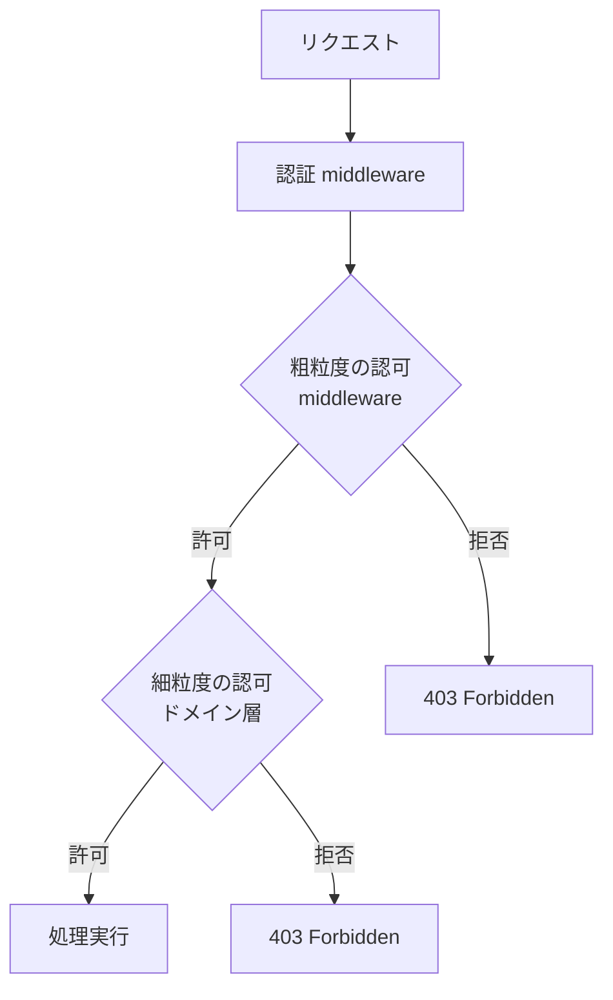
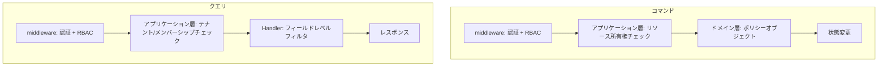

## はじめに

:::message

本記事はDDD（ドメイン駆動設計）とCQRS（コマンドクエリ責務分離）における認可の設計パターンをまとめたものです。各セクションの根拠となる一次情報源は、該当箇所に参照リンクを記載しています。

:::

APIの認可設計で「middlewareで全部チェックすればよい」と考えていた時期が私にもありました。しかしDDDを導入したプロジェクトで、**コマンド（書き込み）とクエリ（読み取り）で認可の粒度が根本的に異なる**ことに気づきました。

middlewareでJWTを検証してユーザーIDを取り出すところまではよいのですが、「このユーザーはこのタスクを編集できるか」「このクエリでどのデータが見えるべきか」はドメイン知識に依存します。結果として、認可ロジックがmiddleware・Handler・UseCaseに散在し、修正漏れによる権限バグが発生しました。

この記事では、CQRSパターンを前提に、**コマンドとクエリそれぞれに適した認可の設計箇所**を整理します。

---

## 認可の2つのレベル

認可は大きく**認証（Authentication）**と**認可（Authorization）**に分かれます。本記事では認証済みのユーザーに対する認可に焦点を当てます。

認可はさらに2つのレベルに分けて考えることができます。



| レベル                   | 判断基準                     | 実装箇所                       |
| ------------------------ | ---------------------------- | ------------------------------ |
| 粗粒度（Coarse-grained） | ロール、エンドポイント単位   | middleware                     |
| 細粒度（Fine-grained）   | リソースの所有者、状態に依存 | アプリケーション層・ドメイン層 |

粗粒度の認可は「管理者ロールのみアクセス可能」のように、リクエストの属性だけで判断できます。細粒度の認可は「このタスクの作成者またはプロジェクトオーナーのみ編集可能」のように、ドメインモデルの状態を参照する必要があります。

---

## middleware での粗粒度の認可

Go の HTTP middleware で認証と粗粒度の認可をするパターンです。

```go
// interface/rest/middleware/auth.go

type Claims struct {
    UserID string
    Roles  []string
}

type contextKey string

const claimsKey contextKey = "claims"

func Authentication(verifier TokenVerifier) func(http.Handler) http.Handler {
    return func(next http.Handler) http.Handler {
        return http.HandlerFunc(func(w http.ResponseWriter, r *http.Request) {
            token := extractBearerToken(r)
            if token == "" {
                respondError(w, http.StatusUnauthorized, "missing token")
                return
            }

            claims, err := verifier.Verify(r.Context(), token)
            if err != nil {
                respondError(w, http.StatusUnauthorized, "invalid token")
                return
            }

            ctx := context.WithValue(r.Context(), claimsKey, claims)
            next.ServeHTTP(w, r.WithContext(ctx))
        })
    }
}

func RequireRole(roles ...string) func(http.Handler) http.Handler {
    return func(next http.Handler) http.Handler {
        return http.HandlerFunc(func(w http.ResponseWriter, r *http.Request) {
            claims := ClaimsFromContext(r.Context())
            if claims == nil {
                respondError(w, http.StatusUnauthorized, "not authenticated")
                return
            }

            for _, required := range roles {
                for _, actual := range claims.Roles {
                    if required == actual {
                        next.ServeHTTP(w, r)
                        return
                    }
                }
            }

            respondError(w, http.StatusForbidden, "insufficient permissions")
        })
    }
}
```

ルーターでの利用例です。

```go
// interface/rest/router.go

func SetupRouter(h *handler.TaskHandler, auth middleware.TokenVerifier) http.Handler {
    r := chi.NewRouter()

    r.Use(middleware.Authentication(auth))

    r.Route("/api/tasks", func(r chi.Router) {
        r.Get("/", h.List)           // 全ロールがアクセス可能
        r.Post("/", h.Create)        // 全ロールがアクセス可能

        r.Route("/{taskID}", func(r chi.Router) {
            r.Get("/", h.Get)
            r.Put("/", h.Update)
            r.Delete("/", h.Delete)
        })
    })

    // 管理者専用エンドポイント
    r.Route("/api/admin", func(r chi.Router) {
        r.Use(middleware.RequireRole("admin"))
        r.Get("/stats", h.AdminStats)
    })

    return r
}
```

middlewareで扱えるのは**ロールベースのアクセス制御（RBAC）**です。「このエンドポイントにはこのロールが必要」という静的なルールを宣言的に設定できます。

---

## コマンド実行時の権限チェック

CQRSにおけるコマンド（状態を変更する操作）では、**リソースの所有権や状態に基づく細粒度の認可**が必要になります。

### アプリケーション層での権限チェック

コマンドの実行前に、アプリケーション層で権限を検証します。

```go
// usecase/update_task_interactor.go

type taskFinder interface {
    FindByID(ctx context.Context, id model.TaskID) (*model.Task, error)
}

type taskSaver interface {
    Save(ctx context.Context, task *model.Task) error
}

type projectMemberChecker interface {
    IsMember(ctx context.Context, projectID model.ProjectID, userID model.UserID) (bool, error)
}

type UpdateTaskInteractor struct {
    tasks    taskFinder
    saver    taskSaver
    members  projectMemberChecker
}

func (i *UpdateTaskInteractor) Execute(ctx context.Context, input *UpdateTaskInput) (*UpdateTaskOutput, error) {
    actor := model.UserIDFromContext(ctx)

    task, err := i.tasks.FindByID(ctx, model.TaskID(input.TaskID))
    if err != nil {
        return nil, fmt.Errorf("failed to find task: %w", err)
    }
    if task == nil {
        return nil, ErrTaskNotFound
    }

    // 権限チェック：タスクの作成者またはプロジェクトメンバーであること
    if err := i.authorizeUpdate(ctx, task, actor); err != nil {
        return nil, err
    }

    // ドメインモデルの操作
    if err := task.UpdateTitle(input.Title); err != nil {
        return nil, fmt.Errorf("failed to update title: %w", err)
    }

    if err := i.saver.Save(ctx, task); err != nil {
        return nil, fmt.Errorf("failed to save task: %w", err)
    }

    return &UpdateTaskOutput{ID: task.ID().String()}, nil
}

func (i *UpdateTaskInteractor) authorizeUpdate(ctx context.Context, task *model.Task, actor model.UserID) error {
    // 作成者本人は常に許可
    if task.CreatedBy() == actor {
        return nil
    }

    // プロジェクトメンバーかどうかを確認
    isMember, err := i.members.IsMember(ctx, task.ProjectID(), actor)
    if err != nil {
        return fmt.Errorf("failed to check membership: %w", err)
    }
    if !isMember {
        return ErrNotAuthorized
    }

    return nil
}
```

### ドメイン層での認可（ポリシーオブジェクト）

より複雑な認可ルールは、ドメイン層にポリシーオブジェクトとして表現できます。Vaughn Vernonは、認可ルールがドメイン知識の一部である場合、ドメイン層に配置すべきだと述べています。

```go
// domain/model/task_policy.go

type TaskAction int

const (
    TaskActionUpdate TaskAction = iota + 1
    TaskActionDelete
    TaskActionChangeStatus
    TaskActionAssign
)

type TaskPolicy struct{}

func (p *TaskPolicy) CanPerform(task *Task, actor UserID, role MemberRole, action TaskAction) error {
    switch action {
    case TaskActionUpdate:
        if task.CreatedBy() == actor || role == MemberRoleOwner || role == MemberRoleEditor {
            return nil
        }
    case TaskActionDelete:
        if task.CreatedBy() == actor || role == MemberRoleOwner {
            return nil
        }
    case TaskActionChangeStatus:
        if task.AssigneeID() == actor || task.CreatedBy() == actor || role == MemberRoleOwner {
            return nil
        }
    case TaskActionAssign:
        if role == MemberRoleOwner || role == MemberRoleEditor {
            return nil
        }
    }
    return fmt.Errorf("user %s is not allowed to %v on task %s", actor, action, task.ID())
}
```

アプリケーション層からポリシーオブジェクトを利用します。

```go
// usecase/delete_task_interactor.go

func (i *DeleteTaskInteractor) Execute(ctx context.Context, input *DeleteTaskInput) error {
    actor := model.UserIDFromContext(ctx)

    task, err := i.tasks.FindByID(ctx, model.TaskID(input.TaskID))
    if err != nil {
        return fmt.Errorf("failed to find task: %w", err)
    }
    if task == nil {
        return ErrTaskNotFound
    }

    role, err := i.members.GetRole(ctx, task.ProjectID(), actor)
    if err != nil {
        return fmt.Errorf("failed to get role: %w", err)
    }

    // ドメインポリシーによる認可
    policy := &model.TaskPolicy{}
    if err := policy.CanPerform(task, actor, role, model.TaskActionDelete); err != nil {
        return ErrNotAuthorized
    }

    return i.tasks.Delete(ctx, task.ID())
}
```

---

## クエリの可視性制御

CQRSにおけるクエリ（読み取り操作）では、**ユーザーに見えるべきデータのみを返す**ことが重要です。これをデータの可視性制御と呼びます。

### テナント分離

マルチテナントシステムでは、クエリが必ず自テナントのデータのみを返すように制御します。

```go
// usecase/list_tasks_interactor.go

type taskLister interface {
    ListByProject(ctx context.Context, projectID model.ProjectID, filter *model.TaskFilter) ([]*model.Task, int64, error)
}

type ListTasksInteractor struct {
    tasks   taskLister
    members projectMemberChecker
}

func (i *ListTasksInteractor) Execute(ctx context.Context, input *ListTasksInput) (*ListTasksOutput, error) {
    actor := model.UserIDFromContext(ctx)

    // クエリの可視性制御：プロジェクトメンバーのみがタスク一覧を取得できる
    isMember, err := i.members.IsMember(ctx, model.ProjectID(input.ProjectID), actor)
    if err != nil {
        return nil, fmt.Errorf("failed to check membership: %w", err)
    }
    if !isMember {
        return nil, ErrNotAuthorized
    }

    tasks, total, err := i.tasks.ListByProject(ctx, model.ProjectID(input.ProjectID), input.Filter)
    if err != nil {
        return nil, fmt.Errorf("failed to list tasks: %w", err)
    }

    return &ListTasksOutput{Tasks: tasks, Total: total}, nil
}
```

### フィールドレベルの可視性制御

ロールに応じて返すフィールドを制御するパターンです。

```go
// interface/rest/handler/task_response.go

type TaskResponse struct {
    ID          string  `json:"id"`
    Title       string  `json:"title"`
    Status      string  `json:"status"`
    AssigneeName string `json:"assigneeName,omitempty"`
    // 管理者のみに見えるフィールド
    InternalNote *string `json:"internalNote,omitempty"`
    CostEstimate *int    `json:"costEstimate,omitempty"`
}

func toTaskResponse(task *model.Task, role model.MemberRole) TaskResponse {
    resp := TaskResponse{
        ID:           task.ID().String(),
        Title:        task.Title().String(),
        Status:       task.Status().String(),
        AssigneeName: task.AssigneeName(),
    }

    // 管理者・オーナーのみ内部メモとコスト見積もりを含める
    if role == model.MemberRoleOwner || role == model.MemberRoleAdmin {
        note := task.InternalNote()
        resp.InternalNote = &note
        cost := task.CostEstimate()
        resp.CostEstimate = &cost
    }

    return resp
}
```

---

## コマンドとクエリの認可設計の比較

コマンドとクエリでは、認可の性質が異なります。



| 観点 | コマンド | クエリ |
| --- | --- | --- |
| 認可の粒度 | リソース単位（この操作をこのリソースに対して行えるか） | 範囲単位（どのデータが見えるか） |
| 主な実装箇所 | アプリケーション層＋ドメインポリシー | アプリケーション層＋Handler |
| 失敗時のレスポンス | 403 Forbidden | 403 Forbidden またはデータのフィルタリング |
| 状態への依存 | 高い（リソースの状態で許可が変わる） | 中程度（メンバーシップや所属で決まる） |

---

## 認可設計のアンチパターン

私の経験から、避けるべきアンチパターンを紹介します。

### 1. Handlerに認可ロジックを埋め込む

```go
// ❌ Handlerにドメイン知識が漏れている
func (h *TaskHandler) Delete(w http.ResponseWriter, r *http.Request) {
    claims := middleware.ClaimsFromContext(r.Context())
    task, _ := h.taskFinder.FindByID(r.Context(), taskID)

    // Handlerがドメインの認可ルールを知っている
    if task.CreatedBy != claims.UserID && !contains(claims.Roles, "admin") {
        respondError(w, http.StatusForbidden, "not authorized")
        return
    }
    // ...
}
```

このパターンでは、認可ルールがHandler内に散在し、同じルールを複数のHandlerで重複実装することになります。

### 2. middlewareで全ての認可を行おうとする

```go
// ❌ リソースの状態に依存する認可をmiddlewareで行う
func TaskOwnerOnly() func(http.Handler) http.Handler {
    return func(next http.Handler) http.Handler {
        return http.HandlerFunc(func(w http.ResponseWriter, r *http.Request) {
            taskID := chi.URLParam(r, "taskID")
            // middlewareがリポジトリに直接アクセスしている
            task, _ := taskRepo.FindByID(r.Context(), taskID)
            // ...
        })
    }
}
```

middlewareがリポジトリに依存すると、レイヤー構造が崩れます。middlewareはコンテキスト情報（トークン、ロール）のみを扱うべきです。

---

## まとめ

DDDとCQRSにおける認可設計のポイントは以下の通りです。

| 認可レベル       | 実装箇所                             | 判断基準                 |
| ---------------- | ------------------------------------ | ------------------------ |
| 粗粒度（RBAC）   | middleware                           | ロール、エンドポイント   |
| コマンドの細粒度 | アプリケーション層＋ドメインポリシー | リソースの所有権、状態   |
| クエリの可視性   | アプリケーション層＋Handler          | テナント、メンバーシップ |

認可設計で最も重要なのは、**各層の責務を明確に分けること**です。middlewareは認証とロールベースのチェックに専念し、リソースの状態に依存する細粒度の認可はアプリケーション層とドメイン層に委ねます。コマンドとクエリでは認可の性質が異なるため、それぞれに適した設計パターンを選択することが安全なAPIの実現につながります。

---

## 参考文献

| 内容 | 出典 |
| --- | --- |
| CQRSパターン | Greg Young, [CQRS Documents](https://cqrs.files.wordpress.com/2010/11/cqrs_documents.pdf) |
| ドメイン層での認可 | Vaughn Vernon, _Implementing Domain-Driven Design_（2013）Chapter 14: Application |
| OWASPの認可ガイドライン | OWASP, [Authorization Cheat Sheet](https://cheatsheetseries.owasp.org/cheatsheets/Authorization_Cheat_Sheet.html) |
| RBACパターン | NIST, [Role-Based Access Control](https://csrc.nist.gov/projects/role-based-access-control) |
| Go のmiddlewareパターン | Mat Ryer, [How I write HTTP services in Go after 13 years](https://grafana.com/blog/2024/02/09/how-i-write-http-services-in-go-after-13-years/) |
