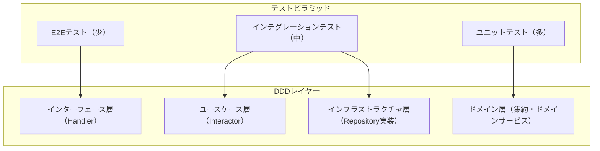
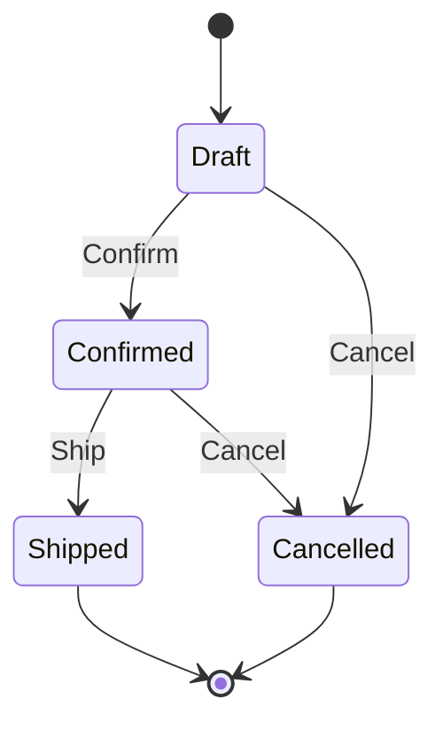

## はじめに

:::message

本記事はDDD×クリーンアーキテクチャ連載の一部です。DDDにおけるテスト戦略を、Go の実装例とともに解説します。各セクションの根拠となる一次情報源は、該当箇所に参照リンクを記載しています。

:::

DDDで設計されたコードベースには、エンティティ、値オブジェクト、集約、ドメインサービス、リポジトリ、ユースケースなど、多くの構成要素があります。それぞれの要素をどのレベルでテストするかは、チームの生産性と品質に直結する重要な判断です。

Mike Cohn が提唱したテストピラミッドでは、ユニットテストを最も多く、インテグレーションテスト、E2Eテストの順に減らすことが推奨されています（参考：[TestPyramid](https://martinfowler.com/bliki/TestPyramid.html)）。しかしDDDのレイヤー構造にこのピラミッドをどう対応させるかは、自明ではありません。

本記事では、ドメイン層からインフラストラクチャ層までのテスト戦略を Go のコード例とともに解説します。インターフェース層（HTTPハンドラ等）のE2Eテストはフレームワークに依存する部分が大きいため、本記事の対象外とします。

---

## テストピラミッドとDDDレイヤーの対応

DDDのレイヤー構造とテストピラミッドの対応関係を整理します。



| DDDレイヤー | テストレベル | テスト対象 |
| --- | --- | --- |
| ドメイン層 | ユニットテスト | 集約の振る舞い、値オブジェクトの制約、ドメインサービスのロジック |
| ユースケース層 | インテグレーションテスト | ユースケースのフロー、依存コンポーネントの連携 |
| インフラストラクチャ層 | インテグレーションテスト | リポジトリのクエリ、外部サービスとの通信 |
| インターフェース層 | E2Eテスト / HTTPテスト | APIエンドポイントのリクエスト/レスポンス |

テストピラミッドの考え方に従えば、外部依存のないドメイン層はユニットテストの対象として最も適しており、投資対効果が高いと考えられます。

---

## ドメイン層のユニットテスト

ドメイン層の構成要素のうち、このセクションでは値オブジェクトと集約（エンティティ）のテストを扱います。それぞれテストの観点が異なります。

- **値オブジェクト**: 生成時の制約と等値性
- **集約**: 状態遷移を伴う振る舞い

ドメインサービスのテストは、モックの境界判断が加わるため、次のセクションで独立して解説します。

### 値オブジェクトのテスト

値オブジェクトは生成時の制約（バリデーション）と等値性をテストします。構造がシンプルなため、最もテストしやすい要素です。

```go
// domain/model/email_test.go
package model_test

import (
    "testing"

    "example/domain/model"
)

func TestNewEmail(t *testing.T) {
    tests := []struct {
        name    string
        input   string
        wantErr bool
    }{
        {name: "正常なメールアドレス", input: "user@example.com", wantErr: false},
        {name: "空文字列", input: "", wantErr: true},
        {name: "@がない", input: "userexample.com", wantErr: true},
        {name: "ドメインがない", input: "user@", wantErr: true},
        {name: "日本語ドメイン", input: "user@例え.jp", wantErr: false},
    }
    for _, tt := range tests {
        t.Run(tt.name, func(t *testing.T) {
            _, err := model.NewEmail(tt.input)
            if (err != nil) != tt.wantErr {
                t.Errorf("NewEmail(%q) error = %v, wantErr %v", tt.input, err, tt.wantErr)
            }
        })
    }
}

func TestEmail_Equals(t *testing.T) {
    email1, _ := model.NewEmail("user@example.com")
    email2, _ := model.NewEmail("user@example.com")
    email3, _ := model.NewEmail("other@example.com")

    if !email1.Equals(email2) {
        t.Error("同じアドレスのEmailは等しいはずです")
    }
    if email1.Equals(email3) {
        t.Error("異なるアドレスのEmailは等しくないはずです")
    }
}
```

### 集約の振る舞いテスト

集約のテストで重要なのは、**状態ではなく振る舞い**をテストすることです。内部のフィールドを直接検証するのではなく、コマンドを実行した結果として外部から観測可能な変化をテストします。

```go
// domain/model/order_test.go
package model_test

import (
    "testing"

    "example/domain/model"
)

func TestOrder_Confirm(t *testing.T) {
    t.Run("下書き状態の注文を確定できる", func(t *testing.T) {
        order := newTestOrder(t)

        err := order.Confirm()

        if err != nil {
            t.Fatalf("Confirm() でエラーが発生しました: %v", err)
        }
        if order.Status() != model.OrderStatusConfirmed {
            t.Errorf("ステータスが %q になりました。%q を期待していました",
                order.Status(), model.OrderStatusConfirmed)
        }
    })

    t.Run("確定済みの注文は再度確定できない", func(t *testing.T) {
        order := newTestOrder(t)
        order.Confirm()

        err := order.Confirm()

        if err == nil {
            t.Error("確定済みの注文に対する Confirm() はエラーを返すべきです")
        }
    })

    t.Run("キャンセル済みの注文は確定できない", func(t *testing.T) {
        order := newTestOrder(t)
        order.Cancel("テスト用キャンセル")

        err := order.Confirm()

        if err == nil {
            t.Error("キャンセル済みの注文に対する Confirm() はエラーを返すべきです")
        }
    })
}

func TestOrder_Ship(t *testing.T) {
    t.Run("確定済みの注文を出荷できる", func(t *testing.T) {
        order := newTestOrder(t)
        order.Confirm()

        err := order.Ship("TRACK-001")

        if err != nil {
            t.Fatalf("Ship() でエラーが発生しました: %v", err)
        }
        if order.Status() != model.OrderStatusShipped {
            t.Errorf("ステータスが %q になりました。%q を期待していました",
                order.Status(), model.OrderStatusShipped)
        }
    })

    t.Run("下書き状態の注文は出荷できない", func(t *testing.T) {
        order := newTestOrder(t)

        err := order.Ship("TRACK-001")

        if err == nil {
            t.Error("下書き状態の注文に対する Ship() はエラーを返すべきです")
        }
    })
}

// newTestOrder はテスト用の注文を生成するヘルパーです。
func newTestOrder(t *testing.T) *model.Order {
    t.Helper()
    order, err := model.NewOrder("order-1", "customer-1", []model.OrderItem{
        {ProductID: "product-1", Quantity: 2, Price: 1000},
    })
    if err != nil {
        t.Fatalf("テスト用注文の生成に失敗しました: %v", err)
    }
    return order
}
```

### 状態遷移のテーブル駆動テスト

集約の状態遷移が複雑な場合、テーブル駆動テストで代表的なパターンを網羅します。

```go
func TestOrder_StateTransitions(t *testing.T) {
    type action func(*model.Order) error

    confirm := func(o *model.Order) error { return o.Confirm() }
    ship := func(o *model.Order) error { return o.Ship("TRACK-001") }
    cancel := func(o *model.Order) error { return o.Cancel("テスト") }

    tests := []struct {
        name       string
        setup      []action // 事前に実行するアクション
        action     action   // テスト対象のアクション
        wantErr    bool
        wantStatus model.OrderStatus
    }{
        {"Draft→Confirmed", nil, confirm, false, model.OrderStatusConfirmed},
        {"Draft→Shipped", nil, ship, true, ""},
        {"Draft→Cancelled", nil, cancel, false, model.OrderStatusCancelled},
        {"Confirmed→Shipped", []action{confirm}, ship, false, model.OrderStatusShipped},
        {"Confirmed→Cancelled", []action{confirm}, cancel, false, model.OrderStatusCancelled},
        {"Shipped→Cancelled", []action{confirm, ship}, cancel, true, ""},
        {"Cancelled→Confirmed", []action{cancel}, confirm, true, ""},
    }

    for _, tt := range tests {
        t.Run(tt.name, func(t *testing.T) {
            order := newTestOrder(t)
            for _, a := range tt.setup {
                if err := a(order); err != nil {
                    t.Fatalf("セットアップアクションでエラーが発生しました: %v", err)
                }
            }

            err := tt.action(order)

            if (err != nil) != tt.wantErr {
                t.Errorf("error = %v, wantErr %v", err, tt.wantErr)
            }
            if !tt.wantErr && order.Status() != tt.wantStatus {
                t.Errorf("status = %q, want %q", order.Status(), tt.wantStatus)
            }
        })
    }
}
```

状態遷移図と対応させると、テストの漏れを発見しやすくなります。



---

## ドメインサービスのテスト

### モックの境界を見極める

ドメインサービスのテストでは、**モックの使用範囲を慎重に判断する**必要があります。基本的な方針は次のとおりです。

- **ドメイン層の内部（値オブジェクト、エンティティ）**: モックしません。実際のオブジェクトを使います
- **リポジトリ**: モックします。テストの対象はドメインロジックであり、データアクセスではありません
- **外部サービスのポート**: モックします。テストの安定性と速度のためです

```go
// domain/service/pricing_service_test.go
package service_test

import (
    "context"
    "testing"

    "example/domain/model"
    "example/domain/service"
)

// discountRuleFinder はテスト用のスタブです。
type discountRuleFinder struct {
    rules []model.DiscountRule
}

func (f *discountRuleFinder) FindApplicableRules(
    ctx context.Context,
    customerID string,
) ([]model.DiscountRule, error) {
    return f.rules, nil
}

func TestPricingService_CalculateTotal(t *testing.T) {
    t.Run("割引ルールが適用される", func(t *testing.T) {
        finder := &discountRuleFinder{
            rules: []model.DiscountRule{
                model.NewPercentageDiscount("会員割引", 10),
            },
        }
        svc := service.NewPricingService(finder)
        items := []model.OrderItem{
            {ProductID: "p1", Quantity: 1, Price: 10000},
        }

        total, err := svc.CalculateTotal(context.Background(), "customer-1", items)

        if err != nil {
            t.Fatalf("CalculateTotal() error = %v", err)
        }
        // 10000円の10%割引 = 9000円
        if total != 9000 {
            t.Errorf("total = %d, want 9000", total)
        }
    })

    t.Run("割引ルールがない場合は定価", func(t *testing.T) {
        finder := &discountRuleFinder{rules: nil}
        svc := service.NewPricingService(finder)
        items := []model.OrderItem{
            {ProductID: "p1", Quantity: 2, Price: 500},
        }

        total, err := svc.CalculateTotal(context.Background(), "customer-1", items)

        if err != nil {
            t.Fatalf("CalculateTotal() error = %v", err)
        }
        if total != 1000 {
            t.Errorf("total = %d, want 1000", total)
        }
    })
}
```

### モックライブラリを使わない理由

Go の標準ライブラリ自体が、モックライブラリを使わずテストファイル内にスタブ構造体を定義しています（参考：[Advanced Testing with Go](https://www.youtube.com/watch?v=8hQG7QlcLBk)）。本記事でも同じスタイルを採用しています。理由は次のとおりです。

- **Go のinterfaceは暗黙的**に満たされるため、テスト用のスタブを簡単に作成できます
- **interfaceが小さい**（1〜2メソッド）場合、モック生成ツールのオーバーヘッドが利点を上回ります
- **テストコードが自己完結**するため、テストファイルだけで依存関係が把握できます

ただし、interfaceのメソッド数が多い場合や、呼び出し回数の検証が必要な場合は、モックライブラリの利用も合理的な選択です。

---

## ユースケース層のテスト

### ユースケースのテスト戦略

ユースケース層のテストは、リポジトリやイベントバスをテストダブルに差し替え、ユースケースの振る舞いを検証する**コンポーネントテスト**です。ドメインオブジェクトは実物を使い、インフラストラクチャの実装には依存しません。

```go
// usecase/confirm_order_test.go
package usecase_test

import (
    "context"
    "fmt"
    "testing"

    "example/domain/event"
    "example/domain/model"
    "example/usecase"
)

type inMemoryOrderRepo struct {
    orders map[string]*model.Order
}

func newInMemoryOrderRepo() *inMemoryOrderRepo {
    return &inMemoryOrderRepo{orders: make(map[string]*model.Order)}
}

func (r *inMemoryOrderRepo) FindByID(ctx context.Context, id string) (*model.Order, error) {
    order, ok := r.orders[id]
    if !ok {
        return nil, fmt.Errorf("注文が見つかりません: %s", id)
    }
    return order, nil
}

func (r *inMemoryOrderRepo) Save(ctx context.Context, order *model.Order) error {
    r.orders[order.ID()] = order
    return nil
}

type spyEventBus struct {
    published []event.Event
}

func (b *spyEventBus) Publish(events ...event.Event) error {
    b.published = append(b.published, events...)
    return nil
}

func (b *spyEventBus) Subscribe(string, event.Handler) {}

func TestConfirmOrderUseCase(t *testing.T) {
    t.Run("注文を確定してイベントを発行する", func(t *testing.T) {
        repo := newInMemoryOrderRepo()
        bus := &spyEventBus{}
        order, err := model.NewOrder("order-1", "customer-1", []model.OrderItem{
            {ProductID: "p1", Quantity: 1, Price: 1000},
        })
        if err != nil {
            t.Fatalf("テスト用注文の生成に失敗しました: %v", err)
        }
        repo.orders["order-1"] = order

        uc := usecase.NewConfirmOrderUseCase(repo, bus)
        err = uc.Execute(context.Background(), "order-1")

        if err != nil {
            t.Fatalf("Execute() error = %v", err)
        }
        if repo.orders["order-1"].Status() != model.OrderStatusConfirmed {
            t.Error("注文のステータスが confirmed になっていません")
        }
        if len(bus.published) == 0 {
            t.Error("ドメインイベントが発行されていません")
        }
    })

    t.Run("存在しない注文はエラーになる", func(t *testing.T) {
        repo := newInMemoryOrderRepo()
        bus := &spyEventBus{}

        uc := usecase.NewConfirmOrderUseCase(repo, bus)
        err := uc.Execute(context.Background(), "not-found")

        if err == nil {
            t.Error("存在しない注文に対する Execute() はエラーを返すべきです")
        }
    })
}
```

### テストダブルの使い分け

| 種類             | 用途                         | 例                   |
| ---------------- | ---------------------------- | -------------------- |
| スタブ（Stub）   | 固定値を返す                 | `discountRuleFinder` |
| スパイ（Spy）    | 呼び出しを記録する           | `spyEventBus`        |
| フェイク（Fake） | 簡易実装を提供する           | `inMemoryOrderRepo`  |
| モック（Mock）   | 期待される呼び出しを検証する | gomock生成のモック   |

DDD のテストでは、スタブ・フェイク・スパイで十分なケースがほとんどです。モックの検証（「このメソッドが何回呼ばれたか」）は実装の詳細に依存するため、過度に使うとリファクタリング耐性が下がります。

---

## インフラストラクチャ層のテスト

### リポジトリのインテグレーションテスト

リポジトリの実装は実際のデータベースに対してテストします。Go では `testing` パッケージの `TestMain` でデータベースのセットアップを行うのが一般的です。

```go
// infrastructure/postgres/order_repository_test.go
package postgres_test

import (
    "context"
    "database/sql"
    "fmt"
    "os"
    "testing"

    "example/domain/model"
    "example/infrastructure/postgres"
)

var testDB *sql.DB

func TestMain(m *testing.M) {
    var err error
    testDB, err = sql.Open("postgres", os.Getenv("TEST_DATABASE_URL"))
    if err != nil {
        panic(err)
    }
    if err := testDB.Ping(); err != nil {
        panic(fmt.Sprintf("データベースに接続できません: %v", err))
    }
    code := m.Run()
    testDB.Close()
    os.Exit(code)
}

func TestOrderRepository_SaveAndFindByID(t *testing.T) {
    repo := postgres.NewOrderRepository(testDB)
    ctx := context.Background()

    // クリーンアップを先に登録する（Save が失敗しても確実に実行される）
    t.Cleanup(func() {
        testDB.Exec("DELETE FROM orders WHERE id = $1", "test-order-1")
    })

    order, err := model.NewOrder("test-order-1", "customer-1", []model.OrderItem{
        {ProductID: "p1", Quantity: 2, Price: 1000},
    })
    if err != nil {
        t.Fatalf("テスト用注文の生成に失敗しました: %v", err)
    }

    // Save
    if err := repo.Save(ctx, order); err != nil {
        t.Fatalf("Save() error = %v", err)
    }

    // FindByID
    found, err := repo.FindByID(ctx, "test-order-1")
    if err != nil {
        t.Fatalf("FindByID() error = %v", err)
    }
    if found.ID() != order.ID() {
        t.Errorf("ID = %q, want %q", found.ID(), order.ID())
    }
    if found.Status() != order.Status() {
        t.Errorf("Status = %q, want %q", found.Status(), order.Status())
    }
}
```

テスト用データベースには、本番と同じスキーマを持つ別のデータベースを使います。`testcontainers-go` を使えば、テスト実行時に Docker コンテナで一時的な PostgreSQL を起動できます。

---

## テスト設計のベストプラクティス

### 1. テストの命名規則

Go コミュニティで広く使われている命名慣習に従います。`Test{関数名}_{シナリオ}` の形式を使い、日本語で具体的なシナリオを記述します。

```go
func TestOrder_Confirm(t *testing.T) {
    t.Run("下書き状態の注文を確定できる", func(t *testing.T) { ... })
    t.Run("確定済みの注文は再度確定できない", func(t *testing.T) { ... })
}
```

### 2. Arrange-Act-Assert パターン

テストの構造を「準備（Arrange）→ 実行（Act）→ 検証（Assert）」の3段階で統一します。空行で区切ることで、各フェーズが一目で分かります。

本記事のコード例もすべてこのパターンに従っています。たとえば `TestOrder_Confirm` では、`newTestOrder(t)` が準備、`order.Confirm()` が実行、`order.Status()` の検証が Assert に対応します。

### 3. テストヘルパーには t.Helper() を付ける

```go
func newTestOrder(t *testing.T) *model.Order {
    t.Helper() // エラー時のスタックトレースがこの関数を飛ばす
    order, err := model.NewOrder("order-1", "customer-1", []model.OrderItem{
        {ProductID: "product-1", Quantity: 2, Price: 1000},
    })
    if err != nil {
        t.Fatalf("テスト用注文の生成に失敗しました: %v", err)
    }
    return order
}
```

### 4. テストの実行戦略を分ける

ドメイン層のユニットテストは `go test ./domain/...` で高速に実行できるため、ローカル開発中に頻繁に回します。一方、データベースを必要とするインフラ層のインテグレーションテストは `//go:build integration` などのビルドタグで分離し、CI 環境でのみ実行するのが実用的です。

---

## まとめ

DDDのテスト戦略は、レイヤーごとに適切なテストレベルを選択することが鍵です。

- **ドメイン層はユニットテストの主戦場**です。外部依存がなく、高速で安定したテストが書けます
- **集約のテストは振る舞いに注目**します。内部状態ではなく、コマンドの結果として観測可能な変化を検証します
- **状態遷移のテストはテーブル駆動テスト**で網羅します。状態遷移図と対応させると漏れを防げます
- **ドメインサービスのモックは最小限**にします。リポジトリと外部サービスのポートだけをモックし、ドメインオブジェクトは実物を使います
- **Go ではスタブ・フェイク・スパイで十分**なケースがほとんどです。モックライブラリの導入は、interfaceが大きい場合に検討します

テストを書きやすい設計は、良いDDD設計の指標でもあります。テストが書きづらいと感じたら、それは集約の境界やinterfaceの設計を見直すシグナルです。

---

## 参考文献

| 内容 | 出典 |
| --- | --- |
| テストピラミッド | Mike Cohn, _Succeeding with Agile_（2009）；Martin Fowler, [TestPyramid](https://martinfowler.com/bliki/TestPyramid.html) |
| DDD 原典 | Eric Evans, _Domain-Driven Design: Tackling Complexity in the Heart of Software_（2003） |
| IDDD のテスト戦略 | Vaughn Vernon, _Implementing Domain-Driven Design_（2013） |
| Go のテストパターン | Mitchell Hashimoto, [Advanced Testing with Go](https://www.youtube.com/watch?v=8hQG7QlcLBk) |
| テストダブルの分類 | Gerard Meszaros, _xUnit Test Patterns_（2007） |
| TDD とDDD | Kent Beck, _Test Driven Development: By Example_（2002） |
