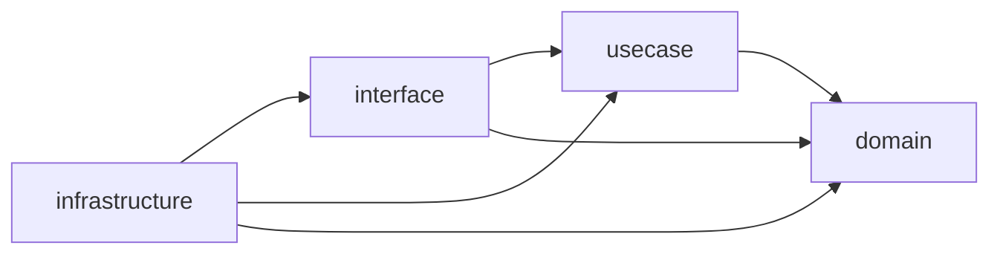

## はじめに

:::message

本記事は「DDD / クリーンアーキテクチャ」連載の1つです。Goプロジェクトでクリーンアーキテクチャの依存性ルールを静的解析とCIで強制する方法を解説します。各セクションの根拠となる一次情報源は、該当箇所に参照リンクを記載しています。

:::

クリーンアーキテクチャの最も重要なルールは「依存性は常に内側に向かう」という**依存性ルール**です。しかし、コードレビューで依存方向を目視チェックするのは限界があります。チームが大きくなるほど、うっかり外側のレイヤーをimportしてしまう事故は増えていきます。

私のチームでも、domain層からinfrastructure層のパッケージをimportしてしまうPRが月に数回発生していました。レビューで気づけば良いのですが、見落とすとアーキテクチャの崩壊が静かに進行します。

この記事では、Goの`import`文を静的解析ツールで検査し、CIパイプラインで依存性ルール違反を自動的に検出・ブロックする方法を紹介します。

---

## 依存性ルール違反が発生するパターン

まず、典型的なクリーンアーキテクチャのレイヤー構成を確認します。

```text
internal/order/
├── domain/           # エンティティ、値オブジェクト、Repository interface
├── usecase/          # アプリケーションロジック
├── interface/        # HTTPハンドラ、gRPCサーバー
└── infrastructure/   # DB実装、外部API連携
```

依存性ルールでは、内側のレイヤーが外側のレイヤーを知ってはいけません。



しかし、実際のプロジェクトでは次のような違反が起きがちです。

### パターン1：domain層からinfrastructure層への直接依存

```go
// ❌ domain/service/pricing.go
package service

import (
    "myapp/internal/order/infrastructure/postgres" // 違反！
)

func CalcPrice(orderID string) (int, error) {
    repo := postgres.NewOrderRepository() // domain層がDB実装を知っている
    order, err := repo.FindByID(orderID)
    // ...
}
```

domain層がPostgreSQLの存在を知ってしまうと、DBを変更するときにdomain層まで修正が必要になります。

### パターン2：usecase層からinterface層への逆方向依存

```go
// ❌ usecase/create_order.go
package usecase

import (
    "myapp/internal/order/interface/rest/dto" // 違反！
)

func (i *CreateOrderInteractor) Execute(req dto.CreateOrderRequest) error {
    // HTTPリクエストDTOに直接依存している
}
```

usecase層がHTTPのDTO構造体を知ってしまうと、gRPCやCLIなど別のインターフェースへの対応が困難になります。

### パターン3：パッケージ間の循環依存

```go
// ❌ usecase/interactor.go
import "myapp/internal/order/interface/rest/handler"

// ❌ interface/rest/handler/order_handler.go
import "myapp/internal/order/usecase"
```

Go言語ではパッケージの循環importはコンパイルエラーになるため、循環依存そのものは防げます。しかし、間接的な循環（A → B → C → A）は検出しづらい場合があります。

---

## depguard によるインポート制限の設定

[depguard](https://github.com/OpenPolicyAgent/depguard)は、パッケージごとに許可・拒否するimportを宣言的に設定できるツールです。[golangci-lint](https://golangci-lint.run/)に組み込まれているため、既存のlint環境にすぐ導入できます。

### 基本設定

`.golangci.yml`に以下のように設定します。

```yaml
linters:
  enable:
    - depguard

linters-settings:
  depguard:
    rules:
      domain-layer:
        files:
          - "**/domain/**"
        deny:
          - pkg: "myapp/internal/*/usecase"
            desc: "domain層はusecase層に依存できません"
          - pkg: "myapp/internal/*/usecase/**"
            desc: "domain層はusecase層に依存できません"
          - pkg: "myapp/internal/*/interface"
            desc: "domain層はinterface層に依存できません"
          - pkg: "myapp/internal/*/interface/**"
            desc: "domain層はinterface層に依存できません"
          - pkg: "myapp/internal/*/infrastructure"
            desc: "domain層はinfrastructure層に依存できません"
          - pkg: "myapp/internal/*/infrastructure/**"
            desc: "domain層はinfrastructure層に依存できません"

      usecase-layer:
        files:
          - "**/usecase/**"
        deny:
          - pkg: "myapp/internal/*/interface"
            desc: "usecase層はinterface層に依存できません"
          - pkg: "myapp/internal/*/interface/**"
            desc: "usecase層はinterface層に依存できません"
          - pkg: "myapp/internal/*/infrastructure"
            desc: "usecase層はinfrastructure層に依存できません"
          - pkg: "myapp/internal/*/infrastructure/**"
            desc: "usecase層はinfrastructure層に依存できません"
```

### 違反時の出力例

設定後に`golangci-lint run`を実行すると、違反があれば次のようなメッセージが表示されます。

```text
domain/service/pricing.go:5:2: import "myapp/internal/order/infrastructure/postgres"
  is not allowed because: domain層はinfrastructure層に依存できません (depguard)
```

エラーメッセージにルール違反の理由が表示されるため、開発者はなぜブロックされたのかをすぐに理解できます。

---

## go-cleanarch によるレイヤー検証

[go-cleanarch](https://github.com/roblaszczak/go-cleanarch)は、クリーンアーキテクチャに特化した依存性チェックツールです。ディレクトリ名からレイヤーを推定し、依存方向の違反を検出します。

### インストールと実行

```bash
go install github.com/roblaszczak/go-cleanarch@latest
go-cleanarch ./internal/...
```

### レイヤーの認識ルール

go-cleanarchはディレクトリ名をもとにレイヤーを判定します。デフォルトでは以下のマッピングが使われます。

| ディレクトリ名            | レイヤー                 |
| ------------------------- | ------------------------ |
| `domain`                  | Domain（最内層）         |
| `usecase`, `application`  | Application              |
| `interface`, `interfaces` | Interfaces               |
| `infrastructure`, `infra` | Infrastructure（最外層） |

### 実行結果の例

違反がある場合、以下のように出力されます。

```text
/internal/order/domain/service/pricing.go:5:
  domain layer cannot import from infrastructure layer
  (import: myapp/internal/order/infrastructure/postgres)
```

go-cleanarchの利点は、**設定ファイル不要**で導入コストが低い点です。ディレクトリ命名規約に従っていれば、即座に使い始められます。

---

## archunit-go による柔軟なアーキテクチャテスト

[archunit-go](https://github.com/nicognaW/archunit-go)は、Goのテストコードの中でアーキテクチャルールを宣言的に記述できるライブラリです。JVM向けの[ArchUnit](https://www.archunit.org/)にインスパイアされています。

### テストコードでルールを定義

```go
// architecture_test.go
package architecture_test

import (
    "testing"

    archunit "github.com/nicognaW/archunit-go"
)

func TestDependencyRule(t *testing.T) {
    t.Run("domain層は外側のレイヤーに依存しない", func(t *testing.T) {
        archunit.Package(t, "myapp/internal/order/domain/...").
            ShouldNotDependOn(
                "myapp/internal/order/usecase/...",
                "myapp/internal/order/interface/...",
                "myapp/internal/order/infrastructure/...",
            )
    })

    t.Run("usecase層はinterface層とinfrastructure層に依存しない", func(t *testing.T) {
        archunit.Package(t, "myapp/internal/order/usecase/...").
            ShouldNotDependOn(
                "myapp/internal/order/interface/...",
                "myapp/internal/order/infrastructure/...",
            )
    })

    t.Run("interface層はinfrastructure層に依存しない", func(t *testing.T) {
        archunit.Package(t, "myapp/internal/order/interface/...").
            ShouldNotDependOn(
                "myapp/internal/order/infrastructure/...",
            )
    })
}
```

### archunit-goの利点

archunit-goには他のツールにない特長があります。

- **Goのテストとして実行できる**: `go test`で依存性ルールを検証でき、既存のテスト基盤にそのまま組み込めます
- **柔軟なルール定義**: パッケージ単位だけでなく、特定の例外を許可するルールも書けます
- **テストレポートに統合**: CIのテスト結果レポートに依存性違反が含まれるため、見落としが減ります

---

## 3つのツールの比較

各ツールの特性を比較します。プロジェクトの状況に応じて使い分けてください。

| 項目 | depguard | go-cleanarch | archunit-go |
| --- | --- | --- | --- |
| 導入方法 | golangci-lint に組み込み | スタンドアロンCLI | テストコード |
| 設定 | YAML（`.golangci.yml`） | 設定不要（命名規約ベース） | Goテストコード |
| 柔軟性 | 高い（任意のパッケージを指定可） | 中程度（命名規約に依存） | 非常に高い（プログラマブル） |
| エラーメッセージ | カスタムメッセージ設定可 | 固定フォーマット | テスト失敗メッセージ |
| 実行コマンド | `golangci-lint run` | `go-cleanarch ./...` | `go test ./...` |
| 推奨シーン | 既にgolangci-lintを使っているプロジェクト | 素早く導入したいとき | 複雑なルールを定義したいとき |

私のチームでは、**depguard をメインに使い、archunit-go で補完する**構成に落ち着きました。depguardはgolangci-lintの一部として毎回実行され、archunit-goはテストスイートの中でより細かいルールを検証します。

---

## CI パイプラインへの組み込み

ツールを導入しただけでは不十分です。CIパイプラインに組み込んで、違反があるPRをマージできないようにすることが重要です。

### GitHub Actions の設定例

```yaml
# .github/workflows/architecture.yml
name: Architecture Check

on:
  pull_request:
    branches: [main]

jobs:
  dependency-rule:
    runs-on: ubuntu-latest
    steps:
      - uses: actions/checkout@v4

      - uses: actions/setup-go@v5
        with:
          go-version-file: "go.mod"

      - name: Run golangci-lint (depguard)
        uses: golangci/golangci-lint-action@v6
        with:
          version: latest

      - name: Run go-cleanarch
        run: |
          go install github.com/roblaszczak/go-cleanarch@latest
          go-cleanarch ./internal/...

      - name: Run architecture tests
        run: go test ./test/architecture/... -v
```

### ブランチ保護ルールとの連携

GitHub Actions のステータスチェックをブランチ保護ルールの必須チェックに追加すると、依存性ルール違反があるPRはマージボタンが無効化されます。

```text
Settings → Branches → Branch protection rules → main
  ✅ Require status checks to pass before merging
    ✅ dependency-rule
```

この設定により、コードレビューで見落としても、CIが最後の砦として依存性ルール違反をブロックします。

---

## 導入のステップと注意点

### 段階的に導入する

既存プロジェクトに一気に導入すると、大量の違反が検出されて対応が追いつかなくなります。私のチームでは以下の順序で導入しました。

1. **まずgo-cleanarchで現状を把握する**: 設定不要で実行でき、違反の全体像がつかめます
2. **depguardをwarningモードで導入する**: 最初はCIを失敗させず、違反を可視化するだけにします
3. **既存の違反を修正する**: モジュールごとに修正PRを作成し、段階的にクリーンにします
4. **CIを必須チェックに昇格する**: 既存の違反がゼロになった時点で、必須チェックに切り替えます

### よくある落とし穴

依存性ルールの自動チェックを導入する際に、私のチームが経験した落とし穴をいくつか共有します。

- **テストファイルの除外を忘れる**: `_test.go`ファイルではテスト用のモックやフィクスチャをimportする場合があります。depguardの`files`設定で`!**/*_test.go`を使い、テストファイルを除外できます
- **ルールが厳しすぎる**: 全てのimportを禁止するのではなく、レイヤー間の依存方向だけを制限します。同一レイヤー内のimportは自由にします
- **エラーメッセージが不親切**: depguardの`desc`フィールドに「なぜ禁止なのか」と「どうすべきか」を書くと、開発者が自力で修正できるようになります

```yaml
deny:
  - pkg: "myapp/internal/*/infrastructure/**"
    desc: >
      domain層からinfrastructure層へのimportは禁止されています。 DB操作が必要な場合は、domain/repositoryにinterfaceを定義し、 infrastructure層で実装してください。
```

---

## まとめ

クリーンアーキテクチャの依存性ルールは、コードレビューだけに頼ると必ずどこかで崩れます。Goの`import`文を静的解析ツールで検査し、CIで自動的にブロックすることで、アーキテクチャの一貫性を維持できます。

| ツール       | 特長                             | 導入コスト |
| ------------ | -------------------------------- | ---------- |
| depguard     | golangci-lint統合、柔軟な設定    | 低い       |
| go-cleanarch | 設定不要、即座に使える           | 非常に低い |
| archunit-go  | テストコードで宣言的にルール定義 | 中程度     |

大切なのは、ツールの選択よりも**CIで必須チェックにする**ことです。どんなに良いツールも、実行されなければ意味がありません。まずはgo-cleanarchで現状を把握し、depguardで段階的にルールを厳格化していくのがおすすめです。

---

## 参考文献

| 内容 | 出典 |
| --- | --- |
| クリーンアーキテクチャ原典 | Robert C. Martin, _Clean Architecture_（2017） |
| depguard | [OpenPolicyAgent/depguard - GitHub](https://github.com/OpenPolicyAgent/depguard) |
| go-cleanarch | [roblaszczak/go-cleanarch - GitHub](https://github.com/roblaszczak/go-cleanarch) |
| archunit-go | [nicognaW/archunit-go - GitHub](https://github.com/nicognaW/archunit-go) |
| golangci-lint | [golangci-lint 公式ドキュメント](https://golangci-lint.run/) |
| ArchUnit（JVM版） | [ArchUnit 公式サイト](https://www.archunit.org/) |
| GitHub Actions ステータスチェック | [GitHub Docs - Protected branches](https://docs.github.com/en/repositories/configuring-branches-and-merges-in-your-repository/managing-protected-branches/about-protected-branches) |
