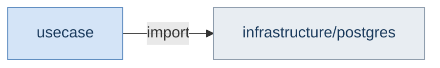
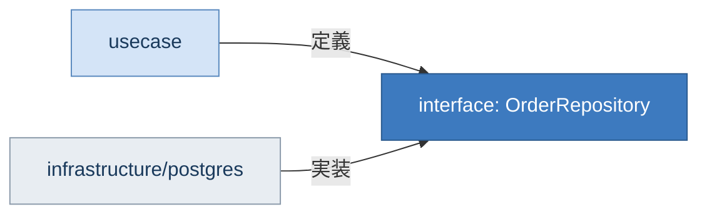

## はじめに

:::message

本記事は「DDD / クリーンアーキテクチャ」連載の1つです。クリーンアーキテクチャの同心円図にまつわる誤解を解き、本当に重要な「依存性の方向」と依存性逆転の原則（DIP）を解説します。各セクションの根拠となる一次情報源は、該当箇所に参照リンクを記載しています。

:::

クリーンアーキテクチャといえば、あの**同心円図**を思い浮かべる方が多いのではないでしょうか。Entities、Use Cases、Interface Adapters、Frameworks & Driversの4層が同心円状に配置された図です。


_※ 原典の同心円図は [The Clean Architecture（Robert C. Martin, 2012）](https://blog.cleancoder.com/uncle-bob/2012/08/13/the-clean-architecture.html) を参照してください。_

赤い矢印に注目してください。**すべての依存が外側から内側へ向かっています**。この「依存性ルール（Dependency Rule）」こそが、同心円図が伝えている最も重要なメッセージです。

私も最初にクリーンアーキテクチャを学んだとき、あの図の通りにレイヤーを4つ作り、ディレクトリを4階層に分割しました。「この図の通りに作ればクリーンアーキテクチャだ」と思い込んでいたのです。

しかし、原典である Robert C. Martin の著書を読み返すと、同心円図は本質の**一部分**を図解したものだと気づきました。本当に大事なのは**レイヤーの数や配置ではなく、依存性の方向**です。

---

## 同心円図の「よくある誤解」

### 誤解1：レイヤーは必ず4つ必要

同心円図を見ると、4つのレイヤーが明確に描かれています。そのため「4層にしなければクリーンアーキテクチャではない」と考えがちです。

しかし、原典にはこう書かれています。

> No rule that says you must always have just these four. However, The Dependency Rule always applies.
>
> — Robert C. Martin, _Clean Architecture_（2017）Chapter 22

レイヤーの数に制約はありません。3層や5層など、依存性ルールさえ守っていればクリーンアーキテクチャです。私のチームの小規模なマイクロサービスでは、`domain`と`adapter`の2層だけで運用しています。

### 誤解2：同心円の境界ごとにディレクトリを分ける必要がある

同心円図を忠実に再現しようとすると、`entities/`、`usecases/`、`adapters/`、`frameworks/`のようなディレクトリ構成になります。しかし、これはあくまで1つの実装例に過ぎません。

```text
# ❌ 同心円図を忠実に再現した構成（層で分割）
├── entities/
│   ├── order.go
│   └── user.go
├── usecases/
│   ├── create_order.go
│   └── register_user.go
├── adapters/
│   ├── order_handler.go
│   └── user_handler.go
└── frameworks/
    ├── order_repository.go
    └── user_repository.go
```

この構成では、1つの機能（例：注文）に関連するファイルが4つのディレクトリに散らばります。機能の追加・変更のたびに複数ディレクトリを横断する必要があり、変更の影響範囲がつかみにくくなります。

**モジュール（機能）でまず分割し、その中でレイヤーを分ける**方が実用的です。

```text
# ✅ モジュール × レイヤーで分割
internal/
├── order/
│   ├── domain/
│   ├── usecase/
│   ├── interface/
│   └── infrastructure/
└── user/
    ├── domain/
    ├── usecase/
    ├── interface/
    └── infrastructure/
```

### 誤解3：外側のレイヤーは「汚い」コード

ここでいう「汚い」コードとは、テストが書きにくく、変更時の影響範囲が読めず、責務が入り混じった保守性の低いコードを指します。同心円図の外側に「Frameworks & Drivers」と書かれているため、「外側は技術詳細を扱う場所だから、設計を気にしなくてよい」と誤解されることがあります。

実際には、外側のレイヤーにも設計品質は求められます。たとえば、infrastructure層のRepository実装でSQLの組み立てとエラーハンドリングが1つの関数に混在していれば、テストや修正が困難になります。外側のレイヤーが「汚くてもよい」のではなく、**ビジネスロジックに依存しないだけ**です。レイヤーの位置にかかわらず、責務の分離やテスト容易性は同じように重要です。

---

## 依存性逆転の原則（DIP）こそが本質

同心円図で本当に伝えたいことは、**依存性の矢印がすべて内側を向いている**という点です。これを支えているのが、SOLIDの「D」にあたる**依存性逆転の原則（Dependency Inversion Principle: DIP）**です。

> A. High-level modules should not depend on low-level modules. Both should depend on abstractions. B. Abstractions should not depend on details. Details should depend on abstractions.
>
> — Robert C. Martin, _Agile Software Development_（2002）

### DIPが解決する問題

DIPがない世界では、usecase層がinfrastructure層の具体的な実装に直接依存します。



この状態では、PostgreSQLからMongoDBに変更するとき、usecase層のコードまで修正が必要になります。ビジネスロジックが技術的な選択に振り回されてしまいます。

DIPを適用すると、usecase層がinterfaceを定義し、infrastructure層がそれを実装するように依存の方向が逆転します。



usecase層はinterfaceだけを知っていればよく、具体的な実装には一切依存しません。これが「依存性の逆転」です。

次のセクションでは、Goのimplicit interfaceを使ってこの依存性の逆転をさらに自然に実現する方法を見ていきます。

---

## レイヤー数ではなく依存の方向が重要

では、レイヤー数にこだわらなくても依存性ルールを守れることを、具体例で確認します。

### 2層でもクリーンアーキテクチャは成立する

小規模なマイクロサービスでは、2層構成でも依存性ルールを十分に守れます。

```text
internal/notification/
├── core/         # ビジネスロジック + interface定義
└── adapter/      # HTTPハンドラ + DB実装 + 外部API連携
```

:::message

コード例に登場する `Interactor` は、クリーンアーキテクチャ原典における Use Cases 層の実装を指す名称です。本連載の過去記事では説明のわかりやすさを優先して `UseCase` と表記していましたが、本記事では原典の用語に合わせて `Interactor` を使用しています。

:::

```go
// core/notifier.go
type MessageSender interface {
    Send(ctx context.Context, msg *Message) error
}

type NotifyInteractor struct {
    sender MessageSender
}

func (n *NotifyInteractor) Notify(ctx context.Context, userID string, body string) error {
    msg := &Message{UserID: userID, Body: body}
    return n.sender.Send(ctx, msg)
}
```

```go
// adapter/slack_sender.go
type SlackSender struct {
    client *slack.Client
}

func (s *SlackSender) Send(ctx context.Context, msg *core.Message) error {
    // Slack APIを呼び出す
    return nil
}
```

`adapter`は`core`に依存しますが、`core`は`adapter`の存在を知りません。2層であっても依存性ルールは守られています。

### 5層にしても方向が間違っていれば意味がない

逆に、5層に分けても依存の方向が間違っていれば、クリーンアーキテクチャではありません。

```go
// ❌ 5層あるが、domain層がinfrastructure層をimportしている
package domain

import "myapp/internal/order/infrastructure/cache" // 依存性ルール違反

type OrderService struct {
    cache *cache.RedisCache // domain層がRedisを直接知っている
}
```

**レイヤー数を増やしても、依存の方向が内側を向いていなければ、設計の恩恵は得られません。**

---

## Go の interface による自然な DIP 実現

多くの言語ではDIPの実現に明示的なinterfaceの宣言と実装が必要です。一方、Goでは **implicit interface（暗黙的なinterface満足）** によって、より自然にDIPを実現できます。

### Java/C# との比較

Javaでは、interfaceを定義した側と実装する側の両方が、そのinterfaceの存在を知る必要があります。

```java
// 定義側（usecase層）
public interface OrderRepository {
    Order findById(String id);
}

// 実装側（infrastructure層）— interfaceを明示的にimplements
public class PostgresOrderRepository implements OrderRepository {
    @Override
    public Order findById(String id) { /* ... */ }
}
```

Goでは、実装側がinterfaceの存在を知る必要がありません。

```go
// 定義側（usecase層）
type OrderRepository interface {
    FindByID(ctx context.Context, id string) (*Order, error)
}

// 実装側（infrastructure層）— interfaceの存在を知らない
type postgresOrderRepository struct {
    db *sql.DB
}

func (r *postgresOrderRepository) FindByID(ctx context.Context, id string) (*Order, error) {
    // PostgreSQLからOrderを取得する
    return nil, nil
}
```

`postgresOrderRepository`は`OrderRepository`をimportしていません。メソッドシグネチャが一致するだけで、自動的にinterfaceを満たします。この仕組みにより、**import文レベルでの依存が発生しない**ため、依存性ルールの遵守がより自然に実現できます。

### 利用側でinterfaceを定義するパターン

さらにGoらしいアプローチとして、interfaceを**利用する側**で定義する方法があります。このパターンの実践的な適用例は、連載記事「[Goでクリーンアーキテクチャを導入するとinterfaceが爆発する問題への処方箋](https://zenn.dev/135yshr/articles/f2027369b648cc)」の処方箋1で詳しく解説しています。

```go
// usecase/create_order.go
// 利用側が必要なメソッドだけinterfaceとして定義
type orderSaver interface {
    Save(ctx context.Context, order *domain.Order) error
}

type CreateOrderInteractor struct {
    saver orderSaver
}

func (i *CreateOrderInteractor) Execute(ctx context.Context, input CreateOrderInput) error {
    order := domain.NewOrder(input.CustomerID, input.Items)
    return i.saver.Save(ctx, order)
}
```

```go
// infrastructure/postgres/order_repository.go
// このinterfaceの存在を知らない
type orderRepository struct {
    db *sql.DB
}

func (r *orderRepository) Save(ctx context.Context, order *domain.Order) error {
    // INSERTクエリを実行
    return nil
}

func (r *orderRepository) FindByID(ctx context.Context, id string) (*domain.Order, error) {
    // SELECTクエリを実行
    return nil, nil
}
```

`CreateOrderInteractor`は`Save`メソッドだけを持つ小さなinterfaceを定義しています。`orderRepository`は`Save`と`FindByID`の両方を持っていますが、`CreateOrderInteractor`は`Save`だけしか知りません。これはインターフェース分離の原則（ISP）に沿った設計です。

### コンパイル時の検証

Goでは、interface満足をコンパイル時に検証するイディオムがあります。

```go
// cmd/main.go（コンポジションルート）
var _ usecase.OrderRepository = (*postgres.OrderRepository)(nil)
```

この1行により、`OrderRepository`がinterfaceを満たさなくなった場合にコンパイルエラーが発生します。実行時ではなくコンパイル時に検出できるため、安全です。この検証コードは、すべての依存関係を把握しているコンポジションルート（`main.go`やDIの設定ファイル）に配置します。そうすることで、infrastructure層からusecase層への依存を避けられます。

---

## 同心円図の正しい読み方

ここまでの内容を踏まえて、同心円図を改めて正しく読み直します。

### 同心円図が伝えていること

- **依存性の矢印は常に内側を向きます**: これが唯一絶対のルールです
- **内側ほど安定性が高いです**: ビジネスルールは技術選択より変更頻度が低いため、内側に配置します
- **外側は交換可能です**: データベースやUIフレームワークは差し替えられる設計にします

### 同心円図が伝えていないこと

- **レイヤーの数**: 4つでなくても構いません
- **ディレクトリ構成**: 図はパッケージ構成を規定していません
- **具体的な命名規則**: `Entities`や`Use Cases`はあくまで例示です
- **レイヤーの厚さ**: 各レイヤーのコード量や複雑さには言及していません

### チェックリスト

自分のプロジェクトが依存性ルールを守っているか確認するためのチェックリストです。

| チェック項目 | 確認方法 |
| --- | --- |
| domain層は外側のレイヤーをimportしていないか | `go-cleanarch`や`depguard`で検証 |
| usecase層はHTTPやDBの具体的な型を参照していないか | import文をgrepで検索 |
| interfaceは利用側で定義されているか | interface定義の配置場所を確認 |
| 依存性の注入はmain関数（またはDIコンテナ）で行っているか | `main.go`や`wire.go`を確認 |
| 新しいレイヤーを追加するとき、既存の内側レイヤーに変更は不要か | 思考実験で検証 |

---

## まとめ

クリーンアーキテクチャの同心円図は、依存性ルールを視覚的に表現した優れた図解です。しかし、図の形を忠実に再現することが目的になってしまうと、本質を見失います。

本当に大事なのは以下の3つです。

1. **依存性は常に内側に向かう**（依存性ルール）
2. **抽象に依存し、具象に依存しない**（DIP）
3. **レイヤーの数はプロジェクトの規模に合わせて調整する**

Goのimplicit interfaceは、DIPを自然に実現できる強力な仕組みです。interfaceを利用側で定義し、実装側がその存在を知らないまま満足する。このGoの特性を活かすことで、同心円図に描かれた「依存性の矢印がすべて内側を向く」状態を、import文レベルで実現できます。

同心円図の「形」ではなく「矢印の方向」に注目してください。

---

## 参考文献

| 内容 | 出典 |
| --- | --- |
| クリーンアーキテクチャ原典 | Robert C. Martin, _Clean Architecture_（2017） |
| 依存性逆転の原則 | Robert C. Martin, _Agile Software Development, Principles, Patterns, and Practices_（2002） |
| SOLID原則 | Robert C. Martin, [The Principles of OOD](http://butunclebob.com/ArticleS.UncleBob.PrinciplesOfOod) |
| Go Code Review Comments | Go Wiki, [Go Code Review Comments](https://go.dev/wiki/CodeReviewComments#interfaces) |
| Go Proverbs | Rob Pike, [Go Proverbs](https://go-proverbs.github.io/) |
| Hexagonal Architecture | Alistair Cockburn, [Hexagonal Architecture](https://alistair.cockburn.us/hexagonal-architecture/) |
