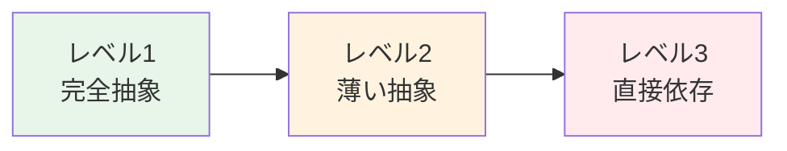
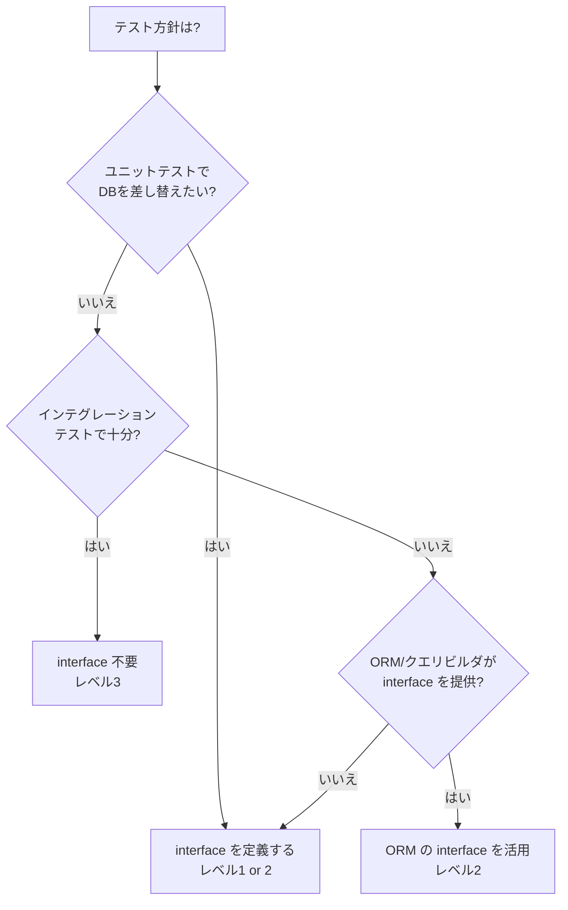

## はじめに

:::message

本記事はDDD/クリーンアーキテクチャ連載の一部です。GoにおけるRepositoryパターンの適用レベルについて、実務での判断基準を紹介します。主要な主張の根拠となる一次情報源は、該当箇所および末尾の参考文献に記載しています。

:::

GoでDDDやクリーンアーキテクチャを導入すると、ほぼ確実に「Repository interface」が登場します。ドメイン層にinterfaceを定義し、infrastructure層で具体的なデータベースアクセスを実装するパターンです。

しかし実務では、「このinterface、本当に必要なのか」と疑問に感じる場面が出てきます。sqlc が生成するコードは十分にテスタブルですし、ent のスキーマ定義はドメインモデルに近い表現力を持っています。**DB依存を完全に剥がすことがゴールではなく、プロジェクトの状況に応じた適切な抽象化レベルを選ぶことが重要です**。

この記事では、Repositoryの抽象化を3つのレベルに分類し、それぞれのメリット・デメリットとGoのエコシステムとの相性を整理します。

---

## Repository パターンの本来の目的

Eric Evans は Repository パターンの目的をこう述べています。

> A REPOSITORY represents all objects of a certain type as a conceptual set (usually emulated). It acts like a collection, yet with more elaborate querying capability.
>
> — Eric Evans, _Domain-Driven Design_（2003）

Martin Fowler もこう補足しています。

> Mediates between the domain and data mapping layers using a collection-like interface for accessing domain objects.
>
> — Martin Fowler, [P of EAA: Repository](https://martinfowler.com/eaaCatalog/repository.html)

どちらも強調しているのは、Repository は**コレクションのように振る舞う抽象**だということです。SQLを隠蔽することが目的ではなく、ドメインオブジェクトの永続化と取得を「集合操作」として表現することがねらいです。

---

## 3つの抽象化レベル

私はGoのプロジェクトでRepositoryの抽象化を以下の3レベルに分類しています。



### レベル1：完全抽象（ドメイン層にinterface定義）

教科書的なDDDのアプローチです。ドメイン層にRepository interfaceを定義し、infrastructure層で実装します。Go の「利用側で interface を定義する」慣習に従い、usecase 層の各 Interactor が必要なメソッドだけを持つ小さな interface を定義する方法と併用できます。本記事では Reader/Writer の分離を `domain/repository` に置く例を示しますが、Interactor ごとにさらに絞り込む方法については[連載 #2](https://zenn.dev/and_and_and/articles/f2027369b648cc)で詳しく解説しています。

```go
// domain/repository/task_repository.go
package repository

type TaskReader interface {
    FindByID(ctx context.Context, id string) (*model.Task, error)
    FindByStatus(ctx context.Context, status model.TaskStatus) ([]*model.Task, error)
}

type TaskWriter interface {
    Save(ctx context.Context, task *model.Task) error
    Delete(ctx context.Context, id string) error
}
```

```go
// infrastructure/postgres/task_repository.go
package postgres

type taskRepository struct {
    db *sql.DB
}

// TaskReader と TaskWriter の両方を満たす
// 呼び出し側は必要な interface 型の変数に代入して使う
func NewTaskRepository(db *sql.DB) *taskRepository {
    return &taskRepository{db: db}
}

func (r *taskRepository) FindByID(ctx context.Context, id string) (*model.Task, error) {
    row := r.db.QueryRowContext(ctx,
        "SELECT id, title, status, created_at FROM tasks WHERE id = $1", id)
    // ...スキャンとドメインモデルへの変換
}

func (r *taskRepository) Save(ctx context.Context, task *model.Task) error {
    _, err := r.db.ExecContext(ctx,
        `INSERT INTO tasks (id, title, status, created_at)
         VALUES ($1, $2, $3, $4)
         ON CONFLICT (id) DO UPDATE SET title = $2, status = $3`,
        task.ID(), task.Title(), task.Status(), task.CreatedAt())
    return err
}
```

**向いているケース：**

- DBの種類を将来変更する可能性がある場合（PostgreSQL → DynamoDB 等）
- 複数のストレージを使い分ける場合（RDB + Redis + S3）
- ドメインモデルとDBスキーマに大きな乖離がある場合

### レベル2：薄い抽象（ORM/クエリビルダーの型をそのまま活用）

sqlc や ent が生成する型をusecase層でそのまま使い、テスト時はinterfaceで差し替えるアプローチです。usecase層が生成コード（infrastructure由来）の型に直接依存するため、[クリーンアーキテクチャの依存関係ルール](https://blog.cleancoder.com/uncle-bob/2012/08/13/the-clean-architecture.html)には厳密に違反します。このトレードオフを受け入れられるかがレベル2を採用する際の判断ポイントです。

sqlc はデフォルトでメソッドを持つ `Queries` 構造体を生成します。`sqlc.yaml` で `emit_interface: true` を設定すると、さらに `Querier` interface が生成されます。この `Querier` interface をそのまま利用すれば、テスト時にモックへ差し替えられます。

```go
// sqlc が生成する Queries 構造体と Querier interface
// db/queries.go (generated)

// Queries 構造体（デフォルトで生成される）
type Queries struct {
    db DBTX
}

// Querier interface（emit_interface: true 時に生成される）
type Querier interface {
    GetTask(ctx context.Context, id string) (Task, error)
    ListTasksByStatus(ctx context.Context, status string) ([]Task, error)
    CreateTask(ctx context.Context, arg CreateTaskParams) (Task, error)
    UpdateTask(ctx context.Context, arg UpdateTaskParams) error
}
```

```go
// usecase/task_interactor.go
type TaskInteractor struct {
    queries db.Querier  // sqlc の生成した Querier interface をそのまま使う
}

func (i *TaskInteractor) GetTask(ctx context.Context, id string) (*TaskOutput, error) {
    row, err := i.queries.GetTask(ctx, id)
    if err != nil {
        return nil, err
    }
    return &TaskOutput{
        ID:     row.ID,
        Title:  row.Title,
        Status: row.Status,
    }, nil
}
```

**向いているケース：**

- DBの種類が固定されている場合
- ドメインモデルとDBスキーマがほぼ一致している場合
- sqlc / ent の interface をそのままテスト用のモックとして使える場合

レベル2では、sqlc の生成エラー（`sql.ErrNoRows` 等）が usecase 層にそのまま漏れる点にも注意が必要です。[連載 #5](https://zenn.dev/and_and_and/articles/56e161aff29ff9)で解説したエラー変換の仕組みを入れるか、handler 層で infrastructure 固有のエラーを変換する必要があります。

### レベル3：直接依存（抽象化なし）

Repository interfaceを作らず、infrastructure層の実装を直接使います。

```go
// usecase/task_interactor.go
type TaskInteractor struct {
    db *sql.DB  // データベース接続を直接保持
}

func (i *TaskInteractor) GetTask(ctx context.Context, id string) (*TaskOutput, error) {
    row := i.db.QueryRowContext(ctx,
        "SELECT id, title, status FROM tasks WHERE id = $1", id)
    // ...
}
```

**向いているケース：**

- プロトタイプや小規模ツールの場合
- DBアクセスが数箇所に限定されている場合
- テストではテスト用DBを使う方針の場合

---

## Go ORM との共存パターン

GoのORM/クエリジェネレーターそれぞれと、Repository パターンの相性を整理します。

### sqlc：レベル2と好相性

[sqlc](https://sqlc.dev/) はSQLファイルからGoのコードを生成するツールです。前述のとおり `emit_interface: true` を設定すると `Querier` interface が生成されるため、これをテスト時のモック差し替えに活用できます。

```sql
-- query/task.sql
-- name: GetTask :one
SELECT id, title, status, created_at FROM tasks WHERE id = $1;

-- name: ListTasksByStatus :many
SELECT id, title, status, created_at FROM tasks WHERE status = $1;
```

sqlc が生成する `Querier` interface をそのまま使う方法と、利用側で必要なメソッドだけに絞った interface を定義する方法の2つがあります。

前者はシンプルですが、usecase層が `Querier` の全メソッドに依存します。後者は Go の「利用側で interface を定義する」慣習に沿った方法で、依存するメソッドを明示できます。

```go
// usecase/task_interactor.go

// 利用側で必要なメソッドだけに絞った interface を定義する
type taskQuerier interface {
    GetTask(ctx context.Context, id string) (db.Task, error)
    ListTasksByStatus(ctx context.Context, status string) ([]db.Task, error)
}

type TaskInteractor struct {
    q taskQuerier // sqlc の Queries は暗黙的にこの interface を満たす
}
```

このパターンでは、Interface Segregation Principle に従い、usecase が実際に使うメソッドだけに依存を限定できます。一方、sqlc の `Querier` をそのまま使えばこの定義自体を省略できるため、プロジェクトの規模に応じて選択してください。

### ent：レベル1〜2の間

[ent](https://entgo.io/) はスキーマ定義からGoのコードを生成するORMです。エンティティの関連やバリデーションをスキーマで定義できるため、DDDのドメインモデルに近い表現力があります。

```go
// ent/schema/task.go
func (Task) Fields() []ent.Field {
    return []ent.Field{
        field.String("id").Unique(),
        field.String("title").NotEmpty(),
        field.Enum("status").Values("draft", "active", "done"),
        field.Time("created_at").Default(time.Now),
    }
}
```

ent のクライアントは構造体なので、モックに差し替えるには interface の定義が必要です。ただし、[enttest](https://entgo.io/docs/testing/) パッケージを使えば SQLite インメモリ DB でテスト用クライアントを生成できるため、interface なしでもインテグレーションテストは可能です。モックによるユニットテストが必要な場合は、完全抽象（レベル1）として Repository を定義し、内部で ent クライアントを使う方法が一般的です。

```go
// infrastructure/entadapter/task_repository.go
type taskRepository struct {
    client *ent.Client
}

func (r *taskRepository) FindByID(ctx context.Context, id string) (*model.Task, error) {
    t, err := r.client.Task.Get(ctx, id)
    if err != nil {
        return nil, err
    }
    return toModel(t), nil
}
```

### GORM：レベル1を推奨

[GORM](https://gorm.io/) は `*gorm.DB` を中心に操作するため、モックによるユニットテストでは interface が必要です。ただし、GORM は SQLite（インメモリ）ドライバをサポートしているため、インテグレーションテストであれば interface なしでも高速にテストを実行できます。モックによるユニットテストが必要な場合や、DB固有の挙動へ依存しない設計にしたい場合は、Repository interface で包む方法をおすすめします。

```go
// infrastructure/gormadapter/task_repository.go
type taskRepository struct {
    db *gorm.DB
}

func (r *taskRepository) Save(ctx context.Context, task *model.Task) error {
    record := toRecord(task)
    return r.db.WithContext(ctx).Save(record).Error
}
```

### 各ツールと推奨レベルのまとめ

| ツール | 推奨レベル | 理由 |
| --- | --- | --- |
| sqlc | レベル2（薄い抽象） | 生成される interface がそのままモック可能 |
| ent | レベル1〜2 | スキーマの表現力が高い。クライアントは interface 化が必要 |
| GORM | レベル1（完全抽象） | モックには interface が必要。SQLite インメモリなら interface 不要 |
| database/sql | レベル1（完全抽象） | [go-sqlmock](https://github.com/DATA-DOG/go-sqlmock) でもテスト可能だが、抽象化の恩恵が大きい |

---

## テスタビリティとのトレードオフ

「テストのためだけにinterfaceを作るべきか」はGoコミュニティでも議論が続くテーマです。私の判断基準を整理します。

### interface を作るべきケース

```go
// ユニットテストでDBアクセスを差し替えたい場合
type taskReader interface {
    FindByID(ctx context.Context, id string) (*model.Task, error)
}

func TestGetTaskInteractor(t *testing.T) {
    mock := &mockTaskReader{
        task: &model.Task{/* テストデータ */},
    }
    interactor := NewGetTaskInteractor(mock)
    result, err := interactor.Execute(ctx, "task-1")
    // ...アサーション
}
```

ユニットテストの高速化やCI環境でのDB不要化が目的なら、interfaceは正当なコストです。

### interface を作らなくてよいケース

テストでもデータベースを使う（インテグレーションテスト）方針であれば、interfaceは不要な場合があります。

```go
func TestGetTask_Integration(t *testing.T) {
    if testing.Short() {
        t.Skip("skipping integration test")
    }
    db := setupTestDB(t)
    repo := postgres.NewTaskRepository(db)
    interactor := NewGetTaskInteractor(repo)
    // ...実DBに対してテスト
}
```

[testcontainers-go](https://github.com/testcontainers/testcontainers-go) を使えば、CIでもDockerコンテナ上のDBに対してテストを実行できます。この場合、Repository interfaceなしでもテスタビリティは確保されます。

### 判断フローチャート



---

## 実務での判断基準

最終的に、どのレベルを採用するかはプロジェクトの状況によります。以下のチェックリストを参考にしてください。

| 質問                                           | Yes →        | No →        |
| ---------------------------------------------- | ------------ | ----------- |
| DBの種類を将来変更する可能性があるか           | レベル1      | レベル2以下 |
| ドメインモデルとDBスキーマに大きな差異があるか | レベル1      | レベル2     |
| ユニットテストでDBを差し替えたいか             | レベル1 or 2 | レベル3     |
| 複数人で同じ Repository を変更するか           | レベル1 or 2 | 自由        |
| プロトタイプ段階か                             | レベル3      | -           |

重要なのは、**最初から完全抽象を目指さなくてもよい**ということです。Go のimplicit interfaceを活かせば、後からinterfaceを追加しても既存の実装コードを変更する必要がありません。

以下のコード例は、クリーンアーキテクチャ導入前のレベル3の状態から、段階的にレベル1へ引き上げるリファクタリングの流れを示しています。Step 1 はリファクタリング前の状態であり、usecase 層が infrastructure 層の具体型に直接依存しています。この依存関係ルール違反を解消するのが Step 2 です。

```go
// Step 1: リファクタリング前（レベル3 — usecase が infrastructure に直接依存）
type TaskInteractor struct {
    repo *postgres.TaskRepository  // 具体型を直接参照（依存関係ルール違反）
}

// Step 2: interface を導入して依存関係を逆転（レベル1）
type taskReader interface {
    FindByID(ctx context.Context, id string) (*model.Task, error)
}

type TaskInteractor struct {
    reader taskReader  // interface に差し替え
}
// postgres.TaskRepository は暗黙的に taskReader を満たすため、既存の実装コードの変更は不要
```

Go の implicit interface により、Step 2 で `taskReader` を追加しても `postgres.TaskRepository` のコードを変更する必要はありません。これがレベル3から始めても安全だと言える理由です。

---

## まとめ

| レベル            | 概要                            | 適用場面                 |
| ----------------- | ------------------------------- | ------------------------ |
| レベル1：完全抽象 | ドメイン層に interface 定義     | 大規模・DB変更可能性あり |
| レベル2：薄い抽象 | ORM/生成コードの interface 活用 | sqlc 利用・中規模        |
| レベル3：直接依存 | 抽象化なし                      | プロトタイプ・小規模     |

Repository パターンの本質は「DB依存の排除」ではなく、「ドメインオブジェクトの集合操作を表現する」ことです。過度な抽象化は複雑性を増し、抽象化の不足はテスタビリティを損ないます。プロジェクトの規模、チーム構成、テスト方針に応じて**適切なレベルを選ぶ**ことが大切です。

Go のimplicit interfaceは「後から抽象化を追加しても既存コードを変更しなくてよい」という大きな利点を持っています。迷ったら**レベル3から始めて、必要になった時点でレベル2やレベル1に引き上げる**のが、Go らしいアプローチだと私は考えています。

---

## 参考文献

| 内容 | 出典 |
| --- | --- |
| Repository パターンの定義 | Eric Evans, _Domain-Driven Design_（2003） |
| Repository の概要 | Martin Fowler, [P of EAA: Repository](https://martinfowler.com/eaaCatalog/repository.html) |
| Go の interface 設計原則 | Go Wiki, [Go Code Review Comments](https://go.dev/wiki/CodeReviewComments#interfaces) |
| sqlc 公式ドキュメント | [sqlc.dev](https://sqlc.dev/) |
| ent 公式ドキュメント | [entgo.io](https://entgo.io/) |
| GORM 公式ドキュメント | [gorm.io](https://gorm.io/) |
| testcontainers-go | [github.com/testcontainers/testcontainers-go](https://github.com/testcontainers/testcontainers-go) |
