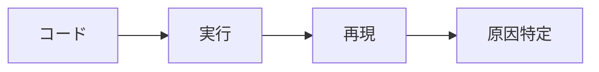
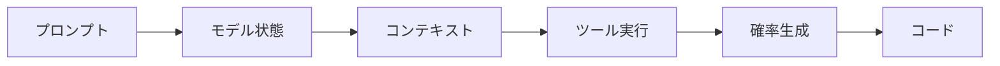

## フォレンジック視点で理解するLLMコーディングの本質

:::message

フォレンジック（デジタル・フォレンジック）とは、単なる原因調査ではありません。証拠を保全し、何が起きたのかを第三者に説明可能な形で再現・証明するための調査技術です。目的は「誰が・いつ・何をしたか」の説明責任（accountability）を成立させることにあります。

:::

従来のソフトウェア開発では、ソースコードとコミット履歴を追跡すれば、変更の理由や責任の所在を比較的明確に辿れました。しかしLLMを用いた開発では、コミット履歴だけでは変更理由を説明できなくなります。

AIでコードを書いていると、次のような経験はありませんか。

- 同じプロンプトなのに違うコードが出る
- バグを再現できない
- もう一度生成させると直ってしまう

これは偶然ではなく、LLMの欠陥でもありません。LLMが確率的生成（stochastic
generation）という性質を持つためです。

## 従来の開発とLLM開発の違い

従来の開発では、コードの作者は人間です。意図が存在し、思考プロセスを説明できます。

一方、LLM開発ではコードの作者が確率モデルです。意図は存在せず、同じ入力に見えても生成条件が少しでも異なると結果が変わります。

問題の本質はAIそのものではなく、「観測できない状態への依存」にあります。

## なぜ追跡できないのか

### 1. 確率的生成（stochastic generation）

LLMはランダムではありません。温度（temperature）やサンプリング設定（top-p,
top-k）、コンテキストといった状態に依存して結果を生成します。つまり「同じプロンプト」が実は同じではない、というのが本質です。

たとえば、Go で書いた API クライアント関数に対して「この関数をリトライ対応にして」と複数回依頼すると、以下のように実装が分かれました。

- ある回は固定間隔（1秒）でリトライし、リトライ処理を別関数に分割した
- 別の回は指数バックオフ（1秒 × 試行回数）を採用し、同様に別関数へ分割した
- さらに別の回はリトライを単一関数内にインラインで実装し、500系エラーのみリトライ・4xx は即エラーとした

どれも正しいコードですが、待機方式・関数構造・リトライ対象の判定がすべて異なります。

### 2. コンテキスト依存

- 開いているファイル
- 直前の会話
- IDE拡張が送信するコンテキスト（周辺コードやLSP情報）

すべて入力に影響します。

「ユーザー情報を取得する API エンドポイントを実装して」と同じプロンプトを、異なるコンテキストで試しました。JWT認証ミドルウェアの相談をした直後のセッションでは、認証は実装済みという前提で単一ユーザーを返すだけのシンプルなエンドポイントが生成されました。一方、新しいセッションで同じプロンプトを投げると、サンプルデータ付きの一覧取得・ID指定取得を備えた包括的な実装が返ってきました。直前の会話が「何を省略してよいか」の判断に影響しています。

### 3. ツール呼び出し

検索、テスト実行、ファイル読み込みなどの結果も入力になります。

入力バリデーション関数のリファクタリングを依頼する際、テスト失敗結果を渡したセッションでは結果が大きく変わりました。空文字エラー・文字数超過・XSS文字列の検出漏れを示すテスト結果を渡すと、トリム処理・文字数制限・正規表現による危険文字の拒否を含む実装が生成されます。一方、テスト結果なしで同じ関数のリファクタリングを依頼すると、関数名を短縮しただけでバリデーションは追加されませんでした。ツール実行結果が「何を修正すべきか」の判断を左右しています。

## フォレンジック問題と解決の方向性

LLMは「コード」を直接生成しているのではなく、状態に依存してトークン列を生成しており、その結果としてコードが得られます。生成されたコードは「設計されたソース」というより、その時の生成過程の結果に近いものです。

つまり、追跡すべき対象はソースコードではなく、生成を引き起こしたイベントです。

- プロンプト
- コンテキスト（会話履歴・参照ファイル）
- モデルバージョン・サンプリング設定
- ツール実行履歴
- 応答

これらを記録するには、以下のようなアプローチがあります。

- セッション記録ツール（Entire など）でプロンプト・応答・ツール実行をコミットに紐づける
- Line Attribution で人間と AI の貢献割合を自動算出する
- PRテンプレートにAIセッションへのリンク欄を設ける
- レビュー時にコードだけでなく生成過程を確認対象にする（「[コードを読むのをやめた——AIが書いたコードはどうレビューするのか](https://zenn.dev/135yshr/articles/f14c01658cd157)」で詳述）

LLM時代のフォレンジックは「コードの監査」ではなく「生成過程の監査」です。コードの差分だけでなく「なぜそのコードが生まれたか」を追跡できる仕組みが、説明責任を成立させるための現実的な解になります。

導入方法や背景については「[AIがコードを書く時代、Gitだけでは監査できない](https://zenn.dev/135yshr/articles/978121945958ed)」で詳しく解説しています。
