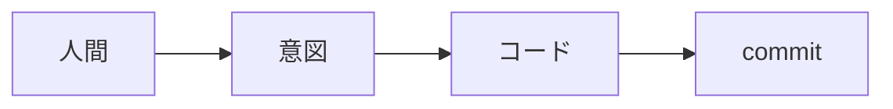
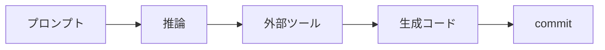
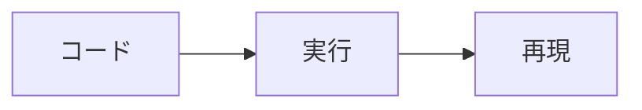
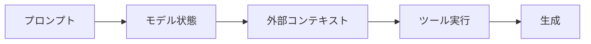
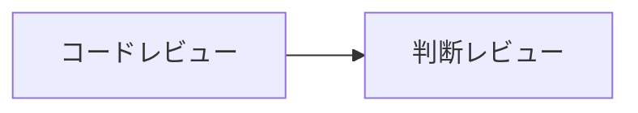

**Claude Code + Entire で「なぜこのコードが生まれたか」を追跡する**

## はじめに

Claude Code や Cursor を使って開発していると、こんな経験はありませんか。

- PRの差分が大きすぎてレビューできない
- なぜその実装になったのか説明できない
- バグの原因が人とAIのどちらか分からない
- 同じコードを再生成できない

これはスキルの問題ではありません。

これはツールの問題ではなく、ソフトウェア開発における「証跡（evidence）」の単位が、コードから生成過程へ移動したという構造変化です。

「[AI生成コードはなぜ追跡できないのか](https://zenn.dev/135yshr/articles/8d2e5d90eafe05)」では、LLMの確率的生成がフォレンジックを困難にする原因を整理しました。本記事では、その問題に対して Git の限界と具体的な解決策を示します。

## Gitは「ファイルの変更履歴」を管理するツール

Git はファイルの変更履歴を管理するツールです。従来の開発では、コミット履歴を辿れば変更の理由や責任の所在を追跡できました。



Gitが記録するのは以下です。

- 誰が変更したか
- 何を変更したか（diff）

しかしAI開発で本当に重要なのは「なぜこのコードが生成されたのか」です。

AIによる生成の流れはこうなります。



Gitが保存するのは最後の commit だけです。

つまり、**最も重要な「生成過程」が記録されていません。**

## 再現性の消失

従来のバグ調査は以下の流れです。



AI開発のバグ調査は以下の流れです。



同じコードを再生成できないケースが発生します。これは偶然ではなく、再生成時の条件（モデル状態・コンテキスト・ツール実行結果）が記録されていないためです。

たとえば、認証モジュールのリファクタリングを Claude
Code に依頼したところ、翌日に同じプロンプトで再生成したコードが前回と異なる実装になっていました。前回のコードでパスしていたテストが失敗し、原因を調べようにも「なぜ前回はあの実装になったのか」を追跡する手段がありませんでした。

出力されたコードだけでは原因を特定できず、証拠として説明可能な形で原因を追跡すること（フォレンジック）が困難になります。

## レビューが成立しなくなる

従来のレビューは以下を目的としていました。

- 設計意図の確認
- バグ検出

しかしAI生成コードでは以下の特徴があります。

- 差分が巨大
- 一見整っている
- もっともらしい

Code Tempo というサービスを Claude
Code で新規作成した際、PR の差分は 4,356 行になりました。ファイル構成は整っており、テストもパスしていましたが、レビュアーは全体を確認しきれず、そのまま approve するしかありませんでした。

### 人間の認知限界

数千行の差分は人間には検証不能です。AI生成コードは一貫性が高く、文法も正しく、説明可能に見えます。しかし安全とは限りません。

Code
Tempo では後から精査した結果、ハイドレーションミスマッチや入力バリデーション不足、セキュリティ問題が複数見つかりました。いずれもレビュー時には気づけなかったものです。

### "もっともらしさ"問題

LLMは自然なコードを書きますが、正しいとは限りません。結果としてレビューは「問題なさそう」という確認に変わりがちです。

これは検証ではありません。

レビュー対象は**コードそのものではなく、判断過程**に移っています。



差分ではなく、なぜその実装か、どの情報を基にしたかを確認する必要があります。具体的なレビュー手法については「[コードを読むのをやめた——AIが書いたコードはどうレビューするのか](https://zenn.dev/135yshr/articles/f14c01658cd157)」で詳しく解説しています。

## 必要なのは「生成来歴（AI Provenance）」

従来は変更履歴で十分でしたが、AI開発では生成来歴の記録が必要です。誰が何を入力し、どのモデルが何を参照し、どのような過程で何を出力したか。追跡すべき情報は以下です。

- プロンプト
- AIの応答
- 参照した情報（会話履歴・ファイル・外部コンテキスト）
- 実行されたツールとその結果

つまりコードではなく「生成過程」を追跡できる必要があります。

## 解決アプローチの一例

この問題を解決するアプローチはいくつかあります。

- 生成ログの保存
- エージェント監査
- セッション記録

その一例として Entire があります。

Entire は、AIセッション（プロンプト・応答・ツール実行）をコミットと紐づけて保存する仕組みです。

| 管理対象 | ツール                     |
| -------- | -------------------------- |
| 成果物   | Git                        |
| 生成来歴 | Entireなどのセッション記録 |

## 最小導入

Homebrew でインストールします。

```bash
brew tap entireio/tap && brew install entireio/tap/entire
```

プロジェクトのリポジトリで有効化します。

```bash
entire enable
```

エージェント選択画面が表示されるので、Claude Code を選択します。`.claude/settings.json`
にフックが追加され、セッションの記録が有効になります。

あとは普段通りです。

- ブランチ作成
- Claude Code で実装
- commit
- PR

コミットのたびに、セッション（プロンプト・応答・ツール実行）が `entire/checkpoints/v1`
ブランチへ自動保存されます。作業ブランチには影響しません。コミットメッセージにはチェックポイント ID がトレーラーとして付与されます。

```text
Entire-Checkpoint: a3b2c4d5e6f7
Entire-Attribution: 73% agent (146/200 lines)
```

Line Attribution により、人間と AI の貢献割合も自動算出されます。

記録状況は `entire status` で確認できます。また [entire.io](https://entire.io) の Web
UI からセッションの閲覧・検索も可能です。

チェックポイント一覧では、各コミットに紐づくセッション数・変更行数・トークン数が一目で分かります。


PR 上のチェックポイント ID から Web
UI に遷移すれば、レビュアーがプロンプトと応答を直接確認できます。


## 導入時の補助設定

PRにAIセッションを表示するにはPRテンプレートの設定が有効です。具体的な手順は「[GitHubのPRテンプレートを0から作る方法](https://zenn.dev/135yshr/articles/499cd6335b5fa6)」を参照してください。

CIからログ用ブランチを除外するには、GitHub Actions のブランチフィルターに除外設定を追加します。

```yaml
# .github/workflows/ci.yml
on:
  push:
    branches-ignore:
      - "entire/**"
  pull_request:
    branches-ignore:
      - "entire/**"
```

## まとめ

AI開発時代に必要なのは変更履歴ではありません。

**生成来歴（AI Provenance）です。**

Git だけでは「何が変わったか」は分かります。しかし「なぜ変わったか」は分かりません。証跡の単位がコードから生成過程へ移動した以上、生成来歴を記録する仕組みが説明責任を支える基盤になります。
