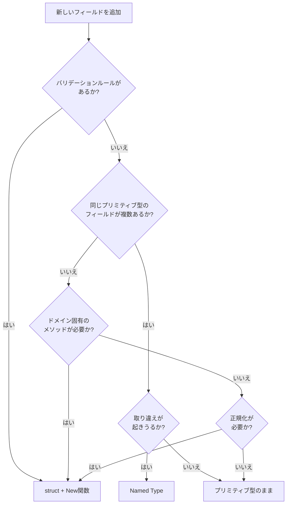

## はじめに

:::message

本記事はDDD/クリーンアーキテクチャ連載の一部です。Goで値オブジェクト（Value Object）をどの粒度で作るべきかについて、実務での判断基準を紹介します。各セクションの根拠となる一次情報源は、該当箇所に参照リンクを記載しています。

:::

DDDの戦術設計を学ぶと、「プリミティブ型をそのまま使わず、値オブジェクトにしましょう」というアドバイスに出会います。メールアドレスは `string` ではなく `Email` 型に、金額は `int` ではなく `Money` 型にする、というものです。

この考え方は正しいのですが、Go で実践すると**すべてのフィールドを値オブジェクトへ変えたくなる衝動**に駆られます。その結果、型が爆発し、かえってコードの可読性と開発速度が落ちるケースを私は経験しました。

この記事では、**値オブジェクトを作る「コスパ」の良いラインはどこか**を、Go の型システムの特性を踏まえて整理します。

---

## 値オブジェクトとは

Eric Evans は値オブジェクトをこう定義しています。

> An object that represents a descriptive aspect of the domain with no conceptual identity is called a VALUE OBJECT. VALUE OBJECTS are instantiated to represent elements of the design that we care about only for what they are, not who or which they are.
>
> — Eric Evans, _Domain-Driven Design_（2003）

値オブジェクトの特性を整理すると以下のとおりです。

| 特性                       | 説明                           |
| -------------------------- | ------------------------------ |
| 識別子を持たない           | 値が等しければ同一とみなす     |
| 不変（immutable）          | 生成後に状態を変更しない       |
| 自己完結的なバリデーション | 不正な値の存在を許さない       |
| ドメイン知識を表現する     | 型名がビジネスの語彙を反映する |

---

## Primitive Obsession（プリミティブ型への執着）のリスク

値オブジェクトを作らずプリミティブ型をそのまま使い続けると、**Primitive Obsession** と呼ばれるコードスメルが発生します。

```go
// ❌ すべてが string
func CreateUser(name string, email string, phone string, role string) error {
    // name と email を取り違えてもコンパイルが通ってしまう
}

// 呼び出し側で引数の順番を間違えてもエラーにならない
CreateUser("user@example.com", "田中太郎", "admin", "090-1234-5678")
```

Martin Fowler はこの問題について次のように述べています。

> Primitive Obsession is using primitive data types to represent domain ideas. For example, we might use a string to represent a phone number or an integer to represent an amount of money.
>
> — Martin Fowler, [Refactoring](https://refactoring.com/)

Primitive Obsession のリスクは以下の3点です。

- **型安全性の欠如**: 引数の取り違えがコンパイル時に検出できません
- **バリデーションの散在**: メールアドレスのフォーマットチェックが複数箇所に重複します
- **ドメイン知識の喪失**: `string` からは「これがメールアドレスである」という情報が読み取れません

---

## 値オブジェクト過剰のコスト

一方で、すべてのフィールドを値オブジェクトにすると別の問題が生じます。

```go
// ❌ 過剰な値オブジェクト化
type UserName struct{ value string }
type UserAge struct{ value int }
type UserBio struct{ value string }
type UserCreatedAt struct{ value time.Time }

type User struct {
    id        UserID
    name      UserName
    age       UserAge
    email     Email
    phone     Phone
    bio       UserBio
    role      Role
    createdAt UserCreatedAt
}
```

この設計のコストを考えてみます。

- **ボイラープレートの増大**: 型ごとにNew関数、ゲッター、`String()` メソッドが必要です
- **変換コストの増加**: APIレスポンスやDBレコードとの相互変換で `user.Name().Value()` のようなアクセスが増えます
- **認知負荷の上昇**: チームの新規メンバーが「`UserBio` は `string` と何が違うのか」と疑問を抱きます

値オブジェクトを作ることにはコストがかかります。**コストに見合う効果がなければ、プリミティブ型のままの方が良い**です。

---

## 判断基準：値オブジェクトを作るべき4つの条件

私が実務で使っている判断基準は以下の4つです。**1つでも該当すれば値オブジェクトにする価値がある**と考えています。

### 条件1：バリデーションルールがある

フォーマットや範囲に制約がある値は、値オブジェクトにする効果が高いです。

```go
// domain/model/email.go
type Email struct {
    value string
}

func NewEmail(v string) (Email, error) {
    if v == "" {
        return Email{}, errors.New("メールアドレスは必須です")
    }
    if strings.Count(v, "@") != 1 {
        return Email{}, fmt.Errorf("メールアドレスの形式が不正です: %s", v)
    }
    parts := strings.SplitN(v, "@", 2)
    if parts[0] == "" || parts[1] == "" || !strings.Contains(parts[1], ".") {
        return Email{}, fmt.Errorf("メールアドレスの形式が不正です: %s", v)
    }
    normalized := parts[0] + "@" + strings.ToLower(parts[1])
    return Email{value: normalized}, nil
}

func (e Email) String() string { return e.value }
func (e Email) Domain() string {
    parts := strings.SplitN(e.value, "@", 2)
    return parts[1]
}
```

バリデーションが値オブジェクトに集約されるため、usecase層やhandler層でのチェックが不要になります。

### 条件2：型の取り違えを防ぎたい

同じプリミティブ型が複数の意味で使われる場合、値オブジェクトで区別します。

```go
type UserID struct{ value string }
type OrderID struct{ value string }
type ProductID struct{ value string }

// ✅ 型が異なるのでコンパイルエラーになる
func FindOrder(id OrderID) (*Order, error) { /* ... */ }

var userID UserID = NewUserID("user-1")
FindOrder(userID)  // コンパイルエラー！
```

### 条件3：ドメイン固有の振る舞いがある

値に対する操作がビジネスルールを反映している場合は、値オブジェクトにメソッドを持たせます。

```go
type Money struct {
    amount   int
    currency string
}

func NewMoney(amount int, currency string) (Money, error) {
    if amount < 0 {
        return Money{}, errors.New("金額は0以上でなければなりません")
    }
    if currency == "" {
        return Money{}, errors.New("通貨コードは必須です")
    }
    // 注: 実際のプロダクションコードでは ISO 4217 コードの検証を追加する
    return Money{amount: amount, currency: currency}, nil
}

func (m Money) Add(other Money) (Money, error) {
    if m.currency != other.currency {
        return Money{}, fmt.Errorf("通貨が異なります: %s と %s", m.currency, other.currency)
    }
    return Money{amount: m.amount + other.amount, currency: m.currency}, nil
}

func (m Money) Multiply(quantity int) (Money, error) {
    if quantity < 0 {
        return Money{}, fmt.Errorf("乗数は0以上でなければなりません: %d", quantity)
    }
    return Money{amount: m.amount * quantity, currency: m.currency}, nil
}
```

異なる通貨同士の加算を型レベルで防げます。これはプリミティブの `int` では表現できないドメインルールです。

### 条件4：正規化が必要

入力値を正規化して保持する場合、値オブジェクトで一元化します。

```go
type Phone struct {
    value string
}

func NewPhone(v string) (Phone, error) {
    // ハイフン、スペース、括弧を除去して正規化
    normalized := strings.Map(func(r rune) rune {
        if r >= '0' && r <= '9' || r == '+' {
            return r
        }
        return -1
    }, v)
    if len(normalized) < 10 {
        return Phone{}, errors.New("電話番号は10桁以上必要です")
    }
    return Phone{value: normalized}, nil
}
```

---

## Go の型定義の使い分け

Go には値オブジェクトを表現する方法がいくつかあり、それぞれ特性が異なります。

### Named Type（名前付き型）

```go
type UserID string
type Amount int
```

最も軽量なアプローチです。新しい型として扱われるため、型安全性が得られます。

```go
type UserID string
type OrderID string

var uid UserID = "user-1"
var oid OrderID = uid  // コンパイルエラー！型が異なる
```

ただし、バリデーションなしでも値を代入できてしまいます。

```go
var uid UserID = ""  // 空文字もUserIDとして有効になってしまう
```

### struct による値オブジェクト

```go
type Email struct {
    value string
}
```

非公開フィールドとNew関数の組み合わせで、バリデーション付きの値オブジェクトを実現します。前述の `Email` の例がこのパターンです。

比較可能なフィールドのみからなる struct は `==` 演算子で比較できます。

```go
e1, _ := NewEmail("user@example.com")
e2, _ := NewEmail("user@example.com")
fmt.Println(e1 == e2) // true
```

非公開フィールドでも同一パッケージ内では `==` が使えます。`map` や `slice` をフィールドに持つ場合は `==` が使えないため、その場合は `Equals` メソッドを実装します。

### 使い分けの指針

| 方法                   | バリデーション | 型安全性 | ボイラープレート | 適用場面               |
| ---------------------- | -------------- | -------- | ---------------- | ---------------------- |
| プリミティブ型そのまま | なし           | なし     | なし             | 内部的な一時変数       |
| Named Type             | なし           | あり     | 少               | ID類、ステータス定数   |
| struct + New関数       | あり           | あり     | 多               | メール、金額、電話番号 |

---

## 実務でのライン引き：具体例

実際のプロジェクトで私がどのようにライン引きしているかを、ユーザー管理ドメインを例に示します。

```go
// domain/model/user.go

// ✅ Named Type：ID は型の取り違え防止だけで十分
type UserID string

func NewUserID(v string) (UserID, error) {
    if v == "" {
        return "", errors.New("ユーザーIDは必須です")
    }
    return UserID(v), nil
}

// ✅ struct + New：バリデーションと正規化が必要
type Email struct {
    value string
}

// ✅ struct + New：ドメイン固有の振る舞いがある
type Role struct {
    value string
}

const (
    roleAdmin  = "admin"
    roleEditor = "editor"
    roleViewer = "viewer"
)

func NewRole(v string) (Role, error) {
    allowed := map[string]bool{roleAdmin: true, roleEditor: true, roleViewer: true}
    if !allowed[v] {
        return Role{}, fmt.Errorf("無効なロールです: %s", v)
    }
    return Role{value: v}, nil
}

func (r Role) CanEdit() bool {
    return r.value == roleAdmin || r.value == roleEditor
}

func (r Role) IsAdmin() bool {
    return r.value == roleAdmin
}

// ✅ プリミティブ型のまま：特別なルールがない
type User struct {
    id        UserID
    name      string    // バリデーションは「空でないこと」程度
    email     Email
    role      Role
    bio       string    // 自由入力テキスト、制約なし
    createdAt time.Time // 標準ライブラリの型で十分
}
```

`name` と `bio` はプリミティブ型のままです。理由は以下のとおりです。

- `name` は「空でないこと」のチェックだけで、New関数内で検証すれば十分です。`UserName` 型にしても `String()` を返すだけのラッパーになります
- `bio` は自由入力テキストで、フォーマット制約もドメイン固有の振る舞いもありません
- `createdAt` は `time.Time` という標準ライブラリの型がすでに十分な表現力を持っています

---

## enum 的な値オブジェクト：iota と Named Type

Go では `enum` キーワードがありませんが、`iota` と Named Type の組み合わせで列挙型を表現できます。

```go
type OrderStatus int

const (
    OrderStatusDraft OrderStatus = iota + 1
    OrderStatusConfirmed
    OrderStatusShipped
    OrderStatusDelivered
    OrderStatusCancelled
)

func (s OrderStatus) String() string {
    names := map[OrderStatus]string{
        OrderStatusDraft:     "draft",
        OrderStatusConfirmed: "confirmed",
        OrderStatusShipped:   "shipped",
        OrderStatusDelivered: "delivered",
        OrderStatusCancelled: "cancelled",
    }
    if name, ok := names[s]; ok {
        return name
    }
    return "unknown"
}

var orderStatusTransitions = map[OrderStatus][]OrderStatus{
    OrderStatusDraft:     {OrderStatusConfirmed, OrderStatusCancelled},
    OrderStatusConfirmed: {OrderStatusShipped, OrderStatusCancelled},
    OrderStatusShipped:   {OrderStatusDelivered},
    OrderStatusDelivered: {},
    OrderStatusCancelled: {},
}

func (s OrderStatus) CanTransitionTo(next OrderStatus) bool {
    for _, allowed := range orderStatusTransitions[s] {
        if allowed == next {
            return true
        }
    }
    return false
}
```

`iota + 1` で開始することで、ゼロ値（0）を「未設定」として検出できるようにしています。これは Go の値オブジェクトでよく使われるテクニックです。ただし、`OrderStatus(99)` のような範囲外の値は型システムだけでは防げません。不正値を防ぐには `NewOrderStatus` コンストラクタを用意するのが一般的です。

---

## アンチパターン：値オブジェクトのゲッター地獄

値オブジェクトを作りすぎると、上位層での変換処理が冗長になります。

```go
// ❌ すべてが値オブジェクト化されていると変換が冗長
func toResponse(user *model.User) *UserResponse {
    return &UserResponse{
        ID:        user.ID().String(),
        Name:      user.Name().Value(),
        Email:     user.Email().String(),
        Phone:     user.Phone().Value(),
        Bio:       user.Bio().Value(),
        Role:      user.Role().String(),
        CreatedAt: user.CreatedAt().Value().Format(time.RFC3339),
    }
}

// ✅ 適切な粒度なら変換もシンプル
func toResponse(user *model.User) *UserResponse {
    return &UserResponse{
        ID:        string(user.ID()),
        Name:      user.Name(),        // string がそのまま返る
        Email:     user.Email().String(),
        Bio:       user.Bio(),          // string がそのまま返る
        Role:      user.Role().String(),
        CreatedAt: user.CreatedAt().Format(time.RFC3339),
    }
}
```

変換の冗長さは、値オブジェクトが過剰であるシグナルです。

---

## 判断フローチャート



---

## まとめ

| 判断基準               | 値オブジェクトにする     | プリミティブ型のまま |
| ---------------------- | ------------------------ | -------------------- |
| バリデーションルール   | あり → struct + New      | なし or 単純         |
| 型の取り違えリスク     | 高い → Named Type        | 低い                 |
| ドメイン固有の振る舞い | あり → struct + メソッド | なし                 |
| 正規化の必要性         | あり → struct + New      | なし                 |

値オブジェクトは「すべてのフィールドに作るもの」ではなく、**コストに見合う効果がある場所に限定して作るもの**です。Go の Named Type は軽量な型安全性を提供し、struct + New関数は完全なバリデーション付きの値オブジェクトを実現します。この2つを使い分けることで、過剰な型定義を避けつつ、ドメインの重要なルールを型で表現できます。

迷ったときは「この型を作ることで、バグを防げるか、ドメイン知識を表現できるか」と自問してください。答えが Yes なら作る価値はあります。No なら、プリミティブ型のままにしておくのが Go らしいシンプルな選択です。

---

## 参考文献

| 内容 | 出典 |
| --- | --- |
| 値オブジェクトの定義 | Eric Evans, _Domain-Driven Design_（2003） |
| Primitive Obsession | Martin Fowler, [Refactoring](https://refactoring.com/) |
| Go の型システム | [The Go Programming Language Specification](https://go.dev/ref/spec#Types) |
| Go の命名規約 | [Effective Go](https://go.dev/doc/effective_go#names) |
| Named Type と Type Alias の違い | [Go Spec: Type definitions](https://go.dev/ref/spec#Type_definitions) および [Alias declarations](https://go.dev/ref/spec#Alias_declarations) |
| iota の使い方 | [Go Spec: Iota](https://go.dev/ref/spec#Iota) |
