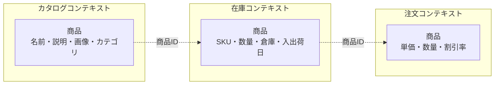
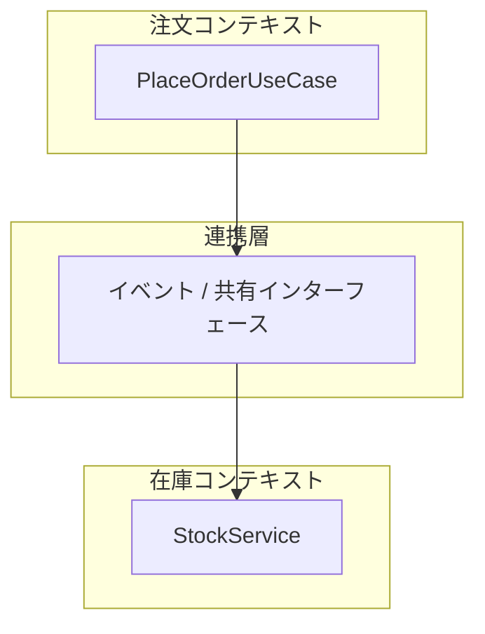

## はじめに

:::message

本記事はDDD/クリーンアーキテクチャ連載の一部です。境界づけられたコンテキストをGoのモジュール構成としてどう表現するかを、実装例を交えて解説します。各セクションの根拠となる一次情報源は、該当箇所に参照リンクを記載しています。

:::

DDDで戦術的パターン（エンティティ、値オブジェクト、リポジトリ等）を導入しても、モジュール境界が曖昧なままだとドメインモデルが肥大化し、変更の影響範囲が広がっていきます。この問題を解決する戦略的パターンが**境界づけられたコンテキスト（Bounded Context）**です。

本記事では、境界づけられたコンテキストの概念を整理した上で、Goの`internal`パッケージやGo Workspaceを活用してモジュール境界をコードレベルで表現する方法を紹介します。

---

## 境界づけられたコンテキストとは

境界づけられたコンテキストは、Eric Evansが『Domain-Driven Design』で提唱した概念です。特定のドメインモデルが有効な範囲を明示的に区切ることで、モデルの一貫性を保ちます。

> A Bounded Context delimits the applicability of a particular model. Bounding Contexts gives team members a clear and shared understanding of what has to be consistent and what can develop independently.
>
> — Eric Evans, _Domain-Driven Design: Tackling Complexity in the Heart of Software_（2003）

たとえばECサイトを考えてみます。「商品」という概念は、カタログ管理と在庫管理では異なる属性を持ちます。



同じ「商品」でも、コンテキストごとに必要な属性やふるまいは異なります。これを1つの`Product`構造体にまとめると、全コンテキストの関心の混在した巨大な構造体ができあがります。境界づけられたコンテキストは、この問題を**モデルの適用範囲を明示的に区切る**ことで解決します。

---

## Go の internal パッケージによるアクセス制御

Goには`internal`パッケージという仕組みがあります。`internal`ディレクトリ配下のコードは、その親ディレクトリのツリー内からしかインポートできません。

> An import of a path containing the element "internal" is disallowed if the importing code is outside the tree rooted at the parent of the "internal" directory.
>
> — [Go Command Documentation](https://pkg.go.dev/cmd/go#hdr-Internal_Directories)

この仕組みを利用すると、境界づけられたコンテキスト間のアクセスを**コンパイラレベルで制御**できます。

### ディレクトリ構成の例

ECサイトのカタログ、在庫、注文という3つのコンテキストを`internal`パッケージで分離してみます。

```text
myapp/
├── go.mod
├── cmd/
│   └── server/
│       └── main.go
├── internal/
│   ├── catalog/          # カタログコンテキスト
│   │   ├── domain/
│   │   │   ├── product.go
│   │   │   └── category.go
│   │   ├── usecase/
│   │   │   └── register_product.go
│   │   └── infra/
│   │       └── postgres/
│   │           └── product_repo.go
│   ├── inventory/        # 在庫コンテキスト
│   │   ├── domain/
│   │   │   ├── stock.go
│   │   │   └── warehouse.go
│   │   ├── usecase/
│   │   │   └── adjust_stock.go
│   │   └── infra/
│   │       └── postgres/
│   │           └── stock_repo.go
│   └── order/            # 注文コンテキスト
│       ├── domain/
│       │   ├── order.go
│       │   └── order_item.go
│       ├── usecase/
│       │   └── place_order.go
│       └── infra/
│           └── postgres/
│               └── order_repo.go
└── pkg/
    └── shared/           # 共有カーネル（後述）
        └── money.go
```

### コンテキストごとのドメインモデル

各コンテキストの`Product`は、そのコンテキストに必要な属性だけを持ちます。

```go
// internal/catalog/domain/product.go
package domain

import "myapp/pkg/shared"

type Product struct {
    ID          string
    Name        string
    Description string
    ImageURL    string
    CategoryID  string
    Price       shared.Money
}
```

```go
// internal/inventory/domain/stock.go
package domain

type Stock struct {
    ProductID   string
    SKU         string
    Quantity    int
    WarehouseID string
    LastUpdated time.Time
}
```

カタログコンテキストの`Product`は商品名や説明文を持ちますが、在庫数は知りません。在庫コンテキストの`Stock`はSKUや数量を持ちますが、商品名は知りません。これが境界づけられたコンテキストによるモデルの分離です。

### アクセス制御の効果

`internal/catalog/`配下のコードは、`internal/inventory/`から直接インポートできません。

```go
// ❌ コンパイルエラー：internal パッケージのアクセス制限
// internal/inventory/usecase/adjust_stock.go
import "myapp/internal/catalog/domain"  // 不可
```

コンテキスト間の通信が必要な場合は、明示的な連携層を設ける必要があります。これにより、暗黙的な依存を防げます。

---

## Go Workspace を使ったマルチモジュール構成

プロジェクトが成長し、各コンテキストの独立性をさらに高めたい場合は、Go 1.18で導入された**Go Workspace**が有効です。

> Go workspaces let you work on multiple modules simultaneously without having to edit go.mod files for each module.
>
> — [Go Workspaces Tutorial](https://go.dev/doc/tutorial/workspaces)

### マルチモジュール構成の例

各コンテキストを独立した`go.mod`を持つモジュールとして分離します。

```text
myapp/
├── go.work
├── cmd/
│   └── server/
│       ├── go.mod
│       └── main.go
├── catalog/
│   ├── go.mod
│   ├── domain/
│   │   └── product.go
│   ├── usecase/
│   │   └── register_product.go
│   └── infra/
│       └── postgres/
│           └── product_repo.go
├── inventory/
│   ├── go.mod
│   ├── domain/
│   │   └── stock.go
│   ├── usecase/
│   │   └── adjust_stock.go
│   └── infra/
│       └── postgres/
│           └── stock_repo.go
├── order/
│   ├── go.mod
│   ├── domain/
│   │   └── order.go
│   ├── usecase/
│   │   └── place_order.go
│   └── infra/
│       └── postgres/
│           └── order_repo.go
└── shared/
    ├── go.mod
    └── money.go
```

### go.work ファイル

```go
// go.work
go 1.22

use (
    ./cmd/server
    ./catalog
    ./inventory
    ./order
    ./shared
)
```

### 各モジュールの go.mod

```go
// catalog/go.mod
module myapp/catalog

go 1.22

require myapp/shared v0.0.0
```

```go
// inventory/go.mod
module myapp/inventory

go 1.22

require myapp/shared v0.0.0
```

### internal パッケージとの使い分け

| 観点           | internal パッケージ | Go Workspace                         |
| -------------- | ------------------- | ------------------------------------ |
| 分離の粒度     | ディレクトリレベル  | モジュールレベル                     |
| 依存管理       | 1つの go.mod        | モジュールごとに go.mod              |
| ビルドの独立性 | 全体を一括ビルド    | モジュール単位でビルド可能           |
| CI/CDの柔軟性  | 全体を一括テスト    | 変更のあったモジュールだけテスト可能 |
| 導入コスト     | 低い                | やや高い                             |
| 推奨規模       | 小〜中規模          | 中〜大規模                           |

小規模なプロジェクトでは`internal`パッケージで十分です。チームが複数に分かれ、各コンテキストの開発サイクルが異なる場合にGo Workspaceへの移行を検討します。

---

## モノレポでのコンテキスト境界の引き方

モノレポでは、すべてのコンテキストが同じリポジトリに存在します。物理的な分離がないため、境界を維持するための工夫が必要です。

### コンテキスト間の通信パターン

コンテキスト間で通信が必要な場合、いくつかのパターンがあります。



#### パターン1：共有インターフェースによる連携

コンテキスト間の連携ポイントを明示的なインターフェースとして定義します。

```go
// shared/stockchecker.go
package shared

import "context"

// StockChecker は在庫確認のための共有インターフェースです。
// 注文コンテキストが在庫コンテキストに問い合わせる際に使用します。
type StockChecker interface {
    IsAvailable(ctx context.Context, productID string, quantity int) (bool, error)
}
```

```go
// order/usecase/place_order.go
package usecase

import (
    "context"
    "myapp/shared"
)

type PlaceOrderUseCase struct {
    stockChecker shared.StockChecker
    orderRepo    orderWriter
}

func (uc *PlaceOrderUseCase) Execute(ctx context.Context, input PlaceOrderInput) (*PlaceOrderOutput, error) {
    available, err := uc.stockChecker.IsAvailable(ctx, input.ProductID, input.Quantity)
    if err != nil {
        return nil, fmt.Errorf("在庫確認に失敗しました: %w", err)
    }
    if !available {
        return nil, ErrOutOfStock
    }
    // 注文処理
    order := domain.NewOrder(input.ProductID, input.Quantity, input.UnitPrice)
    if err := uc.orderRepo.Save(ctx, order); err != nil {
        return nil, fmt.Errorf("注文の保存に失敗しました: %w", err)
    }
    return &PlaceOrderOutput{OrderID: order.ID}, nil
}
```

#### パターン2：ドメインイベントによる非同期連携

コンテキスト間の結合度をさらに下げたい場合は、ドメインイベントを使います。

```go
// shared/event.go
package shared

import "time"

// DomainEvent はコンテキスト間で伝達されるイベントの基底型です。
type DomainEvent struct {
    ID         string
    OccurredAt time.Time
}

// OrderPlaced は注文が確定したことを表すイベントです。
type OrderPlaced struct {
    DomainEvent
    OrderID   string
    ProductID string
    Quantity  int
}
```

```go
// shared/eventbus.go
package shared

import "context"

// EventPublisher はドメインイベントを発行するインターフェースです。
type EventPublisher interface {
    Publish(ctx context.Context, event any) error
}

// EventSubscriber はドメインイベントを購読するインターフェースです。
type EventSubscriber interface {
    Subscribe(ctx context.Context, eventType string, handler func(ctx context.Context, event any) error) error
}
```

```go
// inventory/usecase/handle_order_placed.go
package usecase

import (
    "context"
    "myapp/shared"
)

type HandleOrderPlaced struct {
    stockRepo stockWriter
}

func (h *HandleOrderPlaced) Handle(ctx context.Context, event any) error {
    e, ok := event.(*shared.OrderPlaced)
    if !ok {
        return nil
    }
    return h.stockRepo.Decrease(ctx, e.ProductID, e.Quantity)
}
```

### 境界を維持するためのチェックリスト

モノレポでコンテキスト境界を維持するために、私は以下の点を意識しています。

- **直接インポートの禁止**: コンテキスト間で`internal`パッケージを直接インポートしないようにします。CI で`go vet`やカスタムlintルールを使って検出できます
- **共有は最小限に**: `shared`パッケージには値オブジェクトやイベント定義のみを配置します。ドメインロジックは各コンテキスト内に閉じ込めます
- **IDでの参照**: コンテキスト間でエンティティを参照する場合は、構造体の直接参照ではなくIDを使います
- **命名の独立性**: 各コンテキストで同じ概念（商品、ユーザー等）に異なる名前を付けることを恐れないようにします。カタログの`Product`と在庫の`Stock`は別の型です

---

## まとめ

| 観点 | アプローチ | 効果 |
| --- | --- | --- |
| モデルの分離 | コンテキストごとにドメインモデルを定義する | 各モデルが必要な属性だけを持つ |
| アクセス制御 | `internal`パッケージで公開範囲を制限する | コンパイラレベルで依存を制御できる |
| モジュール独立性 | Go Workspaceで各コンテキストを独立モジュールにする | ビルド・テストの独立性が高まる |
| コンテキスト間連携 | 共有インターフェースまたはドメインイベントを使う | 結合度を最小限に保てる |

境界づけられたコンテキストは、DDDの中でも特に実務的な価値が高い概念です。Goの`internal`パッケージやGo Workspaceは、この概念をコードレベルで強制する手段として機能します。まずは`internal`パッケージで始め、プロジェクトの成長に合わせてGo Workspaceへの移行を検討するのがおすすめです。

---

## 参考文献

| 内容 | 出典 |
| --- | --- |
| 境界づけられたコンテキストの原典 | Eric Evans, _Domain-Driven Design: Tackling Complexity in the Heart of Software_（2003） |
| 境界づけられたコンテキストの解説 | Martin Fowler, [BoundedContext](https://martinfowler.com/bliki/BoundedContext.html) |
| Go internal パッケージ | [Go Command Documentation - Internal Directories](https://pkg.go.dev/cmd/go#hdr-Internal_Directories) |
| Go Workspace | [Tutorial: Getting started with multi-module workspaces](https://go.dev/doc/tutorial/workspaces) |
| ドメインイベント | Vaughn Vernon, _Implementing Domain-Driven Design_（2013） |
| Go モジュール設計 | [Go Modules Reference](https://go.dev/ref/mod) |
