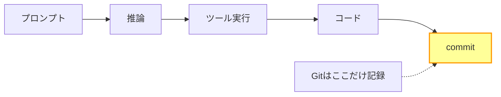

**「差分を読む」から「判断を読む」へ——レビューの単位が変わった**

## はじめに

AI 生成コードのレビューが難しいという認識は、もはや共通認識になりました。「設計の妥当性を見ろ」「リスクの 3 軸で評価しろ」といった提案も出ています。しかし、設計を見ようにも「なぜその設計になったのか」がわからなければ、妥当性の判断はできません。

本記事では、判断の過程を記録・追跡する仕組みで、この問題を具体的に解決する方法を示します。

「[AIがコードを書く時代、Gitだけでは監査できない](https://zenn.dev/135yshr/articles/978121945958ed)」では Git の限界と生成来歴（AI Provenance）の必要性を整理しました。本記事はその実践編です。

<!-- prettier-ignore-start -->
<!-- textlint-disable ja-technical-writing/ja-no-mixed-period -->
:::message
本記事では判断過程の記録ツールとして Entire を紹介しています。私は Entire の開発元との間に金銭的・資本的関係はなく、一ユーザーとして利用しています。判断過程の記録という概念自体は Entire に限定されるものではなく、Claude Code の会話ログの手動保存や、独自のセッション記録ツールでも実現可能です。本記事では Entire を具体例として用います。
:::
<!-- textlint-enable ja-technical-writing/ja-no-mixed-period -->
<!-- prettier-ignore-end -->

## 4,356行のPRが承認された日

Code Tempo というサービスを Claude Code で新規作成した際、PRの差分は 4,356 行になりました。

### レビュアーは何を確認したか

自分でレビューしました。CI が通っていることを確認し、主要なファイルをいくつか開き、テスト環境で動作確認もしました。

しかし確認できなかったことがあります。

- なぜこのディレクトリ構成になったのか
- なぜこの抽象化が選ばれたのか
- コードが本当に正しいかどうか

作成された内容が多すぎて細部まで確認できず、結局そのまま approve しました。

### "問題なさそう"は検証ではない

私の経験では、LLM が生成するコードは一貫性が高く、文法も正しく、命名も自然な傾向があります。これはレビュアーにとって「問題を発見しにくい」ことを意味します。

実際に Code Tempo のコードを後から精査すると、以下の問題が見つかりました。

- SSR 中に `localStorage` を読み取るハイドレーションミスマッチ
- `parseInt` の NaN 未チェックや `profile.id` の null 未処理
- Stripe の webhook secret の一部がログに出力されるセキュリティ問題

これらは人間のエンジニアでも起こし得るバグです。問題は AI が書いたことではなく、4,356 行という差分のレビューが不十分で見逃したことにあります。コード自体が整っていたため「問題なさそう」と感じましたが、その感覚は検証ではありません。

## コードレビューが前提にしていたこと

従来のコードレビューには暗黙の前提がありました。

- 人間が意図を持って書いています
- コードに意図が反映されています
- 不明点は作者に聞けます


この前提は、AIエージェントが数百の判断を自律的に行ってコードを生成する開発では成立しません。コードの作者に「なぜこうしたのか」を聞けない以上、レビューには別の手段が必要です。

## AIコードにコードレビューが効かない理由

### 差分の巨大化

4,356 行の差分は人間の認知能力を超えています。これは偶然ではなく、AIエージェントが大きな単位でコードを生成する構造的な特性です。

### 一貫性という罠

Code Tempo では、レイアウトの `max-w-7xl` 制約を無視した独自の UI 実装が全画面に一貫して適用されていました。また、`users.plan` と `subscriptions` テーブルの両方にプラン情報を持つ冗長なデータ設計も、すべての関連ファイルで統一されていました。どちらもファイル間で一貫しているため、差分を読むだけでは「一貫した誤り」だと気づきにくい状態でした。

従来のレビューは「何かおかしい」という違和感で問題を見つけます。私が経験した範囲では、LLM のコードはその違和感を生みにくい傾向がありました。

### 意図の不在

コードは存在しますが、それを生んだ推論の過程は差分に残りません。



「なぜこうしたのか」を事後に確認する手段がなければ、レビューは表面の確認にとどまります。

## 判断レビューとは何か

### 確認対象の移動：コード → 判断過程

判断レビューとは、コードそのものではなく、コードを生み出した判断の過程を確認するレビュー手法です。ソフトウェア監査における監査ログや、設計の意思決定記録（ADR）と同じ発想を、AI エージェントによるコード生成に適用したものです。

確認すべき問いは以下に変わります。

- どんなプロンプトを出したか
- AIはどの情報を参照したか
- どのツールを実行し、何を得たか
- その結果、どのコードが生まれたか

コードの検査を否定するものではなく、上流に確認レイヤーを追加するものです。

### 判断レビューで見る4つのもの

| 項目       | 従来のレビュー       | 判断レビュー                       |
| ---------- | -------------------- | ---------------------------------- |
| 対象       | コードの差分         | 生成を引き起こした判断過程         |
| 主な問い   | このコードは正しいか | この判断は妥当か                   |
| 必要な情報 | diff + コミット      | プロンプト・応答・ツール実行・diff |
| 承認の根拠 | コードを読んだ       | 判断過程を確認した                 |

## Entireで判断レビューを実装する

判断レビューを実践するには、判断過程が記録されている必要があります。Entire はその記録を担います。

### チェックポイントIDをたどる

Entire を導入すると、コミットメッセージにチェックポイント ID のトレーラーが自動付与されます。実際の私のリポジトリでは以下のようになっていました。

```text
📝 replace TODO placeholders with real Entire.io data

Co-Authored-By: Claude Opus 4.6 <noreply@anthropic.com>
Entire-Checkpoint: 12f102af0a28
```

上記は私のリポジトリで Entire が実際に出力したコミットメッセージです。`Co-Authored-By` のモデル名やメールアドレスは Entire が自動付与したもので、Anthropic 公式の形式とは異なる場合があります。

レビュアーはこのチェックポイント ID から Web UI（`entire.io/gh/<owner>/<repo>/checkpoints/main/<id>`）に遷移し、セッション詳細を確認できます。Attribution（AI 寄与率）はコミットメッセージではなく、Web UI 上で確認します。

 _Attribution・セッション数・トークン数が一覧で確認できます_

### セッションビューで確認できること

私の環境では、Web UI のセッションビューで以下を確認できました。

- プロンプト履歴（何を指示したか）
- AIの応答全文
- ツール実行ログ（どのファイルを読んだか、テストを実行したか）
- diff との対応関係

あるチェックポイントのセッションビューを開くと、起点のプロンプトから AI の推論が時系列で確認できます。

 _セッションビュー。プロンプト・AI 応答・ツール実行ログが時系列で確認できます_

たとえば「今日公開すると良い記事を選定してください」という指示に対して、AI は公開済み記事の時系列を整理し、テーマの切り替え戦略を立て、具体的な記事を推薦していました。続くレビューセッションでは、4 つの観点で記事を分析した後、行番号付きの修正サマリーを出力しています。「L21, L40: 小見出しの表記揺れ解消」「L155-157: である調をですます調に統一」といった具合です。17 のツールを実行して自動修正した過程もすべて記録されていました。

diff だけでは「11 行変わった」としかわかりません。セッションを読むと「なぜこの 11 行が変わったのか」が判断の起点から追えます。

 _diff ビュー。セッションの会話と対応する行レベルの差分が確認できます_

### Line Attribution を読む

私の環境では、Entire の Web UI でチェックポイントごとに AI の寄与率が表示されていました。Attribution の算出方法の詳細は Entire の公式ドキュメントを参照してください。ここでは Web UI 上で私が実際に確認した Attribution の分布を示します。

| チェックポイント                                      | Attribution |
| ----------------------------------------------------- | ----------- |
| 記事のレビューと文体統一（documents）                 | 100% AI     |
| OSS コミュニティヘルスファイルの追加（meow, +684 行） | 74% AI      |
| コンパイラと CI のセキュリティ修正（meow）            | 33% AI      |

 _セキュリティ修正では Attribution が 33% AI まで下がります_

同じ Claude Code を使っていても、タスクの性質によって AI の寄与率は大きく変わります。定型的なドキュメント作業は 100% に近くなり、セキュリティ修正のように判断の重い作業では人間の介入が増えて 33% まで下がります。

Attribution が高いほど、差分より先にセッションを読むべきです。AI が大半を書いたコードは「なぜそう書いたか」の確認が特に重要になります。逆に Attribution が低い場合は、従来のコードレビューがより有効です。

## 判断レビューのチェックリスト

以下は Entire などの判断過程記録ツールが導入済みの環境を前提としています。

- コミットトレーラーにチェックポイント ID がありますか
- セッションビューで起点のプロンプトを確認しましたか
- AI が参照したファイルやコンテキストを確認しましたか
- ツール実行ログ（テスト結果・検索・読み込み）を確認しましたか
- Line Attribution を確認し、人間と AI の比率を把握しましたか
- 重要な設計判断（構造・命名・依存関係）の根拠を確認しましたか
- 不明な判断があった場合、プロンプトに対応する応答を確認しましたか

## まとめ

4,356 行の差分は、コードとして読むには多すぎます。しかし判断の過程として読めば、確認すべきポイントは明確になります。

レビューの単位がコードから判断過程へ移りつつある以上、判断過程を記録し、閲覧できる仕組みが必要になると考えます。

判断レビューを PR で運用するには、テンプレートに AI セッション欄を設ける方法が有効です。「[GitHubのPRテンプレートを0から作る方法](https://zenn.dev/135yshr/articles/499cd6335b5fa6)」で手順を解説しています。LLM のコードが追跡困難になる根本原因は「[AI生成コードはなぜ追跡できないのか](https://zenn.dev/135yshr/articles/8d2e5d90eafe05)」で整理しています。
