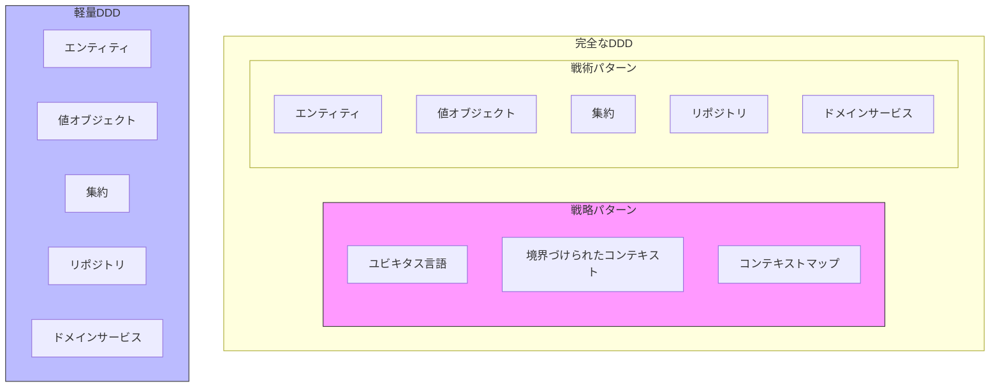
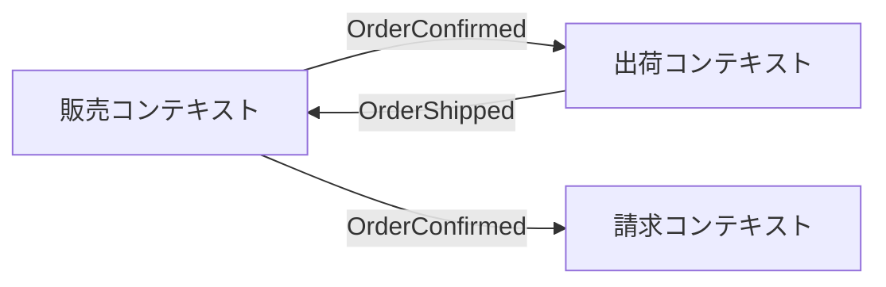
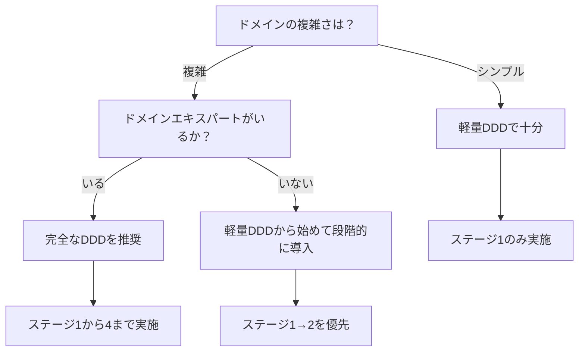

## はじめに

:::message

本記事はDDD×クリーンアーキテクチャ連載の一部です。軽量DDD（DDD-Lite）の功罪と段階的導入のアプローチを解説します。各セクションの根拠となる一次情報源は、該当箇所に参照リンクを記載しています。

:::

DDDに関する議論で「軽量DDDはアンチパターンだ」という主張を目にすることがあります。Vaughn Vernon は _Implementing Domain-Driven Design_（2013）の Chapter 1 で "DDD-Lite" について警鐘を鳴らしています。DDD-Lite とは戦術パターンだけを選択的に導入する手法です。Vernon によれば、この実践は「劣ったドメインモデル（inferior domain models）」の構築につながります。

この指摘には同意します。戦術パターンだけの導入にとどまり続ければ、ドメインモデルの品質は頭打ちになります。しかし Vernon の警鐘は「戦術パターンだけで終わること」への批判であり、「戦術パターンから始めること」自体を否定しているわけではありません。

現実のプロジェクトでは、チームのスキルセット、ドメインの理解度、スケジュールの制約から、最初から完全なDDDを導入できない場面が多々あります。私の経験では、 **軽量DDDは「ゴール」ではなく「出発点」** です。戦術パターンで得た手応えを足がかりに、戦略パターンへ段階的に進むことで、Vernon が懸念する「劣ったドメインモデル」を回避できます。

この記事では、軽量DDDの功罪を整理したうえで、軽量DDDにとどまらず完全なDDDへ段階的に進むための具体的なロードマップを共有します。

---

## 軽量DDDとは何か

### 定義

軽量DDDとは、DDDの**戦術パターン**（エンティティ、値オブジェクト、リポジトリ、ドメインサービスなど）だけを導入するアプローチです。**戦略パターン**（境界づけられたコンテキスト、ユビキタス言語、コンテキストマップなど）は省略します。



Eric Evans 自身も戦略パターンの重要性を強調しています。

> The really powerful domain models evolve over time, and even the most experienced modelers find that they gain their best ideas after the initial releases of a system.
>
> — Eric Evans, _Domain-Driven Design_（2003）

### 軽量DDDの典型的な姿

Go のプロジェクトでよく見かける軽量DDDの構成は次のとおりです。

```text
internal/
├── domain/
│   ├── model/          # エンティティ、値オブジェクト
│   └── repository/     # Repositoryインターフェース
├── usecase/            # ユースケース（アプリケーションサービス）
├── handler/            # HTTPハンドラ
└── infrastructure/     # Repository実装、外部サービス
```

この構成自体は悪くありません。ただし**境界づけられたコンテキストが意識されていない**ため、プロジェクトの成長とともに集約間の依存が複雑になりがちです。

---

## 軽量DDDの功罪

### 功：戦術パターンだけでも得られるもの

軽量DDDでも、以下のメリットは十分に得られます。

**1. ドメインロジックの集約への凝集**

ビジネスルールがユースケース層やハンドラ層に散らばる状態から、ドメイン層に集約されます。これだけでもコードの可読性と保守性は大きく改善します。

```go
// ❌ 軽量DDDすら導入していない状態
// ビジネスルールがハンドラに散在
func (h *OrderHandler) Confirm(w http.ResponseWriter, r *http.Request) {
    order := fetchOrder(r)
    if order.Status != "draft" { // ビジネスルールがここに
        http.Error(w, "確定できません", 400)
        return
    }
    order.Status = "confirmed" // 状態変更もここに
    saveOrder(order)
}
```

```go
// ✅ 軽量DDDを導入した状態
// ビジネスルールが集約に凝集
func (o *Order) Confirm() error {
    if o.status != OrderStatusDraft {
        return fmt.Errorf("確認できるのは下書き状態の注文のみです（現在: %s）", o.status)
    }
    o.status = OrderStatusConfirmed
    return nil
}
```

**2. テスタビリティの向上**

ドメインロジックが外部依存のない純粋な Go コードになるため、テストが格段に書きやすくなります。データベースやHTTPサーバーのセットアップなしにビジネスルールをテストできます。

**3. 非公開フィールドによる不変条件の保護**

Go の非公開フィールドを活用することで、集約の不変条件が外部から破壊されることを防げます。

```go
type Order struct {
    id     string      // 非公開フィールド
    status OrderStatus // 直接変更できない
    items  []OrderItem
}
```

### 罪：戦略パターン不在のリスク

**1. コンテキスト境界の欠如によるモデル肥大化**

プロジェクトが成長すると、1つのドメインモデルがあらゆる文脈の責務を担うようになります。たとえば「注文」という概念が、販売、出荷、請求、分析のすべてで同じモデルを使い回す状態です。

```go
// ❌ あらゆる文脈の責務を担う「神モデル」
type Order struct {
    id              string
    customerID      string
    status          OrderStatus
    items           []OrderItem
    shippingAddress Address       // 出荷コンテキストの関心
    trackingNumber  string        // 配送コンテキストの関心
    invoiceNumber   string        // 請求コンテキストの関心
    analyticsTag    string        // 分析コンテキストの関心
}
```

**2. ユビキタス言語の不在**

ドメインエキスパートとの共通言語がないまま開発を進めると、コード上の名前とビジネス用語が乖離します。結果として、仕様変更のたびに「この処理はコード上のどこに対応するのか」という確認コストが発生します。

**3. チーム全体のDDD理解が深まらない**

戦術パターンだけを機械的に適用すると、「なぜこの設計にするのか」という根本的な理解が育ちません。新しいメンバーが加わったときに、形だけのパターン適用が増えていきます。

---

## 段階的導入のロードマップ

私が3〜10人規模のチームで複数のプロジェクトに携わるなかで実践した段階的導入のロードマップです。各ステージは独立して価値を提供し、前のステージの成果の大部分を活かせます。ただしステージ3でコンテキストを分離する際に、集約の構造を見直す場合はあります。

### ステージ1：戦術パターンの導入（軽量DDD）

**期間の目安**: 私のチームでは1〜2スプリント程度でした。

最初のステージでは、戦術パターンの基本を導入します。

- エンティティと値オブジェクトを定義します
- 集約にビジネスルールを凝集させます
- リポジトリパターンでデータアクセスを抽象化します

```text
internal/
├── domain/
│   ├── model/          # エンティティ、値オブジェクト
│   └── repository/     # Repositoryインターフェース
├── usecase/
├── handler/
└── infrastructure/
```

**このステージのゴール**: ドメインロジックがドメイン層に集約され、ユニットテストが書ける状態になること。

### ステージ2：ユビキタス言語の構築

**期間の目安**: 私のチームでは2〜4スプリント程度でした（その後も継続的に更新）。

ドメインエキスパートと協力し、ユビキタス言語の用語集を作成します。コード上の名前を用語集に合わせてリファクタリングします。

```markdown
## 注文ドメイン用語集

| 用語                  | 定義                                       | コード上の名前    |
| --------------------- | ------------------------------------------ | ----------------- |
| 注文（Order）         | 顧客の購買意思を表す集約                   | `model.Order`     |
| 注文確定（Confirm）   | 注文を確定し、在庫引当を開始するアクション | `Order.Confirm()` |
| 出荷（Ship）          | 商品を顧客に発送するアクション             | `Order.Ship()`    |
| 注文明細（OrderItem） | 注文に含まれる商品と数量の値オブジェクト   | `model.OrderItem` |
```

**このステージのゴール**: コードの命名がビジネス用語と一致し、ドメインエキスパートがコードを読んでレビューできる状態になること。

### ステージ3：境界づけられたコンテキストの識別

**期間の目安**: 私のチームでは1〜2スプリント（分析）+ 2〜4スプリント（分離）程度でした。

ドメインの中に複数のコンテキストが存在することを識別し、分離します。

```text
internal/
├── sales/              # 販売コンテキスト
│   ├── domain/
│   ├── usecase/
│   └── infrastructure/
├── shipping/           # 出荷コンテキスト
│   ├── domain/
│   ├── usecase/
│   └── infrastructure/
└── billing/            # 請求コンテキスト
    ├── domain/
    ├── usecase/
    └── infrastructure/
```

**このステージのゴール**: 各コンテキストが独立したドメインモデルを持ち、コンテキスト間の依存が明示的になること。

### ステージ4：コンテキストマップとイベント駆動の導入

**期間の目安**: 私のチームでは2〜4スプリント程度でした。

コンテキスト間の関係を整理し、ドメインイベントによる連携を導入します。



**このステージのゴール**: コンテキスト間の結合がドメインイベントで断ち切られ、各コンテキストが独立してデプロイ可能な状態に近づくこと。

---

## 「完全なDDD」を目指さない選択の合理性

### すべてのプロジェクトにDDDが必要なわけではない

DDDが最も効果を発揮するのは、Eric Evans の言う**複雑なドメイン**です。

> Domain-Driven Design is an approach to software development for complex needs by deeply connecting the implementation to an evolving model of the core business concepts.
>
> — Eric Evans, [DDD Reference](https://www.domainlanguage.com/ddd/reference/)

以下のようなプロジェクトでは、軽量DDDで十分な場合があります。

| プロジェクト特性 | 推奨アプローチ |
| --- | --- |
| CRUDが中心、ビジネスルールが少ない | シンプルなレイヤードアーキテクチャ（DDDの導入は不要な場合も多い） |
| ドメインが複雑で、ビジネスルールが多い | 完全なDDD |
| 小規模チーム（2〜3人）、短期プロジェクト | 軽量DDD |
| 大規模チーム、長期運用 | 完全なDDD |
| ドメインエキスパートとの協業が可能 | 完全なDDD |
| ドメインエキスパートが不在 | 軽量DDDから始めて段階的に導入 |

### 軽量DDDの「罪」を軽減する方法

完全なDDDに移行しない場合でも、軽量DDDの問題点を軽減する方法があります。

**1. パッケージの命名にドメイン用語を使う**

ユビキタス言語の用語集を作らなくても、パッケージ名やファイル名にドメイン用語を使うだけでコードの可読性は向上します。

```go
// ❌ 技術的な命名
package service

// ✅ ドメイン用語を使った命名
package pricing
```

**2. 集約の境界を意識する**

境界づけられたコンテキストまで分離しなくても、集約単位でパッケージを分けることで、モデルの肥大化を防げます。

```text
internal/domain/
├── order/       # 注文集約
├── customer/    # 顧客集約
└── product/     # 商品集約
```

**3. 依存の方向を守る**

クリーンアーキテクチャの依存性ルールだけは守ります。ドメイン層が外側のレイヤーに依存しない構造を維持することで、将来の拡張が容易になります。

---

## チーム規模・プロジェクト特性による判断基準

### 判断フローチャート



### 段階的導入の成功条件

私がこれまでの経験で重要だと感じた成功条件をまとめます。

**1. 各ステージが独立して価値を提供すること**

「ステージ4まで完了しないと効果がない」という状態は避けます。ステージ1だけでもテスタビリティの向上という明確な価値があります。

**2. チームの理解が追いついていること**

パターンを機械的に適用しても効果は限定的です。各ステージで「なぜこのパターンを使うのか」をチームで議論し、納得してから進めます。

**3. リファクタリングの時間が確保されていること**

段階的導入は既存コードのリファクタリングを伴います。「新機能開発と同時にDDDも導入する」のではなく、リファクタリングのための時間を明示的に確保します。

**4. 完璧を目指さないこと**

DDDは継続的な学習と改善のプロセスです。最初から完璧なモデルを作ろうとせず、イテレーションを重ねて改善していく姿勢が重要です。

---

## まとめ

軽量DDDは「アンチパターン」ではなく、**完全なDDDへの途中経過**です。

- **戦術パターンだけでも価値はあります**。ドメインロジックの凝集、テスタビリティの向上、不変条件の保護は軽量DDDでも得られます
- **戦略パターンの不在にはリスクがあります**。モデルの肥大化、ユビキタス言語の欠如、チームの理解不足が顕在化するのは時間の問題です
- **段階的導入のロードマップ**があれば、軽量DDDからスタートしても着実に完全なDDDに近づけます
- **すべてのプロジェクトに完全なDDDが必要なわけではありません**。ドメインの複雑さ、チーム規模、ドメインエキスパートの有無に応じて判断します
- **各ステージが独立して価値を提供する**ことが、段階的導入の成功条件です

「完全なDDDか、まったくやらないか」という二択ではなく、プロジェクトの状況に応じた最適な導入レベルを選択することが、現実的で賢明なアプローチです。

---

## 参考文献

| 内容 | 出典 |
| --- | --- |
| DDD 原典 | Eric Evans, _Domain-Driven Design: Tackling Complexity in the Heart of Software_（2003） |
| 軽量DDDへの警鐘 | Vaughn Vernon, _Implementing Domain-Driven Design_（2013） |
| DDD Reference | Eric Evans, [DDD Reference](https://www.domainlanguage.com/ddd/reference/) |
| DDD戦術パターンの実践的な適用 | Jimmy Bogard, [Domain-Driven Design: The Good Parts](https://www.youtube.com/watch?v=dnUFEg68ESM)（NDC Sydney 2016） |
| 段階的導入の考え方（本記事のロードマップの参考） | Scott Millett & Nick Tune, _Patterns, Principles, and Practices of Domain-Driven Design_（2015） |
| クリーンアーキテクチャ | Robert C. Martin, _Clean Architecture_（2017） |
