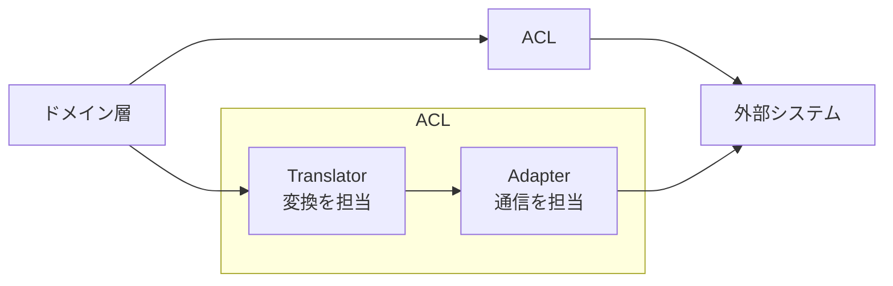

## はじめに

:::message

本記事はDDD/クリーンアーキテクチャ連載の一部です。腐敗防止層（Anti-Corruption Layer）の目的と、Goでの実装パターンを解説します。各セクションの根拠となる一次情報源は、該当箇所に参照リンクを記載しています。

:::

外部APIやレガシーシステムと連携する際、相手のデータ構造をそのまま自分のドメインモデルへ持ち込むと、ドメインが外部の都合で振り回されるようになります。APIの仕様変更がドメインロジックに波及し、テストも壊れます。

この問題を防ぐための設計パターンが**腐敗防止層（Anti-Corruption Layer、以下ACL）**です。本記事では、ACLの目的を整理した上で、GoでのAdapter / Translatorパターンの実装例を紹介します。

---

## 腐敗防止層とは

腐敗防止層は、Eric Evansが『Domain-Driven Design』で定義したパターンです。外部システムのモデルが自分のドメインモデルを「腐敗」させることを防ぐ翻訳層として機能します。

> Create an isolating layer to provide clients with functionality in terms of their own domain model. The layer talks to the other system through its existing interface, requiring little or no modification to the other system.
>
> — Eric Evans, _Domain-Driven Design: Tackling Complexity in the Heart of Software_（2003）

### ACLが必要になる場面

以下のような状況で、ACLの導入を検討します。

- **外部APIのレスポンス構造が自分のドメインモデルと異なる**: たとえば外部の決済APIが返す`transaction`と、自分のドメインの`Payment`は異なる概念です
- **レガシーシステムとの連携**: 古いシステムのデータ構造をそのまま使うと、レガシーの設計判断に引きずられます
- **サードパーティサービスの仕様変更リスク**: APIのバージョンアップで構造体が変わっても、ACLの中だけで吸収したい場合

### ACLの構造

ACLは概念的に3つの要素で構成されます。



| 要素       | 責務                                                                       |
| ---------- | -------------------------------------------------------------------------- |
| Adapter    | 外部システムとの通信プロトコルを処理します（HTTP呼び出し、gRPC呼び出し等） |
| Translator | 外部のデータ構造をドメインモデルに変換します（またはその逆）               |

---

## Go での ACL 実装パターン

ECサイトで外部の決済APIと連携する場面を例に、ACLの実装を見ていきます。

### ドメインモデルの定義

まず、自分のドメインモデルを定義します。このモデルは外部APIの存在を知りません。

```go
// domain/payment.go
package domain

import "time"

// PaymentStatus は決済の状態を表す値オブジェクトです。
type PaymentStatus string

const (
    PaymentStatusPending   PaymentStatus = "pending"
    PaymentStatusCompleted PaymentStatus = "completed"
    PaymentStatusFailed    PaymentStatus = "failed"
    PaymentStatusRefunded  PaymentStatus = "refunded"
)

// Payment はドメインの決済モデルです。
type Payment struct {
    ID        string
    OrderID   string
    Amount    Money
    Status    PaymentStatus
    PaidAt    time.Time
    FailureReason string
}

// Money は金額を表す値オブジェクトです。
type Money struct {
    Amount   int64
    Currency string
}
```

### 外部APIのレスポンス構造体

外部の決済APIは独自のデータ構造を返します。この構造体はACL内に閉じ込めます。

```go
// infra/payment/external/types.go
package external

// ChargeResponse は外部決済APIのレスポンスです。
// このファイルはACL内部でのみ使用します。
type ChargeResponse struct {
    ChargeID     string `json:"charge_id"`
    MerchantRef  string `json:"merchant_ref"`
    AmountCents  int64  `json:"amount_cents"`
    CurrencyCode string `json:"currency_code"`
    State        string `json:"state"`       // "authorized", "captured", "voided", "refunded"
    ProcessedAt  string `json:"processed_at"` // ISO 8601
    ErrorCode    string `json:"error_code"`
    ErrorMessage string `json:"error_message"`
}
```

ドメインの`Payment`と外部の`ChargeResponse`は構造や命名規則が異なります。`State`の値（`authorized`、`captured`等）は外部APIの語彙であり、ドメインの`PaymentStatus`とは対応関係が必要です。

### Translator の実装

Translatorは外部のデータ構造をドメインモデルに変換する責務を持ちます。

```go
// infra/payment/translator.go
package payment

import (
    "fmt"
    "time"

    "myapp/domain"
    "myapp/infra/payment/external"
)

// translator は外部決済APIのレスポンスをドメインモデルに変換します。
type translator struct{}

func (t *translator) toPayment(resp *external.ChargeResponse) (*domain.Payment, error) {
    status, err := t.toPaymentStatus(resp.State)
    if err != nil {
        return nil, fmt.Errorf("決済状態の変換に失敗しました: %w", err)
    }

    paidAt, err := time.Parse(time.RFC3339, resp.ProcessedAt)
    if err != nil {
        return nil, fmt.Errorf("日時の解析に失敗しました: %w", err)
    }

    return &domain.Payment{
        ID:      resp.ChargeID,
        OrderID: resp.MerchantRef,
        Amount: domain.Money{
            Amount:   resp.AmountCents,
            Currency: resp.CurrencyCode,
        },
        Status:        status,
        PaidAt:        paidAt,
        FailureReason: resp.ErrorMessage,
    }, nil
}

func (t *translator) toPaymentStatus(state string) (domain.PaymentStatus, error) {
    switch state {
    case "authorized", "captured":
        return domain.PaymentStatusCompleted, nil
    case "voided":
        return domain.PaymentStatusFailed, nil
    case "refunded":
        return domain.PaymentStatusRefunded, nil
    default:
        return "", fmt.Errorf("未知の決済状態です: %s", state)
    }
}

func (t *translator) toChargeRequest(orderID string, amount domain.Money) map[string]any {
    return map[string]any{
        "merchant_ref":  orderID,
        "amount_cents":  amount.Amount,
        "currency_code": amount.Currency,
    }
}
```

Translatorのポイントは以下の通りです。

- 外部APIの語彙（`authorized`、`captured`等）をドメインの語彙（`completed`等）に翻訳します
- 日時フォーマットの変換など、技術的な差異もここで吸収します
- 未知の値に対してエラーを返すことで、外部API変更時に問題を早期検出します

### Adapter の実装

Adapterは外部システムとの通信プロトコルを担当します。ドメインのインターフェースを実装し、内部でTranslatorを使います。

```go
// infra/payment/adapter.go
package payment

import (
    "bytes"
    "context"
    "encoding/json"
    "fmt"
    "net/http"

    "myapp/domain"
    "myapp/infra/payment/external"
)

// PaymentGateway は外部決済APIとの通信を担当するAdapterです。
// ユースケース層が定義するインターフェース（paymentGateway）を実装します。
type PaymentGateway struct {
    client     *http.Client
    baseURL    string
    apiKey     string
    translator *translator
}

func NewPaymentGateway(client *http.Client, baseURL, apiKey string) *PaymentGateway {
    return &PaymentGateway{
        client:     client,
        baseURL:    baseURL,
        apiKey:     apiKey,
        translator: &translator{},
    }
}

func (g *PaymentGateway) Charge(ctx context.Context, orderID string, amount domain.Money) (*domain.Payment, error) {
    reqBody := g.translator.toChargeRequest(orderID, amount)

    body, err := json.Marshal(reqBody)
    if err != nil {
        return nil, fmt.Errorf("リクエストの構築に失敗しました: %w", err)
    }

    req, err := http.NewRequestWithContext(ctx, http.MethodPost, g.baseURL+"/v1/charges", bytes.NewReader(body))
    if err != nil {
        return nil, fmt.Errorf("HTTPリクエストの作成に失敗しました: %w", err)
    }
    req.Header.Set("Authorization", "Bearer "+g.apiKey)
    req.Header.Set("Content-Type", "application/json")

    resp, err := g.client.Do(req)
    if err != nil {
        return nil, fmt.Errorf("決済APIの呼び出しに失敗しました: %w", err)
    }
    defer resp.Body.Close()

    if resp.StatusCode != http.StatusOK {
        return nil, fmt.Errorf("決済APIがエラーを返しました: status=%d", resp.StatusCode)
    }

    var chargeResp external.ChargeResponse
    if err := json.NewDecoder(resp.Body).Decode(&chargeResp); err != nil {
        return nil, fmt.Errorf("レスポンスの解析に失敗しました: %w", err)
    }

    return g.translator.toPayment(&chargeResp)
}
```

### ユースケースからの利用

ユースケース層はACLの存在を意識しません。ドメインモデルだけを使って処理を記述します。

```go
// usecase/process_payment.go
package usecase

import (
    "context"
    "fmt"

    "myapp/domain"
)

// paymentGateway はユースケースが必要とするインターフェースです。
// Go の慣習に従い、利用側で定義します。
type paymentGateway interface {
    Charge(ctx context.Context, orderID string, amount domain.Money) (*domain.Payment, error)
}

type orderReader interface {
    FindByID(ctx context.Context, orderID string) (*domain.Order, error)
}

type ProcessPaymentUseCase struct {
    gateway   paymentGateway
    orderRepo orderReader
}

func (uc *ProcessPaymentUseCase) Execute(ctx context.Context, orderID string) (*domain.Payment, error) {
    order, err := uc.orderRepo.FindByID(ctx, orderID)
    if err != nil {
        return nil, fmt.Errorf("注文の取得に失敗しました: %w", err)
    }

    payment, err := uc.gateway.Charge(ctx, order.ID, order.TotalAmount)
    if err != nil {
        return nil, fmt.Errorf("決済処理に失敗しました: %w", err)
    }

    return payment, nil
}
```

---

## プロトコル別の実装例

ACLのパターンはHTTP/RESTに限りません。gRPCやGraphQLでも同じ考え方が適用できます。

### gRPC の場合

外部サービスがgRPCを提供している場合、Protocol Buffersで生成された型がACLの外部型になります。

```go
// infra/shipping/translator.go
package shipping

import (
    "myapp/domain"
    shippingpb "myapp/infra/shipping/gen/proto"
)

type translator struct{}

func (t *translator) toShipment(resp *shippingpb.TrackingResponse) *domain.Shipment {
    return &domain.Shipment{
        TrackingID: resp.GetTrackingId(),
        Status:     t.toShipmentStatus(resp.GetStatus()),
        Location:   resp.GetCurrentLocation(),
    }
}

func (t *translator) toShipmentStatus(status shippingpb.ShippingStatus) domain.ShipmentStatus {
    switch status {
    case shippingpb.ShippingStatus_SHIPPED:
        return domain.ShipmentStatusInTransit
    case shippingpb.ShippingStatus_DELIVERED:
        return domain.ShipmentStatusDelivered
    case shippingpb.ShippingStatus_RETURNED:
        return domain.ShipmentStatusReturned
    default:
        return domain.ShipmentStatusUnknown
    }
}
```

```go
// infra/shipping/adapter.go
package shipping

import (
    "context"
    "fmt"

    "myapp/domain"
    shippingpb "myapp/infra/shipping/gen/proto"
    "google.golang.org/grpc"
)

type ShippingTracker struct {
    client     shippingpb.ShippingServiceClient
    translator *translator
}

func NewShippingTracker(conn *grpc.ClientConn) *ShippingTracker {
    return &ShippingTracker{
        client:     shippingpb.NewShippingServiceClient(conn),
        translator: &translator{},
    }
}

func (s *ShippingTracker) Track(ctx context.Context, trackingID string) (*domain.Shipment, error) {
    resp, err := s.client.GetTracking(ctx, &shippingpb.TrackingRequest{
        TrackingId: trackingID,
    })
    if err != nil {
        return nil, fmt.Errorf("配送追跡の取得に失敗しました: %w", err)
    }

    return s.translator.toShipment(resp), nil
}
```

### REST と gRPC の比較

| 観点             | REST                          | gRPC                         |
| ---------------- | ----------------------------- | ---------------------------- |
| 外部型の定義場所 | ACL内の構造体（JSONタグ付き） | Protocol Buffersの生成コード |
| Translatorの入力 | JSON構造体                    | Protocol Buffersメッセージ   |
| Adapterの通信    | `net/http`                    | `google.golang.org/grpc`     |
| ACLのパターン    | 同じ                          | 同じ                         |

プロトコルが変わっても、ACLの構造（Adapter + Translator）は変わりません。変わるのは通信の詳細と外部型の定義方法だけです。

---

## ACL 導入時の判断基準

ACLはすべての外部連携に必要なわけではありません。以下の基準で導入を判断します。

| 条件                                             | ACLの要否                                |
| ------------------------------------------------ | ---------------------------------------- |
| 外部APIのモデルが自分のドメインと大きく異なる    | 必要です                                 |
| 外部APIの仕様変更頻度が高い                      | 必要です                                 |
| レガシーシステムとの連携                         | 必要です                                 |
| チーム内の別サービス（共通のドメイン言語がある） | 不要な場合が多いです                     |
| 標準的なライブラリ（DB、キャッシュ等）           | 不要です（Repositoryパターンで十分です） |

ACLを過剰に導入すると、翻訳層のメンテナンスコストが増えます。外部のモデルとドメインモデルが近い場合は、シンプルなAdapterで十分です。

---

## まとめ

| 観点             | 内容                                                               |
| ---------------- | ------------------------------------------------------------------ |
| ACLの目的        | 外部システムのモデルがドメインを「腐敗」させることを防ぎます       |
| Translatorの責務 | 外部のデータ構造をドメインモデルに変換します                       |
| Adapterの責務    | 外部システムとの通信プロトコルを処理します                         |
| Goでの実装       | 利用側でインターフェースを定義し、Adapter + Translatorで実装します |
| プロトコル非依存 | REST / gRPC等、プロトコルが変わってもACLの構造は同じです           |

ACLは、外部システムとの境界を明確にし、ドメインモデルの純粋性を守るための重要なパターンです。Goでは、implicit interfaceの仕組みにより、ユースケース層はACLの実装詳細を一切知らずに済みます。外部APIの仕様変更があっても、Translator内の変換ロジックを修正するだけでドメイン層への影響を防げます。

---

## 参考文献

| 内容 | 出典 |
| --- | --- |
| 腐敗防止層の原典 | Eric Evans, _Domain-Driven Design: Tackling Complexity in the Heart of Software_（2003） |
| ACLの解説 | [Anti-Corruption Layer](https://docs.microsoft.com/en-us/azure/architecture/patterns/anti-corruption-layer)（Microsoft Azure Architecture Patterns） |
| Goのインターフェース設計 | Go Wiki, [Go Code Review Comments](https://go.dev/wiki/CodeReviewComments#interfaces) |
| DDD実践ガイド | Vaughn Vernon, _Implementing Domain-Driven Design_（2013） |
| gRPC Go実装 | [gRPC Go Quick Start](https://grpc.io/docs/languages/go/quickstart/) |
