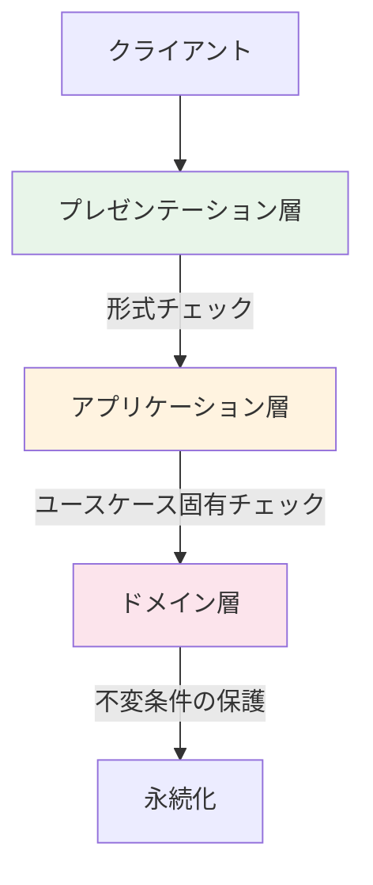
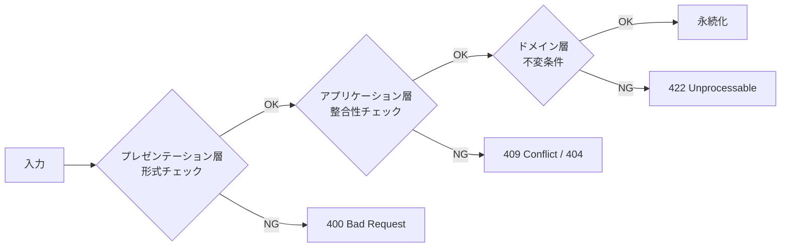

## はじめに

:::message

本記事はDDD（ドメイン駆動設計）における入力バリデーションの設計指針をまとめたものです。各セクションの根拠となる一次情報源は、該当箇所に参照リンクを記載しています。

:::

「バリデーションはどこに書くべきか」——これはDDDを導入したプロジェクトで必ず議論になるテーマです。

私がGoでDDDを実践する中で経験したのは、バリデーションの配置が曖昧なまま開発を進めた結果、**同じチェックがController・UseCase・ドメインモデルに重複して散在する**状態でした。修正漏れによるバグが発生し、「どの層のバリデーションが正なのか」が分からなくなりました。

この記事では、バリデーションを**プレゼンテーション層・アプリケーション層・ドメイン層**の3層に分けて設計する方法と、各層が何を守るべきかを整理します。

---

## バリデーションの3層モデル

バリデーションは、入力がシステムに到達してからドメインモデルに届くまでの間に、段階的にフィルタリングされるべきです。Vaughn Vernonは著書の中で、バリデーションをドメインモデルの不変条件の保護として位置づけています。



各層の責務を明確にすることで、バリデーションの重複を排除し、変更に強い設計が実現できます。

| 層                   | 責務                     | 例                                         |
| -------------------- | ------------------------ | ------------------------------------------ |
| プレゼンテーション層 | 入力形式・型の検証       | JSON構造、必須フィールド、文字列長         |
| アプリケーション層   | ユースケース固有の整合性 | 重複チェック、権限確認、外部状態の参照     |
| ドメイン層           | 不変条件の保護           | 値の範囲、状態遷移の妥当性、ビジネスルール |

---

## プレゼンテーション層のバリデーション

プレゼンテーション層では、**入力データの形式が正しいか**を検証します。この層のバリデーションはドメイン知識を含まず、技術的な制約のみを扱います。

```go
// interface/rest/handler/task_handler.go

type CreateTaskRequest struct {
    Title       string   `json:"title" validate:"required,min=1,max=200"`
    Description string   `json:"description" validate:"max=5000"`
    Priority    string   `json:"priority" validate:"required,oneof=low medium high"`
    AssigneeID  string   `json:"assigneeId" validate:"omitempty,uuid"`
    Tags        []string `json:"tags" validate:"max=10,dive,min=1,max=50"`
}

func (h *TaskHandler) Create(w http.ResponseWriter, r *http.Request) {
    var req CreateTaskRequest
    if err := json.NewDecoder(r.Body).Decode(&req); err != nil {
        respondError(w, http.StatusBadRequest, "invalid JSON format")
        return
    }

    if err := h.validator.Struct(req); err != nil {
        respondValidationError(w, err)
        return
    }

    // アプリケーション層に委譲
    output, err := h.taskCreator.Create(r.Context(), toUseCaseInput(req))
    // ...
}
```

プレゼンテーション層でチェックすべき項目は以下の通りです。

- JSONやフォームデータのパース可否
- 必須フィールドの存在
- 文字列長・配列長の上限
- 型の妥当性（UUID形式、メールアドレス形式など）

この層のバリデーションは**セキュリティの第一防衛線**でもあります。不正な入力を早期に弾くことで、後続の処理に到達するデータの品質を保証します。

---

## アプリケーション層のバリデーション

アプリケーション層では、**ユースケース固有の整合性**を検証します。ドメインモデルの不変条件とは異なり、外部状態の参照や複数集約にまたがるチェックがここに含まれます。

```go
// usecase/create_task_interactor.go

type taskRepository interface {
    FindByTitle(ctx context.Context, projectID, title string) (*model.Task, error)
    Save(ctx context.Context, task *model.Task) error
}

type memberRepository interface {
    FindByID(ctx context.Context, id model.MemberID) (*model.Member, error)
}

type CreateTaskInteractor struct {
    taskRepo   taskRepository
    memberRepo memberRepository
}

func (i *CreateTaskInteractor) Create(ctx context.Context, input *CreateTaskInput) (*CreateTaskOutput, error) {
    // ユースケース固有のバリデーション：担当者の存在確認
    if input.AssigneeID != "" {
        member, err := i.memberRepo.FindByID(ctx, model.MemberID(input.AssigneeID))
        if err != nil {
            return nil, fmt.Errorf("failed to find assignee: %w", err)
        }
        if member == nil {
            return nil, ErrAssigneeNotFound
        }
    }

    // ユースケース固有のバリデーション：同一プロジェクト内のタイトル重複チェック
    existing, err := i.taskRepo.FindByTitle(ctx, input.ProjectID, input.Title)
    if err != nil {
        return nil, fmt.Errorf("failed to check duplicate: %w", err)
    }
    if existing != nil {
        return nil, ErrTaskTitleDuplicate
    }

    // ドメインモデルの生成（ドメイン層のバリデーションが実行される）
    task, err := model.NewTask(input.Title, input.Description, input.Priority, input.ProjectID)
    if err != nil {
        return nil, fmt.Errorf("failed to create task: %w", err)
    }

    if err := i.taskRepo.Save(ctx, task); err != nil {
        return nil, fmt.Errorf("failed to save task: %w", err)
    }

    return &CreateTaskOutput{ID: task.ID().String()}, nil
}
```

アプリケーション層でチェックすべき項目は以下の通りです。

- 参照先エンティティの存在確認（担当者、プロジェクトなど）
- 一意性制約のチェック（タイトルの重複など）
- 現在のユーザーに対する権限チェック
- 複数集約にまたがる整合性チェック

**重要なのは、これらのチェックがドメインモデルの外に置かれる理由です。** 存在確認や重複チェックはリポジトリへの問い合わせが必要であり、ドメインモデルが外部依存を持つべきではないためです。

---

## ドメイン層のバリデーション：不変条件の保護

ドメイン層のバリデーションは、**モデルの不変条件（invariants）を保護する**ために存在します。Eric Evansは『Domain-Driven Design』の中で、集約が常にトランザクション整合性を保つべきだと述べています。

### 値オブジェクトによるバリデーション

値オブジェクトのコンストラクタでバリデーションを行うことで、**不正な値がシステム内に存在できない**ことを保証します。

```go
// domain/model/priority.go

type Priority int

const (
    PriorityLow    Priority = iota + 1
    PriorityMedium
    PriorityHigh
)

func NewPriority(s string) (Priority, error) {
    switch s {
    case "low":
        return PriorityLow, nil
    case "medium":
        return PriorityMedium, nil
    case "high":
        return PriorityHigh, nil
    default:
        return 0, fmt.Errorf("invalid priority: %s", s)
    }
}
```

```go
// domain/model/task_title.go

type TaskTitle string

func NewTaskTitle(s string) (TaskTitle, error) {
    s = strings.TrimSpace(s)
    if s == "" {
        return "", errors.New("task title must not be empty")
    }
    if utf8.RuneCountInString(s) > 200 {
        return "", errors.New("task title must be 200 characters or less")
    }
    return TaskTitle(s), nil
}
```

### エンティティの不変条件

エンティティのコンストラクタは、値オブジェクトを組み合わせて不変条件を保護します。

```go
// domain/model/task.go

type Task struct {
    id          TaskID
    title       TaskTitle
    description string
    priority    Priority
    status      TaskStatus
    projectID   ProjectID
    createdAt   time.Time
}

func NewTask(title, description, priority, projectID string) (*Task, error) {
    t, err := NewTaskTitle(title)
    if err != nil {
        return nil, fmt.Errorf("invalid title: %w", err)
    }

    p, err := NewPriority(priority)
    if err != nil {
        return nil, fmt.Errorf("invalid priority: %w", err)
    }

    pid, err := NewProjectID(projectID)
    if err != nil {
        return nil, fmt.Errorf("invalid project id: %w", err)
    }

    return &Task{
        id:          NewTaskID(),
        title:       t,
        description: description,
        priority:    p,
        status:      TaskStatusOpen,
        projectID:   pid,
        createdAt:   time.Now(),
    }, nil
}
```

### 状態遷移のバリデーション

ドメインモデルの重要な不変条件として、**許可された状態遷移のみを受け入れる**ことがあります。

```go
// domain/model/task_status.go

type TaskStatus int

const (
    TaskStatusOpen       TaskStatus = iota + 1
    TaskStatusInProgress
    TaskStatusDone
    TaskStatusCancelled
)

var allowedTransitions = map[TaskStatus][]TaskStatus{
    TaskStatusOpen:       {TaskStatusInProgress, TaskStatusCancelled},
    TaskStatusInProgress: {TaskStatusDone, TaskStatusOpen, TaskStatusCancelled},
    TaskStatusDone:       {},
    TaskStatusCancelled:  {},
}

func (t *Task) TransitionTo(next TaskStatus) error {
    allowed := allowedTransitions[t.status]
    for _, s := range allowed {
        if s == next {
            t.status = next
            return nil
        }
    }
    return fmt.Errorf("cannot transition from %v to %v", t.status, next)
}
```

この設計により、`Task`は**常に有効な状態にある**ことが保証されます。完了済みのタスクを再度進行中にする、といった不正な操作はドメインモデルが拒否します。

---

## 多層防御としてのバリデーション戦略

3層のバリデーションを組み合わせることで、**多層防御（Defense in Depth）**が実現します。



### なぜ多層防御が必要なのか

「プレゼンテーション層で全部チェックすればよいのでは」という疑問はもっともです。多層防御が必要な理由は以下の通りです。

- **入口は1つに限りません**。REST API、gRPC、CLIツール、バッチ処理など、ドメインモデルへの入口は複数存在します。プレゼンテーション層のバリデーションに依存すると、新しい入口を追加するたびにバリデーションを再実装する必要があります
- **ドメインモデルは自分自身を守る必要があります**。値オブジェクトとエンティティが不変条件を保護していれば、どの経路からアクセスされても不正な状態にはなりません
- **層ごとに関心事が異なります**。「JSONのパースに失敗した」と「ビジネスルール上許可されない操作だ」では、エラーの性質やレスポンスコードが異なります

### セキュリティ観点でのバリデーション

セキュリティの観点では、OWASP（Open Worldwide Application Security Project）のガイドラインが参考になります。

| 脅威                | 対策層                       | 具体的な対策                             |
| ------------------- | ---------------------------- | ---------------------------------------- |
| SQLインジェクション | プレゼンテーション＋インフラ | 入力サニタイズ＋プリペアドステートメント |
| XSS                 | プレゼンテーション           | 出力エスケープ＋CSPヘッダ                |
| 不正な状態遷移      | ドメイン                     | 状態遷移マップによる制御                 |
| 権限昇格            | アプリケーション             | ユースケースでの権限チェック             |
| 大量データ送信      | プレゼンテーション           | リクエストサイズ制限＋レートリミット     |

Go のミドルウェアでセキュリティ関連のバリデーションを共通化する例です。

```go
// interface/rest/middleware/security.go

func RequestSizeLimit(maxBytes int64) func(http.Handler) http.Handler {
    return func(next http.Handler) http.Handler {
        return http.HandlerFunc(func(w http.ResponseWriter, r *http.Request) {
            r.Body = http.MaxBytesReader(w, r.Body, maxBytes)
            next.ServeHTTP(w, r)
        })
    }
}

func SanitizeInput() func(http.Handler) http.Handler {
    return func(next http.Handler) http.Handler {
        return http.HandlerFunc(func(w http.ResponseWriter, r *http.Request) {
            // Content-Typeの検証
            if r.Method == http.MethodPost || r.Method == http.MethodPut {
                ct := r.Header.Get("Content-Type")
                if !strings.HasPrefix(ct, "application/json") {
                    respondError(w, http.StatusUnsupportedMediaType, "content type must be application/json")
                    return
                }
            }
            next.ServeHTTP(w, r)
        })
    }
}
```

---

## バリデーションエラーの設計

各層のバリデーションエラーは、呼び出し側が適切にハンドリングできる形で返す必要があります。

```go
// domain/model/validation_error.go

type ValidationError struct {
    Field   string
    Message string
}

type ValidationErrors []ValidationError

func (ve ValidationErrors) Error() string {
    var msgs []string
    for _, e := range ve {
        msgs = append(msgs, fmt.Sprintf("%s: %s", e.Field, e.Message))
    }
    return strings.Join(msgs, "; ")
}
```

```go
// interface/rest/handler/error_response.go

func respondValidationErrors(w http.ResponseWriter, errs model.ValidationErrors) {
    type fieldError struct {
        Field   string `json:"field"`
        Message string `json:"message"`
    }

    resp := struct {
        Errors []fieldError `json:"errors"`
    }{}

    for _, e := range errs {
        resp.Errors = append(resp.Errors, fieldError{
            Field:   e.Field,
            Message: e.Message,
        })
    }

    w.Header().Set("Content-Type", "application/json")
    w.WriteHeader(http.StatusUnprocessableEntity)
    json.NewEncoder(w).Encode(resp)
}
```

---

## まとめ

DDDにおけるバリデーション設計のポイントを整理します。

| 層 | 守るもの | 設計方針 |
| --- | --- | --- |
| プレゼンテーション層 | 入力形式 | 構造体タグやミドルウェアで宣言的に記述する |
| アプリケーション層 | ユースケースの整合性 | リポジトリへの問い合わせで外部状態を検証する |
| ドメイン層 | 不変条件 | 値オブジェクトとエンティティのコンストラクタで保護する |

最も重要な原則は、**ドメインモデルが自分自身の不変条件を守る**ことです。値オブジェクトのコンストラクタで不正な値の生成を防ぎ、エンティティのメソッドで不正な状態遷移を拒否します。これにより、どの経路からドメインモデルにアクセスされても、モデルは常に有効な状態を保ちます。

プレゼンテーション層とアプリケーション層のバリデーションは、ドメイン層の保護を補強する「多層防御」の外側のレイヤーです。ユーザー体験やパフォーマンスの向上には必要ですが、最終的な防衛線はドメインモデル自身にあります。

---

## 参考文献

| 内容 | 出典 |
| --- | --- |
| DDDにおけるバリデーションの位置づけ | Eric Evans, _Domain-Driven Design_（2003）Chapter 6: The Life Cycle of a Domain Object |
| 集約の不変条件 | Vaughn Vernon, _Implementing Domain-Driven Design_（2013）Chapter 10: Aggregates |
| Always-Valid Domain Model | Vladimir Khorikov, [Always-Valid Domain Model](https://enterprisecraftsmanship.com/posts/always-valid-domain-model/) |
| 入力バリデーションとセキュリティ | OWASP, [Input Validation Cheat Sheet](https://cheatsheetseries.owasp.org/cheatsheets/Input_Validation_Cheat_Sheet.html) |
| Go のバリデーションライブラリ | go-playground/validator, [GitHub](https://github.com/go-playground/validator) |
| 多層防御の概念 | NIST, [Defense in Depth](https://csrc.nist.gov/glossary/term/defense_in_depth) |
