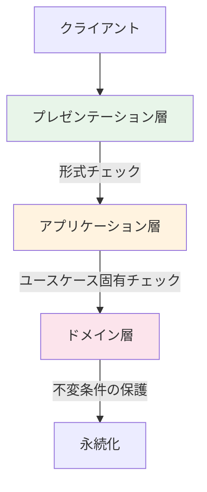
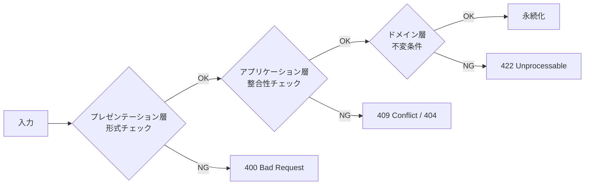

## はじめに

:::message

本記事はDDD（ドメイン駆動設計）における入力バリデーションの設計指針をまとめたものです。各セクションの根拠となる一次情報源は、該当箇所に参照リンクを記載しています。

:::

「バリデーションはどこに書くべきか」——私の経験では、DDDを導入したプロジェクトで毎回議論になるテーマです。

私がGoでDDDを実践する中で経験したのは、バリデーションの配置が曖昧なまま開発を進めた結果、**同じチェックがController・UseCase・ドメインモデルに重複して散在する**状態でした。修正漏れによるバグが発生し、「どの層のバリデーションが正なのか」が分からなくなりました。

この記事では、バリデーションを**プレゼンテーション層・アプリケーション層・ドメイン層**の3層に分けて設計する方法と、各層が何を守るべきかを整理します。

---

## バリデーションの3層モデル

バリデーションは、入力がシステムに到達してからドメインモデルに届くまでの間に、段階的にフィルタリングされるべきです。Vaughn Vernonは『Implementing Domain-Driven Design』（2013）Chapter 10で、集約が自身の不変条件を常に保護すべきだと述べています。

以下の3層モデルは、Vernonの不変条件の保護という原則と、実際のGoプロジェクトでの私の経験をもとに整理した**本記事独自の分類**です。DDDの文献でこの3層が標準的に定義されているわけではありませんが、バリデーションの配置を議論する際の実用的なフレームワークとして使えます。



私のプロジェクトでは、各層の責務を明確にした結果、バリデーションの重複が解消しました。新しい入口を追加する際も、既存のバリデーションを再実装せずに済んでいます。

| 層                   | 責務                     | 例                                         |
| -------------------- | ------------------------ | ------------------------------------------ |
| プレゼンテーション層 | 入力形式・型の検証       | JSON構造、必須フィールド、文字列長         |
| アプリケーション層   | ユースケース固有の整合性 | 重複チェック、権限確認、外部状態の参照     |
| ドメイン層           | 不変条件の保護           | 値の範囲、状態遷移の妥当性、ビジネスルール |

---

## プレゼンテーション層のバリデーション

プレゼンテーション層では、**入力データの形式が正しいか**を検証します。この層のバリデーションはドメイン知識を含まず、技術的な制約のみを扱います。

```go
// interface/rest/handler/task_handler.go

type CreateTaskRequest struct {
    Title       string   `json:"title" validate:"required,min=1,max=200"`
    Description string   `json:"description" validate:"max=5000"`
    Priority    string   `json:"priority" validate:"required,oneof=low medium high"`
    AssigneeID  string   `json:"assigneeId" validate:"omitempty,uuid"`
    Tags        []string `json:"tags" validate:"max=10,dive,min=1,max=50"`
}

func (h *TaskHandler) Create(w http.ResponseWriter, r *http.Request) {
    var req CreateTaskRequest
    if err := json.NewDecoder(r.Body).Decode(&req); err != nil {
        respondError(w, http.StatusBadRequest, "invalid JSON format")
        return
    }

    if err := h.validator.Struct(req); err != nil {
        respondValidationError(w, err)
        return
    }

    // アプリケーション層に委譲
    output, err := h.taskCreator.Create(r.Context(), toUseCaseInput(req))
    // ...
}
```

プレゼンテーション層でチェックすべき項目は以下の通りです。

- JSONやフォームデータのパース可否
- 必須フィールドの存在
- 文字列長・配列長の上限
- 型の妥当性（UUID形式、メールアドレス形式など）

この層のバリデーションは、不正な形式のデータを早期に弾くことで後続の処理に到達するデータの品質を保証します。ただし、SQLインジェクションやXSSのような脅威に対しては入力バリデーションだけでは対策になりません（詳しくは後述の「セキュリティ観点でのバリデーション」を参照してください）。入力バリデーションの役割は、**リクエストサイズの制限や形式不正の排除**に限定されます。

---

## アプリケーション層のバリデーション

アプリケーション層では、**ユースケース固有の整合性**を検証します。ドメインモデルの不変条件とは異なり、外部状態の参照や複数集約にまたがるチェックがここに含まれます。

```go
// usecase/create_task_interactor.go

type taskRepository interface {
    ExistsByTitle(ctx context.Context, projectID, title string) (bool, error)
    Save(ctx context.Context, task *model.Task) error
}

type memberRepository interface {
    FindByID(ctx context.Context, id model.MemberID) (*model.Member, error)
}

type CreateTaskInteractor struct {
    taskRepo   taskRepository
    memberRepo memberRepository
}

func (i *CreateTaskInteractor) Create(ctx context.Context, input *CreateTaskInput) (*CreateTaskOutput, error) {
    // ユースケース固有のバリデーション：担当者の存在確認
    if input.AssigneeID != "" {
        member, err := i.memberRepo.FindByID(ctx, model.MemberID(input.AssigneeID))
        if err != nil {
            return nil, fmt.Errorf("failed to find assignee: %w", err)
        }
        if member == nil {
            return nil, ErrAssigneeNotFound
        }
    }

    // ユースケース固有のバリデーション：同一プロジェクト内のタイトル重複チェック
    exists, err := i.taskRepo.ExistsByTitle(ctx, input.ProjectID, input.Title)
    if err != nil {
        return nil, fmt.Errorf("failed to check duplicate: %w", err)
    }
    if exists {
        return nil, ErrTaskTitleDuplicate
    }

    // ドメインモデルの生成（ドメイン層のバリデーションが実行される）
    task, err := model.NewTask(input.Title, input.Description, input.Priority, input.ProjectID, time.Now())
    if err != nil {
        return nil, fmt.Errorf("failed to create task: %w", err)
    }

    // ExistsByTitleは早期フィードバック用であり、並行リクエストの最終防衛線はDB側の一意制約です。
    // DB側には以下のような一意制約を定義しておきます。
    //   ALTER TABLE tasks ADD CONSTRAINT uq_tasks_project_title UNIQUE (project_id, title);
    // Save時にこの一意制約に違反した場合、リポジトリ実装がrepository.ErrDuplicateTitleを返します。
    if err := i.taskRepo.Save(ctx, task); err != nil {
        if errors.Is(err, repository.ErrDuplicateTitle) {
            return nil, ErrTaskTitleDuplicate
        }
        return nil, fmt.Errorf("failed to save task: %w", err)
    }

    return &CreateTaskOutput{ID: task.ID().String()}, nil
}
```

`repository.ErrDuplicateTitle`はリポジトリ実装側で定義するセンチネルエラーです。DBドライバ固有のエラーをドメインが理解できるエラーに変換する責務はインフラ層にあります。これはAlistair Cockburnの[Hexagonal Architecture（Ports and Adapters）](https://alistair.cockburn.us/hexagonal-architecture/)の原則に基づいています。外部技術の詳細をアダプター（インフラ層）が吸収し、ポート（リポジトリインターフェース）を通じてドメインが理解できる形で公開します。

```go
// infrastructure/repository/error.go

var ErrDuplicateTitle = errors.New("task title already exists in this project")
```

アプリケーション層でチェックすべき項目は以下の通りです。

- 参照先エンティティの存在確認（担当者、プロジェクトなど）
- 一意性制約のチェック（タイトルの重複など）
- 現在のユーザーに対する権限チェック
- 複数集約にまたがる整合性チェック

**重要なのは、これらのチェックがドメインモデルの外に置かれる理由です。** 存在確認や重複チェックはリポジトリへの問い合わせが必要です。Vernon（IDDD, Chapter 10）は集約の設計ルールとして「他の集約はIDで参照する」「集約の境界内でトランザクション整合性を保つ」ことを挙げています。集約内にリポジトリへの直接的な依存を持ち込むと、この境界が曖昧になるため、リポジトリを使うチェックは集約の外に配置します。

なお、「同一プロジェクト内のタイトル一意性」のようなルールはドメインサービスとして表現する選択肢もあります。ドメインサービスであればリポジトリインターフェースを受け取れるため、技術的にはドメイン層に置くことも可能です。本記事ではユースケース層に配置していますが、これはこのルールが**特定のユースケース（タスク作成）でのみ検証される**ためです。タスク名の変更時にも同じチェックが必要になった場合は、ドメインサービスへの移動を検討すべきです。

---

## ドメイン層のバリデーション：不変条件の保護

ドメイン層のバリデーションは、**モデルの不変条件（invariants）を保護する**ために存在します。Vaughn Vernonは『Implementing Domain-Driven Design』の中で、集約が常にトランザクション整合性を保つべきだと述べています。

### 値オブジェクトによるバリデーション

値オブジェクトのコンストラクタでバリデーションを行うことで、**不正な値がシステム内に存在できない**ことを保証します。Evans（DDD, Chapter 5）は値オブジェクトの不変性と自己完結的な検証について論じています。本記事の設計はその考え方に基づいています。

```go
// domain/model/priority.go

type Priority int

const (
    PriorityLow    Priority = iota + 1
    PriorityMedium
    PriorityHigh
)

func NewPriority(s string) (Priority, error) {
    switch s {
    case "low":
        return PriorityLow, nil
    case "medium":
        return PriorityMedium, nil
    case "high":
        return PriorityHigh, nil
    default:
        return 0, fmt.Errorf("invalid priority: %s", s)
    }
}
```

```go
// domain/model/task_title.go

type TaskTitle string

func NewTaskTitle(s string) (TaskTitle, error) {
    s = strings.TrimSpace(s)
    if s == "" {
        return "", &RuleViolation{Rule: "TaskTitleRequired", Message: "task title must not be empty"}
    }
    if utf8.RuneCountInString(s) > 200 {
        return "", &RuleViolation{Rule: "TaskTitleLength", Message: "task title must be 200 characters or less"}
    }
    return TaskTitle(s), nil
}
```

```go
// domain/model/task_description.go

type TaskDescription string

func NewTaskDescription(s string) (TaskDescription, error) {
    if utf8.RuneCountInString(s) > 5000 {
        return "", &RuleViolation{Rule: "DescriptionLength", Message: "task description must be 5000 characters or less"}
    }
    return TaskDescription(s), nil
}
```

`TaskTitle`と同様に、`TaskDescription`も値オブジェクトとして定義します。プレゼンテーション層の`max=5000`とドメイン層の上限値が重複しているように見えますが、役割は異なります。プレゼンテーション層は早期フィードバック用であり、ドメイン層は**どの経路からアクセスされても不変条件が破られないこと**を保証します。

### エンティティの不変条件

エンティティのコンストラクタは、値オブジェクトを組み合わせて不変条件を保護します。

ここでは`NewTask`の引数にプリミティブ型（`string`）を受け取り、コンストラクタ内部で値オブジェクトに変換する設計を採用しています。値オブジェクトを引数に取る設計（例：`NewTask(title TaskTitle, ...)`）もありますが、その場合は呼び出し側が値オブジェクトの生成責任を持ちます。バリデーション漏れのリスクが呼び出し側に移る点がデメリットです。

一方、プリミティブ型を受け取る設計では、エンティティが値オブジェクト生成の責任を集約します。**どこから呼び出されてもバリデーションが確実に実行される**のがメリットです。トレードオフとして、すでに検証済みの値オブジェクトを再検証する無駄が生じますが、安全性を優先してこの設計を選んでいます。

```go
// domain/model/task.go

type Task struct {
    id          TaskID
    title       TaskTitle
    description TaskDescription
    priority    Priority
    status      TaskStatus
    projectID   ProjectID
    createdAt   time.Time
}

func NewTask(title, description, priority, projectID string, now time.Time) (*Task, error) {
    t, err := NewTaskTitle(title)
    if err != nil {
        return nil, fmt.Errorf("invalid title: %w", err)
    }

    d, err := NewTaskDescription(description)
    if err != nil {
        return nil, fmt.Errorf("invalid description: %w", err)
    }

    p, err := NewPriority(priority)
    if err != nil {
        return nil, fmt.Errorf("invalid priority: %w", err)
    }

    pid, err := NewProjectID(projectID)
    if err != nil {
        return nil, fmt.Errorf("invalid project id: %w", err)
    }

    return &Task{
        id:          NewTaskID(),
        title:       t,
        description: d,
        priority:    p,
        status:      TaskStatusOpen,
        projectID:   pid,
        createdAt:   now,
    }, nil
}
```

`time.Now()`をコンストラクタ内で直接呼び出すと、テスト時に時刻を制御できません。`now time.Time`を引数として外部から注入することで、テストでは固定時刻を渡し、本番コードでは`time.Now()`を渡す設計にしています。

### 状態遷移のバリデーション

ドメインモデルの重要な不変条件として、**許可された状態遷移のみを受け入れる**ことがあります。

```go
// domain/model/task_status.go

type TaskStatus int

const (
    TaskStatusOpen       TaskStatus = iota + 1
    TaskStatusInProgress
    TaskStatusDone
    TaskStatusCancelled
)

var allowedTransitions = map[TaskStatus][]TaskStatus{
    TaskStatusOpen:       {TaskStatusInProgress, TaskStatusCancelled},
    TaskStatusInProgress: {TaskStatusDone, TaskStatusOpen, TaskStatusCancelled},
    TaskStatusDone:       {},
    TaskStatusCancelled:  {},
}

func (t *Task) TransitionTo(next TaskStatus) error {
    allowed := allowedTransitions[t.status]
    for _, s := range allowed {
        if s == next {
            t.status = next
            return nil
        }
    }
    return fmt.Errorf("cannot transition from %v to %v", t.status, next)
}
```

この設計により、`Task`は**常に有効な状態にある**ことが保証されます。ここでは`Done`と`Cancelled`を意図的に終端状態としています。「完了したタスクを再オープンしたい」という要件が出てきた場合は、`allowedTransitions`に遷移先を追加するだけで対応できます。状態遷移マップを一箇所で管理しているため、要件の変化に追従しやすい構造です。

---

## 多層防御としてのバリデーション戦略

3層のバリデーションを組み合わせることで、**多層防御（Defense in Depth）**が実現します。



### なぜ多層防御が必要なのか

「プレゼンテーション層で全部チェックすればよいのでは」という疑問はもっともです。多層防御が必要な理由は以下の通りです。

- **入口は1つに限りません**。REST API、gRPC、CLIツール、バッチ処理など、ドメインモデルへの入口は複数存在します。プレゼンテーション層のバリデーションに依存すると、新しい入口を追加するたびにバリデーションを再実装する必要があります
- **ドメインモデルは自分自身を守る必要があります**。前述のとおり、値オブジェクトとエンティティのコンストラクタが不変条件を保護する最終防衛線です
- **層ごとに関心事が異なります**。「JSONのパースに失敗した」と「ビジネスルール上許可されない操作だ」では、エラーの性質やレスポンスコードが異なります

### セキュリティ観点でのバリデーション

セキュリティの観点では、OWASP（Open Worldwide Application Security Project）のガイドラインが参考になります。

| 脅威 | 対策層 | 具体的な対策 |
| --- | --- | --- |
| SQLインジェクション | インフラ | プリペアドステートメント |
| XSS | プレゼンテーション（＋インフラ） | 出力時のエスケープ（主対策）＋CSPヘッダ（補助） |
| 不正な状態遷移 | ドメイン | 状態遷移マップによる制御 |
| 権限昇格 | アプリケーション | ユースケースでの権限チェック |
| 大量データ送信 | プレゼンテーション | リクエストサイズ制限＋レートリミット |

SQLインジェクションの主対策はプリペアドステートメント（パラメータ化クエリ）です。OWASPは入力バリデーションを補助的な防御（secondary defense）と位置づけていますが、主対策の代替にはなりません。XSSについても、OWASPの[XSS Prevention Cheat Sheet](https://cheatsheetseries.owasp.org/cheatsheets/Cross-Site_Scripting_Prevention_Cheat_Sheet.html)は**出力時**のエスケープを主対策としています。出力エスケープはテンプレートレンダリング時の処理であり、Goの`html/template`パッケージのように**プレゼンテーション層**が担当します。CSPヘッダは補助的な多層防御としてインフラ層（ミドルウェア）が設定します。いずれも入力バリデーションの文脈とは区別して理解する必要があります。

Go のミドルウェアでセキュリティ関連のバリデーションを共通化する例です。

```go
// interface/rest/middleware/security.go

func RequestSizeLimit(maxBytes int64) func(http.Handler) http.Handler {
    return func(next http.Handler) http.Handler {
        return http.HandlerFunc(func(w http.ResponseWriter, r *http.Request) {
            r.Body = http.MaxBytesReader(w, r.Body, maxBytes)
            next.ServeHTTP(w, r)
        })
    }
}

func ContentTypeValidator() func(http.Handler) http.Handler {
    return func(next http.Handler) http.Handler {
        return http.HandlerFunc(func(w http.ResponseWriter, r *http.Request) {
            // Content-Typeの検証
            if r.Method == http.MethodPost || r.Method == http.MethodPut || r.Method == http.MethodPatch {
                ct := r.Header.Get("Content-Type")
                if !strings.HasPrefix(ct, "application/json") {
                    respondError(w, http.StatusUnsupportedMediaType, "content type must be application/json")
                    return
                }
            }
            next.ServeHTTP(w, r)
        })
    }
}
```

---

## バリデーションエラーの設計

各層のバリデーションエラーは、呼び出し側が適切にハンドリングできる形で返す必要があります。

ドメイン層のエラーは「どのフィールドか」ではなく、**どのビジネスルールに違反したか**を表現します。`Field`のようなHTTPリクエストに紐づく概念はプレゼンテーション層の関心事です。Robert C. Martinの[The Clean Architecture](https://blog.cleancoder.com/uncle-bob/2012/08/13/the-clean-architecture.html)は、外側の層が内側の層に依存し、その逆は許さないという依存性ルールを定めています。ドメイン層がプレゼンテーション層の概念に依存する設計は、このルールに反します。

```go
// domain/model/rule_violation.go

// RuleViolation はドメインルールの違反を表現します。
// どのルールに違反したかを示し、プレゼンテーション層の概念（フィールド名など）には依存しません。
type RuleViolation struct {
    Rule    string
    Message string
}

// error インターフェースを満たすことで、値オブジェクトのコンストラクタから直接返せます。
func (rv *RuleViolation) Error() string {
    return fmt.Sprintf("%s: %s", rv.Rule, rv.Message)
}

// RuleViolations は複数のルール違反をまとめて返す場合に使います。
// エンティティのコンストラクタで複数の値オブジェクト生成を試み、すべてのエラーを収集する用途を想定しています。
type RuleViolations []RuleViolation

func (rv RuleViolations) Error() string {
    var msgs []string
    for _, v := range rv {
        msgs = append(msgs, fmt.Sprintf("%s: %s", v.Rule, v.Message))
    }
    return strings.Join(msgs, "; ")
}
```

プレゼンテーション層では、ドメイン層の`RuleViolation`をAPIレスポンス用の構造に変換します。「どのルールに違反したか」から「どのフィールドに問題があるか」へのマッピングはプレゼンテーション層の責務です。

```go
// interface/rest/handler/error_response.go

// ドメインルール名からAPIフィールド名へのマッピング
var ruleToField = map[string]string{
    "TaskTitleRequired": "title",
    "TaskTitleLength":   "title",
    "PriorityInvalid":   "priority",
    "DescriptionLength": "description",
}

func respondRuleViolations(w http.ResponseWriter, violations model.RuleViolations) {
    type fieldError struct {
        Field   string `json:"field"`
        Message string `json:"message"`
    }

    resp := struct {
        Errors []fieldError `json:"errors"`
    }{}

    for _, v := range violations {
        field := ruleToField[v.Rule]
        if field == "" {
            field = v.Rule
        }
        resp.Errors = append(resp.Errors, fieldError{
            Field:   field,
            Message: v.Message,
        })
    }

    w.Header().Set("Content-Type", "application/json")
    w.WriteHeader(http.StatusUnprocessableEntity)
    json.NewEncoder(w).Encode(resp)
}
```

---

## まとめ

DDDにおけるバリデーション設計のポイントを整理します。

| 層 | 守るもの | 設計方針 |
| --- | --- | --- |
| プレゼンテーション層 | 入力形式 | 構造体タグやミドルウェアで宣言的に記述する |
| アプリケーション層 | ユースケースの整合性 | リポジトリへの問い合わせで外部状態を検証する |
| ドメイン層 | 不変条件 | 値オブジェクトとエンティティのコンストラクタで保護する |

最も重要な原則は、**ドメインモデルが自分自身の不変条件を守る**ことです。Vladimir Khorikovはこれを[Always-Valid Domain Model](https://enterprisecraftsmanship.com/posts/always-valid-domain-model/)と呼んでいます。値オブジェクトのコンストラクタで不正な値の生成を防ぎ、エンティティのメソッドで不正な状態遷移を拒否することで、どの経路からアクセスされてもモデルは常に有効な状態を保ちます。

プレゼンテーション層とアプリケーション層のバリデーションは、ドメイン層の保護を補強する「多層防御」の外側のレイヤーです。ユーザー体験やパフォーマンスの向上には必要ですが、最終的な防衛線はドメインモデル自身にあります。

---

## 参考文献

| 内容 | 出典 |
| --- | --- |
| 値オブジェクトの不変性と自己検証 | Eric Evans, _Domain-Driven Design_（2003）Chapter 5: A Model Expressed in Software |
| 集約の不変条件 | Vaughn Vernon, _Implementing Domain-Driven Design_（2013）Chapter 10: Aggregates |
| Always-Valid Domain Model | Vladimir Khorikov, [Always-Valid Domain Model](https://enterprisecraftsmanship.com/posts/always-valid-domain-model/) |
| 入力バリデーションとセキュリティ | OWASP, [Input Validation Cheat Sheet](https://cheatsheetseries.owasp.org/cheatsheets/Input_Validation_Cheat_Sheet.html) |
| XSS対策の主対策と補助的防御 | OWASP, [XSS Prevention Cheat Sheet](https://cheatsheetseries.owasp.org/cheatsheets/Cross-Site_Scripting_Prevention_Cheat_Sheet.html) |
| クリーンアーキテクチャの依存性ルール | Robert C. Martin, [The Clean Architecture](https://blog.cleancoder.com/uncle-bob/2012/08/13/the-clean-architecture.html) |
| Hexagonal Architecture（Ports and Adapters） | Alistair Cockburn, [Hexagonal Architecture](https://alistair.cockburn.us/hexagonal-architecture/) |
| Go のバリデーションライブラリ | go-playground/validator, [GitHub](https://github.com/go-playground/validator) |
| 多層防御の設計指針 | NIST, [SP 800-53 Rev. 5: Security and Privacy Controls for Information Systems and Organizations](https://csrc.nist.gov/pubs/sp/800/53/r5/upd1/final)（SC-7 Boundary Protection など） |
