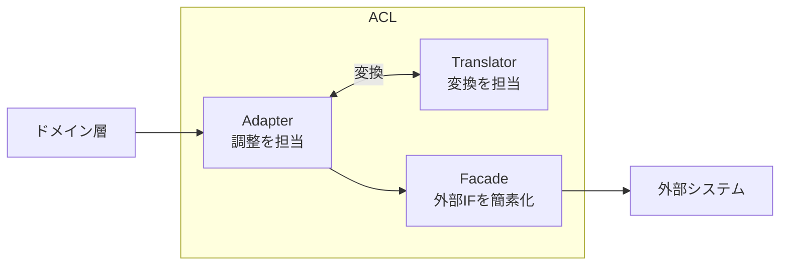

## はじめに

外部 API やレガシーシステムと連携する際、相手のデータ構造をそのまま自分のドメインモデルへ持ち込むと、ドメインが外部の都合で振り回されるようになります。API の仕様変更がドメインロジックに波及し、テストも壊れます。

この問題を防ぐための設計パターンが **腐敗防止層（Anti-Corruption Layer、以下 ACL）** です。本章では、ACL の目的を整理した上で、Go での Facade / Adapter / Translator パターンの実装例を紹介します。

---

## 腐敗防止層とは

腐敗防止層は、Eric Evans が『Domain-Driven Design』で定義したパターンです。

> Create an isolating layer to provide clients with functionality in terms of their own domain model. The layer talks to the other system through its existing interface, requiring little or no modification to the other system.
>
> — Eric Evans, _Domain-Driven Design: Tackling Complexity in the Heart of Software_（2003）

### ACL が必要になる場面

以下のような状況で、ACL の導入を検討します。

- **外部 API のレスポンス構造が自分のドメインモデルと異なる**: たとえば外部の決済 API が返す`transaction`と、自分のドメインの`Payment`は異なる概念です
- **レガシーシステムとの連携**: 古いシステムのデータ構造をそのまま使うと、レガシーの設計判断に引きずられます
- **サードパーティサービスの仕様変更リスク**: API のバージョンアップで構造体が変わっても、ACL の中だけで吸収したい場合

### ACL の構造

Evans は『Domain-Driven Design』の中で ACL の設計について次のように述べています。

> One way of organizing the design of the ANTICORRUPTION LAYER is as a combination of FACADES, ADAPTERS (both from Gamma et al. 1995), and translators.
>
> — Eric Evans, _Domain-Driven Design: Tackling Complexity in the Heart of Software_（2003）

ACL は主に3つの要素で構成されます。



| 要素 | 責務 |
| --- | --- |
| Translator | 外部のデータ構造をドメインモデルに変換します（またはその逆） |
| Facade | 外部システムの複雑なインターフェースを簡素化します（通信プロトコルの詳細を隠蔽します） |
| Adapter | ドメイン層のリクエストを受け取り、Facade と Translator を使って外部システムと橋渡しします |

Facade と Adapter は GoF の同名パターン（Gamma et al. 1995）に由来します。

---

## Go での ACL 実装パターン

EC サイトで外部の決済 API と連携する場面を例に、ACL の実装を見ていきます。

### ドメインモデルの定義

まず、自分のドメインモデルを定義します。このモデルは外部 API の存在を知りません。

```go
// domain/payment.go
package domain

import "time"

// PaymentStatus は決済の状態を表す値オブジェクトです。
type PaymentStatus string

const (
    PaymentStatusPending   PaymentStatus = "pending"
    PaymentStatusCompleted PaymentStatus = "completed"
    PaymentStatusCancelled PaymentStatus = "cancelled"
    PaymentStatusFailed    PaymentStatus = "failed"
    PaymentStatusRefunded  PaymentStatus = "refunded"
)

// Payment はドメインの決済モデルです。
type Payment struct {
    ID            string
    OrderID       string
    Amount        Money
    Status        PaymentStatus
    PaidAt        *time.Time
    FailureReason string
}

// Money は金額を表す値オブジェクトです。
type Money struct {
    Amount   int64
    Currency string
}

// Order はドメインの注文モデルです。
type Order struct {
    ID          string
    TotalAmount Money
}
```

### 外部 API のレスポンス構造体

外部の決済 API は独自のデータ構造を返します。この構造体は ACL 内に閉じ込めます。

```go
// infra/payment/external/types.go
package external

// ChargeRequest は外部決済APIへのリクエストです。
// このファイルはACL内部でのみ使用します。
type ChargeRequest struct {
    MerchantRef  string `json:"merchant_ref"`
    AmountCents  int64  `json:"amount_cents"`
    CurrencyCode string `json:"currency_code"`
}

// ChargeResponse は外部決済APIのレスポンスです。
// このファイルはACL内部でのみ使用します。
type ChargeResponse struct {
    ChargeID     string `json:"charge_id"`
    MerchantRef  string `json:"merchant_ref"`
    AmountCents  int64  `json:"amount_cents"`
    CurrencyCode string `json:"currency_code"`
    State        string `json:"state"`       // "authorized", "captured", "voided", "refunded"
    ProcessedAt  string `json:"processed_at"` // RFC3339（例: "2024-01-15T10:30:00Z"）
    ErrorCode    string `json:"error_code"`
    ErrorMessage string `json:"error_message"`
}
```

ドメインの`Payment`と外部の`ChargeResponse`は構造や命名規則が異なります。`State`の値（`authorized`、`captured`等）は外部 API の語彙であり、ドメインの`PaymentStatus`とは対応関係が必要です。

### Translator の実装

Translator は外部のデータ構造をドメインモデルに変換する責務を持ちます。

```go
// infra/payment/translator.go
package payment

import (
    "fmt"
    "time"

    "myapp/domain"
    "myapp/infra/payment/external"
)

// translator は外部決済APIのレスポンスをドメインモデルに変換します。
type translator struct{}

func (t *translator) toPayment(resp *external.ChargeResponse) (*domain.Payment, error) {
    status, err := t.toPaymentStatus(resp.State)
    if err != nil {
        return nil, fmt.Errorf("決済状態の変換に失敗しました: %w", err)
    }

    paidAt, err := t.toPaidAt(status, resp.ProcessedAt)
    if err != nil {
        return nil, fmt.Errorf("日時の解析に失敗しました: %w", err)
    }

    return &domain.Payment{
        ID:      resp.ChargeID,
        OrderID: resp.MerchantRef,
        Amount: domain.Money{
            Amount:   resp.AmountCents,
            Currency: resp.CurrencyCode,
        },
        Status:        status,
        PaidAt:        paidAt,
        FailureReason: resp.ErrorMessage,
    }, nil
}

// toPaidAt は決済完了時のみ PaidAt を設定します。
// pending（オーソリ済み）や cancelled（ボイド）の段階ではまだ支払いが完了していないため nil を返します。
func (t *translator) toPaidAt(status domain.PaymentStatus, processedAt string) (*time.Time, error) {
    if status != domain.PaymentStatusCompleted && status != domain.PaymentStatusRefunded {
        return nil, nil
    }

    parsed, err := time.Parse(time.RFC3339, processedAt)
    if err != nil {
        return nil, err
    }
    return &parsed, nil
}

func (t *translator) toPaymentStatus(state string) (domain.PaymentStatus, error) {
    switch state {
    case "authorized":
        return domain.PaymentStatusPending, nil
    case "captured":
        return domain.PaymentStatusCompleted, nil
    case "voided":
        return domain.PaymentStatusCancelled, nil
    case "refunded":
        return domain.PaymentStatusRefunded, nil
    default:
        return "", fmt.Errorf("未知の決済状態です: %s", state)
    }
}

func (t *translator) toChargeRequest(orderID string, amount domain.Money) *external.ChargeRequest {
    return &external.ChargeRequest{
        MerchantRef:  orderID,
        AmountCents:  amount.Amount,
        CurrencyCode: amount.Currency,
    }
}
```

Translator のポイントは以下の通りです。

- 外部 API の語彙（`authorized`、`captured`、`voided`等）をドメインの語彙（`pending`、`completed`、`cancelled`等）に翻訳します
- 日時フォーマットの変換など、技術的な差異もここで吸収します
- 決済状態に応じて`PaidAt`の設定を制御します。まだ支払いが完了していない状態（`pending`や`cancelled`）では`nil`を返します
- 未知の値に対してエラーを返すことで、外部 API 変更時に問題を早期検出します

### Facade の実装

Facade は GoF の Facade パターンに相当し、外部 API との通信の詳細（HTTP メソッド、エンドポイント、認証ヘッダー、ステータスコード判定、ボディのデコード）を隠蔽します。Adapter から見ると「`ChargeRequest`を渡せば`ChargeResponse`が返ってくる」シンプルな窓口です。

```go
// infra/payment/facade.go
package payment

import (
    "bytes"
    "context"
    "encoding/json"
    "fmt"
    "io"
    "net/http"

    "myapp/infra/payment/external"
)

// paymentAPIFacade は外部決済APIとの通信の詳細を隠蔽するFacadeです。
// 外部の複雑なHTTPインターフェースをシンプルなメソッド呼び出しとして提供します。
type paymentAPIFacade struct {
    client  *http.Client
    baseURL string
    apiKey  string
}

func newPaymentAPIFacade(client *http.Client, baseURL, apiKey string) *paymentAPIFacade {
    return &paymentAPIFacade{
        client:  client,
        baseURL: baseURL,
        apiKey:  apiKey,
    }
}

// Charge は外部決済APIの /v1/charges エンドポイントを呼び出します。
// 呼び出し元はHTTPの詳細を意識する必要がありません。
func (f *paymentAPIFacade) Charge(ctx context.Context, req *external.ChargeRequest) (*external.ChargeResponse, error) {
    body, err := json.Marshal(req)
    if err != nil {
        return nil, fmt.Errorf("リクエストの構築に失敗しました: %w", err)
    }

    httpReq, err := http.NewRequestWithContext(ctx, http.MethodPost, f.baseURL+"/v1/charges", bytes.NewReader(body))
    if err != nil {
        return nil, fmt.Errorf("HTTPリクエストの作成に失敗しました: %w", err)
    }
    httpReq.Header.Set("Authorization", "Bearer "+f.apiKey)
    httpReq.Header.Set("Content-Type", "application/json")

    resp, err := f.client.Do(httpReq)
    if err != nil {
        return nil, fmt.Errorf("決済APIの呼び出しに失敗しました: %w", err)
    }
    defer resp.Body.Close()

    if resp.StatusCode < 200 || resp.StatusCode >= 300 {
        // コネクション再利用のためボディを読み捨てます。
        // ここでの読み捨てエラーは本質的な障害ではないため無視します。
        _, _ = io.Copy(io.Discard, resp.Body)
        return nil, fmt.Errorf("決済APIがエラーを返しました: status=%d", resp.StatusCode)
    }

    var chargeResp external.ChargeResponse
    if err := json.NewDecoder(resp.Body).Decode(&chargeResp); err != nil {
        return nil, fmt.Errorf("レスポンスの解析に失敗しました: %w", err)
    }

    return &chargeResp, nil
}
```

### Adapter の実装

Adapter は Facade と Translator を組み合わせて、ドメイン層のリクエストを外部システムとの通信に橋渡しします。UseCase 層が定義するインターフェースを実装しますが、通信の詳細は Facade に委譲するため、Adapter 自体はシンプルな調整役に徹します。

```go
// infra/payment/adapter.go
package payment

import (
    "context"
    "net/http"

    "myapp/domain"
)

// PaymentGateway は外部決済APIとドメイン層を橋渡しするAdapterです。
// UseCase層が定義するインターフェース（paymentGateway）を実装します。
// 通信の詳細はFacadeに、データ変換はTranslatorに委譲します。
type PaymentGateway struct {
    facade     *paymentAPIFacade
    translator *translator
}

func NewPaymentGateway(client *http.Client, baseURL, apiKey string) *PaymentGateway {
    return &PaymentGateway{
        facade:     newPaymentAPIFacade(client, baseURL, apiKey),
        translator: &translator{},
    }
}

func (g *PaymentGateway) Charge(ctx context.Context, orderID string, amount domain.Money) (*domain.Payment, error) {
    // 1. ドメインモデルを外部APIのリクエスト形式に変換します
    req := g.translator.toChargeRequest(orderID, amount)

    // 2. Facade経由で外部APIを呼び出します（通信の詳細はFacadeが隠蔽します）
    resp, err := g.facade.Charge(ctx, req)
    if err != nil {
        return nil, err
    }

    // 3. 外部APIのレスポンスをドメインモデルに変換して返します
    return g.translator.toPayment(resp)
}
```

Adapter の`Charge`メソッドは、変換（Translator）→ 通信（Facade）→ 変換（Translator）という3ステップで処理を組み立てています。Adapter 自体にはビジネスロジックや通信コードがなく、調整役に徹している点がポイントです。

### UseCase からの利用

UseCase 層は ACL の存在を意識しません。ドメインモデルだけを使って処理を記述します。

```go
// usecase/process_payment.go
package usecase

import (
    "context"
    "fmt"

    "myapp/domain"
)

// paymentGateway はUseCaseが必要とするインターフェースです。
// Go の慣習に従い、利用側で定義します。
type paymentGateway interface {
    Charge(ctx context.Context, orderID string, amount domain.Money) (*domain.Payment, error)
}

type orderReader interface {
    FindByID(ctx context.Context, orderID string) (*domain.Order, error)
}

type ProcessPaymentInteractor struct {
    gateway   paymentGateway
    orderRepo orderReader
}

func NewProcessPaymentInteractor(gateway paymentGateway, orderRepo orderReader) *ProcessPaymentInteractor {
    return &ProcessPaymentInteractor{
        gateway:   gateway,
        orderRepo: orderRepo,
    }
}

func (uc *ProcessPaymentInteractor) Execute(ctx context.Context, orderID string) (*domain.Payment, error) {
    order, err := uc.orderRepo.FindByID(ctx, orderID)
    if err != nil {
        return nil, fmt.Errorf("注文の取得に失敗しました: %w", err)
    }

    payment, err := uc.gateway.Charge(ctx, order.ID, order.TotalAmount)
    if err != nil {
        return nil, fmt.Errorf("決済処理に失敗しました: %w", err)
    }

    return payment, nil
}
```

---

## プロトコル別の実装例

ACL のパターンは HTTP/REST に限りません。gRPC や GraphQL でも同じ考え方が適用できます。

### gRPC の場合

外部サービスが gRPC を提供している場合、Protocol Buffers で生成された型が ACL の外部型になります。

```go
// infra/shipping/translator.go
package shipping

import (
    "fmt"

    "myapp/domain"
    shippingpb "myapp/infra/shipping/gen/proto"
)

type translator struct{}

func (t *translator) toShipment(resp *shippingpb.TrackingResponse) (*domain.Shipment, error) {
    status, err := t.toShipmentStatus(resp.GetStatus())
    if err != nil {
        return nil, fmt.Errorf("配送状態の変換に失敗しました: %w", err)
    }

    return &domain.Shipment{
        TrackingID: resp.GetTrackingId(),
        Status:     status,
        Location:   resp.GetCurrentLocation(),
    }, nil
}

func (t *translator) toShipmentStatus(status shippingpb.ShippingStatus) (domain.ShipmentStatus, error) {
    switch status {
    case shippingpb.ShippingStatus_SHIPPED:
        return domain.ShipmentStatusInTransit, nil
    case shippingpb.ShippingStatus_DELIVERED:
        return domain.ShipmentStatusDelivered, nil
    case shippingpb.ShippingStatus_RETURNED:
        return domain.ShipmentStatusReturned, nil
    default:
        return "", fmt.Errorf("未知の配送状態です: %v", status)
    }
}
```

```go
// infra/shipping/facade.go
package shipping

import (
    "context"

    shippingpb "myapp/infra/shipping/gen/proto"
    "google.golang.org/grpc"
)

// shippingServiceFacade は外部配送サービスのgRPCインターフェースを簡素化するFacadeです。
type shippingServiceFacade struct {
    client shippingpb.ShippingServiceClient
}

func newShippingServiceFacade(conn grpc.ClientConnInterface) *shippingServiceFacade {
    return &shippingServiceFacade{
        client: shippingpb.NewShippingServiceClient(conn),
    }
}

// GetTracking は外部配送サービスのgRPCリクエストの詳細を隠蔽します。
func (f *shippingServiceFacade) GetTracking(ctx context.Context, trackingID string) (*shippingpb.TrackingResponse, error) {
    return f.client.GetTracking(ctx, &shippingpb.TrackingRequest{
        TrackingId: trackingID,
    })
}
```

```go
// infra/shipping/adapter.go
package shipping

import (
    "context"
    "fmt"

    "myapp/domain"
    "google.golang.org/grpc"
)

// ShippingTracker は外部配送サービスとドメイン層を橋渡しするAdapterです。
type ShippingTracker struct {
    facade     *shippingServiceFacade
    translator *translator
}

func NewShippingTracker(conn grpc.ClientConnInterface) *ShippingTracker {
    return &ShippingTracker{
        facade:     newShippingServiceFacade(conn),
        translator: &translator{},
    }
}

func (s *ShippingTracker) Track(ctx context.Context, trackingID string) (*domain.Shipment, error) {
    resp, err := s.facade.GetTracking(ctx, trackingID)
    if err != nil {
        return nil, fmt.Errorf("配送追跡の取得に失敗しました: %w", err)
    }

    return s.translator.toShipment(resp)
}
```

### REST と gRPC の比較

| 観点              | REST                            | gRPC                          |
| ----------------- | ------------------------------- | ----------------------------- |
| 外部型の定義場所  | ACL 内の構造体（JSON タグ付き） | Protocol Buffers の生成コード |
| Translator の入力 | JSON 構造体                     | Protocol Buffers メッセージ   |
| Facade の通信     | `net/http`                      | `google.golang.org/grpc`      |
| Adapter の役割    | 同じ                            | 同じ                          |
| ACL のパターン    | 同じ                            | 同じ                          |

プロトコルが変わっても、ACL の構造（Facade + Adapter + Translator）は変わりません。変わるのは Facade が扱う通信の詳細と外部型の定義方法だけです。

---

## ACL 導入時の判断基準

ACL はすべての外部連携に必要なわけではありません。以下の基準で導入を判断します。

| 条件                                             | ACL の要否                           |
| ------------------------------------------------ | ------------------------------------ |
| 外部 API のモデルが自分のドメインと大きく異なる  | 必要です                             |
| 外部 API の仕様変更頻度が高い                    | 必要です                             |
| レガシーシステムとの連携                         | 必要です                             |
| チーム内の別サービス（共通のドメイン言語がある） | 不要な場合が多いです                 |
| 標準的なライブラリ（DB、キャッシュ等）           | 不要です（モデルの乖離が小さいため） |

ACL を過剰に導入すると、翻訳層のメンテナンスコストが増えます。外部のモデルとドメインモデルが近い場合は、Facade や Translator を省いたシンプルな実装で十分なこともあります。

---

## Translator のテスト

ACL を導入する利点の1つは、Translator を単体テストできることです。外部 API を呼び出さずに変換ロジックだけを検証できます。

```go
// infra/payment/translator_test.go
package payment

import (
    "testing"

    "myapp/domain"
    "myapp/infra/payment/external"
)

func TestToPayment_Captured(t *testing.T) {
    tr := &translator{}
    resp := &external.ChargeResponse{
        ChargeID:     "ch_001",
        MerchantRef:  "order_123",
        AmountCents:  1500,
        CurrencyCode: "JPY",
        State:        "captured",
        ProcessedAt:  "2024-06-15T14:30:00Z",
    }

    payment, err := tr.toPayment(resp)
    if err != nil {
        t.Fatalf("unexpected error: %v", err)
    }

    if payment.Status != domain.PaymentStatusCompleted {
        t.Errorf("status = %s, want %s", payment.Status, domain.PaymentStatusCompleted)
    }
    if payment.PaidAt == nil {
        t.Fatal("PaidAt should not be nil for completed payment")
    }
    if payment.Amount.Amount != 1500 {
        t.Errorf("amount = %d, want 1500", payment.Amount.Amount)
    }
}

func TestToPayment_Authorized(t *testing.T) {
    tr := &translator{}
    // authorized（オーソリ済み）ではまだキャプチャされていないため、
    // 本章の外部APIの仕様では ProcessedAt は空になります。
    resp := &external.ChargeResponse{
        ChargeID:     "ch_002",
        MerchantRef:  "order_456",
        AmountCents:  3000,
        CurrencyCode: "JPY",
        State:        "authorized",
        ProcessedAt:  "",
    }

    payment, err := tr.toPayment(resp)
    if err != nil {
        t.Fatalf("unexpected error: %v", err)
    }

    if payment.Status != domain.PaymentStatusPending {
        t.Errorf("status = %s, want %s", payment.Status, domain.PaymentStatusPending)
    }
    if payment.PaidAt != nil {
        t.Error("PaidAt should be nil for pending payment")
    }
}

func TestToPaymentStatus_Unknown(t *testing.T) {
    tr := &translator{}

    _, err := tr.toPaymentStatus("unknown_state")
    if err == nil {
        t.Fatal("expected error for unknown state")
    }
}

func TestToChargeRequest(t *testing.T) {
    tr := &translator{}

    req := tr.toChargeRequest("order_789", domain.Money{Amount: 2500, Currency: "JPY"})

    if req.MerchantRef != "order_789" {
        t.Errorf("MerchantRef = %s, want order_789", req.MerchantRef)
    }
    if req.AmountCents != 2500 {
        t.Errorf("AmountCents = %d, want 2500", req.AmountCents)
    }
    if req.CurrencyCode != "JPY" {
        t.Errorf("CurrencyCode = %s, want JPY", req.CurrencyCode)
    }
}
```

Translator をテストする際のポイントは以下の通りです。

- 外部 API の各状態がドメインの正しい状態にマッピングされることを検証します
- 決済完了時のみ`PaidAt`が設定されることを確認します
- 未知の状態でエラーが返ることを確認し、外部 API 変更時の検出を保証します
- リクエスト変換（`toChargeRequest`）のフィールドマッピングが正しいことを確認します

---

## まとめ

| 観点              | 内容                                                                         |
| ----------------- | ---------------------------------------------------------------------------- |
| ACL の目的        | 外部システムのモデルがドメインを「腐敗」させることを防ぎます                 |
| Facade の責務     | 外部システムの複雑な通信インターフェースを簡素化します                       |
| Adapter の責務    | ドメイン層のリクエストを Facade と Translator で外部システムと橋渡しします   |
| Translator の責務 | 外部のデータ構造をドメインモデルに変換します                                 |
| Go での実装       | 利用側でインターフェースを定義し、Facade + Adapter + Translator で実装します |
| プロトコル非依存  | REST / gRPC 等、プロトコルが変わっても ACL の構造は同じです                  |

ACL は、外部システムとの境界を明確にし、ドメインモデルの純粋性を守るための重要なパターンです。UseCase 層がインターフェースを定義し、ACL がそれを実装する構造（依存性の逆転）により、UseCase 層は ACL の実装詳細を一切知らずに済みます。外部 API の仕様変更があっても、Translator 内の変換ロジックを修正するだけでドメイン層への影響を防げます。

---

## 参考文献

| 内容 | 出典 |
| --- | --- |
| 腐敗防止層の原典 | Eric Evans, _Domain-Driven Design: Tackling Complexity in the Heart of Software_（2003） |
| ACL の解説 | [Anti-Corruption Layer](https://learn.microsoft.com/en-us/azure/architecture/patterns/anti-corruption-layer)（Microsoft Azure Architecture Patterns） |
| Go のインターフェース設計 | Go Wiki, [Go Code Review Comments](https://go.dev/wiki/CodeReviewComments#interfaces) |
| DDD 実践ガイド | Vaughn Vernon, _Implementing Domain-Driven Design_（2013） |
| GoF デザインパターン | Erich Gamma et al., _Design Patterns: Elements of Reusable Object-Oriented Software_（1995） |
| gRPC Go 実装 | [gRPC Go Quick Start](https://grpc.io/docs/languages/go/quickstart/) |
