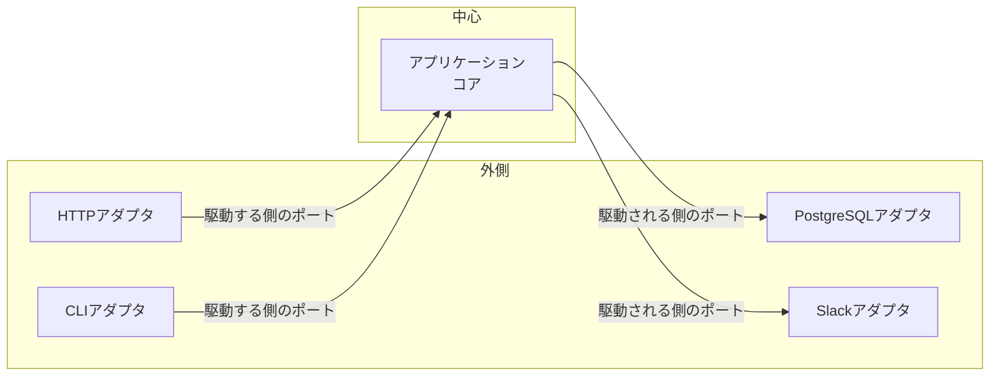

## はじめに

クリーンアーキテクチャを調べていると、ヘキサゴナルアーキテクチャ、オニオンアーキテクチャ、Vertical Slice Architecture といった別の名前が次々に出てきます。「どれを採用すべきか」という問いに時間を使う前に、先に結論を書いておきます。ヘキサゴナル、オニオン、クリーンアーキテクチャの3つは、依存の向きという観点ではほぼ同じものです。選ぶべきは名前ではなく、自分のプロジェクトに合った分割の粒度です。

実際、クリーンアーキテクチャの提唱者である Robert C. Martin 自身が、原典のブログ記事でヘキサゴナルやオニオンを列挙したうえで、こう書いています。

> Though these architectures all vary somewhat in their details, they are very similar. They all have the same objective, which is the separation of concerns.
>
> — Robert C. Martin, [The Clean Architecture](https://blog.cleancoder.com/uncle-bob/2012/08/13/the-clean-architecture.html)（2012）

Martin 自身が、クリーンアーキテクチャを先行するアーキテクチャ群の統合の試みだと位置づけています。この章では、それぞれのスタイルが何を強調しているかを整理し、Go のプロジェクトでどう選ぶかの判断基準を示します。

---

## ヘキサゴナルアーキテクチャ（Ports & Adapters）

Alistair Cockburn が2005年に発表したスタイルで、正式名は Ports & Adapters です。アプリケーションの中心（ビジネスロジック）をポートと呼ばれる抽象で囲み、外部との接続はすべてアダプタ経由にします。



特徴は次の2点です。

- **レイヤーの数を規定しない**。中心と外側の2つだけです
- **左右対称の視点**。アプリケーションを駆動する側（HTTP、CLI）と、アプリケーションから駆動される側（DB、外部 API）を同じ「ポートとアダプタ」で扱います

第2章で紹介した `core/` と `adapter/` の2層構成は、実質的にヘキサゴナルアーキテクチャそのものです。Go の implicit interface はポートの実装宣言を不要にするので、この2つは相性がよいと私は考えています。

> Allow an application to equally be driven by users, programs, automated test or batch scripts, and to be developed and tested in isolation from its eventual run-time devices and databases.
>
> — Alistair Cockburn, [Hexagonal Architecture](https://alistair.cockburn.us/hexagonal-architecture/)

---

## オニオンアーキテクチャ

Jeffrey Palermo が2008年に提唱したスタイルです。中心に Domain Model、その外に Domain Services、Application Services、最も外側に Infrastructure を置く同心円です。依存はすべて中心に向かいます。

クリーンアーキテクチャの同心円図とほぼ同じに見えますし、実際ほぼ同じです。違いは語彙にあります。クリーンアーキテクチャの最内層が Entities（エンタープライズ全体のビジネスルール）と呼ばれるのに対し、オニオンは中心を Domain Model と呼び、DDD の用語で説明します。

Go での実装に落とすと、`domain/model` を中心に据えて `domain/service`、`usecase`、`infrastructure` を重ねる構成になります。本書で扱ってきた構成と区別がつきません。名前が違うだけだと理解して差し支えありません。

---

## クリーンアーキテクチャ

2012年に Robert C. Martin が発表したスタイルです。Martin 自身が原典で、同心円図を先行アーキテクチャ群の統合の試みだと位置づけています。

> The diagram at the top of this article is an attempt at integrating all these architectures into a single actionable idea.
>
> — Robert C. Martin, [The Clean Architecture](https://blog.cleancoder.com/uncle-bob/2012/08/13/the-clean-architecture.html)（2012）

統合元はヘキサゴナルとオニオンに加え、Screaming Architecture、DCI、BCE です。BCE（Boundary-Control-Entity）は Ivar Jacobson が1992年に提唱したものです。同心円図に描かれる円は Entities / Use Cases / Interface Adapters / Frameworks & Drivers の4つです。Use Cases の円には「アプリケーション固有のビジネスルール」を置くと説明されています。本書が実装 struct の名前に使っている Interactor という呼び名も、Martin の独創ではありません。参照元である BCE の Control（ユースケースの制御役）の系譜にあたります。

第5章で扱う「UseCase 層は必要か」という論点は、この図に Use Cases が独立した円として描かれていることを出発点にしています。

---

## Vertical Slice Architecture

Vertical Slice Architecture は、ここまでの3つとは分割の軸そのものが違います。Jimmy Bogard が提唱したもので、コードを技術レイヤー（水平方向）ではなく機能（垂直方向）で分割します。

> Instead of coupling across a layer, we couple vertically along a slice.
>
> — Jimmy Bogard, [Vertical Slice Architecture](https://www.jimmybogard.com/vertical-slice-architecture/)

「注文作成」という機能に必要なハンドラ、ロジック、DB アクセスを1つのスライスにまとめ、スライス間の結合を最小にする考え方です。レイヤー分割への批判として語られることが多いのですが、私は排他的なものだとは考えていません。第2章で示した「モジュールでまず分割し、その中でレイヤーを分ける」構成は、外側の分割が Vertical Slice、内側の分割がクリーンアーキテクチャという組み合わせです。

```text
internal/
├── order/        # ← ここの分割はVertical Slice的
│   ├── domain/       # ← ここから内側はクリーンアーキテクチャ的
│   ├── usecase/
│   ├── interface/
│   └── infrastructure/
└── user/
    └── ...
```

スライス内のレイヤーをどこまで薄くするかは機能ごとに変えられます。CRUD だけのスライスならレイヤーを減らし、ロジックの重いスライスだけ層を厚くする。この柔軟さが Vertical Slice の実利です。

---

## 4つのスタイルの比較

| 観点       | ヘキサゴナル       | オニオン             | クリーン           | Vertical Slice     |
| ---------- | ------------------ | -------------------- | ------------------ | ------------------ |
| 提唱       | Cockburn（2005）   | Palermo（2008）      | Martin（2012）     | Bogard             |
| 分割の軸   | 中心と外側         | 同心円レイヤー       | 同心円レイヤー     | 機能               |
| 依存の向き | 中心へ             | 中心へ               | 中心へ             | スライス内で自由   |
| 層の数     | 規定しない         | 4層が目安            | 例示は4層（可変）  | 規定しない         |
| 特徴       | ポートの左右対称性 | 中心はドメインモデル | Use Cases 円の明示 | レイヤー横断の凝集 |

上の3列は本質的に同じもので、依存の向きを守るという1点で一致しています。第2章で「レイヤー数ではなく依存の方向が重要」と書いたのは、この3スタイルすべてに共通する原則です。

---

## Go プロジェクトでの選び方

名前で選ぶのをやめて、プロジェクトの性質で決めます。私の判断基準は次のとおりです。

| 状況 | 構成 |
| --- | --- |
| 小さなツール、単機能のマイクロサービス | `core/` と `adapter/` の2層（ヘキサゴナル的） |
| 複数機能を持つサービス | モジュール分割 × 各モジュール内で3〜4層（Vertical Slice × クリーン） |
| 機能ごとの複雑さの差が大きい | モジュール分割を優先し、層の厚さはモジュールごとに調整 |

どの構成でも守るものは1つ、依存の向きだけです。逆に言うと、依存の向きさえ守れていれば、途中で構成を変えることは難しくありません。2層で始めたサービスが育ってきたら、`core/` を `domain/` と `usecase/` に割ればよいだけです。私は迷ったら小さい方を選びます。層を増やすのは、増やす理由が実際に現れてからで間に合うからです。

モジュール分割の単位をどう決めるかは、第13章「モジュール構成」で詳しく扱います。

---

## まとめ

- ヘキサゴナル、オニオン、クリーンアーキテクチャは依存の向きという観点では同じものです。どれを「採用」するかの議論に時間を使う必要はありません
- クリーンアーキテクチャの同心円図は Use Cases を独立した円として描いています。その層の要否は第5章で判断します
- Vertical Slice は分割の軸が違うだけで、レイヤー分割と併用できます。モジュール × レイヤーの構成が Go での現実解です
- 迷ったら小さい構成から始めて、育ってから層を増やします

---

## 参考文献

| 内容 | 出典 |
| --- | --- |
| クリーンアーキテクチャ原典 | Robert C. Martin, [The Clean Architecture](https://blog.cleancoder.com/uncle-bob/2012/08/13/the-clean-architecture.html)（2012） |
| ヘキサゴナルアーキテクチャ | Alistair Cockburn, [Hexagonal Architecture](https://alistair.cockburn.us/hexagonal-architecture/) |
| オニオンアーキテクチャ | Jeffrey Palermo, [The Onion Architecture : part 1](https://jeffreypalermo.com/2008/07/the-onion-architecture-part-1/)（2008） |
| Vertical Slice Architecture | Jimmy Bogard, [Vertical Slice Architecture](https://www.jimmybogard.com/vertical-slice-architecture/) |
