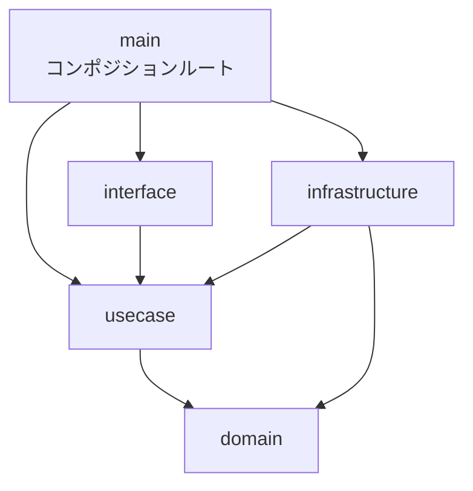

## はじめに

ここまでの章で「interfaceは利用側で定義する」「実装はinfrastructure層に置く」「依存の注入はmain関数で行う」と繰り返し書いてきました。この章では最後の「main関数で注入する」の部分を掘り下げます。依存の配線をどこに書くか、手動で書くかツールに任せるか、という論点です。

先に私の結論を書いておきます。**手動DIから始めてください**。GoのDIはコンストラクタ関数に引数を渡すだけの話で、ツールが必要になるのは配線が数百行を超えてからです。

---

## コンポジションルートという考え方

依存性注入の文献でよく参照されるMark Seemannは、依存を組み立てる場所をコンポジションルートと呼び、こう定義しています。

> A Composition Root is a (preferably) unique location in an application where modules are composed together.
>
> — Mark Seemann, [Composition Root](https://blog.ploeh.dk/2011/07/28/CompositionRoot/)（2011）

重要なのは、この場所がアプリケーション内で唯一であることです。配線がハンドラの中やUseCase層の中に散らばると、どの実装がどこで使われているかを追えなくなります。Goのアプリケーションでは、コンポジションルートは`main`パッケージ、もしくは`main`から呼ばれる初期化専用のパッケージになります。

コンポジションルートには特権があります。ここだけは、すべてのレイヤーをimportしてよいのです。domain層からinfrastructure層まで、すべてを知らなければ配線できないからです。依存性ルールの例外ではなく、最も外側のレイヤーだからこそ許される役割です。



---

## 手動DI：まずはこれで十分

手動DIの実体は、コンストラクタ関数の呼び出しを依存の順に並べることです。

```go
// cmd/server/main.go
func main() {
    db, err := sql.Open("pgx", os.Getenv("DATABASE_URL"))
    if err != nil {
        log.Fatal(err)
    }
    defer db.Close()

    // infrastructure層：外側から組み立てる
    orderRepo := postgres.NewOrderRepository(db)
    mailer := smtp.NewMailer(os.Getenv("SMTP_HOST"))

    // usecase層：infrastructureの実装を注入する
    createOrder := usecase.NewCreateOrderInteractor(orderRepo, mailer)
    getOrder := usecase.NewGetOrderInteractor(orderRepo)

    // interface層：Interactorを注入する
    orderHandler := handler.NewOrderHandler(createOrder, getOrder)

    mux := http.NewServeMux()
    mux.HandleFunc("POST /orders", orderHandler.Create)
    mux.HandleFunc("GET /orders/{id}", orderHandler.Get)

    log.Fatal(http.ListenAndServe(":8080", mux))
}
```

利点は3つあります。

- **コンパイル時にすべて検証される**。引数の型が合わなければビルドが通りません
- **実行順が読める**。何がどの順で初期化されるか、上から読むだけで分かります
- **学習コストがゼロ**。新しくチームに入った人が追加のツールを学ぶ必要がありません

### interface満足の検証もここに置く

第2章で紹介した`var _`イディオムの置き場所も、コンポジションルートです。

```go
// cmd/server/main.go
var (
    _ usecase.OrderRepository = (*postgres.OrderRepository)(nil)
    _ usecase.Mailer          = (*smtp.Mailer)(nil)
)
```

infrastructure層のテストファイルに書く方法もありますが、私はコンポジションルートに集約する方を選びます。「この実装はこのinterfaceとして使われる」という配線の宣言そのものだからです。

### 肥大化への対策：モジュールごとの組み立て関数

モジュールが増えると`main`が長くなります。その場合は、モジュールごとに組み立て関数を切り出します。

```go
// internal/order/di/provider.go
package di

func NewOrderHandler(db *sql.DB, mailer usecase.Mailer) *handler.OrderHandler {
    repo := postgres.NewOrderRepository(db)
    create := usecase.NewCreateOrderInteractor(repo, mailer)
    get := usecase.NewGetOrderInteractor(repo)
    return handler.NewOrderHandler(create, get)
}
```

```go
// cmd/server/main.go
orderHandler := orderdi.NewOrderHandler(db, mailer)
userHandler := userdi.NewUserHandler(db)
```

`main`はモジュールをまたぐ資源（DB接続、設定、ロガー）の生成と、モジュール組み立て関数の呼び出しだけになります。この形なら、モジュールが10個あっても`main`は数十行に収まります。

---

## wire：コード生成による自動配線

[google/wire](https://github.com/google/wire)は、コンストラクタ関数の集合から配線コードを生成するツールです。

```go
// internal/order/di/wire.go
//go:build wireinject

package di

func InitializeOrderHandler(db *sql.DB) *handler.OrderHandler {
    wire.Build(
        postgres.NewOrderRepository,
        wire.Bind(new(usecase.OrderRepository), new(*postgres.OrderRepository)),
        usecase.NewCreateOrderInteractor,
        usecase.NewGetOrderInteractor,
        handler.NewOrderHandler,
    )
    return nil // wireが実装を生成する
}
```

`wire`コマンドを実行すると、手動DIで書くのと同等のコードが`wire_gen.go`として生成されます。生成されるのは普通のGoコードなので、実行時のリフレクションはなく、型の不整合はコンパイルエラーになります。

注意点は、`wire.Bind`の行数です。interfaceと実装の対応を1つずつ宣言する必要があるため、interfaceを利用側で細かく定義する本書のスタイルとはやや相性が悪く、Bindの記述が積み上がります。コンストラクタが増えたときの追記がプロバイダ集合への1行で済む点が、手動DIに対する主な利点です。

---

## dig / fx：リフレクションによるDIコンテナ

[uber-go/dig](https://github.com/uber-go/dig)は実行時にリフレクションで依存を解決するコンテナで、[uber-go/fx](https://github.com/uber-go/fx)はその上に構築されたアプリケーションフレームワークです。

```go
c := dig.New()
c.Provide(postgres.NewOrderRepository)
c.Provide(usecase.NewCreateOrderInteractor)
c.Provide(handler.NewOrderHandler)

err := c.Invoke(func(h *handler.OrderHandler) {
    // hを使ってサーバーを起動する
})
```

登録順を気にしなくてよい手軽さはありますが、配線ミスがコンパイルエラーではなく実行時エラーになります。依存の解決に失敗するとアプリケーションが起動時に落ちる、という形で発覚します。コンパイル時検証を手放すこの性質を、私は受け入れていません。大規模なコードベースでfxを全面採用しているチームなら話は別ですが、これから設計を始めるプロジェクトで最初に選ぶものではないと考えています。

---

## 3つのアプローチの比較

| 観点           | 手動DI                 | wire                     | dig / fx               |
| -------------- | ---------------------- | ------------------------ | ---------------------- |
| 検証タイミング | コンパイル時           | コンパイル時（生成時）   | 実行時                 |
| 追加ツール     | 不要                   | wireコマンド             | ライブラリ             |
| 配線の可読性   | 高い（ただのGoコード） | 生成コードを読めば分かる | コンテナ内部は追えない |
| 配線追加の手間 | 引数の手直しが必要     | プロバイダ登録のみ       | プロバイダ登録のみ     |
| 向く規模       | 小〜中                 | 中〜大                   | fx前提の大規模組織     |

移行の順序も書いておきます。手動DIで始めて、モジュール組み立て関数で整理して、それでも配線の修正が開発の待ち時間になってきたらwireを検討する。この順です。逆方向の移行（wireをやめて手動に戻す）は生成コードをコミットすれば済むので、wireの採用はやり直しがききます。

---

## まとめ

- 依存の配線はコンポジションルート（`main`か初期化専用パッケージ）に集約します。配線とinterface満足の検証をここに置けば、実装の差し替え地点が1箇所になります
- 手動DIから始めます。コンパイル時検証、可読性、学習コストのバランスが最もよいからです
- 肥大化にはまずモジュールごとの組み立て関数で対処し、それでも足りなければwireを導入します
- 実行時解決のDIコンテナは、コンパイル時検証を手放すコストに見合う理由があるときだけ選びます

---

## 参考文献

| 内容 | 出典 |
| --- | --- |
| Composition Root | Mark Seemann, [Composition Root](https://blog.ploeh.dk/2011/07/28/CompositionRoot/)（2011） |
| wire | [google/wire - GitHub](https://github.com/google/wire) |
| wire紹介記事 | The Go Blog, [Compile-time Dependency Injection With Go Cloud's Wire](https://go.dev/blog/wire) |
| dig | [uber-go/dig - GitHub](https://github.com/uber-go/dig) |
| fx | [uber-go/fx - GitHub](https://github.com/uber-go/fx) |
