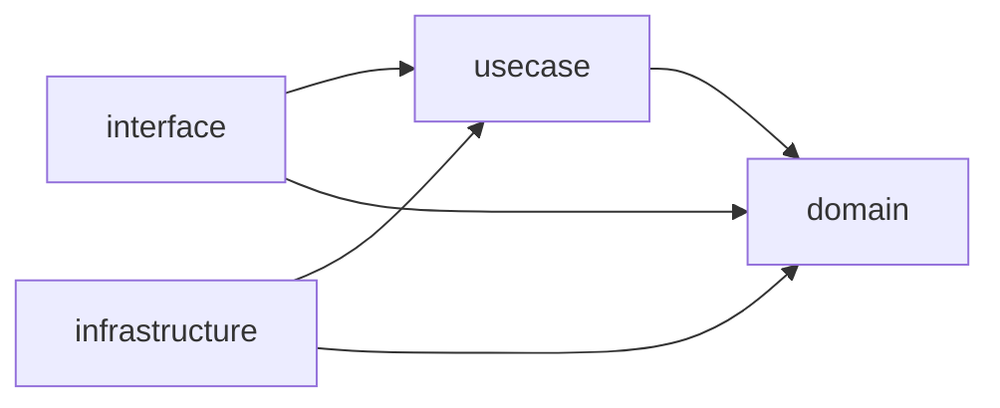

## はじめに

クリーンアーキテクチャの最も重要なルールは「依存性は常に内側に向かう」という**依存性ルール**です。しかし、コードレビューで依存方向を目視でチェックするには限界があります。チームが大きくなるほど、うっかり外側のレイヤーを import してしまう事故は増えていきます。

私のチームでも、domain 層から infrastructure 層のパッケージを import してしまう PR が月に数回発生していました。レビューで気づけば良いのですが、見落とすとアーキテクチャの崩壊が静かに進行します。

この章では、Go の`import`文を静的解析ツールで検査し、CI パイプラインで依存性ルール違反を自動的に検出・ブロックする方法を紹介します。

---

## 依存性ルール違反が発生するパターン

まず、典型的なクリーンアーキテクチャのレイヤー構成を確認します。

```text
internal/order/
├── domain/           # エンティティ、値オブジェクト、Repository interface
├── usecase/          # アプリケーションロジック
├── interface/        # HTTPハンドラ、gRPCサーバー
└── infrastructure/   # DB実装、外部API連携
```

:::message

`interface` は Go の予約語のため、パッケージ名には使えません。`interface/` はディレクトリ名としてのみ使い、直下にはパッケージを置かず `interface/rest` のようにサブパッケージを配置します。紛らわしさを避けたい場合は `presentation/` や `adapter/` という名前もよく使われます。

:::

依存性ルールでは、内側のレイヤーが外側のレイヤーを知ってはいけません。



しかし、実際のプロジェクトでは次のような違反が起きがちです。

### パターン1：domain 層から infrastructure 層への直接依存

```go
// ❌ domain/service/pricing.go
package service

import (
    "myapp/internal/order/infrastructure/postgres" // 違反！
)

func CalcPrice(orderID string) (int, error) {
    repo := postgres.NewOrderRepository() // domain層がDB実装を知っている
    order, err := repo.FindByID(orderID)
    // ...
}
```

domain 層が PostgreSQL の存在を知ってしまうと、DB を変更するときに domain 層まで修正が必要になります。

### パターン2：usecase 層から interface 層への逆方向依存

```go
// ❌ usecase/create_order.go
package usecase

import (
    "myapp/internal/order/interface/rest/dto" // 違反！
)

func (i *CreateOrderInteractor) Execute(req dto.CreateOrderRequest) error {
    // HTTPリクエストDTOに直接依存している
}
```

usecase 層が HTTP の DTO 構造体を知ってしまうと、gRPC や CLI など別のインターフェースへの対応が困難になります。

### パターン3：パッケージ間の循環依存

```go
// ❌ usecase/interactor.go
import "myapp/internal/order/interface/rest/handler"

// ❌ interface/rest/handler/order_handler.go
import "myapp/internal/order/usecase"
```

Go 言語ではパッケージの循環 import はコンパイルエラーになるため、循環依存そのものは防げます。しかし、間接的な循環（A → B → C → A）は検出しづらい場合があります。

---

## depguard によるインポート制限の設定

[depguard](https://github.com/OpenPeeDeeP/depguard)は、パッケージごとに許可・拒否する import を宣言的に設定できるツールです。[golangci-lint](https://golangci-lint.run/)に組み込まれているため、既存の lint 環境にすぐ導入できます。

### 基本設定

`.golangci.yml`に以下のように設定します。

```yaml
linters:
  enable:
    - depguard

linters-settings:
  depguard:
    rules:
      domain-layer:
        files:
          - "**/domain/**"
        deny:
          - pkg: "myapp/internal/*/usecase"
            desc: "domain層はusecase層に依存できません"
          - pkg: "myapp/internal/*/usecase/**"
            desc: "domain層はusecase層に依存できません"
          - pkg: "myapp/internal/*/interface"
            desc: "domain層はinterface層に依存できません"
          - pkg: "myapp/internal/*/interface/**"
            desc: "domain層はinterface層に依存できません"
          - pkg: "myapp/internal/*/infrastructure"
            desc: "domain層はinfrastructure層に依存できません"
          - pkg: "myapp/internal/*/infrastructure/**"
            desc: "domain層はinfrastructure層に依存できません"

      usecase-layer:
        files:
          - "**/usecase/**"
        deny:
          - pkg: "myapp/internal/*/interface"
            desc: "usecase層はinterface層に依存できません"
          - pkg: "myapp/internal/*/interface/**"
            desc: "usecase層はinterface層に依存できません"
          - pkg: "myapp/internal/*/infrastructure"
            desc: "usecase層はinfrastructure層に依存できません"
          - pkg: "myapp/internal/*/infrastructure/**"
            desc: "usecase層はinfrastructure層に依存できません"
```

### 違反時の出力例

設定後に`golangci-lint run`を実行すると、違反があれば次のようなメッセージが表示されます。

```text
domain/service/pricing.go:5:2: import "myapp/internal/order/infrastructure/postgres"
  is not allowed because: domain層はinfrastructure層に依存できません (depguard)
```

エラーメッセージにルール違反の理由が表示されるため、開発者はなぜブロックされたのかをすぐに理解できます。

---

## go-cleanarch によるレイヤー検証

[go-cleanarch](https://github.com/roblaszczak/go-cleanarch)は、クリーンアーキテクチャに特化した依存性チェックツールです。ディレクトリ名からレイヤーを推定し、依存方向の違反を検出します。

### インストールと実行

```bash
go install github.com/roblaszczak/go-cleanarch@latest
go-cleanarch ./internal/...
```

### レイヤーの認識ルール

go-cleanarch はディレクトリ名をもとにレイヤーを判定します。デフォルトでは以下のマッピングが使われます。

| ディレクトリ名            | レイヤー                 |
| ------------------------- | ------------------------ |
| `domain`                  | Domain（最内層）         |
| `usecase`, `application`  | Application              |
| `interface`, `interfaces` | Interfaces               |
| `infrastructure`, `infra` | Infrastructure（最外層） |

### 実行結果の例

違反がある場合、以下のように出力されます。

```text
/internal/order/domain/service/pricing.go:5:
  domain layer cannot import from infrastructure layer
  (import: myapp/internal/order/infrastructure/postgres)
```

go-cleanarch の利点は、**設定ファイル不要**で導入コストが低い点です。ディレクトリ命名規約に従っていれば、即座に使い始められます。

---

## kcmvp/archunit による柔軟なアーキテクチャテスト

[kcmvp/archunit](https://github.com/kcmvp/archunit)は、Go のテストコードの中でアーキテクチャルールを宣言的に記述できるライブラリです。JVM 向けの[ArchUnit](https://www.archunit.org/)にインスパイアされており、レイヤーを定義してから依存関係のルールを検証する流れになっています。

### テストコードでルールを定義

archunit ではまず`ArchLayer`でレイヤーを宣言し、`ArchUnit`でまとめてから、`Validate`にルールを渡して検証します。依存方向のルールは`Layers(...).ShouldNotRefer(...)`という流暢な API で記述できます。

```go
// architecture_test.go
package architecture_test

import (
    "testing"

    "github.com/kcmvp/archunit"
)

func TestDependencyRule(t *testing.T) {
    // レイヤーを定義する
    domain := archunit.ArchLayer("Domain", "myapp/internal/order/domain/...")
    usecase := archunit.ArchLayer("UseCase", "myapp/internal/order/usecase/...")
    iface := archunit.ArchLayer("Interface", "myapp/internal/order/interface/...")
    infra := archunit.ArchLayer("Infrastructure", "myapp/internal/order/infrastructure/...")

    // 宣言したレイヤーでArchUnitを初期化する
    arch := archunit.ArchUnit(domain, usecase, iface, infra)

    // ルールを定義して検証する
    err := arch.Validate(
        // domain層は外側のレイヤーに依存しない
        archunit.Layers("Domain").ShouldNotRefer(
            archunit.Layers("UseCase", "Interface", "Infrastructure"),
        ),
        // usecase層はinterface層とinfrastructure層に依存しない
        archunit.Layers("UseCase").ShouldNotRefer(
            archunit.Layers("Interface", "Infrastructure"),
        ),
        // interface層はinfrastructure層に依存しない
        archunit.Layers("Interface").ShouldNotRefer(
            archunit.Layers("Infrastructure"),
        ),
    )
    if err != nil {
        t.Fatal(err)
    }
}
```

### archunit の利点

archunit には他のツールにない特長があります。

- **Go のテストとして実行できる**: `go test`で依存性ルールを検証でき、既存のテスト基盤にそのまま組み込めます
- **宣言的で流暢な API**: `Layers(...).ShouldNotRefer(...)`のようにルールをチェーンで記述でき、意図が読み取りやすくなります
- **豊富な組み込みルール**: `ShouldNotRefer`や`ShouldOnlyRefer`といった依存ルールに加え、`BestPractices`で命名規約やパッケージ構成などをまとめて検査できます

CLI で完結させたい場合は、[arch-go](https://github.com/arch-go/arch-go)という選択肢もあります。arch-go は YAML でアーキテクチャルールを定義するスタンドアロンの CLI ツールで、テストコードを書かずに依存関係を検証できます。テストスイートに組み込むなら archunit、独立したチェックコマンドとして回すなら arch-go、と使い分けられます。

---

## 3つのツールの比較

各ツールの特性を比較します。プロジェクトの状況に応じて使い分けてください。

| 項目 | depguard | go-cleanarch | kcmvp/archunit |
| --- | --- | --- | --- |
| 導入方法 | golangci-lint に組み込み | スタンドアロン CLI | テストコード |
| 設定 | YAML（`.golangci.yml`） | 設定不要（命名規約ベース） | Go テストコード |
| 柔軟性 | 高い（任意のパッケージを指定可） | 中程度（命名規約に依存） | 非常に高い（プログラマブル） |
| エラーメッセージ | カスタムメッセージ設定可 | 固定フォーマット | テスト失敗メッセージ |
| 実行コマンド | `golangci-lint run` | `go-cleanarch ./...` | `go test ./...` |
| 推奨シーン | 既に golangci-lint を使っているプロジェクト | 素早く導入したいとき | 複雑なルールを定義したいとき |

私のチームでは、**depguard をメインに使い、archunit で補完する**構成に落ち着きました。depguard は golangci-lint の一部として毎回実行され、archunit はテストスイートの中でより細かいルールを検証します。

---

## CI パイプラインへの組み込み

ツールを導入しただけでは不十分です。CI パイプラインに組み込んで、違反がある PR をマージできないようにすることが重要です。

### GitHub Actions の設定例

```yaml
# .github/workflows/architecture.yml
name: Architecture Check

on:
  pull_request:
    branches: [main]

jobs:
  dependency-rule:
    runs-on: ubuntu-latest
    steps:
      - uses: actions/checkout@v4

      - uses: actions/setup-go@v5
        with:
          go-version-file: "go.mod"

      - name: Run golangci-lint (depguard)
        uses: golangci/golangci-lint-action@v6
        with:
          version: latest

      - name: Run go-cleanarch
        run: |
          go install github.com/roblaszczak/go-cleanarch@latest
          go-cleanarch ./internal/...

      - name: Run architecture tests
        run: go test ./test/architecture/... -v
```

### ブランチ保護ルールとの連携

GitHub Actions のステータスチェックをブランチ保護ルールの必須チェックに追加すると、依存性ルール違反がある PR はマージボタンが無効化されます。

```text
Settings → Branches → Branch protection rules → main
  ✅ Require status checks to pass before merging
    ✅ dependency-rule
```

この設定により、コードレビューで見落としても、CI が最後の砦として依存性ルール違反をブロックします。

---

## 導入のステップと注意点

### 段階的に導入する

既存プロジェクトに一気に導入すると、大量の違反が検出されて対応が追いつかなくなります。私のチームでは以下の順序で導入しました。

1. **まず go-cleanarch で現状を把握する**: 設定不要で実行でき、違反の全体像がつかめます
2. **depguard を warning モードで導入する**: 最初は CI を失敗させず、違反を可視化するだけにします
3. **既存の違反を修正する**: モジュールごとに修正 PR を作成し、段階的にクリーンにします
4. **CI を必須チェックに昇格する**: 既存の違反がゼロになった時点で、必須チェックに切り替えます

### よくある落とし穴

依存性ルールの自動チェックを導入する際に、私のチームが経験した落とし穴をいくつか共有します。

- **テストファイルの除外を忘れる**: `_test.go`ファイルではテスト用のモックやフィクスチャを import する場合があります。depguard の`files`設定で`!**/*_test.go`を使い、テストファイルを除外できます
- **ルールが厳しすぎる**: 全ての import を禁止するのではなく、レイヤー間の依存方向だけを制限します。同一レイヤー内の import は自由にします
- **エラーメッセージが不親切**: depguard の`desc`フィールドに「なぜ禁止なのか」と「どうすべきか」を書くと、開発者が自力で修正できるようになります

```yaml
deny:
  - pkg: "myapp/internal/*/infrastructure/**"
    desc: >
      domain層からinfrastructure層へのimportは禁止されています。 DB操作が必要な場合は、domain/repositoryにinterfaceを定義し、 infrastructure層で実装してください。
```

---

## まとめ

クリーンアーキテクチャの依存性ルールは、コードレビューだけに頼ると必ずどこかで崩れます。Go の`import`文を静的解析ツールで検査し、CI で自動的にブロックすることで、アーキテクチャの一貫性を維持できます。

| ツール         | 特長                             | 導入コスト |
| -------------- | -------------------------------- | ---------- |
| depguard       | golangci-lint 統合、柔軟な設定   | 低い       |
| go-cleanarch   | 設定不要、即座に使える           | 非常に低い |
| kcmvp/archunit | テストコードで宣言的にルール定義 | 中程度     |

大切なのは、ツールの選択よりも**CI で必須チェックにする**ことです。どんなに良いツールも、実行されなければ意味がありません。まずは go-cleanarch で現状を把握し、depguard で段階的にルールを厳格化していくのがおすすめです。

---

## 参考文献

| 内容 | 出典 |
| --- | --- |
| クリーンアーキテクチャ原典 | Robert C. Martin, _Clean Architecture_（2017） |
| depguard | [OpenPeeDeeP/depguard - GitHub](https://github.com/OpenPeeDeeP/depguard) |
| go-cleanarch | [roblaszczak/go-cleanarch - GitHub](https://github.com/roblaszczak/go-cleanarch) |
| kcmvp/archunit | [kcmvp/archunit - GitHub](https://github.com/kcmvp/archunit) |
| arch-go | [arch-go/arch-go - GitHub](https://github.com/arch-go/arch-go) |
| golangci-lint | [golangci-lint 公式ドキュメント](https://golangci-lint.run/) |
| ArchUnit（JVM 版） | [ArchUnit 公式サイト](https://www.archunit.org/) |
| GitHub Actions ステータスチェック | [GitHub Docs - Protected branches](https://docs.github.com/en/repositories/configuring-branches-and-merges-in-your-repository/managing-protected-branches/about-protected-branches) |
