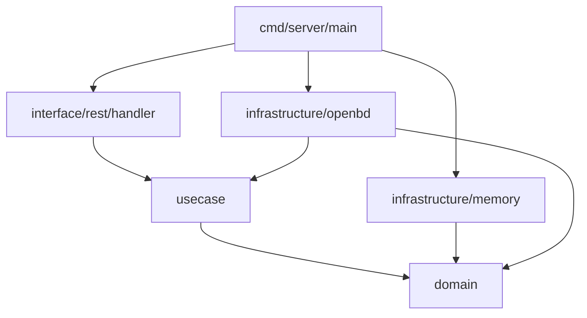

## はじめに

ここからの2章はハンズオンです。これまでの章で示してきた判断基準を、実際に1つのサービスに適用していきます。読むだけでも流れは追えますが、手元に Go の環境を用意して一緒に作ることをおすすめします。

題材は**読書ログサービス（booklog）**にしました。読んだ本を記録して、感想を書いて、あとから振り返れる API サービスです。選んだ理由は3つあります。CRUD だけでは終わらない程よいドメインロジックがあること、外部 API 連携（書誌情報の取得）が自然に登場すること、そして自分用に本当に運用できることです。

この章では設計を固め、次章で実装します。といっても分厚い設計書を書くわけではなく、決めるのは次の5つだけです。

1. ユースケースの一覧
2. ドメインモデルと不変条件
3. 層構成とディレクトリ
4. エラーとバリデーションの分担
5. 外部 API との境界

---

## ステップ1：ユースケースを動詞で書き出す

最初にやるのはレイヤー設計ではなく、このサービスで何ができるかの列挙です。私はいつも「ユーザーは〜できる」の形で書き出します。

- ユーザーは、ISBN を入力して本を本棚に登録できる（書誌情報は外部 API から取得する）
- ユーザーは、本のステータスを積読 → 読書中 → 読了と進められる
- ユーザーは、読了した本に感想を書ける
- ユーザーは、本棚の一覧をステータスで絞り込んで見られる
- ユーザーは、月ごとの読了数を確認できる

最初のバージョンはこの5つに絞ります。認証、複数ユーザー対応、感想の公開機能は今回のスコープ外です。小さく作って、育てるのは動いてからです。

この時点で、UseCase 層に置く Interactor の顔ぶれがほぼ決まります。

| ユースケース       | Interactor                |
| ------------------ | ------------------------- |
| 本を登録する       | RegisterBookInteractor    |
| ステータスを進める | AdvanceStatusInteractor   |
| 感想を書く         | WriteReviewInteractor     |
| 一覧を見る         | ListRecordsInteractor     |
| 月間統計を見る     | GetMonthlyStatsInteractor |

---

## ステップ2：ドメインモデルと不変条件を決める

### 集約は1つで始める

このサービスの中心概念は「1冊の本についての読書の記録」です。これを`ReadingRecord`という集約にします。本（Book）と記録（Record）を別の集約に分ける案も考えましたが、今回のスコープでは本の情報を単独で更新するユースケースが存在しないため、分けませんでした。集約を増やすのは、増やす理由が出てからです（第10章）。

```text
ReadingRecord（集約ルート）
├── ID
├── Book（値オブジェクト: ISBN、タイトル、著者）
├── Status（値オブジェクト: 積読 / 読書中 / 読了）
├── Review（感想。読了後のみ）
└── FinishedAt（読了日時。読了のときのみ）
```

### 守るべき不変条件

第10章の基準で、このドメインが常に守るべきルールを言語化します。

1. ステータスは積読 → 読書中 → 読了の順にしか進まない（逆行と飛び級は不可）
2. 感想は読了した本にしか書けない
3. 読了日時はステータスが読了のときだけ存在する

この3つは、非公開フィールドとメソッド経由の状態変更で守ります。`record.Status = StatusFinished`のような直接代入をコンパイルレベルで不可能にする、第10章そのままの適用です。

### 値オブジェクトは ISBN と Status だけ作る

第9章で、値オブジェクトは「バリデーションが必要」か「振る舞いを持つ」ものに絞るという基準を示しました。適用すると次のようになります。

| 候補 | 判断 | 理由 |
| --- | --- | --- |
| ISBN | 作る | 形式バリデーション（13桁、チェックディジット）が必要で、等価比較に意味がある |
| Status | 作る | 遷移ルールという振る舞いを持つ |
| タイトル、著者 | 作らない | 検証も振る舞いもない。string で十分 |
| 感想本文 | 作らない | 長さ制限はあるが、それだけのために wrap する価値はないと判断 |

---

## ステップ3：層構成を決める

これまでの章の判断基準を、1つずつこのサービスに当てはめます。

**モジュール分割はしない**（第4章、第13章）。境界づけられたコンテキストが1つしかないからです。`internal/booklog/`という単一モジュールの中に層を切ります。将来「書評の公開」のような別コンテキストが育ったら、そのとき`internal/`直下に並べます。

**UseCase 層は置く**（第5章）。一覧取得のようなパススルーに見えるユースケースもありますが、登録には冪等性チェック、統計には集計ロジックが最初から入ります。全ユースケースに統一して置きます。

**Repository はレベル1（完全抽象）にする**（第6章）。ユニットテストで DB を差し替えたいという要件に加え、インメモリ実装から後日 PostgreSQL へ移す予定もあります。第6章の判断表に当てはめると、domain 層で interface を定義するレベル1の一択です。Reader と Writer は分離します。

**interface は利用側で定義する**（第3章）。Handler が Interactor に依存するときの interface は handler 側に置きます。Interactor が外部サービスに依存するときの interface は usecase 側です。

結果、ディレクトリはこうなります。

```text
booklog/
├── cmd/
│   └── server/
│       └── main.go              # コンポジションルート（第14章）
└── internal/
    └── booklog/
        ├── domain/
        │   ├── model/           # ReadingRecord、ISBN、Status
        │   └── repository/      # RecordReader / RecordWriter interface
        ├── usecase/
        │   ├── register_book.go
        │   ├── advance_status.go
        │   ├── write_review.go
        │   ├── list_records.go
        │   ├── get_monthly_stats.go
        │   └── port.go          # bookMetadataFetcher（外部API抽象）
        ├── interface/
        │   └── rest/
        │       └── handler/     # HTTPハンドラ（利用側interface定義）
        └── infrastructure/
            ├── memory/          # インメモリRepository（最初はこれで動かす）
            └── openbd/          # 書誌検索APIクライアント + ACL
```

依存の向きを図にすると、これまでの章で見てきた形そのものです。



---

## ステップ4：エラーとバリデーションの分担を決める

第7章と第8章の分担ルールを適用します。

**バリデーション**の分担は次のとおりです。形式チェック（JSON の形、必須項目、ISBN の桁数）は handler 層で行います。ドメインの不変条件（ステータス遷移、感想は読了後のみ）は domain 層で守ります。ISBN のチェックディジット検証は`model.NewISBN`に置きます。形式の知識は ISBN という概念自体に属するからです。

**エラー**は、domain 層にセンチネルエラーを定義し、handler 層で HTTP ステータスに変換します。

| エラー                | 発生場所                  | HTTP ステータス           |
| --------------------- | ------------------------- | ------------------------- |
| ErrInvalidISBN        | domain（NewISBN）         | 400 Bad Request           |
| ErrRecordNotFound     | domain（Repository 契約） | 404 Not Found             |
| ErrAlreadyRegistered  | usecase（冪等性チェック） | 409 Conflict              |
| ErrInvalidTransition  | domain（Status 遷移）     | 422 Unprocessable Entity  |
| ErrReviewBeforeFinish | domain（Review）          | 422 Unprocessable Entity  |
| インフラ由来のエラー  | infrastructure            | 500 Internal Server Error |

---

## ステップ5：外部 API との境界を設計する

本の登録時、ISBN から書誌情報（タイトル、著者）を取得します。外部の書誌検索 API を使いますが、そのレスポンス形式をドメインに持ち込まないよう、第12章の腐敗防止層を置きます。

UseCase 層には、必要な情報だけを返す小さな interface を定義します。

```go
// usecase/port.go
type bookMetadata struct {
    Title  string
    Author string
}

type bookMetadataFetcher interface {
    Fetch(ctx context.Context, isbn model.ISBN) (*bookMetadata, error)
}
```

infrastructure 層の`openbd`パッケージが、外部 API のレスポンス（ネストの深い JSON）をこの形に翻訳します。将来、書誌検索の API を別のものに乗り換えても、変更は`openbd`パッケージの置き換えだけで済みます。

外部 API が落ちていたときの扱いも決めておきます。今回は、書誌情報が取れなければ登録自体を失敗させます。タイトル未取得のまま登録を許す設計（あとから補完）も考えられますが、最初のバージョンでは複雑さに見合わないと判断しました。

---

## 設計のまとめ

決めたことを1枚にまとめます。次章はこの表の通りに実装します。

| 決定事項             | 選択                                   | 根拠にした章  |
| -------------------- | -------------------------------------- | ------------- |
| モジュール分割       | しない（単一モジュール）               | 第4章、第13章 |
| 集約                 | ReadingRecord の1つ                    | 第10章        |
| 値オブジェクト       | ISBN と Status のみ                    | 第9章         |
| UseCase 層           | 全ユースケースに置く                   | 第5章         |
| Repository           | レベル1、Reader/Writer 分離            | 第6章         |
| interface の置き場所 | 利用側で定義                           | 第3章         |
| エラー変換           | domain で定義、handler で HTTP へ変換  | 第7章         |
| バリデーション       | 形式は handler、不変条件は domain      | 第8章         |
| 外部 API             | ACL で翻訳、UseCase 層はポートだけ知る | 第12章        |
| DI                   | 手動 DI、main がコンポジションルート   | 第14章        |
| 最初の永続化         | インメモリ実装（後から DB へ差し替え） | 第6章         |

設計にかける時間はこの程度で十分です。この段階で決めなかったこと（テーブル定義、キャッシュ、認証）は、必要になってから依存の向きを守ったまま追加できます。それを次章で確かめます。
